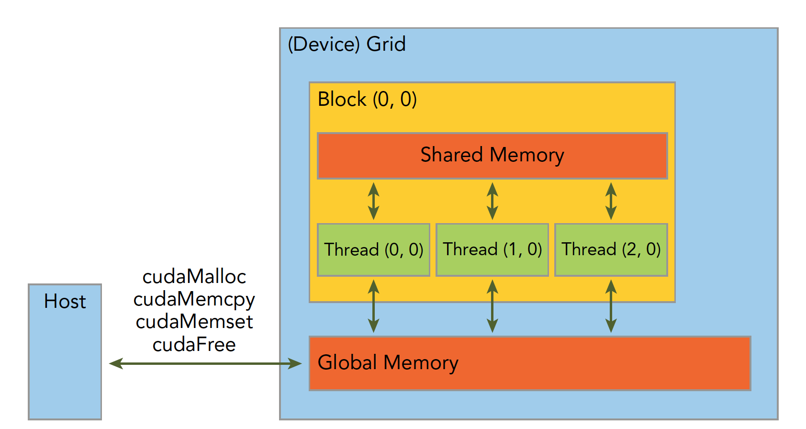
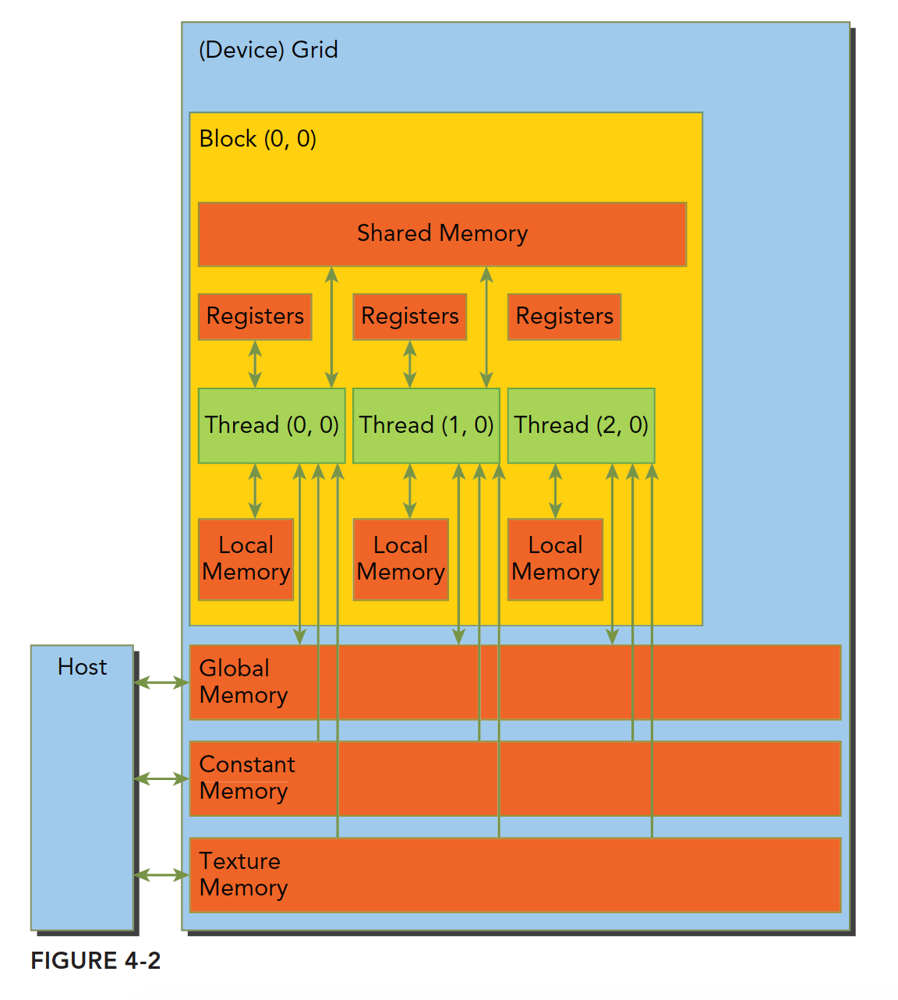
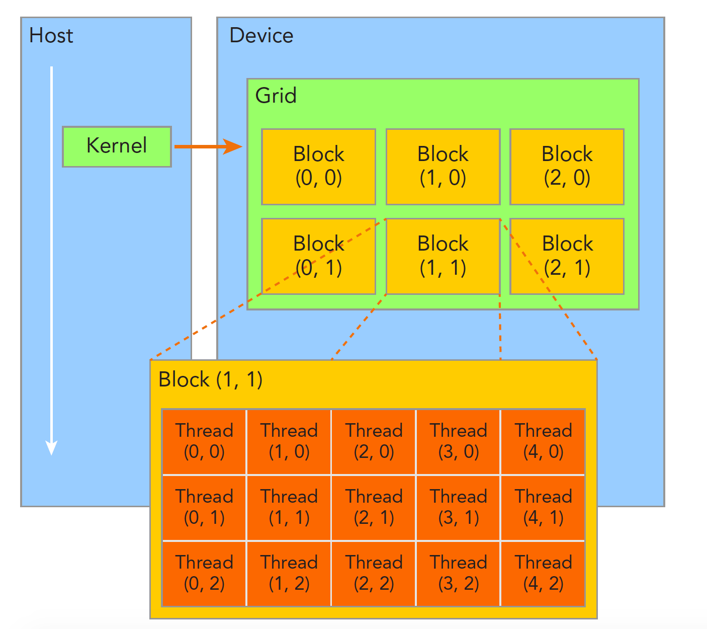
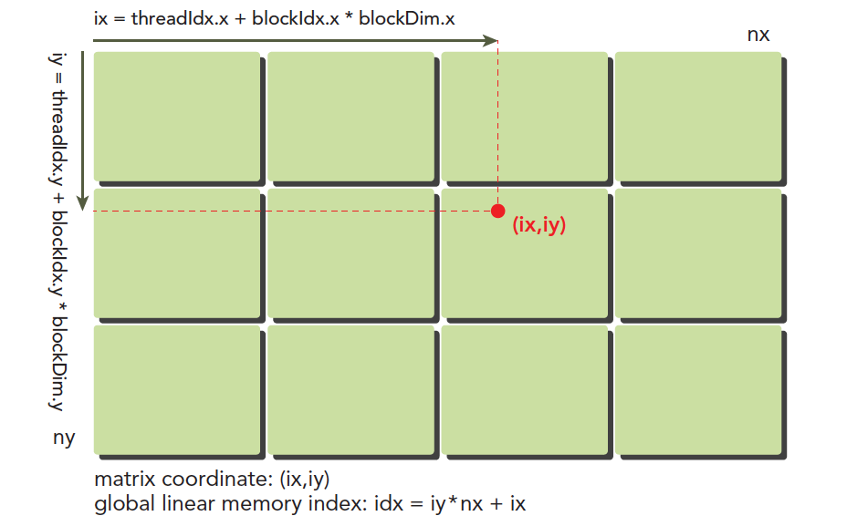

# 05-03-CUDA内存层次

> 父节点: [[05-00-Nvidia-CUDA与SIMD]]
> 源文件: `nvidia/nvidia.md`
> 相关: [[05-04-Reduction优化]] | [[05-05-Bank冲突]] | [[11-00-大模型与深度学习]]

---

### 资料

nvidia-smi

https://blog.csdn.net/C_chuxin/article/details/82993350#:~:text=nvidia-smi

GPU编程  谭升的博客

https://face2ai.com/program-blog/#GPU%E7%BC%96%E7%A8%8B%EF%BC%88CUDA%EF%BC%89

博客园，苹果妖

https://www.cnblogs.com/1024incn/category/695134.html

CSDN cuda并行编程，主要介绍了一些并行策略，并行方式

https://blog.csdn.net/sunmc1204953974/category_6156113.html

https://blog.csdn.net/langb2014/category_6219832.html

cuda 内存访问，知乎

https://zhuanlan.zhihu.com/p/632244210

nvprof工具的使用

https://zhuanlan.zhihu.com/p/595136588

nsight systems 使用

https://blog.csdn.net/HaoZiHuang/article/details/121885850

https://blog.csdn.net/NXHYD/article/details/112915968

https://thnum.blog.csdn.net/article/details/109952643


《CUDA C 编程指南》

https://zhuanlan.zhihu.com/p/53773183

资源小集合

https://zhuanlan.zhihu.com/p/346910129

### 常用命令


```bash
# https://zhuanlan.zhihu.com/p/666242337#:~:text=%E7%9B%AE%E5%89%8D%E4%B8%BB%E6%B5%81%E7%9A%84%20CU
# https://zhuanlan.zhihu.com/p/666242337#:~:text=%E7%9B%AE%E5%89%8D%E4%B8%BB%E6%B5%81%E7%9A%84%20CU

# https://blog.csdn.net/m0_67392409/article/details/123598464

# https://zmurder.github.io/CUDA/Nsight/Nsight%20Compute%E7%A4%BA%E4%BE%8B1_%E6%80%BB%E8%A7%88/

# 代码简单时，编译器会进行优化 原 branch_efficiency
# 非发散分支与总分支的比率
ncu  --metrics smsp__sass_average_branch_targets_threads_uniform.pct


# 每个SM在每个cycle能够达到的最大active warp数目占总warp的比例 ，原 achieved_occupancy
# 可以猜测的到的是，拥有更多的block并行性更好。这个猜测可以使用nvprof 的 achieved_occupancy这个metric参数来验证。
# 每个SM在每个cycle能够达到的最大active warp数目占总warp的比例
ncu --metrics sm__warps_active.avg.pct_of_peak_sustained_active


# 带宽  全局内存加载事务数，原 gld_throughput
# memory load和memory store,查看memory的throughput
# 高load throughput有可能是一种假象，如果需要的数据在memory中存储格式未对齐不连续，会导致许多额外的不必要的load操作，
ncu --metrics l1tex__t_bytes_pipe_lsu_mem_global_op_ld.sum.per_second


# 带宽比值 原 gld_efficiency
# gld_efficiency来度量load efficiency, ，加载的效率
# 该metric参数是指我们确切需要的 global load throughput与实际得到global load memory的比值。
# 这个metric参数可以让我们知道，APP的 load操作利用device memory bandwidth的程度：
#
ncu --metrics smsp__sass_average_data_bytes_per_sector_mem_global_op_ld.pct


# 原 gst_efficiency，存储
# 请求的全局内存存储吞吐量与所需的全局内存存储吞吐量的比率
ncu --metrics smsp__sass_average_data_bytes_per_sector_mem_global_op_st.pct


# gld_transactions_per_request 被每个全局内存加载请求执行的全局内存加载事务的平均数
# l1tex__average_t_sectors_per_request_pipe_lsu_mem_global_op_ld.ratio

# gst_transactions_per_request 被每个全局内存存储请求执行的全局内存存储事务的平均数
# l1tex__average_t_sectors_per_request_pipe_lsu_mem_global_op_st.ratio
# 如果单一的全局加载或存储请求了很多事务，那么设备内存带宽可能就会被浪费


# 每个warp上执行的指令数目的平均值， 原 inst_per_warp
# 可以查看是否有许多不必要的操作也执行了
ncu --metrics smsp__average_inst_executed_per_warp.ratio


# 原 dram_read_throughput
# 同一个thread中如果能有更多的独立的load/store操作，会产生更好的性能，因为这样做memory latency能够更好的被隐藏。
# device read throughtput和unrolling程度是正比的：
ncu --metrics dram__bytes_read.sum.per_second


# shared_load_transactions_per_request  每次共享内存加载时执行的平均共享内存加载事务数
# shared_store_transactions_per_request 每次共享内存加载时执行的平均共享内存写入事务数
# 两个参数来衡量相应的bank-conflict 。 ncu没有这个参数了。

# 用来验证由于__syncthreads导致更少的warp, 原 stall_sync
ncu --metrics smsp__warp_issue_stalled_barrier_per_warp_active.pct + smsp__warp_issue_stalled_membar_per_warp_active.pct

# 生成ncu-rep 文件
ncu --set full -f -o 09 ./09

```

### 理论

#### grid与block




#### 内存

全局内存

```c++
//全局声明
__device__ float devData;
// initialize the global variable
float value = 3.14f;
CHECK(cudaMemcpyToSymbol(devData, &value, sizeof(float)));
// invoke the kernel
checkGlobalVariable<<<1, 1>>>();
// copy the global variable back to the host
CHECK(cudaMemcpyFromSymbol(&value, devData, sizeof(float)));
```

静态共享内存

```c++
__global__ void setColReadCol(int *out)
{
    // static shared memory
    __shared__ int tile[BDIMX][BDIMY];
    // mapping from thread index to global memory index
    unsigned int idx = threadIdx.y * blockDim.x + threadIdx.x;
    // shared memory store operation
    tile[threadIdx.x][threadIdx.y] = idx;
    // wait for all threads to complete
    __syncthreads();
    // shared memory load operation
    out[idx] = tile[threadIdx.x][threadIdx.y];
}

//核函数调用
setColReadCol<<<grid, block>>>(d_C);
```

动态共享内存

```c++
__global__ void setRowReadColDyn(int *out)
{
    // dynamic shared memory
    extern  __shared__ int tile[];
    // mapping from thread index to global memory index
    unsigned int idx = threadIdx.y * blockDim.x + threadIdx.x;
    // convert idx to transposed (row, col)
    unsigned int irow = idx / blockDim.y;
    unsigned int icol = idx % blockDim.y;
    // convert back to smem idx to access the transposed element
    unsigned int col_idx = icol * blockDim.x + irow;
    // shared memory store operation
    tile[idx] = idx;
    // wait for all threads to complete
    __syncthreads();
    // shared memory load operation
    out[idx] = tile[col_idx];
}

//核函数调用，第三个参数是动态共享内存的大小
setRowReadColDyn<<<grid, block, BDIMX*BDIMY*sizeof(int)>>>(d_C);
```

常量内存

```c++
#define RADIUS 4
#define BDIM 32
// constant memory
__constant__ float coef[RADIUS + 1];

// FD coeffecient
#define a0     0.00000f
#define a1     0.80000f
#define a2    -0.20000f
#define a3     0.03809f
#define a4    -0.00357f
//设置常量内存
void setup_coef_constant (void)
{
    const float h_coef[] = {a0, a1, a2, a3, a4};
    CHECK(cudaMemcpyToSymbol( coef, h_coef, (RADIUS + 1) * sizeof(float)));
}

```
#### 复制方式

申请的方式

cudaMalloc：   普通内存的时候有在使用

cudaFree：     普通内存的时候有在使用

cudaMallocHost：锁页内存的时候有在使用

cudaFreeHost：  锁页内存的时候有在使用

cudaMallocManaged:   nvidia自己管理内存的时候使用

cudaMemcpyToSymbol：全局内存与常量内存的时候有在使用

cudaHostAlloc：    零拷贝内存的时候有在使用

cudaMemcpy的方向：

cudaMemcpyHostToDevice： 主机到设备

cudaMemcpyDeviceToHost： 设备到主机

cudaHostAllocMapped： 零拷贝内存的时候有在使用


从主机到设备，设备到主机

```c++
float *h_a = (float *)malloc(nbytes);
float *d_a;
CHECK(cudaMalloc((float **)&d_a, nbytes));
for(unsigned int i = 0; i < isize; i++) h_a[i] = 0.5f;
CHECK(cudaMemcpy(d_a, h_a, nbytes, cudaMemcpyHostToDevice));
CHECK(cudaMemcpy(h_a, d_a, nbytes, cudaMemcpyDeviceToHost));
CHECK(cudaFree(d_a));
free(h_a);
```


锁页内存

```c++
//查询是否支持锁页内存
cudaDeviceProp deviceProp;
CHECK(cudaGetDeviceProperties(&deviceProp, dev));
if (!deviceProp.canMapHostMemory)
{
    printf("Device %d does not support mapping CPU host memory!\n", dev);
    CHECK(cudaDeviceReset());
    exit(EXIT_SUCCESS);
}

printf("%s starting at ", argv[0]);
printf("device %d: %s memory size %d nbyte %5.2fMB canMap %d\n", dev,
        deviceProp.name, isize, nbytes / (1024.0f * 1024.0f),
        deviceProp.canMapHostMemory);

// allocate pinned host memory
float *h_a;
CHECK(cudaMallocHost ((float **)&h_a, nbytes));
// allocate device memory
float *d_a;
CHECK(cudaMalloc((float **)&d_a, nbytes));
// initialize host memory
memset(h_a, 0, nbytes);
for (int i = 0; i < isize; i++) h_a[i] = 100.10f;
// transfer data from the host to the device
CHECK(cudaMemcpy(d_a, h_a, nbytes, cudaMemcpyHostToDevice));
// transfer data from the device to the host
CHECK(cudaMemcpy(h_a, d_a, nbytes, cudaMemcpyDeviceToHost));
// free memory
CHECK(cudaFree(d_a));
CHECK(cudaFreeHost(h_a));
```

零拷贝复制

```c++
float *h_A, *h_B;
float *d_A, *d_B;
CHECK(cudaHostAlloc((void **)&h_A, nBytes, cudaHostAllocMapped));
CHECK(cudaHostAlloc((void **)&h_B, nBytes, cudaHostAllocMapped));
// initialize data at host side
initialData(h_A, nElem);
initialData(h_B, nElem);
memset(hostRef, 0, nBytes);
memset(gpuRef,  0, nBytes);
// pass the pointer to device
//相当于将指针给了设备的数据
CHECK(cudaHostGetDevicePointer((void **)&d_A, (void *)h_A, 0));
CHECK(cudaHostGetDevicePointer((void **)&d_B, (void *)h_B, 0));
// execute kernel with zero copy memory
sumArraysZeroCopy<<<grid, block>>>(d_A, d_B, d_C, nElem);
// copy kernel result back to host side
CHECK(cudaMemcpy(gpuRef, d_C, nBytes, cudaMemcpyDeviceToHost));
CHECK(cudaFree(d_C));
CHECK(cudaFreeHost(h_A));
CHECK(cudaFreeHost(h_B));
```

cudaMallocManaged管理内存
统一内存寻址

```c++

// malloc host memory
float *A, *B, *hostRef, *gpuRef;
CHECK(cudaMallocManaged((void **)&A, nBytes));
CHECK(cudaMallocManaged((void **)&B, nBytes));
CHECK(cudaMallocManaged((void **)&gpuRef,  nBytes);  );
CHECK(cudaMallocManaged((void **)&hostRef, nBytes););

// initialize data at host side
initialData(A, nxy);
initialData(B, nxy);
memset(hostRef, 0, nBytes);
//invoke kernel func
sumMatrixGPU<<<grid, block>>>(A, B, gpuRef, nx, ny);

// free device global memory
CHECK(cudaFree(A));
CHECK(cudaFree(B));
CHECK(cudaFree(hostRef));
CHECK(cudaFree(gpuRef));
```


#### 同步

同步主要可以通过流与事件同步

```c++
//在主机端同步函数
CHECK(cudaDeviceSynchronize());
//在设备端同步的函数，实现了在线程块内的同步，一个wrap内的线程不用同步
// synchronize within threadblock
__syncthreads();

//一个线程调用完之后，该线程在该语句前对全局存储器或者共享存储器访问已经全部完成，对grid中所有线程可见
__threadfence();
//一个线程调用完之后，该线程在该语句前对全局存储器或者共享存储器访问已经全部完成，对block中所有线程可见
__threadfence_block();
//使其他线程能够安全的消费当前线程生产的数据，

//原子操作
atomicAdd()
atomicMax()
atomicInc()

//位原子操作
atomicAnd()
atomicOr()
atomicXor()
```

使用流来同步

```c++
cudaStreamSynchronize()
```

```c++
//回调函数
void CUDART_CB my_callback(cudaStream_t stream, cudaError_t status, void *data)
{
    printf("callback from stream %d\n", *((int *)data));
}

//主函数里面，
// Allocate and initialize an array of stream handles
int n_streams=4;
//流数组
cudaStream_t *streams = (cudaStream_t *) malloc(n_streams * sizeof(cudaStream_t));
//流在创建的时候可以指定优先级
for (int i = 0 ; i < n_streams ; i++)
{
    CHECK(cudaStreamCreate(&(streams[i])));
}

dim3 block (1);
dim3 grid  (1);
//事件
cudaEvent_t start_event, stop_event;
CHECK(cudaEventCreate(&start_event));
CHECK(cudaEventCreate(&stop_event));

int stream_ids[n_streams];

CHECK(cudaEventRecord(start_event, 0));

for (int i = 0; i < n_streams; i++)
{
    stream_ids[i] = i;
    kernel_1<<<grid, block, 0, streams[i]>>>();
    kernel_2<<<grid, block, 0, streams[i]>>>();
    kernel_3<<<grid, block, 0, streams[i]>>>();
    kernel_4<<<grid, block, 0, streams[i]>>>();
    //第三个参数是回调函数的参数
    CHECK(cudaStreamAddCallback(streams[i], my_callback,(void *)(stream_ids + i), 0));
}
CHECK(cudaEventRecord(stop_event, 0));
CHECK(cudaEventSynchronize(stop_event));
float elapsed_time;
CHECK(cudaEventElapsedTime(&elapsed_time, start_event, stop_event));

 // release all stream
for (int i = 0 ; i < n_streams ; i++)
{
    CHECK(cudaStreamDestroy(streams[i]));
}
free(streams);

// destroy events
CHECK(cudaEventDestroy(start_event));
CHECK(cudaEventDestroy(stop_event));
```

事件同步

```c++
 // Allocate and initialize an array of stream handles
int n_streams=4;
cudaStream_t *streams = (cudaStream_t *) malloc(n_streams * sizeof(cudaStream_t));
for (int i = 0 ; i < n_streams ; i++)
{
    CHECK(cudaStreamCreate(&(streams[i])));
}

 // creat events
cudaEvent_t start, stop;
CHECK(cudaEventCreate(&start));
CHECK(cudaEventCreate(&stop));

cudaEvent_t *kernelEvent;
kernelEvent = (cudaEvent_t *) malloc(n_streams * sizeof(cudaEvent_t));
for (int i = 0; i < n_streams; i++)
{
    CHECK(cudaEventCreateWithFlags(&(kernelEvent[i]),cudaEventDisableTiming));
}

 // record start event
CHECK(cudaEventRecord(start, 0));

// dispatch job with depth first ordering
for (int i = 0; i < n_streams; i++)
{
    kernel_1<<<grid, block, 0, streams[i]>>>();
    kernel_2<<<grid, block, 0, streams[i]>>>();
    kernel_3<<<grid, block, 0, streams[i]>>>();
    kernel_4<<<grid, block, 0, streams[i]>>>();

    CHECK(cudaEventRecord(kernelEvent[i], streams[i]));
    //在最后一个流中插入其他流的事件，最后一个流必须等到其他流的事件执行之后才开始执行
    CHECK(cudaStreamWaitEvent(streams[n_streams - 1], kernelEvent[i], 0));
}

// record stop event
CHECK(cudaEventRecord(stop, 0));
//阻塞stop
CHECK(cudaEventSynchronize(stop));

// calculate elapsed time
CHECK(cudaEventElapsedTime(&elapsed_time, start, stop));
printf("Measured time for parallel execution = %.3fs\n",elapsed_time / 1000.0f);
// release all stream
for (int i = 0 ; i < n_streams ; i++)
{
    CHECK(cudaStreamDestroy(streams[i]));
    CHECK(cudaEventDestroy(kernelEvent[i]));
}
free(streams);
free(kernelEvent);

```

#### 计时

使用事件计时

```c++
cudaEvent_t     start, stop;
cudaEventCreate( &start );
cudaEventCreate( &stop ) ;
cudaEventRecord( start, 0 ) ;

//在GPU上执行的一些操作

cudaEventRecord( stop, 0 ) ;
//很幸运，有一种事件API函数，告诉CPU在某个事件上同步
cudaEventSynchronize( stop );

float   elapsedTime;
cudaEventElapsedTime( &elapsedTime,start, stop ) );
printf( "Time to generate:  %3.1f ms\n", elapsedTime );

cudaEventDestroy( start );
cudaEventDestroy( stop );

```

### 优化案列