# 一 xmake入门
## 1 xmake基本使用

在本节实验中，将会学习如何安装使用 xmake，如何快速创建 C++ 工程，并且编译和运行。以及如何利用 gdb 去加载调试编译后的程序，还有程序的安装和卸载操作。

#### 知识点

- xmake 的安装

- xmake 的基本操作

- C/C++ 项目的基本构建

- 程序的运行、调试、安装和卸载操作

xmake 是一个基于 Lua 的轻量级跨平台 C/C++ 构建工具，使用 xmake.lua 维护项目构建，相比 makefile/CMakeLists.txt，配置语法更加简洁直观，对新手非常友好，短时间内就能快速入门，让用户把更多的精力集中在实际的项目开发上。

  虽然，简单易用是 xmake 的一大特色，但 xmake 的功能也是非常强大的，既能够像 make/ninja 那样直接编译项目，也可以像 cmake/meson 那样生成工程文件，还有内置的包管理系统帮助用户解决 C/C++ 依赖库的集成使用问题。

  目前，xmake 已经在 Github 收获 2.9K star，300+ fork，30+ 贡献者，并且处理了 900+ issues，5400+ Commits，star 数已经赶超大部分同类构建工具，逐渐逼近 cmake，现在已经有越来越多的用户开始使用 xmake。

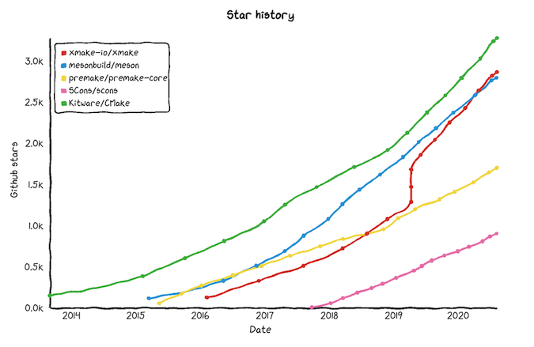
关于 xmake 的具体介绍，可以到 [xmake 官网](https://xmake.io/#/zh-cn/) 进一步了解，我们也提供了完善的中文文档支持，也可以直接访问 xmake 的 [GitHub 仓库](https://github.com/xmake-io/xmake)。


#### xmake 安装

打开 Xfce 终端，然后执行下面的安装命令。

```bash
bash <(curl -kfsSL https://xmake.io/shget.text) v2.3.7
```

等待编译安装完成后，如果是在当前终端下继续操作使用 xmake，请再执行下面的命令，关联下 xmake 环境，否则会提示 xmake 找不到。

```bash
source ~/.xmake/profile
```

如果是新打开的终端，就不需要执行上面的命令了，xmake 已经能够正常使用了。

我们可以执行 `xmake --version` 来验证下 xmake 是否安装成功，如果看到下面的输出结果，说明我们已经成功安装，可以正常使用了。

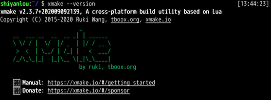

注：我们所有的实验都是使用 xmake v2.3.7 版本，这是为了确保所有实验操作和结果完全一致，不会受到 xmake 版本更新导致的一些细小差异。

xmake 有自带各种 C/C++ 项目的工程创建模板，我们可以通过执行下面的命令，快速创建一个 Hello World 工程。

```bash
cd ~/Code
xmake create hello
```

这里，我们将工程目录创建在 `~/Code` 目录下，这个是当前实验环境的代码存储目录，后期的工程创建操作默认都是存放在此目录下。

如果看到下面的输出内容，则说明已经成功创建了一个最简单的 C++ 空项目。

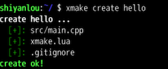

我们可以在项目根目录执行 `tree` 简单看下这个空项目里面有哪些文件。

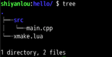

可以看到，除了 src 目录下的 C++ 源文件外，xmake 会在根目录生成一个 xmake.lua 文件，执行 `gvim xmake.lua` 使用 gvim 打开看下 xmake.lua 这个文件里面的内容。

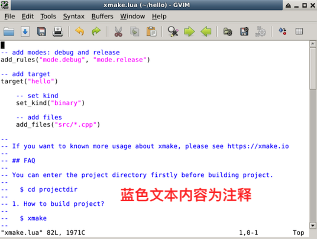

可以看到，仅仅只需要简单几行配置，就可以完整描述整个 C++ 项目的构建，而其中的蓝色文本部分仅仅只是自动生成的注释内容，用户不需要的话，完全可以自己删掉它们，实际描述构建的配置，可以精简为：

```lua
add_rules("mode.debug", "mode.release")
target("hello")
    set_kind("binary")
    add_files("src/*.cpp")
```

- `add_rules("mode.debug", "mode.release")`：可选配置，用于描述编译模式，默认情况下会采用 release 编译模式。

- `target("hello")`：定义一个目标程序。

- `set_kind("binary")`：指定编译生成的目标程序是可以执行的。

- `add_files("src/*.cpp")`：添加 src 目录下的所有 C++ 源文件。

接下来，我们开始编译这个工程，只需要进入项目根目录下，然后执行 `xmake` 命令就可以完成编译。

  ```bash
  cd hello
  xmake
  ```

  如果编译正常通过，会显示下面的结果，编译过程中默认会显示编译进度信息，以及正在编译哪些文件。

  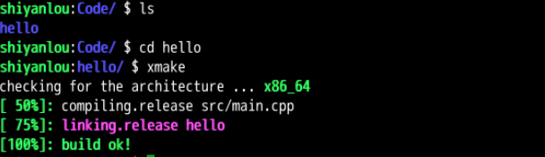

  编译完成后，再执行 `tree` 命令，查看 xmake 生成了哪些文件。

  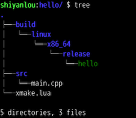

可以看到默认情况下，xmake 会自动在 build 目录生成可执行文件，其中还会自动创建 `linux/x86_64/release` 子目录，这是为了方便处理跨平台编译，如果一个项目同时需要编译各种平台、架构、编译模式下的目标文件，那么分别存储到不同的目录，可以互不影响。

#### 运行程序

既然完成了编译，有了可执行文件，执行如下命令，就可以直接运行。

```bash
xmake run
```

xmake 会自动执行 build 目录下实际对应的可执行程序，然后加载运行，因此不需要用户手动去找对应的程序路径来执行，这样能够最大程度地简化用户的操作。

如果运行成功，就会在终端显示 `hello world!` 字符串，如下图所示。


xmake 也支持直接加载 gdb 调试器运行编译好的可执行程序来实现断点调试，在开始调试前，我们需要先在当前环境安装下 gdb，在 Xfce 终端输入下面的命令。

```bash
sudo apt install -y gdb
```

gdb 安装完成后，需要在之前的 hello 项目中，将编译配置切换到 debug 模式重新编译程序，使编译好的程序带上符号信息（这个时候会传递 -g 编译选项给 gcc），这样我们才能够在调试器中正常下断点进行源码调试。

因此我们先来重新编译下 debug 版本程序。

```bash
xmake f -m debug
xmake
```

上面的 `xmake f -m debug` 就是切换的 debug 调试编译模式，保存配置后，重新执行 `xmake` 就可以编译生成带符号信息的 debug 程序，编译成功后的结果如下。

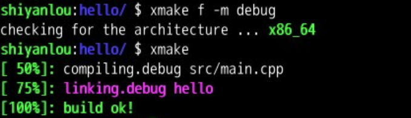

编译好后，我们就可以加载调试器运行了，还是之前的 `xmake run` 命令，只不过追加了 `-d` 参数，告诉 xmake 当前我们需要调试运行程序，xmake 会自动检测当前环境存在的调试器，然后运行它去加载我们的程序。

```bash
xmake run -d
```

如果看到 gdb 已经正常把程序加载了，就可以执行下面的命令在 main 入口函数下个断点，然后继续输入 r 继续运行程序，直到 main 函数断点被正常触发中断。

```bash
gdb> b main
gdb> r
gdb> q   # 退出
```

断点正常触发后，我们就会看到实际断下的源码位置，这个时候可以继续使用 gdb 的其它调试命令来调试我们的程序了，关于 gdb 的使用细节，这里就不多讲了，这里主要是演示如何使用 xmake 去加载使用 gdb 调试器。

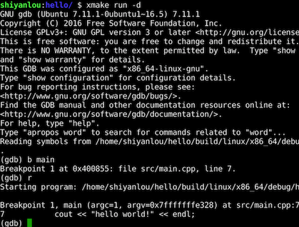

**注意：gdb 调试程序需要在一台单独的主机上才能正确执行，由于这里使用的是容器环境，环境限制不能正确运行。**

调试程序成功后，如果我们的程序确实没什么问题了，那么就可以将其直接安装到系统中使用，不用每次都依赖 `xmake run` 来运行了。

执行如下命令就可以安装编译好的程序到系统环境。

```bash
xmake install -y
```

由于系统默认会将 xmake 安装到 `/usr/local` 目录下，需要系统权限，所以安装命令中带上了 -y 参数。整个安装过程如下图。

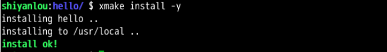

安装完成后，尝试直接执行 hello 程序，来确认是否真的已经安装成功。

```bash
hello
```

如果看到下面的结果，说明程序可以正常运行，确实已经安装成功。


执行 `which hello` 查看安装好的程序存放在系统的哪个路径下。

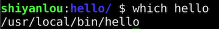

可以看到，xmake 是把 hello 程序给安装到了系统 `/usr/local/bin/hello` 位置。

#### 卸载程序

如果我们要卸载之前安装的程序，也是可以的，只需要在之前的项目根目录继续执行 `xmake uninstall -y` 完成卸载，-y 参数表示使用管理员权限。执行成功后，会显示下面的结果。

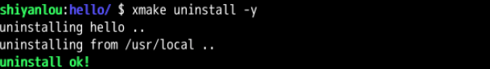

我们也可以继续使用 `which hello` 来继续确认是否卸载成功，如果看到 `Not Found` 字样，说明程序已经成功被卸载掉了。


在本节实验中，我们学习了如何使用 xmake 创建 C++ 工程，并编译运行，以及如何进行断点调试。另外，我们也学习了程序的安装和卸载操作流程。

本实验的参考代码可以使用如下命令下载：

```bash
wget https://labfile.oss.aliyuncs.com/courses/2764/code1.zip
```

## 2 xmake的基本命令使用

在本节实验中，将会进一步讲解 xmake 的各种基本命令的操作，了解 xmake 常用命令行参数的使用方式。

#### 知识点

- xmake 子命令介绍和使用
- xmake 的帮助菜单介绍
- 如何配置编译，编译器工具链的切换
- xmake 的自我更新升级

在介绍 xmake 命令行程序的各种子命令前，我们先介绍下 xmake 的 help 菜单，所有 xmake 命令参数都是可以从这个菜单中找到，并且有相应的描述和参数值说明。

因此，在还不熟悉怎么使用某个子命令的时候，都可以通过查看对应的帮助菜单里面的参数说明，来快速找到想要的某个设置参数的使用方式。

#### 主菜单

xmake 的整个命令行格式如下。

```bash
xmake [task] [options] [target]
```

主要由 `[task]`、`[options]` 还有 `[target]` 组成，其中 `[]` 部分表示可选输入，里面的 task 就是子命令任务名，xmake 提供了很多的内置子命令以及插件任务子命令，可以通过执行 `xmake --help` 在主菜单里面查看具体有哪些子命令，整个主菜单的列表内容如下。


而 `options` 就是指的上图中的参数选项，除了主菜单的参数选项，每个子命令也有对应的参数选项，比如 `xmake build --help` 就是 build 子命令的帮助菜单。

最后面的 `target` 指的是当前的命令是针对哪个目标程序的，这个也是可选的参数，并不是所有命令都有，主要是 build、install 等这些基础命令才提供，用于指定编译、安装对应的目标程序，而默认不指定，则会编译安装所有程序。

在上图中的 `Actions` 区域的子命令，就是用于跟构建相关的所有内置命令，而 `Plugins` 区域的子命令，是扩展的插件命令。这里我们主要简单介绍下 Actions 命令，其实很多在实验 1 《xmake 的基本使用》中都已经使用过。

- `config`：配置编译需要的参数，比如平台、架构等。
- `global`：全局配置编译参数。
- `build`：构建程序。
- `run`：运行目标程序。
- `install`：安装编译后的目标程序。
- `uninstall`：卸载之前安装的程序文件。
- `package`：打包编译生成的库和头文件。
- `clean`：清理编译过程中生成的临时文件。
- `require`：手动拉取第三方依赖库。
- `update`：xmake 程序自更新。


#### build 子命令

build 子命令也就是默认的构建命令，由于这个命令最常用，因此即使用户不完整运行 `xmake build`，仅仅执行 `xmake` 就可以编译项目，两者是完全等价的。

如果我们要查看构建命令具体有哪些参数选项，可以执行下面的命令来查看，参数列表如下：

```bash
xmake build --help
```

输出内容如下。

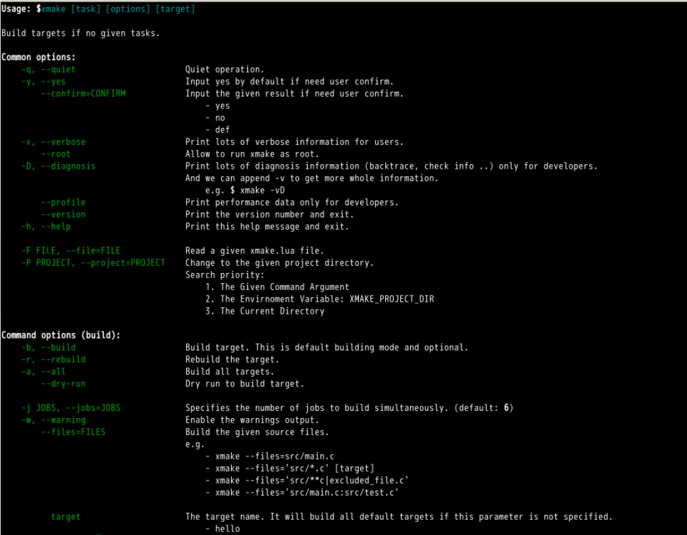

我们可以看到，它主要分了两大类，上半段 `Common options` 部分是通用选项，所有子命令都会存在这些选项，下半段 `Command options (build)` 就是 build 子命令特有的选项列表。

这里仅仅介绍比较常用的几个选项。

- `-v/--verbose`：查看详细完整的编译命令。
- `-r/--rebuild`：强制重新编译所有代码。
- `-j/--jobs`：指定多任务编译的并行任务数。
- `-w/--warning`：编译过程中显示编译警告信息。

#### 查看详细编译选项

通过添加 `-v` 参数，在编译过程中，查看完整的编译选项，这是非常有用的，可以排查和确认设置的编译选项是否生效，我们可以进入之前的 hello 项目中执行下面的命令。

```bash
xmake -rv
```

这里我们还同时追加 `-r` 选项，`-r` 和 `-v` 可以组合在一起变成 `-rv` 同时生效（这是由于 xmake 采用的是 unix 的命令参数风格），也就是重新编译并且显示详细命令输出，具体效果如图。

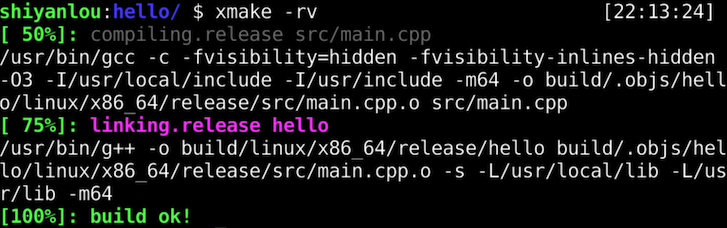

config 子命令主要用于在编译前，对项目进行一些参数配置，比如切换平台、架构以及编译模式等，可用于修改编译过程中的各种行为，当然里面很多配置是可以直接在 xmake.lua 中配置来永久生效的，不过这里通过配置命令，也可以针对当前编译临时生效，配置结果也会被缓存。

需要注意的是，每次的配置都是完整配置，会完全覆盖上一次的配置结果。

#### 切换到调试编译模式

编译模式的切换，在实验 1 《xmake 的基本使用》中已经讲解过，只需要执行。

```bash
xmake f -m debug
```

需要提示的一点是，`xmake f` 是 `xmake config` 的简写，用来简化输入提高效率，其它子命令也都是有简写的，大家可以在帮助菜单中查看。

#### 切换编译输出目录

默认编译 xmake 会在当前项目根目录下生成 build 子目录作为编译输出目录，如果不想生成到当前目录下，我们可以通过下面的配置命令切换到其它输出目录下。

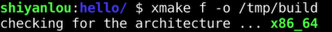

如果配置成功，通过下面的命令查看当前的配置信息，确认是否生效。


#### 添加 C/C++ 编译选项

通过配置命令，我们可以在命令行中快速添加一些自定义的 C/C++ 编译选项，其中主要涉及这三个选项。

- `--cflags`：仅仅添加 C 编译选项。
- `--cxxflags`：仅仅添加 C++ 编译选项。
- `--cxflags`：同时添加 C/C++ 编译选项。

如果你的项目中既有 C 代码，也有 C++ 代码，那么使用 `--cxflags` 来同时设置会更加方便，使用方式如下。

```bash
xmake f --cxflags="-DTEST"
xmake -rv
```

我们通过执行 `xmake -rv` 强制重新编译并且显示详细输出，来确认是否添加生效，下图红框部分中的 `-DTEST` 说明我们添加的 TEST 宏定义确实传入了 gcc 编译器。

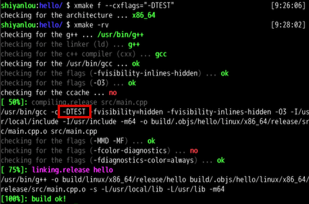

#### 添加链接库和搜索路径

同样，除了 C/C++ 代码编译，最后的链接器阶段的选项，我们也可以通过 `--ldflags` 命令参数添加设置，例如。

```bash
xmake f --ldflags="-L/tmp -lpthread"
xmake -rv
```

我们通过添加额外的 pthread 链接库，同时新增了 `/tmp` 的库搜索目录，最后生效的效果如下。

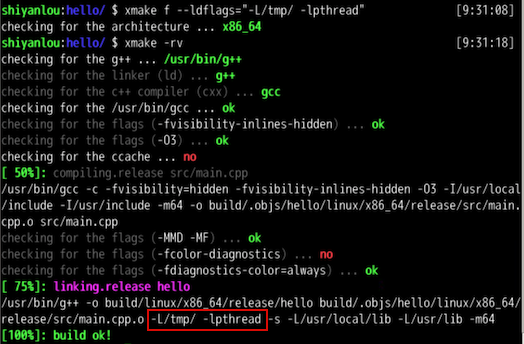

另外，我们也可以通过 `--links` 和 `--linkdirs` 达到同样的效果。

```bash
xmake f --links="pthread" --linkdirs="/tmp"
xmake -rv
```

#### 切换到 clang 编译器

默认情况下，在 Linux 环境中，xmake 会优先使用 gcc 编译器，不过我们也可以很方便地切换使用其它的编译器，比如 clang，不过在使用 clang 编译器之前，需要执行下面的命令安装它。

```bash
sudo apt update
sudo apt install -y clang
```

安装完成后，执行 `clang --version` 命令来确认 clang 是否安装成功。

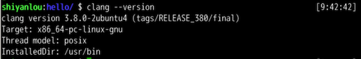

如果安装成功，执行下面的命令切换到 clang 编译工具链，然后执行编译。

```bash
xmake f --toolchain=clang
xmake -rv
```

我们可以看下执行的详细输出，红框部分显示的 `/usr/bin/clang` 说明当前的编译确实使用了 clang 编译器而不是 gcc 了。

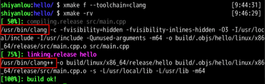

我们再通过 `xmake run` 运行下编译好的目标程序。


正常显示 `hello world!`，一切运行正常。

#### 重置所有配置

经过之前的一些配置，我们缓存了不少编译配置，如果想重置所有配置到最初的默认状态，那么可以添加 `-c` 选项来重置所有。默认配置下，也就是 release 编译模式，会忽略本地的配置缓存，像之前的编译输出路径、新增的编译选项配置都会被忽略。

```bash
xmake f -c
xmake -rv
```

重置配置后，我们重新编译当前工程，可以看下里面的详细编译选项，已经完全还原回去了，刚刚设置的 clang 编译器重新变成了 gcc 编译器。

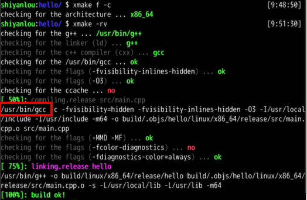

我们可以使用此命令，查看当前工程的基本信息，以及 xmake 自身的一些基本信息，这通常是非常有用的，比如可以知道当前项目有哪些目标程序，当前的编译架构和模式是什么，以及 xmake 的临时目录、缓存目录和安装路径在哪里等等。

```bash
xmake show
```

显示的一些信息如下图。

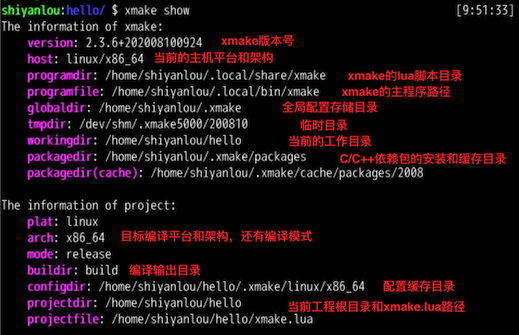

除了项目和 xmake 自身基本信息，show 命令还可以显示指定 target 目标的基本信息，比如我们执行下面的命令查看下在 xmake.lua 文件中定义的 `target("hello")` 目标程序的基本信息。

```bash
xmake show -t hello
```

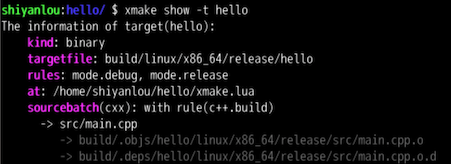

通过上图，我们能大致了解这个 hello 程序的可执行文件的实际生成路径在哪里，编译过程中的 `.o` 文件在哪里，以及是在 `xmake.lua` 哪个位置定义的。

如果 xmake 有新版本发布，我们也可以使用自更新命令快速更新版本，只需要执行下面的命令。

```bash
xmake update -f
```

这里我们额外加上了 `-f/--force` 参数，这是因为我们当前环境的 xmake 已经是最新版本，通常不需要更新，为了演示这个更新操作，我们通过这个参数来强制重新更新一遍当前的最新版本。

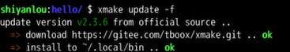

更新完成后，我们可以继续执行 `xmake --version` 确认下版本是否为最新版本，实际的版本号由于时间关系，会有所变动，毕竟 xmake 的版本迭代还是挺频繁的。

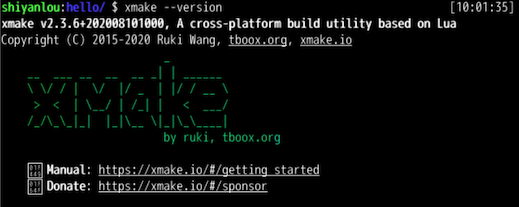

在本节实验中，我们进一步熟悉了 xmake 的各种基本命令的使用和参数介绍，熟悉了如何去定制化配置编译，切换使用 clang 编译器，如何查看各种项目信息以及更新升级 xmake 自身。

本实验的参考代码可以使用如下命令下载：

```bash
wget https://labfile.oss.aliyuncs.com/courses/2764/code2.zip
```

## 3 C&C++项目常用配置描述

在本节实验中，我们可以学习到一些编译器和链接器相关的基本概念，并且掌握 xmake.lua 中的一些基础配置，比如：C/C++ 头文件、链接库的配置，编译优化的相关配置，源文件的模式匹配等等。

#### 知识点

- 编译器、链接器基础概念
- xmake.lua 基本配置和修改
- 编译优化相关选项的配置
- C/C++ 头文件、链接库相关配置
- C/C++ 源文件的添加和过滤配置

在讲解本节实验之前，我们需要先简单了解下 C/C++ 程序的大致构建流程，它主要分为：预编译、编译和链接三个阶段，而这三个阶段会使用不同的工具去处理。

- 预编译：使用预编译器去处理 C/C++ 源文件中头文件、宏定义等。
- 编译：使用编译器对处理后的 C/C++ 源文件进行源码编译生成 `.o` 对象文件。
- 链接：使用链接器将编译生成的 `.o` 对象文件进行完整链接生成最终的可执行文件。

大致的编译链接流程可以参考下图。


从图中，我们可以看到链接器除了会去链接所有 `.o` 对象文件外，如果提供了 `.a` 静态库和 `.so` 动态库，那么链接器也会对它们进行链接。

通常我们使用的一些第三方 C/C++ 库以及系统库，都是通过静态库或者动态库的方式提供，这两者的区别在于：

- 静态库：链接后会直接把里面所有的代码都合并生成到可执行程序中。
- 动态库：链接后仅仅将动态库中导出的函数提供给可执行程序调用，实际运行过程中，还是会单独加载这个动态库。

因此，使用静态库完整链接后的程序大小通常比使用动态库的程序大很多，但这也有自己的优势，就是依赖少、便于升级维护和部署。

#### 编译器和链接器

目前市面上常用的编译器有：gcc，clang，msvc 等，而这里主要使用 gcc 作为我们的编译器，可以在之前的 hello 工程下执行 `xmake -rv` 查看当前使用的编译器和链接器。

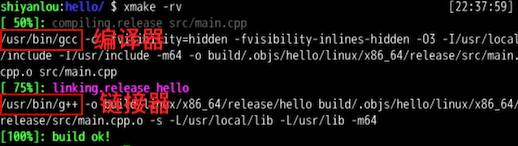

从上图可以看出，gcc 就是我们当前使用的编译器，它可以直接编译 `.cpp` 源文件到 `.o` 文件，而 `g++` 就是我们使用的链接器，用来将所有生成的 `.o` 文件链接成可执行文件。

其中需要注意的是，其实 `g++` 也仅仅只是个编译器前端，它实际上会去内部调用真实的 `ld` 链接器程序，相比直接使用 `ld`，我们使用 `g++` 来链接的一个好处是，它会自动搜索和链接内置提供的 libc++ 等依赖库，这会省事不少，也更通用，否则如果直接使用 `ld` 的话，那么我们只能自己处理对这些依赖的搜索路径等配置选项了。

而关于实际的内部链接器，比较常用的有 ld.bfd、ld.gold 和 lld，其中 bfd 用的最多，而 lld 是 llvm 新出的链接器，链接速度更加快，关于这块细节与本实验关系不大，就不再过多展开讨论了。

接下来，我们开始逐一介绍 xmake 的配置文件 xmake.lua 里面的一些基础配置接口使用方式，只要大概掌握了这些配置，基本上常规的 C/C++ 项目编译和维护都能快速搞定了。

#### 配置目标类型

首先，我们来介绍下 xmake 支持的几种基础目标类型，目前主要也就是四种类型。

| 值     | 描述       |
| ------ | ---------- |
| phony  | 空目标程序 |
| binary | 二进制程序 |
| static | 静态库程序 |
| shared | 动态库程序 |

#### 可执行程序类型

比如我们之前一直在用的可执行目标程序类型 `binary`，可以通过 `set_kind("binary")` 来设置，如下面的配置。

```lua
target("hello")
    set_kind("binary")
    add_files("src/*.cpp")
```

#### 静态库程序类型

我们接下来尝试编译生成一个带有静态库的目标程序，直接使用 xmake 来创建个空工程，例如。

```bash
cd ~/Code
xmake create -t static hello_static
```

`-t static` 参数用于指定当前工程类型为静态库，后面是工程项目名，生成后的项目结构如下。

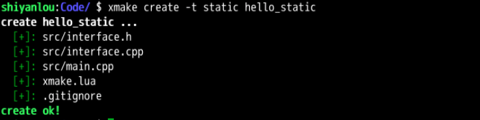

其中，项目根目录下还是会自动生成一个 xmake.lua 用于维护整个项目构建，而 src 源码目录下 `interface.cpp` 就是用来参与静态库编译，`main.cpp` 用来生成可执行程序，在里面调用静态库的接口。

我们可以进入 hello_static 项目根目录后，执行 `gvim ./xmake.lua` 查看下里面的内容，大致如下。

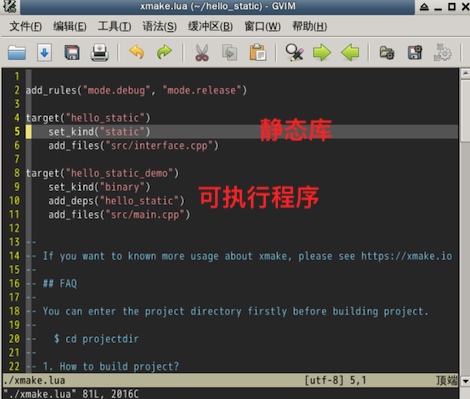

里面有两个编译目标，通过 `target()` 定义维护，一个是 static 静态库类型，一个是 binary 可执行程序类型，它们之间通过 `add_deps("hello_static")` 进行依赖关联，这样 xmake 在编译的时候，会优先编译依赖的静态库，并且把静态库自动集成到对应的可执行程序上去。

执行 `xmake` 对这个工程进行编译，如果输出结果跟下图基本一致，说明我们成功生成了一个链接静态库的目标程序。


然后我们执行 `xmake run` 运行下这个程序。


#### 动态库程序类型

动态库的创建跟静态库类似，只需要把类型名改成 `shared` 就行了，例如。

```bash
cd ~/Code
xmake create -t shared hello_shared
```

生成的工程结构和 xmake.lua 内容都跟静态库的基本一致，唯一的区别就是目标类型变成了 `shared`。

```lua
add_rules("mode.debug", "mode.release")

target("hello_shared")
    set_kind("shared") -- 设置为动态库目标程序
    add_files("src/interface.cpp")

target("hello_shared_demo")
    set_kind("binary")
    add_deps("hello_shared")
    add_files("src/main.cpp")
```

然后我们执行下编译和运行。

```bash
cd hello_shared
xmake
xmake run
```

编译运行结果也跟静态库基本一致。

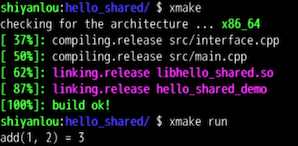

#### Phony 目标类型

其中，phony 是一个特殊的目标程序类型，使用它定义的 target 目标不会生成任何实际的程序文件，也不会执行任何编译操作，通常用于组合其它目标程序的依赖关系，实现关联编译。

为了更好的理解 phony 类型，我们这回手工创建个带有 phony 目标的工程进行测试，首先创建个空目录。

```bash
cd ~/Code
mkdir phony_test
cd phony_test
```

然后执行 `vim ./xmake.lua` 编辑 xmake.lua 写入下面的内容。

```lua
target("foo")
    set_kind("phony")
```

可以看到，这边我们没有添加任何源文件，这个 foo 目标仅仅只是个空目标程序，执行编译也是空执行，不会有任何源文件参与编译。


而关于使用 phony 目标跟其它目标程序的关联编译，我们会在实验 6 《xmake 基础之目标依赖》中详细讲解。

在实验 2 《xmake 的基本命令使用》中，我们介绍了通过命令行的方式快速添加 C/C++ 编译选项，不过这种方式不适合永久保存和对外发布，仅仅用于本地编译。如果我们想将自己的项目发布后提供给其他用户编译，那么就需要在 xmake.lua 中去设置这些编译选项。

进入之前创建的 hello 程序目录，然后使用 `vim xmake.lua` 编辑里面的 xmake.lua 文件，修改成如下内容。

```lua
add_rules("mode.debug", "mode.release")

target("hello")
    set_kind("binary")
    add_files("src/*.cpp")
    add_cxflags("-DTEST1")
```

通过 `add_cxflags("-DTEST1")` 设置就能对所有的 C/C++ 代码定义上 `TEST1` 宏开关，然后通过执行 `xmake -v` 查看完整编译命令中，是否真的生效了。

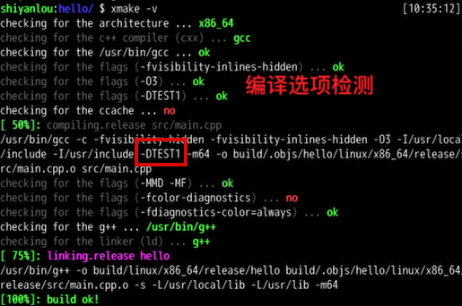

上图中，我们确实可以看到 `-DTEST1` 被传递到了 gcc 编译器进行宏定义。

另外在上图中，我们还看到了一些编译选项的自动检测，这是由于通过 `add_cxflags()` 等设置接口添加的选项都是特定某些编译器的，并不一定是完全跨编译通用的，因此 xmake 会去检测用户的设置，如果不支持的选项被设置进去，xmake 会检测失败并提示警告信息然后忽略它。

#### 添加宏定义

除了可以通过 `add_cxflags` 方式添加宏定义，其实 xmake 还提供了内置的配置接口 `add_defines` 去更方便设置它，这个配置接口相比 `add_cxflags` 使用原始编译选项的方式更加的通用，跨编译器，也是我们更加推荐的配置方式。这个接口会自动处理各种编译的支持方式，所以不会触发 flags 的自动检测机制，更加的快速可靠。

我们还是基于之前的 hello 项目的配置，做一些修改，通过 `add_defines("TEST2")` 添加新的宏定义开关 `TEST2`。

```lua
add_rules("mode.debug", "mode.release")

target("hello")
    set_kind("binary")
    add_files("src/*.cpp")
    add_cxflags("-DTEST1")
    add_defines("TEST2")
```

然后，我们重新执行 `xmake -v` 去编译查看新增的宏定义是否生效，如图。

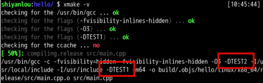

从图中，我们可以看出，相比之前的输出，新增加了一个 `-DTEST2` 宏定义参数选项传入了 gcc，说明我们的配置确实生效了。

#### 头文件路径和链接库配置

xmake 也提供了方便的配置接口去配置头文件搜索路径、链接库、库搜索路径，分别是如下几个接口。

- `add_includedirs`：添加头文件搜索目录。
- `add_linkdirs`：添加库搜索目录。
- `add_links`：添加链接库。
- `add_syslinks`：添加系统链接库。

上述几个接口都是跨编译器配置，相比直接设置到 ldflags 更加的通用。至于 `add_syslinks` 和 `add_links` 这两个的区别就是：`add_syslinks` 通常用于添加一些系统依赖库，比如 pthread，这样 xmake 会把这些系统库链接放置的更靠后些。这是因为链接器在处理库链接时候，是会依赖顺序的，放置在最左边的链接会优先处理，例如 libfoo 库依赖 libpthread 库中的符号，那么我们必须严格按照这个顺序添加链接库依赖 `-lfoo -lpthread`，否则链接器就会报找不到 pthread 库符号的错误。

而链接库和头文件搜索路径，顾名思义，就是设置后告诉编译器、链接器应该从这些目录位置尝试查找指定的链接库和头文件。

继续配置 hello 工程中的 `xmake.lua` 文件。

```lua
add_rules("mode.debug", "mode.release")

target("hello")
    set_kind("binary")
    add_files("src/*.cpp")
    add_cxflags("-DTEST1")
    add_defines("TEST2")
    add_links("z")
    add_syslinks("pthread")
    add_linkdirs("/tmp")
    add_includedirs("/tmp")
```

然后执行 `xmake -v` 查看编译输出，里面的红框部分就是新设置的编译选项：

- `-I/tmp`：添加头文件搜索路径。
- `-L/tmp`：添加链接库搜索路径。
- `-lz -lpthread`：添加的链接库，由于我们是通过 `add_links` 添加的 zlib 库，而 pthread 库是作为系统库添加的，所以被放置在 pthread 的左边优先链接。

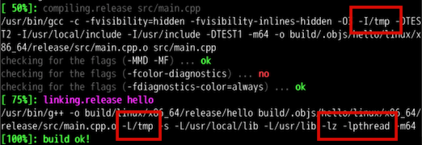

#### 设置语言标准

我们可以使用 `set_languages` 接口设置目标代码编译时候的语言标准，比如是基于 c99 标准，还是 c++11、c++14 标准等。

目前 xmake 支持的语言标准主要有以下几个：

| 值      | 描述                    |
| ------- | ----------------------- |
| ansi    | c 语言标准: `ansi`      |
| c89     | c 语言标准: `c89`       |
| gnu89   | c 语言标准: `gnu89`     |
| c99     | c 语言标准: `c99`       |
| gnu99   | c 语言标准: `gnu99`     |
| c++98   | c++ 语言标准: `c++98`   |
| gnu++98 | c++ 语言标准: `gnu++98` |
| c++11   | c++ 语言标准: `c++11`   |
| gnu++11 | c++ 语言标准: `gnu++11` |
| c++14   | c++ 语言标准: `c++14`   |
| gnu++14 | c++ 语言标准: `gnu++14` |
| c++1z   | c++ 语言标准: `c++1z`   |
| gnu++1z | c++ 语言标准: `gnu++1z` |
| c++17   | c++ 语言标准: `c++17`   |
| gnu++17 | c++ 语言标准: `gnu++17` |

并且 c 标准和 c++ 标准可同时进行设置，例如：

```lua
-- 设置 c 代码标准：c99， c++ 代码标准：c++11
set_languages("c99", "c++11")
```

将这个配置添加到刚刚修改的 xmake.lua 文件中去，就跟上一节的配置方式一样，放置到 `target("hello")` 配置域下面，然后执行 `xmake -v` 看下编译输出结果。

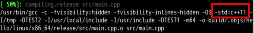

由于当前没 C 代码，所以实际只有 C++11 的标准设置生效了，也就是上图红框位置的编译选项 `-std=c++11`。

#### 设置编译优化

其实，xmake 默认创建的工程 xmake.lua 文件中，已经设置了 `add_rules("mode.debug", "mode.release")` 这两个编译规则，而默认 xmake 编译就是 release 模式编译，它会开启所有内置的编译优化选项，并不需要用户设置什么。

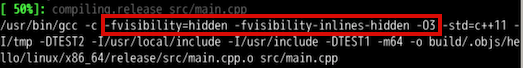

上图红框的部分都是编译优化相关的一些选项，比如最直接的 `-O3` 优化，还有 `-fvisibility=hidden -fvisibility-inlines-hidden` 用于去重一些符号字符串数据，使得编译后的程序更小。

当然，我们也可以不使用 xmake 提供的内置编译规则，自己控制应该如何优化编译，比如继续改成下面配置。

```lua
target("hello")
    set_kind("binary")
    add_files("src/*.cpp")
    add_cxflags("-DTEST1")
    add_defines("TEST2")
    add_links("z")
    add_syslinks("pthread")
    add_linkdirs("/tmp")
    add_includedirs("/tmp")
    set_languages("c99", "c++11")
    if is_mode("release") then
        set_optimize("fastest")
        set_strip("all")
        set_symbols("hidden")
    end
```

我们去除了 `mode.release` 的编译规则，通过 `is_mode("release")` 自己判断和控制优化编译，可以达到跟之前一样的优化效果。

其中 `set_optimize("fastest")` 就是添加 `-O3` 的编译优化开关，而 `set_strip("all")` 和 `set_symbols("hidden")` 用于去掉调试符号数据，使得程序更小。

配置完成以后再执行 `xmake -v` 看看，最后的编译输出里面这些编译优化选项还是同样存在的。

#### 添加源文件

在本实验最后，再讲解下如何添加源文件参与编译，其实之前的配置中，我们已经大概知道，可以通过使用 `add_files` 接口来添加源文件，这里进一步了解下这个配置接口的使用。

其实这个接口还是很强大的，不仅仅支持单个源文件的添加，还可以支持通过模式匹配的方式批量添加源文件，并且支持同时添加不同语言的源文件，不过这里主要讲解对 C/C++ 源文件的添加。

我们先来看个实例，简单了解下用法。

```lua
add_files("src/test_*.c", "src/**.cpp")
```

其中通配符 `*` 表示匹配当前目录下源文件，而 `**` 则递归匹配多级目录下的源文件。

在之前的配置中，我们是用 `add_files("src/*.cpp")` 仅仅匹配 src 单级目录下的 c++ 源文件，现在有了大致的了解后，编辑 hello/xmake.lua 文件来实验如何递归添加源文件，将该文件改为下面的配置。

```lua
add_rules("mode.debug", "mode.release")

target("hello")
    set_kind("binary")
    add_files("**.cpp")
```

然后我们在 `hello/src/test` 目录下，通过下面的命令新创建一个 C++ 的空代码文件，用来测试验证递归模式匹配。

```bash
cd ~/Code/hello
mkdir -p src/test
touch src/test/stub.cpp
```

创建好后执行 `xmake` 编译工程，如果顺利就可以看到新添加的 stub.cpp 文件也参与了编译，如下图。


#### 过滤源文件

模式匹配的方式虽然很方便，但如果源码目录层级结构复杂，在添加过程中，需要排除一些不需要的文件时，就不是那么灵活了，不过 xmake 也提供了在模式匹配过程中排除一批文件的方式，同样还是这个配置接口，我们只需要通过 `|` 符号指定后面的排除匹配模式即可，例如。

```lua
target("hello")
    set_kind("binary")
    add_files("src/**.cpp|test/*.cpp")
```


其中分隔符 `|` 之后的都是需要排除的文件，这些文件也同样支持匹配模式，并且可以同时添加多个过滤模式，只要中间用 `|` 分割就行了，而这里的配置就是在 `src/**.cpp` 基础上，忽略掉其中 `test` 子目录下所有的 C++ 源文件，最终的结果也就是仅仅编译 `src/main.cpp`。

我们再来执行下 `xmake -r` 重新编译验证下结果，如下图。

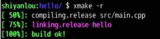

上图中，可以看到我们成功过滤掉了 `src/test/stub.cpp` 仅仅编译 `src/main.cpp`。

还有需要注意的一点是，为了使得描述上更加的精简，`|` 之后的过滤描述都是基于前一个模式：`src/**.cpp` 中 `*` 所在的目录作为根目录，也就是 `src` 目录的基础上来过滤匹配的，所以后面的过滤子模式只需要设置 `test/*.cpp` 而不是 `src/test/*.cpp`。

在本节实验中，我们学习了编译链接的基本概念，如何去配置头文件和链接库，如何去添加编译优化选项、宏定义以及如何添加源文件等一些 xmake 的常用配置，通过这些配置，我们基本上已经可以解决大部分 C/C++ 基础工程的编译需求。

本实验的参考代码可以使用如下命令下载：

```bash
wget https://labfile.oss.aliyuncs.com/courses/2764/code3.zip
```

## 4 C&C++依赖包的集成和使用

在本节实验中，我们可以学习到如何快速集成第三方的 C/C++ 依赖包，以及与第三方包仓库的接入集成。

#### 知识点

- xmake 包管理的整体架构流程

- 系统库以及第三方库的快速集成

- Conan 包管理的介绍

- 语义版本的配置说明

- 依赖包的安装和卸载

- zlib 库的集成和使用

C/C++ 库不像其它新的高级语言那样官方提供好用的依赖包管理和集成，整个生态比较杂乱不统一，集成起来非常的不方便，这也是 C/C++ 开发的痛点之一。

我们经常需要到处找库，研究如何编译、安装它们，并且如何去集成使用，如果需要跨平台，遇到的问题可能还更多点，为了集中管理这些依赖包，现在市面上已经有不少成熟的第三方包管理器来维护和解决这些问题，比如：conan，vcpkg，homebrew 等等，不过我们还是需要有一种更加方便的集成方式将其与我们的 C/C++ 项目工程进行关联集成，才能使用它们。

为此，xmake 内置了对这些第三方包管理仓库的集成，另外 xmake 还有自己的包依赖仓库来更好的解决依赖包集成问题，我们将在下面的实验中逐一讲解。

  #### 直接集成使用系统库

  首先，我们先从最简单的集成方式开始，尝试直接集成系统中已经安装的第三方库，由于 zlib 库在大多数 Linux 系统环境中都是内置了的，并且在本实验环境也是已经存在的，那么我们就先从集成 zlib 库开始实验。

  由于 zlib 是 C 库，为了方便起见，这回我们来创建一个 C 工程来尝试它，只需要在创建工程的时候指定下语言即可，例如。

  ```bash
  cd ~/Code
  xmake create -l c crc32
  ```

  `-l c` 参数指定当前创建的 crc32 工程是基于 C 语言的，其目录结构如下，跟之前的 hello 项目很相似，仅仅只是 `main.cpp` 源文件变成了 `main.c`。

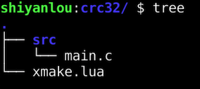

进入 `crc32` 目录中，执行 `vim src/main.c` 编辑源文件，编写一个简单实用、使用 zlib 库中 `crc32()` 接口去计算 crc32 的例子，代码如下。

```c
#include <stdio.h>
#include <zlib.h>

int main(int argc, char** argv)
{
    printf("crc32: %x!\n", crc32(0, argv[1], strlen(argv[1])));
    return 0;
}
```

上述代码通过计算输入字符串内容的 crc32 值，然后回显输出到终端上，我们先尝试下直接执行 `xmake` 命令去编译它。

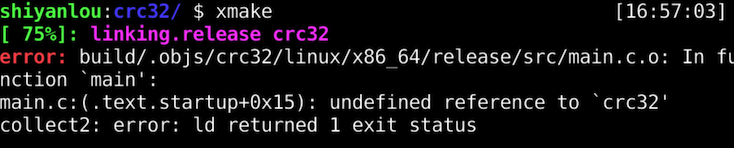

通过上图，我们看到编译链接阶段报错了，缺少 `crc32` 符号，这是因为我们还没集成链接 zlib 库，继续修改 xmake.lua 文件手动加上 zlib 库以及它系统库搜索路径。

```lua
target("crc32")
    set_kind("binary")
    add_files("src/*.c")
    add_links("z")
    add_linkdirs("/usr/lib/x86_64-linux-gnu")
```

然后重新执行 `xmake` 编译这个工程，这回看到编译通过了。

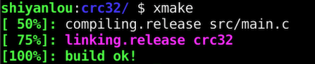

如果我们执行 `xmake -rv` 命令，是可以看到详细编译输出里面已经带上了 `-L/usr/lib/x86_64-linux-gnu -lz` 的库链接选项。

注：这里没有额外添加头文件搜索路径，是因为 `zlib.h` 是在 `/usr/include` 目录下，这个目录 xmake 会内置自动添加对应的 `-I` 选项到 gcc。

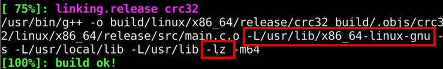

接下来，我们尝试执行下面的命令运行这个程序。

```bash
xmake run crc32 somedata
```

如果运行正常，会看到类似下面的运行结果，说明我们已经正常集成使用了系统自带的 zlib 库。


#### 自动查找系统库

在上节中，我们通过 `add_linkdirs("/usr/lib/x86_64-linux-gnu")` 方式来集成系统依赖库，虽然可以使用但不是非常通用，因为带有 xmake.lua 的 C/C++ 项目有可能会在其它 Linux 环境甚至在其它系统上编译，zlib 库并不一定安装在这个目录下。

为了更加通用化的适配系统库路径，可以使用 `find_packages` 来自动查找 zlib 库所在的位置，通过这种方式集成之前，我们可以先尝试直接执行下面的命令，来探测 zlib 库的位置信息，对这个接口返回的信息有个大概的了解。

```bash
xmake l find_packages zlib
```

如果我们成功找到系统路径下安装的 zlib 库，那么会看到类似下图的结果。

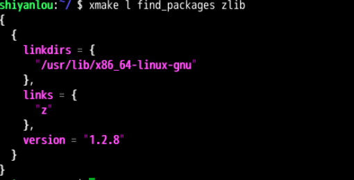

里面有链接库名、链接库的搜索路径，有可能还会有头文件的搜索路径等信息，因此我们只需要把这些信息自动探测到后设置到对应的目标程序中，就可以实现自动集成安装在系统环境的依赖库了。

接下来，我们继续修改 xmake.lua，在 target 定义下面新增一个 `on_load()` 脚本块，在里面调用 `find_packages("zlib")` 将探测到的 zlib 库信息直接动态设置到 target 里面去就行了，如下配置代码。

```lua
target("crc32")
    set_kind("binary")
    add_files("src/*.c")
    add_links("z")
    add_linkdirs("/usr/lib/x86_64-linux-gnu")
    on_load(function (target)
        target:add(find_packages("zlib"))
    end)
```

修改完成后执行 `xmake -rv`，其编译输出应该跟之前的输出完全一致才对。

不过需要注意的一点是：xmake 默认会缓存依赖包的检测结果，并不是每次编译都会重新检测，如果之前检测失败，那么结果也会缓存，这个时候我们可以执行 `xmake f -c` 在配置时候，忽略之前的缓存内容，就会自动重新触发各种检测。


我们现在虽然能够自动检测和集成系统环境的 C/C++ 库，但是如果需要的库在当前环境中还没有安装，那么还是需要手动的去安装它们，如果有些库安装非常复杂容易出错，那么整个过程也是很折腾的。

因此 xmake 提供了依赖包的自动远程下载以及安装集成功能，它不仅支持 conan、vcpkg、homebrew 等第三方包管理仓库，还支持自建的分布式私有包管理仓库，并且 xmake 也提供了官方的 [C/C++ 包仓库](https://github.com/xmake-io/xmake-repo)。

其大致流程可以通过下面这个图来直观的了解。

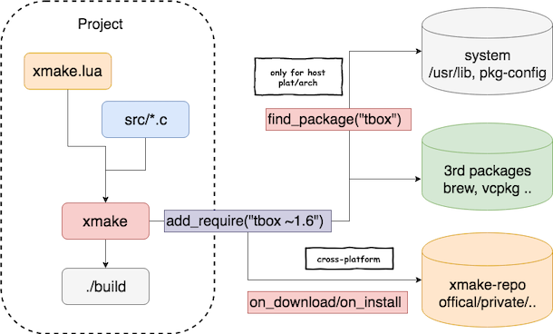

如果暂时看不懂上图的流程，没有关系，我们先来个简单的例子体验下如何远程下载依赖包并把它集成到项目中去，还是拿之前的 zlib 为例，我们先假设当前系统环境中没有这个库存在，想要从网上拉取对应版本进行集成。

还是拿之前的 crc32 工程做下修改，编辑里面的 xmake.lua 文件，修改为下面的内容。

```lua
add_requires("zlib", {system = false})

target("crc32")
    set_kind("binary")
    add_files("src/*.c")
    add_packages("zlib")
```

其中 `add_requires()` 接口指定当前项目需要哪些包，配置这个编译时候会触发一次依赖包的安装，而 `add_packages()` 用来配置对特定 target 目标集成指定的依赖包，这两者需要配合使用，缺一不可。

接下来，执行 `xmake` 重新来编译项目，如果出现下面的提示信息，说明我们配置的 `zlib` 包有在官方仓库中被收录，并且当前平台支持这个依赖包的集成。

如果安装完成并且编译成功会显示下面的信息。

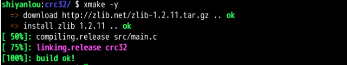

需要注意的一点是，上面的配置中我们额外加上了 `{system = false}` 是因为当前的实验环境中已经存在了 zlib 库，所以 `add_requires("zlib")` 默认会优先自动检测系统环境中的 zlib 库，如果存在就直接使用，也就是内置了 `find_packages("zlib")` 的逻辑。

而这里出于演示远程下载的逻辑，我们通过配置 `{system = false}` 强制触发远程下载，人为忽略了系统库的探测逻辑，在实际项目中，大家可根据自己的需求来决定是否配置这个选项。

另外一个注意事项是，我们的包检测结果都是有本地缓存的，第二次编译并不会再触发依赖包的下载安装，会直接参与集成编译。

所以再次执行 `xmake -rv` 重新编译看看，这次并不会再去安装 zlib 库了，同样可以正常集成 zlib 来重新编译项目，效果如图。


上图中红线部分就是我们从远程仓库集成的 zlib 库头文件和链接信息。

#### 卸载和重装依赖包

如果我们想要卸载之前的依赖包，只需要执行卸载命令。

```bash
xmake require --uninstall zlib
```

如果看到下图，说明已经成功卸载了安装包。

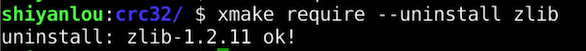

不过需要注意的是，虽然卸载了包，但是当前项目的配置缓存还在，如果继续执行 `xmake` 命令，还是会使用缓存的 zlib 包信息。

因此可以添加 `-c` 参数给 `xmake config`，也就是执行下 `xmake f -c` 命令，强制忽略缓存配置，触发依赖包的重新检测逻辑。

由于 xmake.lua 中还是配置了 zlib 包依赖，因此这次会触发重新安装逻辑（不过不会再重新下载了，而是直接解压安装之前缓存的 zlib 包），效果如图。


#### 语义版本设置

xmake 的依赖包管理是完全支持语义版本选择的，例如："~1.6.1"，对于语义版本的具体描述见：https://semver.org/。

这里，我们在之前的 xmake.lua 基础上，新增两个依赖库，并且设置上不同的语义版本，例如。

```lua
add_requires("zlib", {system = false})
add_requires("tbox 1.6.*", "pcre2 >10.0")

target("crc32")
    set_kind("binary")
    add_files("src/*.c")
    add_packages("zlib", "tbox", "pcre2")
```

其中 [tbox 库](https://github.com/tboox/tbox) 我们会集成匹配 `1.6` 下面的所有可用子版本，而 pcre2 正则库我们会集成匹配 `>10.0` 的可用版本。配置好后，继续执行 `xmake` 安装依赖库编译，如果一切顺利，会看到类似下面的结果输出。

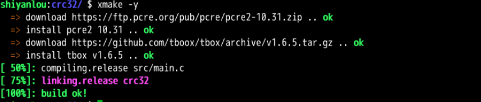

再来执行 `xmake -rv` 查看完整命令输出，看看是否真的集成上了这两个库。

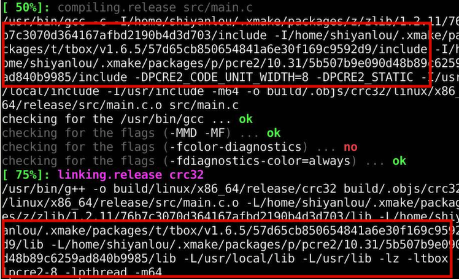

上图红框部分，就是我们新下载集成的两个依赖库的路径和编译链接选项，说明我们已经顺利集成上了，至于 C 代码里面如何去使用它们，这里就不再过多介绍了，大家在实验后可以自行研究。

当然，如果我们对当前的依赖包的版本没有特殊要求，那么也可以不设置版本，xmake 会默认拉取安装当前可以获得的最新版本包。

如果当前依赖包有 git 仓库，也可以集成 git 仓库的 `master/dev` 分支依赖包，只需要把版本号换成对应的分支名就行了，例如。

```lua
add_requires("tbox master")
add_requires("tbox dev")
```

后续编译操作跟之前的类似，这里就不再重复实验了。

#### 查看依赖库信息

我们可以执行下面的命令，快速查看通过 `add_requires("zlib")` 配置的依赖包信息，比如查看实际的安装路径、缓存目录、可选配置信息等。

```bash
xmake require --info zlib
```

相关的包信息说明可以参考下面的图片。

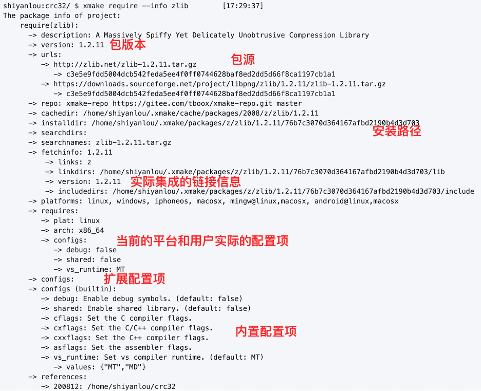

虽然 xmake 内置的包仓库功能已经很完善，但毕竟生态还没完全建立起来，收录的包还不是很多，如果用户需要的 C/C++ 依赖包在我们的包仓库中找不到，那么还可以直接集成使用第三方仓库中提供的包，例如：Conan、Vcpkg、Homebrew 等仓库，xmake 都是支持的。

这里我们来重点尝试下集成 Conan 中提供的包，因为相比 Vcpkg、Homebrew 等仓库，Conan 支持更加完善，不仅自身跨平台，提供的包也是支持多个不同平台的，收录的包数量也非常多。

在使用 [Conan](https://conan.io/) 之前，首先需要安装它到系统环境中，由于 conan 是基于 python 的，因此可以通过 pip 工具来安装它，只需要执行下面的命令。

```bash
sudo pip install --upgrade pip
sudo pip install conan
source ~/.profile
```

然后我们可以通过执行 `conan --version` 确认下是否安装成功，如果成功，我们会看到对应的版本信息，如图。


接下来，使用 vim 编辑之前的 crc32/xmake.lua 文件，改成如下配置。

```lua
add_requires("CONAN::zlib/1.2.11@conan/stable", {alias = "zlib"})

target("crc32")
    set_kind("binary")
    add_files("src/*.c")
    add_packages("zlib")
```

这里我们使用 `CONAN::` 作为 conan 包仓库的命名空间，让 xmake 将其作为 conan 依赖包来处理后续的探测、下载和安装逻辑。xmake 内部会自动调用 conan 去安装指定的 zlib 包，并且集成进来，因此这里的 `zlib/1.2.11@conan/stable` 包描述格式也是完全基于 conan 自身的规范，大家可以直接到 [conan 官方文档](https://docs.conan.io/en/latest/using_packages/conanfile_txt.html#requires) 查看如何设置。

而后面的 `{alias = "zlib"}` 部分是 `add_requires` 接口对于每个包的扩展配置，这里 alias 用来设置包的别名，方便之后每个 target 中更加精简的去集成，例如：`add_packages("zlib")`，而不是每次都是用全名。

配置完成后，执行 `xmake` 去编译这个集成了 conan 依赖包的项目，整个依赖包的下载安装流程，跟之前完全一致，如图。

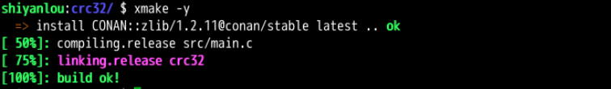

如果安装成功，可以继续执行 `xmake -rv` 来查看 xmake 实际链接的 conan 包路径信息。

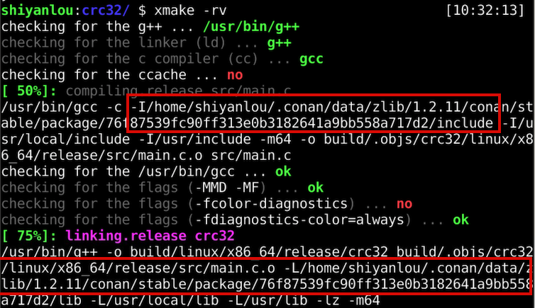

通过上图可以看到，xmake 直接引用了安装在 conan 自身仓库目录下的 zlib 库，说明整个集成流程已经通过。

在本节实验中，我们主要学习了如何查找集成依赖库，如何集成使用 xmake 官方包仓库中提供的 C/C++ 依赖包，另外我们也学习了如何接入 Conan 等第三方包仓库中的依赖包。

本实验的参考代码可以使用如下命令下载：

```bash
wget https://labfile.oss.aliyuncs.com/courses/2764/code4.zip
```

# 二 xmake基础

## 5 配置语法简介

在本节实验中，我们可以大概了解 xmake.lua 的语法设计理念，以及一些基本配置的写法，通过本节实验，基本上能掌握如何去编写合理的 xmake.lua 配置来简化工程配置。

#### 知识点

- xmake.lua 的配置语法和设计理念

- 描述域和脚本域配置的基本概念

- 多目标程序的编译配置

- 全局配置作用域的概念

xmake 的工程描述文件 xmake.lua 虽然基于 lua 语法，但是为了使得更加方便简洁得编写项目构建逻辑，xmake 对其进行了一层封装，使得编写 xmake.lua 不会像编写 makefile 那样繁琐，甚至比 cmake 的 CMakelists.txt 的 DSL 语法还更加的简洁直观，学习成本更低。

基本上写个简单的工程构建描述，只需三行就能完整构建一个 C/C++ 工程，例如。

```lua
target("test")
    set_kind("binary")
    add_files("src/*.c")
```

#### 配置分离

xmake.lua 采用二八原则实现了描述域、脚本域两层分离式配置。

什么是二八原则呢，简单来说，大部分项目的配置，80% 的情况下，都是些基础的常规配置，比如：`add_cxflags`、`add_links` 等，只有剩下不到 20% 的地方才需要额外编写一些复杂的逻辑脚本来满足一些特殊的配置需求。

而这剩余的 20% 配置通常比较复杂，如果直接充斥在整个 xmake.lua 里面，会把整个项目的配置弄的很混乱，不具有良好的可读性。

因此，xmake 通过描述域、脚本域两种不同的配置方式，来隔离 80% 的简单配置以及 20% 的复杂配置，使得整个 xmake.lua 看起来非常的清晰直观，可读性和可维护性都达到最佳。

我们可以通过下图大致了解哪些配置区域是描述域配置，哪些是脚本域。

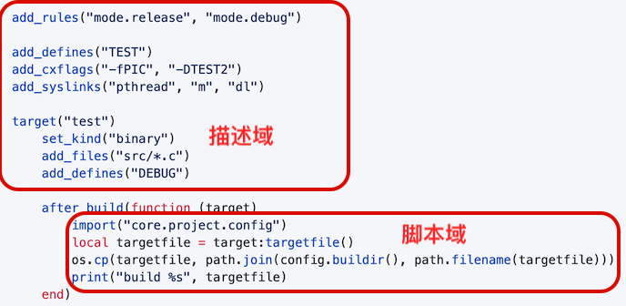

也可以通过下面描述的特征来快速区分：

- 描述域：使用 `set_xx`、`add_xxx` 等配置接口进行的配置区域。

- 脚本域：使用 `on_xx`、`after_xxx` 和 `before_xxx` 等配置接口的内部区域。

对于刚入门的新手，或者仅仅是维护一些简单的小项目，只使用描述配置就已经可以完全满足需求了，例如下面的配置。

```lua
target("hello")
    set_kind("binary")
    add_files("*.c")
    add_defines("DEBUG")
    add_syslinks("pthread")
```

一眼望去，其实就是个 `set_xxx` 和 `add_xxx` 的配置集，而 `target("test")` 用来定义目标程序，所有的配置都会对当前定义的 target 目标生效。

对于新手，这样的配置，我们完全可以不把它当做 lua 脚本，仅仅作为普通的，但有一些基础规则的配置文件就行了，所以即大家完全没学过 lua 也是没有关系的。

这回我们不通过模板工程，直接手工创建一个空项目来实验描述域配置。首先新建一个空目录，然后写个输出指定字符串的 C 例子代码（如果之前已经存在 hello 目录，可以先执行 `rm -rf hello` 删除它）。

```bash
cd Code
mkdir hello
cd hello && vim main.c
```

然后编辑 main.c 编写如下代码。

```c
#include <stdio.h>

int main(int argc, char** argv)
{
    printf("hello %s\n", WORD);
    return 0;
}
```

C 代码写好后，在项目根目录下执行 `vim xmake.lua` 开始写配置文件，我们这里仅仅使用描述域配置。

```lua
target("hello")
    set_kind("binary")
    add_files("*.c")
    add_defines("WORD=\"foo\"")
```

所有的配置都会对 `target("hello")` 定义的 hello 目标程序生效，这里仅仅添加了一个 `-DWORD="foo"` 的宏定义。

最后，我们执行如下命令编译运行程序。

```bash
xmake
xmake run
```


如果正常看到 `hello foo` 的输出，说明添加的宏定义配置确实正常生效了。

描述域虽然支持 lua 的脚本语法，但在描述域尽量不要写太复杂的 lua 脚本，比如一些耗时的函数调用和 for 循环，因为描述域目的主要是为了简化设置配置项。

如果大家已经完全熟悉了 xmake 的描述域配置，并且感觉有些满足不了项目上的一些特殊配置维护，那么我们可以在脚本域做更加复杂的配置逻辑。

只要是类似：`on_xxx`、`after_xxx` 和 `before_xxx` 等字样的配置接口内部的脚本，都是属于脚本域。

继续修改 hello/xmake.lua 配置，在编译完成后输出目标程序的实际存储路径，配置修改如下。

```lua
target("hello")
    set_kind("binary")
    add_files("*.c")
    add_defines("WORD=\"foo\"")
    after_build(function (target)
        print("my path: %s", target:targetfile())
    end)
```

上面的配置中，`after_build()` 定义的内部代码区域就是脚本配置域，可以在里面写各种复杂的 lua 脚本来实现更灵活的配置需求。在这里，我们仅仅通过 `print` 内置接口去打印输出 `target:targetfile()` 的内容，也就是目标程序的实际输出路径。

执行 `xmake` 编译结束，会在编译最后面输出配置信息，例如下图的红框部分。

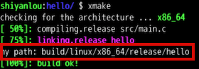

xmake 还对每个 target 提供了 `on_load` 阶段，每个目标程序的配置都会加载这里面的脚本，因此我们可以在这个脚本域中，实现更加灵活复杂的基础配置脚本。

例如，我们可以把之前在描述域中定义的宏定义放置在 `on_load` 里面去动态配置。

```lua
target("hello")
    set_kind("binary")
    add_files("*.c")
    on_load(function (target)
        target:add("defines", "WORD=\"foo\"")
    end)
```

上面的配置跟之前在描述域的配置完全等价，任何 `set_xxx`、`add_xxx` 等描述域接口，在脚本域中都可以通过 target 里面的 `target:set("xxx", ...)` 和 `target:add("xxx", ...)` 模块接口，更加灵活的调用和配置。

我们可以再执行 `xmake -rv` 进行编译，查看编译输出，`-DWORD=\"foo\"` 也被传入的 gcc 编译器，说明动态的在脚本域设置宏定义也生效了。


#### 分离脚本域配置脚本

对于一些简短的配置脚本，像上面这样内置写就足够了，如果需要实现更加复杂的脚本配置逻辑，那么跟描述域配置充斥在一个 xmake.lua 里面，就会显得很臃肿。这个时候可以把脚本域的配置分离到独立的 lua 文件中去维护，这也是描述域和脚本域设计的初衷，可以把复杂的逻辑独立出来单独维护。

这里还是以刚才的配置为例，稍微做一些修改，把 `on_load()` 里面的所有配置独立到单独的 `modules/load.lua` 脚本文件中去，整个工程的目录结构如下。

```txt
.
├── main.c
├── modules
│   └── load.lua
└── xmake.lua
```

接下来使用 vim 编辑 `modules/load.lua` 文件，将之前 `on_load` 里面的配置挪进来，例如。

```lua
function main(target)
    target:add("defines", "WORD=\"foo\"")
end
```

可以看到，里面的配置跟之前的脚本没什么不同，仅仅加了个 `main` 函数作为主入口，而之前在 `on_load(function (target) end)` 中定义的是匿名的入口函数。

最后修改原来的 xmake.lua 配置，将 `on_load()` 里面的配置指向到刚刚创建的 `modules/load.lua` 文件即可。

```lua
target("hello")
    set_kind("binary")
    add_files("*.c")
    on_load("modules.load")
```

这里使用 `modules.load` 的格式去引用当前 modules 目录下的 load.lua 文件，其中每个 `.` 对应一级子目录。至于为什么不用路径分隔符，是为了跟 [import 导入接口](https://xmake.io/#/zh-cn/manual/builtin_modules?id=import) 保持一致，都是用来导入指定的 lua 脚本模块。关于 import 接口，我们会在后面的实验中详细讲解。

执行如下命令验证编译和运行是否通过。

```bash
xmake
xmake run
```

编译和运行是否通过可以对照下面的图片结果。


在之前的实验中，我们的工程都只有一个目标程序，也就是仅仅定义了一个 `target()`，但实际的项目，可能需要同时编译多个目标程序。

这种情况下只需要在 xmake.lua 中再额外多配置一个 `target()` 的定义块就行了，每个 `target("test")` 定义唯一对应一个目标程序，它可以是可执行程序，也可以是静态库、动态库程序目标。

通过缩进的方式，可以显式区分哪些设置是对哪个 target 目标生效，当然缩进配置只是语法风格的约定，使得配置更加简洁，可读性更好，但这并不是强制要求的。

现在继续修改之前的 xmake.lua 配置，里面定义两个执行程序目标，而实际的 C 代码我们还是复用之前的 `main.c`。

```lua
target("test1")
    set_kind("binary")
    add_files("*.c")
    add_defines("WORD=\"TEST1\"")

target("test2")
    set_kind("binary")
    add_files("*.c")
    add_defines("WORD=\"TEST2\"")
```

通过上面的配置看到，我们还对每个 target 额外添加了不同的宏定义，`-DTEST1` 定义给 test1 目标程序，`-DTEST2` 定义给 test2 目标程序。

需要注意，所有的 `set_xx` 和 `add_xx` 设置都是针对上面最近的 `target()` 定义的特定目标程序，而不是全局的。

我们可以把它理解为字典的 key/value 设置，上面的配置等价于下面的伪描述 json 定义。

```json
"test1":
{
    "kind" = "binary",
    "files" = "*.c",
    "defines" = "WORD=\"TEST1\""
},
"test2"
{
    "kind" = "binary",
    "files" = "*.c",
    "defines" = "WORD=\"TEST2\""
}
```

也可以显式的加上 `target_end()` 来明确每个 target 定义块的作用范围，比如下面这样。

```lua
target("test1")
    set_kind("binary")
    add_files("*.c")
    add_defines("WORD=\"TEST1\"")
target_end()

target("test2")
    set_kind("binary")
    add_files("*.c")
    add_defines("WORD=\"TEST2\"")
target_end()
```

执行 `xmake` 来尝试编译这两个目标程序，可以看到，我们实际编译链接生成了两个可执行程序：test1 和 test2。


再执行 `xmake -rv` 查看详细输出，这两个宏定义已经分别传入了对应的 target 中去。


分别运行这两个可执行程序查看输出。

```bash
xmake run test1
xmake run test2
```

如果看到下面的输出，说明我们确实已经将不同的 WORD 宏定义分别传入了 test1 和 test2 这两个程序中去。


#### 全局配置和子配置

如果我们的项目工程需要参与编译的目标程序很多，不止一两个，有可能十几个，如果每个 target 都单独配置一遍，那么整个 xmake.lua 中会有很多的重复配置存在，非常冗余，毕竟不可能每个 target 的配置都是完全不同的，多少总会有一些共享的通用配置。

我们可以把每个 target 中都会使用到的通用配置抽离出来，放在最上面的全局配置域中设置，这样就会对所有 target 都生效了。

在之前的配置中，在全局根域加上一些通用配置，比如改成下面的内容。

```lua
add_defines("ROOT")
set_optimize("fastest")
set_languages("c99")
add_includedirs("/tmp")

target("test1")
    set_kind("binary")
    add_files("*.c")
    add_defines("WORD=\"TEST1\"")

target("test2")
    set_kind("binary")
    add_files("*.c")
    add_defines("WORD=\"TEST2\"")
```

执行 `xmake -rv` 进行编译，从输出中看到红框里面的部分，可以确认在全局根域的这些设置对每个 target 都生效了，而 `-DWORD=` 的宏定义设置在不同的 target 中还是不相同的，因为它们是在特定 target 域中分别设置的。


至于为什么要抽离通用设置到全局根域，在前面也解释了原因，就是为了简化 xmake.lua 的配置，这也是 xmake 的初衷，让工程项目的构建配置能够尽可能的简洁可读，这样方便维护也更加友好。

如果不放在根域，而是每个 target 都去单独配置一遍，我们可以对比下看看，这是非常冗余臃肿的，可读性也很差，就如下面的配置（不要这样去写）。

```lua
target("test1")
    set_kind("binary")
    add_files("*.c")
    add_defines("WORD=\"TEST1\"")
    add_defines("ROOT")
    set_optimize("fastest")
    set_languages("c99")
    add_includedirs("/tmp")

target("test2")
    set_kind("binary")
    add_files("*.c")
    add_defines("WORD=\"TEST2\"")
    add_defines("ROOT")
    set_optimize("fastest")
    set_languages("c99")
    add_includedirs("/tmp")
```

所以，我们要记住，如果有通用的设置，请尽可能设置到全局作用域中对所有 target 生效，而特殊配置才在指定的 target 中去单独配置它们。

在本节实验中，我们了解了 xmake.lua 的语法设计理念，以及基本的配置方式，并且学习了什么是描述域和脚本域，也学习了如何去配置编译多个目标程序，另外还知道了怎么通过全局设置去简化配置内容。

本实验的参考代码可以使用如下命令下载：

```bash
wget https://labfile.oss.aliyuncs.com/courses/2764/code5.zip
```

## 6 目标依赖

在本节实验中，我们会学习到如何控制多个程序的编译顺序，如何设置依赖来继承编译配置，以及动态库和静态库的编译使用。

#### 知识点

- 多个 C++ 程序间的编译顺序控制
- 依赖编译的配置继承
- 动态库、静态库的编译和使用
- Phony 组合多个编译目标程序

在默认情况下，xmake 在编译多个目标程序时，会通过多任务并行编译来提升项目的整体编译效率，不过每个 target 目标程序实际的编译顺序是未定义的。

然而有时候，某些项目工程中的多个目标程序之间是有依赖关系的，如果不控制编译顺序，那么有可能会错误地优先编译一些需要滞后的程序，就会导致编译出错。

这种情况下通过 `add_deps()` 配置接口去控制指定 target 的编译依赖顺序，对一些依赖静态库、动态库的可执行程序非常有用。

#### 链接和编译的依赖控制

为了了解如何使用 `add_deps` 来控制编译依赖顺序，我们先重新创建个 `deps_test` 的空工程。

```bash
cd ~/Code
xmake create deps_test
```

然后修改 deps_test/xmake.lua 配置。

```lua
target("test1")
    set_kind("binary")
    add_files("src/*.cpp")
    add_deps("test2")

target("test2")
    set_kind("binary")
    add_files("src/*.cpp")
    add_deps("test3")

target("test3")
    set_kind("binary")
    add_files("src/*.cpp")
```

上述配置，我们使用 `add_deps` 将三个 target 目标程序的依赖顺序调整为：test1 依赖 test2， test2 依赖 test3。

那么执行编译的时候的，test3 会优先编译，然后是编译 test2，最后才编译 test1。

执行 `xmake` 查看实际的编译顺序。


通过上图，我们可以看到最后三个程序的实际链接顺序确实已经按照刚刚设置的依赖顺序进行执行了，不过其 C++ 源文件还是在最开始就执行编译了。

这是由于 xmake 要优化编译速度，在编译链接时候，假定一个事实，那就是所有不同目标的 C/C++ 源文件之间是不需要依赖顺序的，我们完全可以全部并行化处理编译。

仅仅只有在链接阶段才需要处理依赖顺序，这样我们可以最大化的将大量源码的编译全部并行化，而不是编译链接完成一个 target，再去实际处理第二个 target 程序的源码编译和链接，这会在每个 target 的链接阶段导致一段时间的串行化和停滞，减慢编译速度。

简单来说，也就是即使设置 `add_deps`，xmake 默认也仅仅控制链接的依赖顺序，不控制源码编译的依赖顺序。

不过，万事总有例外，如果程序确实还是需要每个 target 的源码都要严格按照 `add_deps` 指定的依赖顺序去控制编译，那么我们只需要设置下编译策略，禁用跨目标并行编译即可，例如下面的配置。

```lua
set_policy("build.across_targets_in_parallel", false)

target("test1")
    set_kind("binary")
    add_files("src/*.cpp")
    add_deps("test2")

target("test2")
    set_kind("binary")
    add_files("src/*.cpp")
    add_deps("test3")

target("test3")
    set_kind("binary")
    add_files("src/*.cpp")
```

我们通过全局设置禁用 `build.across_targets_in_parallel` 策略，就可以完全串行化 target 间的源码编译顺序，不再跨目标并行编译源码。

由于实际源码和配置没有发生改变，默认的 `xmake` 编译命令不会触发重新编译，所以我们通过执行 `xmake -r` 强制重新编译，来直观感受下禁用这个策略后的效果。


可以对比下上图的编译顺序跟之前的编译顺序，还是有明显区别的，这次我们不仅链接顺序，甚至连源码也都严格按照 test3，test2，test1 的顺序来编译了，test1 的源码必须要等待 test2 实际完成链接后才会去编译。

#### 静态库的依赖编译和继承

了解了依赖顺序的控制后，接下来开始重点讲解如何实现静态库和可执行程序的组合编译，通常我们开发一个静态库程序，都会同时写一个可执行程序去链接并使用库里面的接口。

这个时候，如果我们使用 `add_links` 和 `add_linkdirs` 去链接依赖的静态库就会比较繁琐，既然这两者之间原本就是有依赖关系的，那么我们可以在配置 `add_deps` 后，通过可执行程序去自动集成对应的静态库的链接信息来简化配置。

整个简化流程大概如下图所示，通过配置 `add_deps` 可以集成依赖的静态库目标程序中的大部分链接信息，因此仅仅只需要通过关联依赖，就能够自动集成和使用静态库。


我们可以通过 xmake 提供的模板工程创建一个带有静态库的空工程，里面默认就提供了两个 target 目标程序，一个静态库和一个可执行程序。

```bash
cd Code
xmake create -t static foo
```

foo/xmake.lua 配置内容如下。

```lua
target("foo")
    set_kind("static")
    add_files("src/interface.cpp")

target("foo_demo")
    set_kind("binary")
    add_deps("foo")
    add_files("src/main.cpp")
```

其中 foo 就是静态库目标程序，而 foo_demo 是可执行目标程序，它们之间通过 `add_deps("foo")` 进行依赖关联，使得 foo_demo 可以自动集成 foo 静态库，而不再需要额外添加 `add_linkdirs`、`add_links` 等配置信息。

#### 依赖配置的可见性设置

`add_deps` 除了能够自动继承静态库依赖的链接信息，还可以继承一些其它的配置信息，比如：`add_includedirs`、`add_defines` 等大部分配置都是可以被继承的。

不过只有这些配置被设置了 `public`、`interface` 等对外可见性设置，才能够支持对其它 target 导出配置被继承。

比如我们将 foo/xmake.lua 改为下面的配置，来进一步导出 foo 库的一些头文件搜索路径和宏定义。

```lua
target("foo")
    set_kind("static")
    add_files("src/interface.cpp")
    add_defines("TEST", {public = true})
    add_includedirs("src", {interface = true})

target("foo_demo")
    set_kind("binary")
    add_deps("foo")
    add_files("src/main.cpp")
```

通过设置 `{public = true}` 将 `-DTEST` 的宏定义设置公开给其它依赖的子 target 继承，并且 foo 自身也会被定义。

而 `add_includedirs("src", {interface = true})` 会把 src 作为头文件搜索目录，以接口的方式仅仅开放给其它 target 继承，而 foo 自身不会去设置它。

关于可见性，xmake 主要提供下面三种，默认情况下的配置都是私有的，不对外可见的。

| 属性      | 描述                                                                 |
| --------- | -------------------------------------------------------------------- |
| private   | 默认设置，作为当前 target 的私有配置，不会被依赖的其它 target 所继承 |
| public    | 公有配置，当前 target 依赖的子 target 都会被设置                     |
| interface | 接口设置，仅被依赖的子 target 所继承设置，当前 target 不参与         |

执行 `xmake -rv` 命令编译输出查看实际的继承效果，其中 `-DTEST` 应该会同时设置到 foo 和 foo_demo 的所有源文件编译，而 `-Isrc` 会仅仅被设置到 foo_demo 的源文件编译。


#### 级联依赖继承

接下来，我们再来尝试下更加复杂的场景，将依赖继承的层级加深一层，foo_demo 依赖 foo 静态库，而 foo 依赖 bar 静态库，并且我们把额外的 public 导出配置放置到 bar 目标程序中，比如下面这样。

```lua
target("bar")
    set_kind("static")
    add_files("src/interface.cpp")
    add_defines("TEST", {public = true})
    add_includedirs("src", {interface = true})

target("foo")
    set_kind("static")
    add_files("src/interface.cpp")
    add_deps("bar")

target("foo_demo")
    set_kind("binary")
    add_deps("foo")
    add_files("src/main.cpp")
```

这个时候，xmake 在编译最终的 foo_demo 时候，也会自动继承 foo 和 bar 里面的静态库信息，并且继承上 public 和 interface 的导出配置，也就是说 `add_deps` 的继承是完全支持级联依赖的，实际效果见下图。


除了静态库，我们也可以通过依赖继承的方式将动态库和可执行程序进行关联，只需要把之前的 xmake.lua 里面的 foo 目标类型改成 shared，就能编译生成动态库，并且自动关联上可执行程序。

我们改成下面的配置。

```lua
target("foo")
    set_kind("shared")
    add_files("src/interface.cpp")
    add_defines("TEST", {public = true})
    add_includedirs("src", {interface = true})

target("foo_demo")
    set_kind("binary")
    add_deps("foo")
    add_files("src/main.cpp")
```

然后执行编译运行。

```bash
xmake
xmake run
```

xmake 会生成一个 `libfoo.so` 动态库程序，然后 foo_demo 会自动链接上这个 so 库，然后运行的时候，也能够自动加载上它。


至于为什么能够自动加载上编译生成的 so 库，那是因为通过 `add_deps("foo")` 配置的依赖继承关系，在 foo_demo 链接的时候，除了自动加了 `-Lxx -lfoo` 等链接信息外，还额外追加了 rpath 信息用来设置动态库的加载路径信息，也就是下图红框中的 `-Wl,-rpath=$ORIGIN`。

这个链接选项的意思就是配置可执行程序运行时，可以搜索当前运行目录下的所有依赖的 so 库，如果存在就可以正常加载这些 so 库。


另外，从上图中我们看到 `-DTEST -Isrc` 等 public 导出配置也同样被继承了进来。

#### 使用 Phony 目标组合多个依赖程序

在之前的实验中我们讲到 target 的基础目标类型，除了 `binary`、`static` 和 `shared` 之外，还有一个特殊的目标类型 `phony`，它用于设置给定 target 作为一个空的目标对象，并不会参与实际的源码编译。

虽然不会参与实际编译，但是它可以和 `add_deps` 配合使用，用来组合一些需要一起编译的几个 target，实现一组 target 目标同时编译。

我们再来继续修改 xmake.lua，将 group 目标设置成 phony 目标类型，本身不参与编译，但是通过 `add_deps("foo", "bar")` 关联上 foo 和 bar 这两个目标程序，相当于将它们组合到一起同时被 group 目标依赖，例如。

```lua
target("foo")
    set_kind("binary")
    add_files("src/*.cpp")

target("bar")
    set_kind("binary")
    add_files("src/*.cpp")

target("baz")
    set_kind("binary")
    add_files("src/*.cpp")

target("group")
    set_kind("phony")
    add_deps("foo", "bar")
```

因此，我们只需要执行 `xmake build group` 指定编译 group 目标，就会触发 foo 和 bar 这两个程序的编译，而 bar 目标由于没有被依赖，所以就不会被编译。

编译后的实际结果如下图。


在本节实验中，我们主要学习了如何去设置依赖编译来控制多个目标程序的编译顺序，也学会了如何去继承其它目标程序导出的配置以及如何去编译使用动态库、静态库程序。

本实验的参考代码可以使用如下命令下载：

```bash
wget https://labfile.oss.aliyuncs.com/courses/2764/code6.zip
```

## 7 条件判断

在本节实验中，我们会学习到 xmake 条件判断语句的基础用法，以及常用的平台、架构等判断接口，另外还会学习如何判断自定义选项的值来控制编译。

#### 知识点

- xmake 常用条件判断接口
- xmake 条件判断语法
- 如何自定义配置选项

由于 xmake 是基于 lua 脚本的，所以不管是在描述域还是脚本域中的配置，我们都可以通过基础的 lua 条件判断语法去控制配置逻辑。

整个条件控制的语法逻辑大概如下。

```lua
if expr then
    -- ...
elseif not expr then
    -- ...
else
    -- ...
end
```

整个语法结构非常的简单，并且同时适用于描述域配置和脚本域配置，其中 expr 部分为条件判断表达式，我们可以通过 not，and 和 or 三个逻辑关键字组合成各种复杂的逻辑条件，例如。

```lua
if a > b and not c or d then
    -- ...
end
```

不过，对于构建配置，我们不需要写这么复杂的条件，通常仅仅只需要判断下平台、架构等基础条件来控制编译配置就行了。因此为了简化条件判断，xmake 提供了一些内置的条件判断接口，用来快速判断它们，并且也简化了整个条件判断的逻辑，下面我们来详细讲解下。

#### 判断当前目标平台

在构建配置中，如果要支持跨平台构建，那么最常用的莫过于判断当前程序编译后的运行平台了，也就是通过判断我们编译生成的可执行文件和库程序实际的运行平台环境，来控制编译配置。

在开始实验前，我们先执行下面的命令创建一个新的空工程，然后在里面创建一个 `src/linux/stub.cpp` 的空代码文件。

```bash
cd Code
xmake create condition
cd condition && mkdir src/linux
touch src/linux/stub.cpp
```

其工程文件结构如下。

```txt
.
├── src
│   ├── linux
│   │   └── stub.cpp
│   └── main.cpp
└── xmake.lua
```

在准备工作做好后，我们开始编辑 xmake.lua 修改成下面的配置。

```lua
target("test")
    set_kind("binary")
    add_files("src/*.cpp")
    if is_plat("linux") then
        add_defines("LINUX")
        add_files("src/linux/*.cpp")
    end
```

在上面的配置中，我们通过内置的条件判断接口 `is_plat("linux")` 来判断当前的目标平台是否为 Linux，如果当前正在为 Linux 程序做编译，那么我们会切入里面的 if 分支，额外编译 `src/linux/*.cpp` 等针对 Linux 平台特有的源文件，并且同时添加上 `-DLINUX` 宏定义。

由于实验环境就是 Linux 系统，并且编译的目标程序也是针对 Linux 平台的，因此我们可以执行 `xmake` 命令编译确认 `src/linux/*.cpp` 源文件是否真的参与了编译。


上图红线位置的源文件就是我们刚刚配置的仅对 Linux 平台才会参与编译的代码文件，我们再来执行 `xmake -rv` 查看详细的编译输出，`-DLINUX` 也被正常传递进了 gcc 编译器。


另外需要说明的是，目标编译平台是可以通过 `xmake f -p linux` 显式设置的，它会跟 `is_plat("linux")` 保持一致，如果编译前没有配置过平台，那么默认会使用当前主机平台来作为目标编译平台。

而显式指定编译平台，通常在交叉编译时候非常有用，例如在 Linux 系统上使用 Android NDK 编译 android 库程序，就可以通过 `xmake f -p android` 切换 Android 目标平台编译，这个时候就是对应条件配置 `is_plat("android")` 而不是 Linux。

由于 Android 也是基于 Linux 系统，所以有些配置是可以跟 Linux 保持一致的，这个时候，我们可以使用 `is_plat("android", "linux")` 来判断多个平台，它们之间是属于`或`的关系。

```lua
if is_plat("linux", "android") then
    add_defines("LINUX")
    add_files("src/linux/*.cpp")
end
```

关于 Android 等其它平台的切换编译详情，可以看下 [官方文档](https://xmake.io/#/zh-cn/guide/configuration?id=android)，这里就不多做介绍了。

而目前 xmake 支持的所有平台可以简单列举下：

- Windows
- Cross
- Linux
- macOS
- Android
- Iphoneos
- Watchos
- Freebsd

#### 判断编译指令架构

编译指令架构指的是生成的目标程序实际执行的指令架构，例如：x86_86、i386、armv7 等指令集。

在 Windows 系统上通常是 x64、x86 指令集，而在 Linux/macOS 系统上通常是 x86_64、i386 指令集，另外在一些嵌入式设备、移动端操作系统上通常是 armv7、arm64、mips 等指令架构。

通过判断指令架构，我们可以针对性配置处理不同架构的编译宏、代码以及特殊编译优化选项等。比如可以判断当前编译指令架构如果是 x86_64 的话，就再额外编译 `src/x86_64/stub.S` 汇编文件，里面可以针对这个架构实现一些特殊的汇编优化代码。

将 condition/xmake.lua 修改为如下配置。

```lua
target("test")
    set_kind("binary")
    add_files("src/*.cpp")
    if is_plat("linux") then
        add_defines("LINUX")
        add_files("src/linux/*.cpp")
    end
    if is_arch("x86_64") then
        add_files("src/x86_64/*.S")
    end
```

我们新增了对 x86_64 架构的判断去编译一些特定的汇编代码，当然这里我们仅仅为了演示，所以只是通过下面的命令创建一个空的汇编代码文件，里面没有添加任何实现。

```bash
mkdir src/x86_64
touch src/x86_64/stub.S
```

我们再来强制执行下编译，看下编译输出，由于当前的实验环境就是 Linux 系统的 x86_64 架构，所以会触发新加的条件配置，结果如下图红线位置所示。


#### 判断宿主平台架构

除了上述的目标程序实际运行平台和架构，有时候我们还需要判断当前宿主环境的系统平台和指令架构（也就是编译器实际运行的系统平台）。

更直观点说，比如我们在 Linux 上编译生成 Android 系统的 so 库程序，那么 Linux 就是宿主平台，而 android 就是实际的目标程序平台，这通常在交叉编译环境中，更需要做如此区分。

但是对于编译的目标程序也是在当前系统环境下运行的，那么宿主平台和目标平台是完全一致的。

可以通过 `is_host()` 配置接口来判断宿主平台，xmake 不会从 `xmake f -p/--plat` 中去取目标平台的实际值，因为宿主平台在 xmake 运行时候就是固定的，所以我们可以直接从 `os.host()` 和 `os.arch()` 接口去取对应的值，例如执行如下命令，直接查看当前的宿主平台和架构是多少。

```bash
xmake l os.host
xmake l os.arch
```

运行结果如下图。


至于刚刚所说的交叉编译，也就是在当前主机环境下使用交叉编译工具链生成只能在其它设备才能运行的目标程序，如果在 Linux 上编译 Android 程序或者编译其它 arm，mips 等架构的嵌入式目标程序，这些编译后的目标程序在当前的宿主环境是没办法执行的，只能在对应的设备上才能运行。

这个时候，宿主平台就是我们的 Linux 系统平台，也就是交叉编译工具链的执行环境，而目标平台就是对应程序所在设备上的系统平台，它并不一定是宿主系统的 Linux 环境。

除了一些已知的 Android，Iphoneos 等特定系统平台，其它各种交叉编译工具链平台，我们都可以统一使用 `xmake -p cross` 交叉编译平台来编译。

这里为了演示宿主平台和目标平台的区别，我们可以通过 `xmake f -p cross` 命令切换到 cross 交叉编译平台下执行 `xmake -r` 重新编译，这个时候目标平台就不再是 Linux 了。这里由于切换了平台，因此我们追加 `-c` 强制触发下编译环境的检测。

```bash
xmake f -p cross -c
xmake -r
```

由于这个时候我们的配置还是判断的目标平台，但已经通过命令切换到了 cross 编译平台下，所以不再是 Linux 和 x86_64 了，实际的编译就会变成下图所示。


Linux 和 x86_64 相关的代码文件就不再参与编译了，接下来我们将之前的配置改成判断宿主平台和架构。

```lua
target("test")
    set_kind("binary")
    add_files("src/*.cpp")
    if is_host("linux") then
        add_defines("LINUX")
        add_files("src/linux/*.cpp")
    end
    if os.arch() == "x86_64" then
        add_files("src/x86_64/*.S")
    end
```

然后我们再切到 cross 平台，执行相同的编译。

```bash
xmake f -p cross -c
xmake -r
```

这回我们看到，Linux 和 x86_64 的代码重新参与了编译，这是因为虽然编译平台切换到了 cross 交叉编译，但是实际 xmake 运行的宿主平台还是我们的 Linux 实验环境，永远不会改变。


虽然 xmake 提供了默认的编译模式规则可以让大家很方便的通过 `xmake f -m debug` 切换各种编译模式，不过有时候内置的 `mode.debug`，`mode.release` 等编译模式不一定完全满足需求。这个时候，就需要大家自己来判断当前处于什么编译模式，然后自己去控制编译优化、调试符号等各种编译选项的开启和关闭。

下面，我们将尝试完全使用 `is_mode()` 来自定义判断配置 debug 和 release 编译模式下的一些特定编译选项，实现和内置的 `add_rules("mode.release", "mode.debug")` 编译规则一样的控制效果。

继续修改 condition/xmake.lua 文件的配置为如下所示。

```lua
if is_mode("release") then
    set_symbols("hidden")
    set_optimize("fastest")
    set_strip("all")
elseif is_mode("debug") then
    set_symbols("debug")
    set_optimize("none")
end

target("test")
    set_kind("binary")
    add_files("src/*.cpp")
```

这次我们通过 `is_mode()` 来条件判断当前编译模式是否为 debug 还是 release，然后分别设置不同的编译选项，并且把这些选项设置到全局根域，这样可以对所有 target 生效，也就避免了每个 target 都去重复设置一遍。

如果是 release 编译，也就是 xmake 默认的编译模式，那么配置中，我们启用了 fastest 优化编译，并且去除了所有调试符号信息，相对于 gcc 编译选项就是 `-fvisibility=hidden -fvisibility-inlines-hidden -O3`。

执行如下命令切换到 release 编译模式进行验证。

```bash
xmake f -m release
xmake -rv
```


而如果启用了 debug 编译模式，那么我们会开启调试符号信息，并且禁用所有优化编译，也就是相对于 gcc 中的 `-g -O0` 编译选项。

执行如下命令切到 debug 编译模式进行验证。

```bash
xmake f -m debug
xmake -rv
```


#### 判断自定义配置选项

除了使用 xmake 提供的一些内置条件判断接口来做条件外，为了更加灵活的扩展性，xmake 提供了一种可以让大家自由扩展配置选项的方式，使得在 xmake.lua 中更加定制化的判断配置项。

例如，我们自定义一个配置项 `--myopt` 到命令行。

```console
xmake f --myopt=hello
```

当然，现在直接执行肯定会报错的，因为我们还没有去定义这个选项。

首先，我们在 condition/xmake.lua 文件开头的全局作用域部分加入下面的配置。

```lua
option("myopt")
    set_showmenu(true)
    set_description("The test config option")
option_end()
```

其中，`set_showmenu(true)` 用于启用对外导出，这样 help 帮助菜单中才能看到这个选项，用户才能在命令下使用。

执行如下命令，查看是否已经有了这个选项。用 `grep myopt` 来快速定位新创建的配置选项。

```bash
xmake f --help | grep myopt
```


现在能够在帮助菜单中看到自定义选项了，接下来我们就可以在 xmake.lua 中去判断定义的配置选项来控制编译了。例如我们判断 myopt 的配置值如果是 hello，那么就添加 `-DHELLO` 的宏定义参与编译。

```lua
option("myopt")
    set_showmenu(true)
    set_description("The test config option")
option_end()

target("test")
    set_kind("binary")
    add_files("src/*.cpp")
    if is_config("myopt", "hello") then
        add_defines("HELLO")
    end
```

上面就是我们的完整配置，通过 `is_config("myopt", "hello")` 来判断自定义选项配置 myopt 当前是否为 hello，如果是就会自动追加 `-DHELLO` 宏定义。

执行如下命令，设置 myopt 配置值后，查看编译输出。

```bash
xmake f --myopt=hello
xmake -rv
```

如果一切顺利，那么就会看到红线位置的 `-DHELLO` 已经被传入了 gcc 编译器。


而如果我们清除 myopt 配置，那么 `-DHELLO` 宏定义也就不会被设置上。

```bash
xmake f -c
xmake -rv
```

可以看到下图中已经没有 `-DHELLO` 了。


在本节实验中，我们学习了如何去判断条件语句控制编译逻辑，也了解了一些 xmake 内置的平台、架构判断接口，另外还学会了如何判断自定义的选项开关。

本实验的参考代码可以使用如下命令下载：

```bash
wget https://labfile.oss.aliyuncs.com/courses/2764/code7.zip
```

## 8 内置变量

在本节实验中，我们可以学习到 xmake 内置变量的基础使用，以及如何跟环境变量、shell、自定义选项配置交互来动态配置项目工程。

#### 知识点

- 了解 xmake 常用内置变量
- 构建配置与环境变量、shell 等交互

xmake 提供了 `$(varname)` 的语法，来支持在配置字符串中直接传递内置变量，例如：

```lua
add_cxflags("-I$(projectdir)")
```

它会在实际编译时，将内置的 `projectdir` 变量转换为实际的项目根目录：`-I/home/shiyanlou/hello`。

#### 配置传递项目根目录

在进入本实验前，我们先删除下之前的 hello 项目目录（如果存在的话），然后创建一个新的 hello 工程。

```bash
cd ~/Code
rm -rf hello
xmake create hello
```

然后进入创建的 hello 项目目录，直接执行如下命令快速打印输出内置变量进行测试。

```bash
cd hello
xmake l print '$(projectdir)'
```

上面的命令，相当于直接调用了 xmake 内置接口 print 去打印输出当前项目对应的 `$(projectdir)` 内置变量的值，也就是项目的根目录路径。


这个变量会随着不同的项目自动适配对应的项目路径，因此我们可以在描述域配置中直接嵌入这个变量来使用。

接下来，我们将 xmake.lua 修改成如下内容。

```lua
target("hello")
    set_kind("binary")
    add_files("src/*.cpp")
    add_includedirs("$(projectdir)/inc")
```

通过上面的配置，我们可以大概看出，`$(projectdir)` 内置变量可用于在传参时快速获取和拼接变量字符串，使得传递 includedirs 时，可以获取到相对于项目根目录的路径字符串，也就是 `-I/home/shiyanlou/Code/hello/inc`。

在执行编译前，我们还需要创建缺失的 inc 目录，并且在里面创建一个空头文件。

```bash
mkdir inc
touch inc/stub.h
```

然后执行编译，并查看详细编译输出确认配置的头文件搜索路径是否生效。

```bash
xmake -rv
```

如果能够看到下图红线部分编译选项，则说明内置变量确实配置成功了。


除了获取项目根路径外，xmake 还提供了一些其它的内置变量，用于快速获取各种基本路径字符串，例如下面几个也是比较常用的路径。

- `$(buildir)`：实际构建输出目录。
- `$(tmpdir)`：临时目录。
- `$(curdir)`：当前运行目录。
- `$(scriptdir)`：当前 xmake.lua 配置脚本所在目录。
- `$(programdir)`：xmake 安装程序的 lua 脚本根目录。

#### 获取环境变量

除了获取各种基本路径字符串，我们还可以通过 `$(env varname)` 内置变量，在字符串中快速获取指定环境变量。

例如获取环境变量中的 `$HOME` 路径传递到 xmake.lua 配置中去。

```lua
target("hello")
    set_kind("binary")
    add_files("src/*.cpp")
    add_includedirs("$(env HOME)")
```

执行 `xmake -rv` 查看传入 gcc 的头文件搜索目录是否带上了 `$HOME` 路径。


上图红线位置的 `-I/home/shiyanlou` 就是我们通过获取 `$HOME` 环境变量得到的字符串，至于如何获取当前终端下的所有环境变量，xmake 也提供了接口可以直接快速查看，执行如下命令即可，这个命令会打印所有的环境变量。

```bash
xmake l os.getenvs
```


也可以指定查看特定环境变量的内容。

```bash
xmake l os.getenv HOME
```

其效果跟 `echo $HOME` 是一样的，但这个命令更加通用，其内部实际就是调用了 xmake 的内置接口 `os.getenv("HOME")`，关于 os 相关内置接口，我们会在后面的实验中详细讲解。


#### 执行获取 shell 输出内容

虽然在脚本域，我们可以通过 `os.run` 等接口快速执行其它 shell 程序，但这对初学者来说，使用起来还是繁琐些，因此 xmake 也提供了 `$(shell command)` 内置变量的方式，在描述域配置中快速执行 shell 命令，并嵌入执行输出结果到配置字符串中。

例如，现在有个需求，我们想用在编译 Linux 程序时，调用 `pkg-config` 获取到实际的第三方链接库名，也可以这么配置。

```lua
target("hello")
    set_kind("binary")
    add_files("src/*.cpp")
    if is_plat("linux") then
        add_ldflags("$(shell pkg-config --libs sqlite3)")
    end
```

在执行编译前，执行如下命令安装 libsqlite3 库到系统。

```bash
sudo apt update
sudo apt install -y libsqlite3-dev
```

执行 `xmake -rv` 命令编译就可以看到效果了，如图。


上图红线部分就是执行了我们配置中传入的 shell 命令获取的输出结果。

不过通过执行外部 shell 命令来集成依赖库，我们并不推荐，这里只是出于演示目的，xmake 更推荐使用之前实验中介绍的 find_packages 或者 add_requires 配置接口来集成依赖库。

其实，除了 xmake 内置的这些变量以外，只要是在 `xmake f/config` 配置命令中的所有参数选项配置，都是可以通过内置变量的方式来获取使用。

比如 `xmake f --plat=linux` 配置了目标平台，那么就能够通过 `$(plat)` 内置变量来获取；通过 `xmake f --mode=debug` 配置了编译模式，那么就可以通过 `$(mode)` 来获取到。

所有的配置选项，我们可以通过 `xmake f --help` 来查看配置菜单列表获取到，比较常用的有 `$(plat)`、`$(arch)`、`$(host)` 和 `$(mode)` 等，而之前说的 `$(buildir)` 也是其中一员，对应配置项 `xmake f -o buildir`。

接下来修改之前的 xmake.lua 尝试如何使用这些变量，具体修改如下。

```lua
target("hello")
    set_kind("binary")
    add_files("src/*.cpp")
    set_targetdir("$(projectdir)/bin/$(plat)/$(arch)/$(mode)")
```

这里，我们通过 `set_targetdir` 接口修改默认的目标程序输出路径，将其编译生成到项目根目录的 `bin` 目录下，并且根据不同的平台、架构和编译模式自动分子目录存放。

执行命令 `xmake -rv` 进行编译，然后执行 `tree bin` 查看实际生成的路径接口，如下图所示。


注：这里只修改了可执行目标程序的存储路径，而 build 目录还是没有被修改，因为 build 目录下还会存储构建过程中的其它的一些中间对象文件。

#### 读取自定义选项配置

既然任意的 `xmake f/config` 配置选项参数都可以通过内置变量的方式获取到，那么我们自定义的配置选项，也可以用同样的方式获取到。

在上一节实验中，我们已经初步了解了如何自定义配置选项 `myopt`，现在继续在之前的配置基础上，通过内置变量的方式获取传入 `myopt` 中的值。

修改 xmake.lua 配置，在里面新增 myopt 选项定义，然后添加一个宏定义来获取 `myopt` 的配置值，根据传入的配置参数，动态切换宏定义开关值。

```lua
option("myopt")
    set_showmenu(true)
    set_description("The test config option")
option_end()

target("hello")
    set_kind("binary")
    add_files("src/*.cpp")
    add_defines("$(myopt)")
```

执行如下命令，传入 TEST1 到 myopt 选项参数，来定义 `-DTEST1` 宏。

```bash
xmake f --myopt=TEST1
xmake -rv
```

下图红线标注位置的编译参数就是我们通过 myopt 动态传入的宏定义。


继续执行如下命令，传入 TEST2 到 myopt 选项参数，将宏定义修改为 `-DTEST2`。

```bash
xmake f --myopt=TEST2
xmake -rv
```

结果如下，宏定义又被改成了 `-DTEST2`。


在本节实验中，我们了解了什么是内置变量，并且学习了如何去使用内置变量获取 shell 输出、环境变量和自定义选项值来配置项目。

本实验的参考代码可以使用如下命令下载：

```bash
wget https://labfile.oss.aliyuncs.com/courses/2764/code8.zip
```

## 9 C&C++子工程和目录结构

在本节实验中，我们会学到如何使用 xmake 去实现对更加复杂的大型 C/C++ 项目的构建维护，以及如何使用 includes 接口，并且还能了解和掌握子工程之间的配置继承关系。

#### 知识点

- 如何进行大型 C/C++ 工程项目构建维护
- xmake 的 includes 接口使用
- 子工程配置之间的继承和依赖关系

#### 使用includes引入目录和文件

在之前的实验中，我们的工程项目比较简单，通常仅仅只需要在项目根目录下放置一个 xmake.lua 配置文件，就可以控制整个项目的编译。

但是对于一些大型项目，其源码的组织结构相对比较复杂，层级也比较深，需要参与编译生成的 target 目标也可能有十几甚至上百个，这个时候如果还是都在单一的根 xmake.lua 文件中维护，就有点吃不消了，会显得非常的臃肿并且不可维护。

这个时候，我们需要通过在每个子工程模块里面，单独创建 xmake.lua 来维护它们，然后使用 xmake 提供的 includes 接口，将它们按层级关系包含进来，最终变成一个树状结构。

在讲解如何使用前，我们先做一些准备工作，执行如下命令创建一个稍微复杂点的项目结构。

```bash
cd Code
xmake create includes_test
cd includes_test
mkdir tests
touch src/xmake.lua
cp src/* tests
```

执行完成后，执行 `tree .` 命令查看当前的项目结构。

```bash
tree .
.
├── src
│   ├── main.cpp
│   └── xmake.lua
├── tests
│   ├── main.cpp
│   └── xmake.lua
└── xmake.lua
```

通过上面的项目接口，我们大概可以看出来，这里面有两个模块，一个是 src 目录下的主程序，一个是 tests 目录下的测试程序，它们分别有自己的 xmake.lua 来维护构建，然后通过项目根目录的 xmake.lua 将这两个模块关联起来，构成一个项目树，大概的结构如下图。


参照上图的结构，我们开始编写对应的 xmake.lua 配置内容，首先是根目录下的 xmake.lua。

```lua
includes("src", "tests")
```

现在的根配置就非常精简了，就一行 includes 去引入 src 和 tests 目录下的子 xmake.lua 配置，之前的 `target()` 的定义也没有了，因为我们已经挪到了子目录 xmake.lua 中去分别定义它们。

接下来我们再来编辑下 `src/xmake.lua` 里面的配置内容，定义主程序 target 目标。

```lua
target("hello")
    set_kind("binary")
    add_files("*.cpp")
```

然后编辑 `tests/xmake.lua` 定义测试程序 target 目标。

```lua
target("test")
    set_kind("binary")
    add_files("*.cpp")
```

到这里为止，我们已经基本完成了一个带有两个子工程的 C++ 项目，相比之前的单级 xmake.lua 维护，现在的结构更加容易扩展，通过子工程拆分后，每个子 xmake.lua 维护会更加的清晰和精简。不同子工程的 target 目标之间也可以独立维护，互不干扰了。

最后执行 `xmake` 编译这个工程，看看能否正常编译引入的 hello 和 test 这两个子目标程序，如果一切顺利，会看到下图的输出结果。


通过 includes 关联子工程的好处就是，我们不需要再手动进入每个子工程目录下执行 xmake 编译，所有的 xmake 命令操作还是可以在项目根目录下统一完成，因为通过 includes 引入后，整个项目不管结构多复杂，都是一个整体，因此即使用户进入子目录执行 xmake 命令，实际的操作对象还是针对当前的整个项目而言的。

#### 模式匹配实现批量includes

默认情况下通过 `includes("tests")` 引用子目录，就可以直接导入子目录下 xmake.lua 配置，如果要导入其它文件名的配置文件，可以指定文件全名到 includes，例如 `includes("tests/xmake.lua")`。

基于此，再加上 includes 的模式匹配支持，我们就可以实现批量导入当前工程的所有子 xmake.lua，而不再需要挨个进入子目录手动去配置引入。

修改项目的根 xmake.lua 的内容改为如下配置。

```lua
includes("*/xmake.lua")
```

通过 `*/xmake.lua` 模式匹配，xmake 会自动遍历当前所有一级子目录下的 xmake.lua 文件，将其引入。整个模式匹配的用法跟 `add_files` 是完全一致的，因此我们也可以使用 `**/xmake.lua` 来实现递归模式匹配，具体使用哪个，就看大家自己的实际项目需求了。

改完后，我们重新执行 `xmake -r`，如果一切顺利，那么编译效果应该跟之前完全相同。

#### 根xmake.lua配置

现在，我们整体的项目结构已经通过 includes 方式将所有的子工程全部关联到了一起，使得每个 target 都被放置在单独的子工程目录中去维护。

但是，如果我们有一些通用的配置，需要得这个项目的所有子 target 目标都生效，那么，我们可以直接在根 xmake.lua 的根域去配置它们，子目录下的 target 同样可以被继承到。

例如，我们继续完善项目根目录下的 xmake.lua 文件。

```lua
set_project("hello")
set_version("1.0.1")

add_rules("mode.release", "mode.debug")

set_warnings("all", "error")
set_languages("c++11")
add_defines("ROOT")

includes("*/xmake.lua")
```

我们在上述的根配置中，加了很多的常用配置，比如添加了 debug、release 的编译规则，设置工程名和版本（可选的），设置 C++ 语言标准到 c++11，设置编译警告为严格检测和报错，另外添加了一个额外的宏定义开关：`-DROOT`。

这些根配置会对 includes 里面的所有子 target 目标都生效，属于全局项目配置。这也是我们推荐的做法，就是在根 xmake.lua 中仅仅配置一些对所有 target 都通用的设置，而 target 相关的特定配置就单独放到子工程 xmake.lua 去配置它们。

执行 `xmake -v` 查看当前的编译输出效果，如下图。


这回，我们看到 src 和 tests 目录下的两个目标程序的 C++ 源文件在编译的时候，都被加上了 `-DROOT -std=c++` 和 `-Wall -Werror` 等编译选项，说明根目录下的配置对所有子 target 目标程序都生效了。

#### 子xmake.lua配置

全局根配置完成了，接下来需要开始对每个子 target 进行一些特定的配置，这些配置可以分别放置在 target 所在的子 xmake.lua 文件中。

我们在每个子工程目录中单独配置的 xmake.lua，里面的所有配置不会干扰父 xmake.lua，只对它下面的更细粒度的子工程生效，就这样一层层按 tree 状生效下去。

整个继承结构可以参考下图所示。


为了完成上图的子工程结构，能够更加直观的感受如何去配置子工程，我们需要再对之前的配置文件做一些调整，在 src 目录下额外新增两个子工程：foo 和 bar 目标程序。

为此先执行如下命令，创建这两个子工程。

```bash
cd ~/Code/includes_test
mkdir src/foo src/bar
cp src/main.cpp src/foo
cp src/main.cpp src/bar
rm src/main.cpp
touch src/foo/xmake.lua
touch src/bar/xmake.lua
```

创建完成后的目录结构如下所示，也就是上面图片中所展示的结构。

```bash
.
├── src
│   ├── bar
│   │   ├── main.cpp
│   │   └── xmake.lua
│   ├── foo
│   │   ├── main.cpp
│   │   └── xmake.lua
│   └── xmake.lua
├── tests
│   ├── main.cpp
│   └── xmake.lua
└── xmake.lua
```

然后我们编辑 `src/xmake.lua` 文件，删除之前的配置内容，并在文件中新配置一个全局的宏定义 `-DHELLO`，然后继续通过 `includes("*/xmake.lua")` 引用下级子配置文件，例如。

```lua
add_defines("HELLO")
includes("*/xmake.lua")
```

由于根配置没有通过递归匹配引入所有 xmake.lua，所以我们在这里需要通过 includes 再引入下级目录，当然如果根配置中是通过 `**/xmake.lua` 递归引入了所有配置文件，那么这里就可以省略了。

接下来，我们编辑 `src/foo/xmake.lua` 文件，改成如下配置。

```lua
add_defines("FOO")
target("foo")
    set_kind("binary")
    add_files("*.cpp")
```

然后编辑 `src/bar/xmake.lua` 文件，改成如下配置。

```lua
add_defines("BAR")
target("bar")
    set_kind("binary")
    add_files("*.cpp")
```

最后的这两个子工程配置文件，我们实际定义了两个可执行目标程序：foo 和 bar，并且在它们的子全局作用域分别加了 `-DFOO` 和 `-DBAR` 宏定义。

需要注意的是，虽然这两个宏定义是在 xmake.lua 的全局根作用域配置，但是仅仅只对当前 xmake.lua 以及它们的子 xmake.lua 生效，对于父 xmake.lua 中的其它 target 和其它同级 xmake.lua 里面的 target 都是没有影响的。

简单的说，整个配置作用优先按 xmake.lua 的引用路径结构 tree 状层次继承配置，然后每个 xmake.lua 里面所有 target 继承当前配置文件的根设置。

对了，还有 `tests/xmake.lua` 我们也需要修改一下，加上 `-DTEST` 的宏定义配置。

```lua
add_defines("TEST")
target("test")
    set_kind("binary")
    add_files("*.cpp")
```

整个配置继承效果，我们可以重新看下之前的图。


执行 `xmake -rv` 来验证刚刚的配置结果。


从上图的实际编译输出看到，foo 程序继承了根文件配置的 `-DROOT`，父文件配置中的 `-DHELLO`，以及自身配置文件中的全局设置 `-DFOO`，因此最终结果是 `-DROOT -DHELLO -DFOO`，而 bar 也就是 `-DROOT -DHELLO -DBAR`，另外 test 目标跟它们完全不在一个继承路径上，因此互不干扰，只有 `-DROOT -DTEST`。

然后，我们再执行 `xmake run` 命令看看运行效果。


默认情况下，xmake 会运行当前项目里面定义的所有可执行目标程序。

#### 跨xmake.lua间目标依赖

只要是通过 includes 引用的所有 xmake.lua，其中的 target 定义即使在不同的子 xmake.lua 中，xmake 也会将它们全部加载进来，因此这些 target 之间的依赖关系还是可以正常配置，哪怕是跨 xmake.lua 也不会有任何影响。

比如，我们让 test 程序去依赖另外两个子程序 foo 和 bar，那么我们可以使用之前的依赖配置方式去配置关联依赖。

只需要修改 `tests/xmake.lua` 里面的配置内容，添加上这两个依赖目标即可。

```lua
add_defines("TEST")
target("test")
    set_kind("binary")
    add_files("*.cpp")
    add_deps("foo", "bar")
```

然后执行 `xmake -r` 去重新编译，如果依赖已经生效，那么在链接 test 程序之前，foo 和 bar 会优先编译和完成链接，如下图。


在本节实验中，我们学习了如何使用 includes 接口去组织编译带有多级子工程的 C/C++ 项目工程，并学习了 includes 的基本用法，也了解 xmake 在多级 xmake.lua 中的配置继承关系。

本实验的参考代码可以使用如下命令下载：

```bash
wget https://labfile.oss.aliyuncs.com/courses/2764/code9.zip
```

## 10 C&C++预编译头文件配置

在本节实验中，我们会学习到 C/C++ 预编译头文件的一些基本概念，了解如何在 xmake 中配置开启头文件预编译，以及会做一些对比测试来直观感受预编译头文件对编译性能的影响。

#### 知识点

- C/C++ 预编译头文件的基础概念
- gcc 编译器对预编译的处理细节
- 预编译头文件对编译速度的影响比对
- xmake 中如何配置开启头文件预编译

#### 预编译头文件介绍

在编译器编译每个 C++ 代码的时候，都需要额外处理一遍所有被引入的头文件，而 C++ 头文件的引入就会带来大量的类型定义，C++ 模板类定义等，都会导致源文件的编译速度非常的慢。

如果我们使用过 boost、std 等 C++ 库，就应该知道，这些库大部分类定义都在头文件中，而且大量使用了 C++ 模板特性，引入一个头文件就会使得整体编译慢很多，尤其是臃肿的 boost 库。

因此，为了优化编译速度，其实我们不需要编译每个源文件都去重复预处理一遍里面的头文件，我们可以把大部分项目常用的头文件放置在一个统一的头文件中，比如：stdafx.h （如果使用 vs 开发过 C++ 程序，应该经常能看到这个文件），然后让编译器先预先编译掉这个头文件，然后其它所有代码使用的时候，就不再需要额外引入编译了，在链接阶段直接复用就行了。

这样就将之前的 N 次编译，减少为仅仅一次头文件编译，极大地提升了编译效率，减少大量的头文件冗余编译，这就是整个预编译头文件的作用和处理过程。而且目前大部分 C/C++ 主流编译器，例如：gcc、clang、msvc 等，都是完全支持通过预编译头文件来优化 C/C++ 代码的编译速度。

关于预编译头文件处理的大概机制可以参考下图。


#### 配置使用 C++ 预编译头文件

在开始实验如何使用 C++ 预编译头文件之前，先来做一些准备工作，通过如下命令创建一个空的 C++ 工程。

```bash
cd Code
xmake create pcxxheader
```

然后进入 pcxxheader 文件夹，创建并编辑 `src/stdafx.h` 头文件，引入一些常用的 C++ 头文件。

```c++
#ifndef HEADER_H
#define HEADER_H

#include <algorithm>
#include <deque>
#include <iostream>
#include <map>
#include <memory>
#include <set>
#include <utility>
#include <vector>
#include <string>
#include <queue>
#include <cstdlib>
#include <utility>
#include <exception>
#include <list>
#include <stack>
#include <complex>
#include <fstream>
#include <cstdio>
#include <iomanip>

#endif
```

预编译头文件的名字并不一定非得是 stdafx.h，可以取任意名字，这里仅仅只是沿用了 vs 项目里面的命名而已，另外我们看到上面的代码中，引入了很多的头文件，这主要是为了之后便于对比开启预编译后的编译速度。

创建好预编译头文件后，我们可以创建一些引用了这个头文件的 C++ 源文件，比如创建并编辑 `src/test1.cpp` 文件，添加如下代码。

```c++
#include "stdafx.h"
```

当然，仅仅创建一个，后面测试的时候，也许效果不会太明显，我们可以再多创建一些同样的 C++ 文件，可以执行下面的命令。

```bash
cp src/test1.cpp src/test2.cpp
cp src/test1.cpp src/test3.cpp
cp src/test1.cpp src/test4.cpp
cp src/test1.cpp src/test5.cpp
cp src/test1.cpp src/test6.cpp
cp src/test1.cpp src/test7.cpp
cp src/test1.cpp src/test8.cpp
cp src/test1.cpp src/test9.cpp
cp src/test1.cpp src/test10.cpp
cp src/test1.cpp src/test11.cpp
cp src/test1.cpp src/test12.cpp
cp src/test1.cpp src/test13.cpp
cp src/test1.cpp src/test14.cpp
cp src/test1.cpp src/test15.cpp
cp src/test1.cpp src/test16.cpp
```

然后就可以直接编译我们的项目了，因为自动创建的工程在 `xmake.lua` 里面配置了 `add_files("src/*.cpp")` 会自动匹配引入所有创建的 C++ 代码，所以并不需要做什么配置改动，就可以编译通过。

不过现在我们还没有开启预编译配置，仅仅只是普通的头文件引用和编译。执行如下命令，并且获取正常编译情况下的总编译耗时。

```bash
time xmake -r -j1
```

这里，我们设置 `-j1` 开启单任务编译，主要是为了避免 xmake 默认的并行编译优化的干扰。

下图是正常编译时候的耗时情况，从红框中可以看出，大概编译耗时 4.672s。


然后我们编辑 `xmake.lua` 文件，添加 `set_pcxxheader("src/stdafx.h")` 的预编译设置，告诉编译器将 stdafx.h 作为预编译头文件，开启预编译模式。

```lua
target("pcxxheader")
    set_kind("binary")
    add_files("src/*.cpp")
    set_pcxxheader("src/stdafx.h")
```

然后重新执行刚刚的编译命令，统计下编译耗时。

```bash
time xmake -r -j1
```

这次的编译，我们会明显感觉变快了很多，从下图的红框中看到，整体编译耗时降到了 1.593s，编译速度快了将近 3 倍，如果参与编译的源文件更多的话，效果会更加明显。


从刚刚的对比实验中，我们发现采用预编译模式，整个项目确实会快不少。现在我们从编译器层面简单了解下，gcc 等编译器到底是怎么处理预编译文件的。

我们可以通过 `xmake -rv` 命令，查看完整的编译输出来分析传入编译器的参数选项，输出内容如下图。


从上图可知，xmake 会优先调用 gcc 去编译 stdafx.h 头文件，生成 stdafx.pch 命名的预编译头文件。然后，后续的其它源文件编译通过 `-include stdafx.h` 将其引入进来。

大致的流程如下。

```bash
gcc -c -x c++-header -o src/stdafx.pch src/stdafx.h
gcc -c -include src/stdafx.h -o build/test.o src/test1.cpp
```

我们也可以手动执行上面的命令，尝试直接调用 gcc 来处理头文件预编译，这里额外传递了 `-x c++-header` 编译选项，是为了告诉 gcc 编译器，`src/stdafx.h` 是 C++ 头文件，应该使用 C++ 编译器来编译，而不是使用 C 编译器。

如果执行过程中没有报任何错误，那就说明执行成功了。

记住，第一条 stdafx.pch 的编译命令只需要执行一遍，之后就可以通过 `-include src/stdafx.h` 来查找对应的 pch 文件，直接使用预编译后的结果了。

gcc 的预编译头处理方式其实跟 clang 的基本类似，唯一的区别就是：它不支持 `-include-pch` 参数，因此不能直接指定使用的 stdafx.pch 文件路径，但是会有一些搜索规则来查找对应的 pch 文件。

1. 从 stdafx.h 所在目录中，查找 stdafx.pch 文件是否存在。
2. 从 -I 指定的头文件搜索路径中查找 stdafx.pch。

#### 配置使用 C 预编译头文件

其实，除了 C++ 项目可以支持头文件预编译，C 项目也是同样支持的，只不过 C 代码没有 C++ 模板这种复杂的特性，编译原本就很快，因此是否开启预编译，其优化效果没有 C++ 代码那么明显。

不过，xmake 还是对 C 项目的预编译同时做了支持，相关的预编译配置接口只需要从 `set_pcxxheader` 改成 `set_pcheader` 就可以了，其他配置上没啥变化。

下面，我们重新创建一个基于 C 的空工程来测试验证 C 代码的头文件预编译效果。

```bash
cd Code
xmake create -l c pcheader
```

然后进入 pcheader 文件夹，创建并编辑 `src/stdafx.h` 文件，引入一些常用系统头文件。

```c
#ifndef HEADER_H
#define HEADER_H

#include <stdio.h>
#include <stdlib.h>
#include <string.h>
#include <stdint.h>
#include <pthread.h>

#endif
```

接下来，我们继续创建一些使用了这个 stdafx.h 头文件的 C 代码，比如 `src/test1.c`，内容跟之前 C++ 中的类似。

```c++
#include "stdafx.h"
```

我们可以使用下面的命令多创建些代码文件。

```bash
cp src/test1.c src/test2.c
cp src/test1.c src/test3.c
cp src/test1.c src/test4.c
cp src/test1.c src/test5.c
cp src/test1.c src/test6.c
cp src/test1.c src/test7.c
cp src/test1.c src/test8.c
cp src/test1.c src/test9.c
cp src/test1.c src/test10.c
cp src/test1.c src/test11.c
cp src/test1.c src/test12.c
cp src/test1.c src/test13.c
cp src/test1.c src/test14.c
cp src/test1.c src/test15.c
cp src/test1.c src/test16.c
```

然后可以跟之前一样编译测试对比下编译效率。

继续执行 `time xmake -r -j1` 查看编译耗时，从下图红框中可以看到总耗时 1.211s，说明即使没开预编译，编译速度也已经很快了。


然后，我们通过 `set_pcheader` 配置接口加上头文件预编译设置，修改 xmake.lua 内容如下。

```lua
target("pcheader")
    set_kind("binary")
    add_files("src/*.c")
    set_pcheader("src/stdafx.h")
```

我们再重新执行 `time xmake -r -j1` 查看编译耗时：0.819s，说明还是快了一点的，但是优势不是非常明显。


在本节实验中，我们了解了什么是预编译头文件，学习了如何配置编译头文件来优化 C++ 代码的编译速度，并且知道了 C 代码也是可以支持预编译头文件的，但是整体编译速度不会像 C++ 那样提升这么明显，因此针对 C++ 项目来说，我们使用预编译头文件还是可以改善不少项目的编译效率。

本实验的参考代码可以使用如下命令下载：

```bash
wget https://labfile.oss.aliyuncs.com/courses/2764/code10.zip
```

# 三 xmake进阶

## 11 C&C++库接口和编译器特性检测

在本节实验中，我们会学习到 C/C++ 跨平台开发中一些基础知识和注意点，以及如何使用 xmake 去检测不同编译环境中的 C/C++ 库头文件、库接口是否存在，以及编译器特性相关的检测方式。

#### 知识点

- 跨平台编译开发相关基础知识，不同编译器之间的差异性
- 头文件、库接口的存在性检测
- C/C++ 代码片段的检测
- 编译器特性的支持力度检测

如果 C/C++ 项目在开发和构建中要考虑跨平台问题，需要同时支持 Linux、macOS 和 Windows 系统，甚至还要支持 Android 和 IOS 等移动端系统，那么我们需要考虑很多跟平台相关的一些差异化因素，才能支持跨平台，其涉及并需要解决的一些平台差异有如下这些。

1. 代码差异，比如依赖的系统库 API 不同，不同编译器对 C++ 标准的支持力度不同。
2. 编译工具链的差异，以及对应的编译器特性、编译选项差异。
3. 运行时环境的差异。

抛开运行环境不谈，如果要在不同平台提供的编译工具链上通过编译，首先要解决代码自身支持跨平台的问题，然后不同的工具链、系统提供的 API 接口各不相同，很难能保证写一份代码，随处编译。

即使有 posix 接口、libc 库接口等保证一定程度上调用的 API 是跨平台的，但实际上不同平台对这些接口的支持力度都各不相同，就拿 `strncasecmp` 接口来说，gcc 和 clang 编译器通常都会提供，但是对于 msvc 编译器，是没有这个接口，只提供了等价的 `_strnicmp` 接口。

这个时候，如果我们要支持跨平台编译和运行，那么就需要在代码中判断当前的编译器和工具链是否提供了这个接口，如果有就调用，没有就用其它解决方案，例如。

```c
#ifdef _MSC_VER
    _strnicmp(s1, s2, n);
#else
    strncasecmp(s1, s2, n);
#endif
```

但是这样还是不可靠的，因为我们不能保证 msvc 的所有版本都提供了 `_strnicmp` 接口，有可能老版本里面也没这个接口，同时也不能保证所有 gcc 和 clang 的工具链都提供了 `strncasecmp`，有些嵌入式系统的交叉编译工具链为了精简，可能会去掉部分 libc 接口也是有可能的。

因此，单纯的判断编译器是不行的，我们应该直接检测当前使用的编译工具链里面有没有这个接口，如果有就用，没有就不去用它。但是，这种检测在代码中通过宏是完成不了的，这时候就需要构建工具去提供支持才行。

例如，我们在编译的时候，构建工具先自动检测当前的编译工具链里面是否能够正常使用 `_strnicmp` 接口，如果检测通过，那么可以自动给编译器传递一个宏定义，例如 `HAVE_STRNICMP`，这样就可以在代码中进行更准确的判断处理。

```c
#if defined(HAVE_STRNICMP)
    _strnicmp(s1, s2, n);
#elif defined(HAVE_STRNCASECMP)
    strncasecmp(s1, s2, n);
#else
#    error "not supported"
#endif
```

上述的代码判断逻辑已经相对比较可靠，也已经能很好的处理跨平台了。如果当前编译器没提供对应接口，我们要么直接报错、提示不支持，要么可以自己实现这个接口把它支持上。

因此，为了让大家更方便的处理跨平台，xmake 内置提供了各种便于检测的配置接口，方便用户定制化配置检测编译器特性、头文件、接口、库、类型等支持力度，下面我们会逐一详细讲解如何去配置 xmake.lua 来实现跨平台特性检测。

#### 配置库头文件检测

先从最简单的例子开始，假设我们现在需要使用 pthread 库，但不确定当前环境和工具链是否已经提供了 `pthread.h` 头文件，那么可以通过配置检测下这个头文件是否在。

在配置检测前，执行如下命令创建一个空工程。

```bash
cd Code
xmake create check
```

然后修改其中的 xmake.lua 文件配置，通过 `includes` 接口引入 xmake 内置提供的 `check_cincludes.lua` 辅助接口文件，引入后就可以使用里面提供的 `check_cincludes` 辅助接口去检测头文件是否存在。

```lua
includes("check_cincludes.lua")

target("check")
    set_kind("binary")
    add_files("src/*.cpp")
    check_cincludes("HAS_PTHREAD_H", "pthread.h")
```

上面的配置中，我们通过 check_cincludes 配置了 `pthread.h` 头文件的检测，如果检测通过，那么编译时，`-DHAS_PTHREAD_H` 宏定义会自动传递给 gcc 编译器。这样就可以在代码中通过这个宏定义判断出当前的编译环境是否存在这个头文件了。

修改 `src/main.cpp` 中的代码，加上对 `HAS_PTHREAD_H` 的判断检测，例如。

```c++
#ifdef HAS_PTHREAD_H
#   include <pthread.h>
#else
#   error "pthread.h not found!"
#endif

int main(int argc, char** argv)
{
    return 0;
}
```

这里仅仅判断 `pthread.h` 是否存在，不存在就直接报错。当然如果要真正的支持跨平台，我们应该处理的更完善些，比如判断 `pthread.h` 不存在，那就继续尝试其它的线程接口，比如 Windows 下的线程 API 等等。

一切准备就绪后，执行 `xmake` 去编译这个工程，xmake 会在编译的前期自动检测 `pthread.h` 是否存在，如果存在，就会看到下图红线位置的检测结果，并且正常通过编译。


只要编译没报错，就说明检测通过并且 `HAS_PTHREAD_H` 已经被定义上了，我们也可以再执行 `xmake -rv` 重新编译查看完整的编译输出，继续确认下 `-DHAS_PTHREAD_H` 是否真的被传递到了 gcc 编译器，如图所示。


#### 配置自动生成 config.h

也可以将检测结果永久保存下来，并将对应检测后的宏定义放置在特定的 config.h 头文件中，这便于我们将自己项目的库头文件导出给其它独立工程使用，只需要附带提供这个 config.h 就行了。

为了支持自动生成 config.h 文件，只需要修改 xmake.lua，例如。

```lua
includes("check_cincludes.lua")

target("check")
    set_kind("binary")
    add_files("src/*.cpp")
    add_configfiles("config.h.in")
    set_configdir("$(buildir)")
    add_includedirs("$(buildir)")
    configvar_check_cincludes("HAS_PTHREAD_H", "pthread.h")
```

上面的配置相比之前稍微复杂些，但还是很好理解的，其中 `add_configfiles` 用于设置 `config.h.in` 作为配置模板文件，一会检测完成后，会把结果生成到对应的 `config.h` 中，具体生成到哪里，由 `set_configdir` 指定，这里我们配置将其生成到 `build` 目录下。

而 `configvar_check_cincludes` 也就是跟之前的 `check_cincludes` 检测接口类似，差别在于，前者检测完会把结果存储到 `config.h`，而后者检测完仅仅只会直接传递给编译器，不会永久保存。

配置完成后，我们继续在当前项目根目录下创建并编辑 `config.h.in` 文件，这是一个模板文件，xmake 会基于这个模板文件提供的内容来生成实际的 `config.h`。

`config.h.in` 模板文件的内容如下。

```c
${define HAS_PTHREAD_H}
```

当前只需要加一行代码，定义了一个模板变量，如果 xmake 检测 `pthread.h` 通过，那么这行会被自动展开成下面的代码，然后存储到 `config.h` 文件中去。

```c
#define HAS_PTHREAD_H 1
```

如果检测没通过，那么这行会被自动展开为下面的定义，也就是不定义 `HAS_PTHREAD_H`。

```c
/*#define HAS_PTHREAD_H 0*/
```

另外，除了配置 xmake.lua 和 config.h.in 文件，我们还需要改下 `src/main.cpp` 将自动生成的 `config.h` 引入进来获取检测后的宏定义结果，例如。

```c++
#include "config.h"

#ifdef HAS_PTHREAD_H
#   include <pthread.h>
#else
#   error "pthread.h not found!"
#endif

int main(int argc, char** argv)
{
    return 0;
}
```

相比之前的代码，这里还多了一行 `#include "config.h"` 来引入 `config.h` 头文件获取检测结果，也就是 `HAS_PTHREAD_H`。

到这里为止，我们整个配置过程就算完成了。现在执行 `xmake` 命令，确认是否能够通过编译，如果编译通过，说明检测到了 pthread.h 文件，并且获取到了 `HAS_PTHREAD_H` 定义，因此也就不会报 `pthread.h not found!` 的编译错误。

编译结果如下图。


上面红线部分提示检测正常通过，并且还自动生成了 config.h 文件，至于它的输出位置，就是之前 xmake.lua 配置中指定的 build 目录，如下图所示。


执行 `cat ./build/config.h` 命令，查看实际生成到 config.h 文件里面的内容，说明 `HAS_PTHREAD_H` 确实被定义进去了。


注：xmake 会严格按照配置在 config.h.in 里面的内容格式生成和替换模板变量，不会自己额外添加不存在的配置，关于这个配置模板，我们还可以参考下 tbox 库里面的 [tbox.config.h.in](https://github.com/tboox/tbox/blob/master/src/tbox/tbox.config.h.in) 文件，来更直观地了解。

#### 配置库接口检测

虽然刚刚完成了头文件的自动检测，但是即使检测通过，也不代表这个头文件里面有我们需要的接口，毕竟随着平台和编译环境的差异，即使相同的头文件，也会随着一些宏定义的不同，接口也会随之变动。

为了更好地处理跨平台，我们应该检测指定头文件里面是否确实存在需要的接口 API 才行，而 xmake 也提供了接口检测相关的辅助接口。继续修改 xmake.lua 文件，在之前的配置基础上，新引入一个 `check_cfuncs` 的辅助接口，去尝试从 `signal.h` 和 `setjmp.h` 头文件中检测是否存在 setjmp 接口。

```lua
includes("check_cfuncs.lua")
includes("check_cincludes.lua")

target("check")
    set_kind("binary")
    add_files("src/*.cpp")
    add_configfiles("config.h.in")
    set_configdir("$(buildir)")
    add_includedirs("$(buildir)")
    configvar_check_cincludes("HAS_PTHREAD_H", "pthread.h")
    configvar_check_cfuncs("HAS_SETJMP", "setjmp", {includes = {"signal.h", "setjmp.h"}})
```

这里为了检测 C 函数接口，需要通过 `{includes = {}}` 指定从哪些头文件中去检测（还可以传递 `defines`、`links` 等参数来扩展检测），而第二个参数就是指定需要检测的函数名 `setjmp`。

除了指定函数名，我们还可以写传递参数来扩展函数检测，具体看自己的检测需求，因为有时候定义在头文件的接口其实不是函数，是宏定义过的，这时单纯的指定函数名，是检测不过的，我们通过传递参数调用来通过检测。

具体对于设置 `check_cfuncs` 的函数名描述规则如下。

| 函数描述                                        | 说明          |
| ----------------------------------------------- | ------------- |
| `sigsetjmp`                                     | 纯函数名      |
| `sigsetjmp((void*)0, 0)`                        | 函数调用      |
| `sigsetjmp{int a = 0; sigsetjmp((void*)a, a);}` | 函数名 + {}块 |

接下来我们在 `config.h.in` 文件中加入这个宏开关。

```c
${define HAS_PTHREAD_H}
${define HAS_SETJMP}
```

在 `src/main.cpp` 文件中，我们也加上对应的宏开关来判断是否检测到，如果检测到就引入 setjmp 接口进来。

```c++
#include "config.h"

#ifdef HAS_PTHREAD_H
#   include <pthread.h>
#else
#   error "pthread.h not found!"
#endif

#ifdef HAS_SETJMP
#   include <signal.h>
#   include <setjmp.h>
#else
#   error "setjmp() not found!"
#endif

int main(int argc, char** argv)
{
    return 0;
}
```

然后执行 `xmake` 命令编译，查看是否能够检测通过、完成编译，因为在 Linux 下通常都是存在这个 setjmp 接口的，因此通常是可以编译通过的，如下图。


编译通过后，我们再来看下 `build/config.h` 里面的内容，这时 `${define HAS_SETJMP}` 模板变量已经自动变成了 `#define HAS_SETJMP 1`，说明检测顺利通过。


由于不同的编译器对 C++ 标准的支持力度都是不同的，有些编译器可能并不支持 C++ 的一些高版本标准中的特性，这时我们就可以通过 xmake 提供的编译器特性检测接口去检测它们。

这里以 C++11 的 constexpr 为例，在编译代码时，检测判断是否支持 constexpr，如果不支持，我们就不使用这个关键字。

为了简化实验步骤，这里重新修改 xmake.lua 配置，去掉对 config.h 的使用，直接通过 `check_features` 接口去完成 C++ 特性的检测，例如。

```lua
includes("check_features.lua")

target("check")
    set_kind("binary")
    add_files("src/*.cpp")
    check_features("HAS_CONSTEXPR", "cxx_constexpr")
```

其中 `cxx_constexpr` 就是指 C++ 的 constexpr 特性名称，关于完整的 C++ 特性名称列表，我们可以到 [C++ 特性列表名称](https://xmake.io/#/zh-cn/manual/extension_modules?id=compilerfeatures) 查看。

然后修改 `src/main.cpp` 中的代码，改成如下对 constexpr 的使用。

```c++
#ifdef HAS_CONSTEXPR
constexpr int a = 1;
constexpr int c = a * 2 + 1;
#else
#   error "constexpr not supported!"
#endif

int main(int argc, char** argv)
{
    return 0;
}
```

这个时候，如果我们执行 `xmake` 编译后，会发现 constexpr 的特性并没有检测通过，编译也是失败的，如下图。


那是因为这个关键字仅仅只在 c++11 标准之后才生效，因此需要对 target 启用 c++11 标准，并且对于 `check_features` 检测接口，也需要传递 c++11 的语言标准给它才能通过检测。

因此继续修改完善 xmake.lua 配置，修改如下。

```lua
includes("check_features.lua")

target("check")
    set_kind("binary")
    add_files("src/*.cpp")
    set_languages("c++11")
    check_features("HAS_CONSTEXPR", "cxx_constexpr", {languages = "c++11"})
```

设置上 c++11 语言标准后，再来执行 `xmake` 命令就能顺利通过检测和编译了。


#### 配置自定义 C/C++ 代码片段检测

虽然，xmake 提供了很多内置的辅助检测接口，可以方便的检测头文件、库接口、类型定义、编译器特性等等，但是对于一些比较复杂的检测，单纯靠这些是无法满足的，这时我们还可以通过 xmake 提供的通用检测接口，也就是 C/C++ 代码片段检测，来实现任意的用户检测需求。

可以在检测接口中，传入一小段 C/C++ 代码片段，来实现我们所希望的检测逻辑，其中 `check_csnippets` 用于检测 C 代码片段，而 `check_cxxsnippets` 用于检测 C++ 代码片段。

继续修改之前的 xmake.lua 文件，加上对这两个接口的配置使用，例如。

```lua
includes("check_csnippets.lua")
includes("check_cxxsnippets.lua")

target("check")
    set_kind("binary")
    add_files("src/*.cpp")
    set_languages("c++11")
    check_csnippets("HAS_STATIC_ASSERT", "_Static_assert(1, \"\");")
    check_cxxsnippets("HAS_CONSTEXPR", "constexpr int a = 1;", {languages = "c++11"})
```

通过上面的配置，我们看到其中加了两个代码片段，一个是 C 代码片段，用来检测能否使用 `_Static_assert` 来实现静态断言，而另外一个是 C++ 代码片段，用来实现跟之前的编译器特性检测配置一样的效果，也就是检测 constexpr 是否可用。

但是跟之前不同的是，我们这里是直接在配置中传入了完整的 C++ 代码片段，在里面去使用 constexpr，然后 xmake 会尝试调用 gcc 等编译器去编译它，如果编译通过，就会定义 `HAS_CONSTEXPR` 宏，也就是通过了检测。

同时也需要修改 `src/main.cpp` 文件，加上对 `HAS_STATIC_ASSERT` 和 `HAS_CONSTEXPR` 的宏定义检测。

```c++
#ifdef HAS_CONSTEXPR
constexpr int a = 1;
constexpr int c = a * 2 + 1;
#else
#   error "constexpr not supported!"
#endif

#ifndef HAS_STATIC_ASSERT
#   error "_Static_assert not supported!"
#endif

int main(int argc, char** argv)
{
    return 0;
}
```

然后执行 `xmake` 编译，如果一切顺利，就会看到下图编译通过的输出信息。


在本节实验中，我们了解了怎样才能实现跨平台开发和编译，并且主要学习了如何去使用 xmake 提供的辅助接口来配置检测 C/C++ 的头文件、库接口是否存在，以及检测指定的编译器特性和 C/C++ 代码片段是否能够支持并使用。

本实验的参考代码可以使用如下命令下载：

```bash
wget https://labfile.oss.aliyuncs.com/courses/2764/code11.zip
```

## 12 自定义脚本和规则

在本节实验中，我们会更加深入地了解什么是自定义脚本，以及如何去拦截 C/C++ 构建的整个处理流程，并且还能学习到如何通过 `rule()` 去自定义构建规则来处理未知的文件。

#### 知识点

- 什么是自定义脚本
- 构建过程的几个基本处理阶段
- 构建过程每个阶段的拦截和处理
- 自定义构建规则的基本使用


在之前的实验中，我们一直都是在 xmake.lua 的描述域中进行配置，这对于大部分项目而言，已经足够满足需求，但是对于一些更加复杂的项目，仅仅通过描述域的配置逻辑是不够用的。我们需要更加灵活复杂的配置逻辑，能够处理一切的用户定制化配置需求，这个时候就得在 xmake 的自定义脚本域中进行配置了。

关于什么是描述域，什么是自定义脚本域，我们在实验五《xmake 基础之配置语法简介》中，已经详细介绍过了，这里再来简单的复习下：

- 描述域：`set_xxx`、`add_xxx` 相关的配置接口所在的作用域。
- 脚本域：`on_xxx`、`after_xxx` 和 `before_xxx` 接口函数内部的作用域

我们可以从下面的配置注释中，大概了解下。

```lua
-- 描述域
target("test")
    set_kind("binary")
    add_files("src/*.cpp") -- 描述域
    on_load(function (target)
        -- 脚本域
    end)
    after_build(function (target)
        -- 脚本域
    end)
```

#### 在构建阶段执行特定脚本

xmake 的 `target()` 目标配置块中，我们可以设置一些自定义的脚本域，在 xmake 构建的各个阶段中处理一些用户的自定义逻辑。我们可以把它们理解为类似 C/C++ 中的 Hook (钩子)。相当于在 xmake 的整个构建中，注入一些自定义的 lua 脚本代码。

例如，我们可以在指定 target 目标程序编译前后执行一些自定义的脚本操作。在开始本实验前，我们先执行下面的命令创建一个新的空工程。

```bash
cd Code
xmake create script_test
```

然后进入 script_test 文件夹，开始编辑里面的 xmake.lua 文件，在构建的前后阶段加上自己的一些自定义脚本逻辑，例如。

```lua
target("test")
    set_kind("binary")
    add_files("src/*.cpp")

    before_build(function (target)
        print("start building %s", target:targetfile())
    end)

    after_build(function (target)
        print("finish building %s", target:targetfile())
    end)
```

上面的配置中，我们额外配置了 `before_build` 和 `after_build` 两个自定义的 lua 脚本域，用于在当前目标程序的构建开始和结束两个阶段，打印一些信息。

执行 `xmake` 编译信息，会看到下图的结果，红线位置部分就是我们在脚本中自定义显示的输出信息。


这里，出于演示目的，我们仅仅只是简单的显示了目标程序的实际生成路径，而在真正的项目中，大家可以在里面做更加复杂的事情。

另外，在每个自定义脚本的配置入口，我们可以设置额外的平台、架构匹配模式，使得仅仅在特定平台触发脚本，例如将 xmake.lua 文件改成下面的配置。

```lua
target("test")
    set_kind("binary")
    add_files("src/*.cpp")

    on_build(function (target)
        print("build %s", target:targetfile())
    end)

    on_build("linux", function (target)
        print("build %s on $(plat)", target:targetfile())
    end)

    on_build("windows", function (target)
        print("build %s on $(plat)", target:targetfile())
    end)

    on_build("macosx", function (target)
        print("build %s on $(plat)", target:targetfile())
    end)
```

上面的配置，我们通过自定义 `on_build` 配置接口，完全替换内置的构建规则，也就是说，当前这个目标程序如果不去实现 `on_build`，那么整个编译过程就是空操作，因为 xmake 完全将如何去编译它的任务托管给了我们设置的 `on_build` 来实现。

这对于一些并不想采用内置编译逻辑的特殊目标程序，或者一些压根不是 C/C++ 程序但是也需要处理一些编译、预处理逻辑的其它程序而言，就非常有用了。

这里还有一个需要注意的地方是，我们定义了四个 `on_build`，而不是一个，下面的三个传递了额外的平台参数，用来告诉 xmake，只有匹配到实际的编译平台才会被执行到，也就是说，如果我们现在的需要编译的是 Linux 程序，实际上仅仅只会执行到 `on_build("linux", ...)` 的入口脚本，另外三个是不会被执行到的。

而最上面不带平台参数的 `on_build()` 则是默认的通用设置，仅仅只有当前的平台完全不是下面配置的 `linux`，`windows` 以及 `macosx` 三者之一，那么才会进入默认的通用入口脚本。

其实我们也可以用在通用的入口脚本中，使用 `if is_plat() then` 的方式来实现相同的目的，但这样看上去不是很精简，具体如何配置还是得看大家实际的需求来决定。

接下来，继续执行一遍 `xmake` 查看实际的编译输出。


由于我们通过 `on_build` 重写了内部构建逻辑，并且仅仅只是显示一行输出，因此这回的编译其实除了那一行打印输出外没有做任何事情。

但是，从这行输出信息中，我们可以看到，当前其实执行的是 `on_build("linux", ...)` 里面配置的自定义脚本，因为实验默认平台是 Linux 系统。

#### 在源文件编译阶段执行特定脚本

虽然，`on_build`、`before_build` 等阶段配置可以自定义构建逻辑，但是粒度相对还是太粗了，其实我们可以更加细粒度的在每个源文件的编译阶段，添加自定义的脚本逻辑。

例如，我们想在每个 C/C++ 源文件编译之前的阶段，做一些自定义的预处理操作，比如替换代码里面的特定文本等等。继续修改之前的 xmake.lua 改成下面的配置内容。

```lua
target("test")
    set_kind("binary")
    add_files("src/*.cpp")
    before_build_file(function (target, sourcefile)
        io.gsub(sourcefile, "hello world", "hello xmake")
    end)
```

这次我们做了一件稍微有点实际意义的事情，就是在编译每个 C/C++ 代码之前，通过 `io.gsub` 接口预先将里面的代码中包含有 `hello world` 的文本替换成了 `hello xmake`，然后继续参与编译。

由于我们是通过 `xmake create` 创建的空工程，默认生成的 `src/main.cpp` 里面会打印 `hello world` 字符串，可以执行 `cat ./src/main.cpp` 确认下。


而当我们执行完 `xmake` 编译任务后，再执行 `xmake run` 命令查看实际的运行结果，会发现里面的输出字符串已经了变成 `hello xmake`，如下图所示。


除了上面配置中的 `before_build_file`，其实跟 `on_build` 类似，我们还有对应的 `on_build_file` 配置来重写对单个源文件的编译逻辑，以及在编译后执行 `after_build_file` 中配置的自定义脚本，用法完全相同，因此这里就不重复讲解了。

#### 其它自定义脚本配置阶段

除了在构建阶段，我们可以插入一些自己的脚本逻辑外，还可以通过配置注入到其它的操作阶段。因为 xmake 除了构建，还有清理、安装、卸载、打包等其它的基本操作。

这里可以简单列举下，目前我们可以注入和修改的一些基本操作阶段。

| 自定义脚本配置接口 | 描述                           |
| ------------------ | ------------------------------ |
| on_load            | 自定义目标加载脚本             |
| on_link            | 自定义链接脚本                 |
| on_build           | 自定义编译脚本                 |
| on_build_file      | 自定义编译脚本, 实现单文件构建 |
| on_build_files     | 自定义编译脚本, 实现多文件构建 |
| on_clean           | 自定义清理脚本                 |
| on_package         | 自定义打包脚本                 |
| on_install         | 自定义安装脚本                 |
| on_uninstall       | 自定义卸载脚本                 |
| on_run             | 自定义运行脚本                 |

其中，除了 `on_load` 以外，其它的所有 `on_xxx` 阶段配置接口，都有对应的 `before_xxx` 和 `after_xxx` 版本，在前后阶段配置执行自定义脚本。

为了了解 xmake 是在哪些阶段实际执行了这些配置脚本，我们修改之前的 xmake.lua，把上面的不同阶段脚本都配置上，例如。

```lua
target("test")
    set_kind("binary")
    add_files("src/*.cpp")

    before_build(function (target)
        print("before_build")
    end)
    after_build(function (target)
        print("after_build")
    end)

    before_build_file(function (target, sourcefile)
        print("before_build_file: %s", sourcefile)
    end)
    on_build_file(function (target, sourcefile)
        print("on_build_file: %s", sourcefile)
    end)
    after_build_file(function (target, sourcefile)
        print("after_build_file: %s", sourcefile)
    end)

    before_link(function (target)
        print("before_link")
    end)
    on_link(function (target)
        print("on_link")
    end)
    after_link(function (target)
        print("after_link")
    end)
```

上面的配置代码，我们配置注入了大部分阶段的脚本处理，而 `on_run`、`on_install` 这种，很明显就是对应 `xmake run` 和 `xmake install` 等基本操作的处理，这里就不列举上去，不然配置太长了，大家可以自己再做一些相关尝试。

这里我们主要是通过配置，拦截整个构建流程中会执行到的一些步骤，比如文件编译、链接阶段等等，配置完成后，执行 `xmake` 查看整个编译输出。


通过上图的输出，我们可以大概看出整个构建的执行流程。这里会优先执行 `before_build`，然后会执行每个源文件的编译，接着执行链接过程，最后是 `after_build`。这里我们没有设置 `on_build`，是因为如果设置了这个接口，就会重写内部的所有构建过程，也就不会执行 `on_build_file` 和 `on_link` 了，一切构建操作都需要大家自己去完成。

下图描述了整个构建过程中每个阶段的执行时机。


虽然我们可以在 target 中通过 `on_build_file` 等自定义脚本来定制化处理编译逻辑，但是如果每个 target 都要配置相同的处理逻辑，或者要处理多个不同种类的逻辑，并且全在 target 中去定义实现它们，那么整个配置会非常臃肿并且难以维护。

因此，xmake 提供了一种模块化的方式，也就是通过 `rule()` 自定义规则，然后使用 `add_rules()` 接口实现对单个 target 目标同时配置生效多个不同的编译规则。这些规则可以复用、对多个 target 生效。

而之前我们在 target 中的那些自定义脚本阶段的配置接口，例如 `on_build` 等，都可以在 `rule()` 中定义和实现。其实 xmake 内部的 C/C++ 代码编译本身也是使用 `rule("c++")` 规则来实现的，只不过默认就已经对 C/C++ 代码生效了，而用户在 xmake.lua 中自己定义配置的规则，就需要手动添加 `add_rules` 到对应的 target 才能生效。

直接这么说，也许还不太能很清晰理解什么是自定义规则，我们先来改造下之前的配置文件 xmake.lua，通过定义 `rule()` 的方式，来实现相同的目的，例如。

```lua
rule("myrule")
    before_build(function (target)
        print("before_build")
    end)
    after_build(function (target)
        print("after_build")
    end)

    before_build_file(function (target, sourcefile)
        print("before_build_file: %s", sourcefile)
    end)
    on_build_file(function (target, sourcefile)
        print("on_build_file: %s", sourcefile)
    end)
    after_build_file(function (target, sourcefile)
        print("after_build_file: %s", sourcefile)
    end)

    before_link(function (target)
        print("before_link")
    end)
    on_link(function (target)
        print("on_link")
    end)
    after_link(function (target)
        print("after_link")
    end)
rule_end()

target("test")
    set_kind("binary")
    add_files("src/*.cpp")
    add_rules("myrule")
```

我们通过抽离 target 中的所有自定义脚本到 `rule("myrule")` 中，然后通过 `add_rules("myrule")` 的方式对指定的 target 生效。

执行 `xmake -r` 重新编译看看，能输出哪些信息。


我们看到 `before_build` 还有 `on_link` 等相关的阶段都正常输出了，跟之前完全一样，但是 `on_build_file` 等阶段，还是没有输出。这是因为通过 `add_rules()` 的方式应用的规则，默认是不会去覆盖内部的 `rule("c++")` 规则中的 cpp 文件编译，只是额外附加了一些自定义脚本。

但是，如果是处理一些其它的未知文件，比如：`*.md` 等，由于 xmake 内部没有相关的规则可以识别处理，那么 `rule("myrule")` 中的 `on_build_file` 也就会被执行到。

因此，我们先执行下面的命令，创建一个 `src/test.md` 文件用于定制化处理。

```bash
touch src/test.md
```

然后修改 xmake.lua 配置，通过添加 `set_extensions(".md")` 到 `rule("myrule")` 使得 myrule 规则可以识别到新创建的 `src/test.md` 文件。

```lua
rule("myrule")
    set_extensions(".md") -- 指定这个规则仅对 md 文件生效
    before_build(function (target)
        print("before_build")
    end)
    after_build(function (target)
        print("after_build")
    end)

    before_build_file(function (target, sourcefile)
        print("before_build_file: %s", sourcefile)
    end)
    on_build_file(function (target, sourcefile)
        print("on_build_file: %s", sourcefile)
    end)
    after_build_file(function (target, sourcefile)
        print("after_build_file: %s", sourcefile)
    end)

    before_link(function (target)
        print("before_link")
    end)
    on_link(function (target)
        print("on_link")
    end)
    after_link(function (target)
        print("after_link")
    end)
rule_end()

target("test")
    set_kind("binary")
    add_files("src/*.cpp", "src/*.md") -- 添加上 md 文件
    add_rules("myrule")
```

正如上面的配置中看到，我们也需要在 xmake.lua 中将 `src/test.md` 通过 `add_files` 添加进来，这样 myrule 规则才能识别到它。

接着执行 `xmake -r` 查看输出，如果一切顺利，这回我们会看到 `on_build_file` 也被执行到了，用于 `.md` 文件的定制化处理，而 c++ 文件不受任何影响。


这里，我们仅仅只是简单的调用了 `print` 接口，实际的项目配置过程中，可以通过自定义的 `rule()` 规则配置，实现除了 c++ 代码外的其它任何未知文件的处理和编译，甚至可以扩展编译其它的编译语言的代码文件。

#### 在自定义规则中配置目标编译选项

在实验五《xmake 基础之配置语法简介》中，我们知道可以通过 `on_load` 自定义脚本在 target 中更加灵活的配置各种编译选项，不会再受到描述域的一些限制。而在自定义规则中，我们也可以通过定义 `on_load`，在里面动态添加一些编译选项给个 target 程序。

我们还是拿刚才的工程项目中 myrule 为例，修改下 xmake.lua。

```lua
rule("myrule")
    on_load(function (target)
        target:add("defines", "MYRULE")
        target:add("syslinks", "pthread")
        if is_plat("linux") then
            target:add("defines", "LINUX")
        end
    end)
rule_end()

target("test")
    set_kind("binary")
    add_files("src/*.cpp")
    add_rules("myrule")
```

这里，我们仅仅对 `myrule` 规则添加了 `on_load` 自定义脚本，并在里面动态的设置了一些宏定义和链接库，例如 `-DMYRULE`、`-DLINUX` 等等。

然后只需要通过 `add_rules("myrule")` 将其生效到指定的 target 上去就行了。

执行 `xmake -rv` 编译，可以看到输出结果中，已经加上了在 `on_load` 中新加的一些额外编译选项。


在本节实验中，我们学习了如何配置自定义脚本在拦截目标程序的整个构建过程，实现一些定制化的处理逻辑，并且大概了解了构建的几个基本执行阶段，也学会了如何通过自定义编译规则去处理其它未知文件。

本实验的参考代码可以使用如下命令下载：

```bash
wget https://labfile.oss.aliyuncs.com/courses/2764/code12.zip
```

## 13 系统操作详解

在本节实验中，我们可以学习到如何在自定义脚本中对文件系统操作，以及如何去执行外部 shell 命令程序并获取运行后的输出内容。

#### 知识点

- 系统 os 模块接口的介绍使用
- 文件和目录操作
- 外部命令的执行

xmake 提供了很多的内置模块和接口，可以让用户在自定义脚本域中随意使用，方便用户处理编译过程中的各种定制化逻辑。其中，我们多少会需要涉及到一些系统调用、io 操作等。

因为这些是最基本也是最常用的操作接口，而 lua 语言自身就有提供 os 和 io 内置模块去处理这些，但是 lua 自带的这两个模块功能有限，使用也不是很方便，并且也无法满足用户对编译的一些特殊需求。因此 xmake 在此基础上，做了些扩展和改进，封装了更多好用的接口提供给大家使用。

在本实验中，我们重点介绍如何使用 os 系统模块里面的各种常用接口。

#### 复制删除文件和目录

首先我们来讲解如何使用 os 模块去复制和删除指定的文件以及目录。

对于复制文件，xmake 提供了内置的 `os.cp(src, dst)` 接口，可以从源路径复制到目的路径，同时支持文件和目录的复制，并且支持 `*` 来模式匹配。

而对于删除文件，我们可以使用 `os.rm()` 接口，它也同时支持文件和目录的删除。在实验前，我们还是一样，先执行下面的命令，创建一个新的空工程。

```bash
cd ~/Code
xmake create ostest
```

接下来进入 ostest 目录，修改 xmake.lua 文件，加入对 os 模块接口的调用，具体修改如下。

```lua
target("ostest")
    set_kind("binary")
    add_files("src/*.cpp")
    after_build(function (target)
        os.cp(target:targetfile(), "$(buildir)/test")
        os.rm(target:targetfile())
    end)
```

上面的配置中，我们通过在 `after_build` 的自定义脚本中，额外调用 `os.cp` 接口将编译完成后生成的目标程序复制到 `build/test`，然后调用 `os.rm` 删除了源文件，实现了移动目标程序路径的目的。

当然，这里只是出于演示目的，其实要做到这个需求，并不需要这么复杂，只需要调用 `os.mv` 或者直接使用 `set_targetdir` 去修改目标路径更加的方便省事。

而对于 `os.cp` 等带有路径参数的接口，它们也可以像描述域配置那样支持将内置变量 `$(buildir)` 直接嵌入字符串。

执行 `xmake` 命令，并通过 `tree` 命令看下实际生成的目标路径。


从图中，我们看到 `release` 目录已经变成了空目录，因为 `test` 程序已经被移动到了 `build` 目录下。

#### 遍历获取文件和目录列表

既然有了文件的复制删除操作，那肯定少不了文件的遍历操作，这个也是我们经常需要用到的接口。而关于文件遍历，xmake 其实提供了三个接口来分别实现各种粒度的遍历，主要有如下几个。

| 遍历接口    | 接口说明           |
| ----------- | ------------------ |
| os.dirs     | 遍历所有目录       |
| os.files    | 遍历所有文件       |
| os.filedirs | 遍历所有文件和目录 |

这三个接口除了遍历获取的文件类型有不同外，其传参模式和返回值的处理完全相同。同样都支持通配符的匹配和递归遍历，甚至支持在遍历时指定忽略一批文件。

参数格式也完全跟 `add_files()` 相同，因为 `add_files` 内部就是基于这几个接口实现的。

我们再来改下 xmake.lua 文件，在编译之前去遍历 `src` 目录，在完成编译之后去遍历 `build` 目录，例如。

```lua
target("ostest")
    set_kind("binary")
    add_files("src/*.cpp")
    before_build(function (target)
        print(os.filedirs("src/*"))
    end)
    after_build(function (target)
        for _, filepath in ipairs(os.files("$(buildir)/**")) do
            print(filepath)
        end
    end)
```

上面的配置中，我们通过 `os.filedirs("src/*")` 去遍历 src 目录下的所有文件，使用 `*` 通配符可以实现目录下文件名的任意匹配，而 `os.files("$(buildir)/**")` 则会通过 `**` 通配符来实现递归的模式匹配。

另外，使用 print 可以直接打印出返回的整个列表内容，我们也可以使用 lua 原生提供的 `for/ipairs` 去遍历 `os.files` 返回的 table 列表内容。

执行 `xmake` 编译查看输出内容，如下图。


图中所遍历出来的 `build/.deps` 路径是用来存储自动生成的头文件依赖文件信息，而 `build/.objs` 主要用于存储自动生成的 `.o` 对象文件。

#### 判断文件类型

如果有些路径，我们想知道它到底是文件类型还是目录类型，又或者是否真的存在，那么可以使用下面几个接口。

| 遍历接口  | 接口说明             |
| --------- | -------------------- |
| os.isdir  | 是否为目录           |
| os.isfile | 是否为文件           |
| os.exists | 目录或者文件是否存在 |

其中，`os.isdir` 和 `os.isfile` 除了判断路径类型外，还自带存在性判断，如果不存在的话，不管是否文件还是目录，这两个接口肯定是会返回 false。

这几个接口比较简单，我们就不再修改 xmake.lua 配置去操作了，直接执行下面的命令来快速测试验证这些接口。

```bash
xmake l os.isdir src
xmake l os.isfile src/main.cpp
xmake l os.exists build
```

`xmake l/lua` 插件会直接调用 `os.isfile` 等接口来脱离 xmake.lua 做一些快速的模块接口测试（关于这块我们会在后面的实验中详细讲解）。

这里如果运行正常，我们会在终端下看到三个 `true` 输出。

关于 os 模块的另一个比较常用的操作就是运行外部程序，比如执行一些 shell 命令或者通过其它命令程序获取其运行的结果输出等等。

xmake 对此也提供了一系列接口来满足各种命令执行需求，具体主要有下面这些接口。

| 接口      | 接口说明                           |
| --------- | ---------------------------------- |
| os.run    | 静默运行程序                       |
| os.runv   | 静默运行程序，带参数列表           |
| os.exec   | 回显运行程序                       |
| os.execv  | 回显运行程序，带参数列表           |
| os.iorun  | 运行并获取程序输出内容             |
| os.iorunv | 运行并获取程序输出内容，带参数列表 |

从上面的列表可以看出，单纯运行的外部程序，也细分了各种使用场景对应的不同接口，具体差异已经在上面详细说明。

#### 回显运行程序

下面我们先来简单介绍和使用最简单的 `os.exec` 接口，修改 xmake.lua 配置文件。

```lua
target("ostest")
    set_kind("binary")
    add_files("src/*.cpp")
    after_build(function (target)
        os.exec("echo hello xmake")
        os.execv("bash", {"-c", "echo hello $WORD"}, {envs = {WORD = "xmake"}})
    end)
```

上面的配置中，我们在编译完成后通过 `os.exec` 调用 `echo hello xmake` 命令来回显输出 `hello xmake`，另外还使用了 `os.execv` 命令来调用 bash 子命令来实现相同的输出。

这两个接口在传参上稍微有一些区别，`os.exec` 是通过格式化字符串的方式传参，而 `os.execv` 是通过额外的参数列表传参，这种方式更加的灵活，并且还能在第三个参数中传递额外的可选信息。比如在执行过程中，我们可以同时传递 `WORD=xmake` 环境变量给子命令，使得 echo 可以正常显示输出 `$WORD` 变量的值。

执行 `xmake` 命令，查看编译后的输出信息，如果运行正常，应该会像下图所示，显示两行 `hello xmake` 字符串。


#### 静默运行程序

有时候，我们在编译项目的过程中只是想静默执行一些外部命令，不回显子命令自身的输出内容，就可以使用 `os.run` 和 `os.runv` 接口来运行它们。

其使用方式完全跟 `os.exec` 和 `os.execv` 一致，仅仅只是回显和静默的区别。由于子命令运行过程中不会输出任何信息。因此，我们只有在运行失败后，才能看到实际的错误输出信息，而正常运行过程中，是不会显示任何输出信息的。

把 xmake.lua 改成如下配置内容来继续实验下这两个接口。

```lua
target("ostest")
    set_kind("binary")
    add_files("src/*.cpp")
    after_build(function (target)
        os.run("echo hello xmake")
        os.runv("echo", {"hello", "xmake"})
    end)
```

这个时候，我们执行 `xmake` 命令编译，除了自身编译输出外，不会再看到额外的 `hello xmake` 输出了，之前编译正常通过不中途报错，那么就说明 `os.run` 已经运行成功了。

#### 捕获外部命令执行结果

最后，我们再来讲解下 `os.iorun` 和 `os.iorunv` 的使用，这两个接口主要用于获取子命令运行完成后的输出结果，也就是获取它的 stdout 和 stderr 输出内容，方便在自定义脚本中做后续的处理。

它们的传参完全跟其它的执行接口一致，主要还是多了返回值的差别，用于获取运行结果，例如。

```lua
target("ostest")
    set_kind("binary")
    add_files("src/*.cpp")
    after_build(function (target)
        local stdout, stderr = os.iorun("echo hello xmake")
        print("stdout: %s", stdout)
        print("stderr: %s", stderr)
    end)
```

这里，我们通过运行 `os.iorun` 接口，运行完成 `echo hello xmake` 子命令后，获取了其输出内容，然后再将它们重新打印了出来。记住，`os.iorun` 自身也是静默运行的，并不会自动回显执行结果。

执行 `xmake` 编译后的输出内容如下图，stdout 用于返回标准输出，stderr 用于返回错误输出。


再来个更加实际点的例子，通常的子命令输出是多行的，我们可以获取输出后，按行分隔然后遍历每行内容文本，并且显示对应的行号信息，例如。

```lua
target("ostest")
    set_kind("binary")
    add_files("src/*.cpp")
    after_build(function (target)
        local stdout = os.iorun("cat src/main.cpp")
        for idx, line in ipairs(stdout:split('\n')) do
            print("%d: %s", idx, line)
        end
    end)
```

这里，我们通过 `cat` 命令显示 `src/main.cpp` 文件的所有内容，然后我们通过 `os.iorun` 运行并捕获输出后，重新按行显示了出来。另外，我们还用到了 string 模块的 split 接口来按行分隔字符串。

具体运行 xmake 命令编译后的运行输出效果，如下图所示。


在本节实验中，我们主要学习了一些 os 模块的常用接口，比如如何在自定义脚本域中调用 os 模块接口去执行一些文件操作，也学习了如何在 xmake.lua 中执行外部命令。

本实验的参考代码可以使用如下命令下载：

```bash
wget https://labfile.oss.aliyuncs.com/courses/2764/code13.zip
```

## 14 IO读写

在本节实验中，我们可以学习到 xmake 内置的 io 模块的基本操作，例如文件数据的快速读写和序列化，还能更深入地学习如何使用 print 接口来实现打印输出，以及在终端上获取用户的输入内容。

#### 知识点

- io 模块的介绍和基本使用
- 文件数据的读写和序列化
- 标准输入输出的读写，用户输入的获取

在自定义脚本中，除了 os 模块对应的系统操作之外，还有文件 io 操作也是我们经常需要使用的，比如读写文件数据等等。而 xmake 内部提供的 io 模块是在 lua 原生模块的基础上做了一些改进，比如新增了序列化读写接口，文件锁接口等等，另外还对 unicode 编码也进行了很好的支持。

接下来，我们会逐一介绍下 io 模块中一些比较常用的接口是如何使用的。

#### 读写数据到文件

我们先来简单介绍下 io 模块中最简单方便地读写文件数据的接口操作，不过在此之前，我们还是先来创建一个用于当前实验操作的空工程。

```bash
cd Code
xmake create iotest
```

工程创建完成后，进入 iotest 文件夹，然后编辑 xmake.lua 文件，在编译前通过 io 模块读写 `src/main.cpp` 源文件，并做一些文本替换处理，然后重新写回后再进行编译。

```lua
target("iotest")
    set_kind("binary")
    add_files("src/*.cpp")
    before_build_file(function (target, sourcefile)
        local data = io.readfile(sourcefile)
        if data then
            print("readfile", data)
            data = data:gsub("world", "xmake")
            io.writefile(sourcefile, data)
            print("writefile", data)
        end
    end)
```

这里我们用到了 `io.readfile` 和 `io.writefile` 两个接口来快速的读写指定的文件，这两个接口并不是 lua 原生提供的接口，而是 xmake 为了方便 io 操作，额外封装的接口，可以让大家不必自己去 open 和 close 文件，就能快速读写文件数据，非常的实用。

通过执行 `xmake` 编译，我们会看到下图的数据内容，另外 `main.cpp` 中的 `world` 字符串也确实被替换成了 `xmake` 字符串。


运行 `xmake run` 继续确认下输出结果是否真的被改写为 `hello xmake!`，如下图。


当然除了快速读写，还可以使用原生的 `io.open` 接口来读写文件，虽然这样使用起来稍微繁琐些，但也是有一些不可替代的优势，比如对大文件的读写性能会非常的好，毕竟 `io.readfile` 需要一次性加载到内存，而通过 open 后返回的文件对象去读写可以按行读以及分批写入，极大地减少内存使用。

另外，这样的读写方式也更加的灵活，我们修改 xmake.lua 文件，将里面的读写方式改成使用 `io.open` 的原生接口。

```lua
target("iotest")
    set_kind("binary")
    add_files("src/*.cpp")
    before_build_file(function (target, sourcefile)
        local tmpfile = os.tmpfile()
        local ifile = io.open(sourcefile, 'r')
        local ofile = io.open(tmpfile, 'w')
        for line in ifile:lines() do
            line = line:gsub("xmake", "world")
            ofile:print("%s", line)
        end
        ifile:close()
        ofile:close()
        os.cp(tmpfile, sourcefile)
        os.rm(tmpfile)
    end)
```

这回，我们的脚本相比之前就稍显复杂了，我们先是通过 `io.open` 分别按只读模式 `r`、只写模式 `w` 打开两个文件，然后通过 `ifile:lines()` 接口按行读取源文件，然后做字符串替换，通过 `ofile:print()` 接口格式化写入 `os.tmpfile()` 创建的临时文件中去。

在脚本的最后，我们通过之前介绍过的 `os.cp` 和 `os.rm` 接口将文件覆盖回 sourcefile。

由于刚刚我们把 `main.cpp` 中的 `world` 字符串替换成了 `xmake`，这里又重新替换回了 `world`。首先执行 xmake 编译通过，然后运行 `xmake run` 确认下最终的替换结果。


#### 序列化和反序列化

上面介绍的文件读写接口，都是针对字符串数据的读写操作，然而有时候我们在读写数据时，还想额外的解析其中的数据结构。如果直接从字符串解析会非常繁琐，导致整个配置脚本可读性很差也不方便维护。

因此，xmake 扩展了 io 模块，新增了 `io.load` 和 `io.save` 两个读写接口，专门用来快速的序列化存储 lua 对象到文件，以及直接加载被序列化后的文件到 lua 对象。

这里所谓的 lua 对象，其实就是脚本中所有基础 lua 变量类型，比如：string、table、boolean 和 number 等，而我们通常都会去直接序列化 table 对象，这是 lua 原生的数据类型，它可以是字典类型也可以是数组类型，例如：`{1, 2, 3, a = 1}`。

通常，我们可以使用对象的序列化存储来实现一些在构建过程中对一些配置、状态信息的缓存和加载功能。比如，在 target 的 `before_build` 脚本内缓存当前目标程序的源文件列表，然后在 `after_build` 脚本中去加载显示出来。

修改 xmake.lua 文件为如下内容。

```lua
target("iotest")
    set_kind("binary")
    add_files("src/*.cpp")

    before_build(function (target)
        io.save("$(buildir)/sourcefiles", {sourcefiles = target:sourcefiles()})
    end)

    after_build(function (target)
        local sourcefiles = io.load("$(buildir)/sourcefiles")
        print(sourcefiles)
    end)
```

我们把序列化的数据保存在 `build/sourcefiles` 文件中，执行完 `xmake` 编译后，我们就通过 `print` 将 `io.load` 加载的数据对象整个 dump 了出来，并保留了原始的数据结构，如下所示。


关于 io 操作，除了对于文件的读写，我们有时候还需要读写标准输入输出，也就是 stdout、stdin 这些，其中 stdout 就是我们通常使用 print 接口在终端下的输出，其实也就是内部对 `io.print` 的封装调用，而如果我们要接受用户在终端下输入，就需要通过 `io.read` 去读取 stdin 了。

为了获取用户输入，我们继续改造下 xmake.lua，通过在编译前提示用户输入 `y` 来确认是否需要继续编译，如果用户输入了其它字符，那么就终止编译。

```lua
target("iotest")
    set_kind("binary")
    add_files("src/*.cpp")

    before_build(function (target)
        cprint("please input: ${bright}y${clear} to continue building project (y/n)")
        io.flush()
        local confirm = io.read()
        if confirm:trim() ~= 'y' then
            print("build abort!")
            os.exit()
        end
    end)
```

上面的配置中，在输入前，我们会先打印一些提示信息来提示用户输入，然后调用 `io.flush` 刷新下之前已有的输入缓存后，就可以通过 `io.read()` 接受终端的输入数据了。

直到用户输入完毕按下回车，`confirm` 变量中就会存储实际的输入结果，根据这里面的内容判断用户是否输入了 `y` 字符。如果确实是 `y` 那么 xmake 就会继续完成编译，而如果不是，那么就会调用到配置里面的 `os.exit` 接口，强制中断整个 xmake 命令的执行。

大概的输入提示内容如下。

```bash
$ please input: y to continue building project (y/n)
# 等待用户输入
```

如果执行 `xmake -r` 命令，等到接受输入后，输入 `y`，可以看到整个编译继续正常完成了。


而如果输入 `n`，编译过程就被中断了。


#### 打印标准输出

既然，我们可以使用 `io.read()` 来读取用户输入，那么也可以通过 `io.write()` 来显示输出到终端，不过通常不需要直接使用这个接口，可以使用 xmake 提供的 `print()` 接口打印输出。

它们的区别在于，我们扩展了 lua 原生的 `print` 接口，使其拥有更加强大的输出功能，可以同时支持格式化输出、对象序列化输出，自动换行等特性。而 `io.write` 仅仅只能显示原始的字符串数据到终端。

因此这里我们重点讲解 print 接口的使用，这在自定义脚本中通过打印来调试配置脚本时是非常有用的。

首先，我们先来尝试下格式化输出显示字符串信息，其传参格式和用法基本上跟 C/C++ 里面的 printf 函数完全一致，同样支持 `%s`、`%d` 等格式化参数。

修改 xmake.lua 文件，在里面的 `on_load()` 阶段的脚本中打印一些格式化字符串信息。

```lua
target("iotest")
    set_kind("binary")
    add_files("src/*.cpp")
    add_defines("TEST")
    add_syslinks("pthread", "dl", "m")
    on_load(function (target)
        print("defines: %s", target:get("defines"))
        print("syslinks: %s", target:get("syslinks"))
    end)
```

这里，我们通过 `target:get()` 接口获取了当前 target 程序的一些描述域配置信息，然后通过 `print` 的 `%s` 格式化参数作为字符串打印出来。

然后执行 `xmake` 查看 target 加载完成后，实际打印输出了哪些信息。


从上图中，我们看到 `defines` 信息被正常输出显示了，但是 `syslinks` 的配置信息仅仅显示了 `table: 0x405578f0` 字样，看不出具体有哪些配置。

这是因为我们给 `syslinks` 设置了多个链接库，所以它当前的数据类型其实是 array 对象（在 lua 也就是 table 类型）。

如果要将其正常输出，还是可以用 print，不过就不能通过格式化字符串的方式输出了，而是直接去打印它。继续修改刚才的配置。

```lua
target("iotest")
    set_kind("binary")
    add_files("src/*.cpp")
    add_defines("TEST")
    add_syslinks("pthread", "dl", "m")
    on_load(function (target)
        print("defines: %s", target:get("defines"))
        print("syslinks:", target:get("syslinks"))
    end)
```

这回，我们把 `syslinks: %s` 改成了 `syslinks:`，也就是去掉了 `%s` 的格式化参数，这样 print 就不会走格式化模式，而是直接走 dump 对象模式。它会完整打印整个对象结构。

执行 `xmake` 查看结果。


注：虽然在描述域也可以调用 print，但是通常不建议这么做，如果要调试打印 target 的配置信息，请尽量在 `on_load` 里面完成。

#### 在终端显示色彩文本

除了使用 print 进行正常的格式化打印输出，我们还可以使用 cprint 来显示色彩文本输出，而且当前的主流终端都基本上已经可以支持 16 色的 color codes 输出了。

关于这块，并不是我们构建项目的重点，因此只需要简单了解下用法就可以了，这个接口支持将颜色名称通过 `${red}` 的格式传入 cprint 接口，就能将后面的字符串文本，按前面指定的颜色输出。

这里，我们直接通过执行下面的命令来快速调用 `cprint("${red}hello ${green}xmake!")` 输出带有色彩的文本字符串。

```bash
xmake l cprint '${red}hello ${green}xmake!'
```

执行后的效果如下图所示。


xmake 不仅支持常用的 16 色输出，还支持 24 位色高彩输出以及 emoji 符号输出，关于这块详情，可以看下相关的文章 [色彩高亮显示](https://tboox.org/cn/2016/07/14/plugin-print-colors/)。

在本节实验中，我们学习了如何通过 io 模块接口去读写文件数据，以及如何通过序列化的方式读写数据，另外我们还学习到了如何在终端上输出信息以及获取用户的输入内容。

本实验的参考代码可以使用如下命令下载：

```bash
wget https://labfile.oss.aliyuncs.com/courses/2764/code14.zip
```

## 15 扩展模块导入与使用

在本节实验中，我们将会学习到 xmake 中模块的基本概念和种类，并且还会学到如何在项目配置中通过 import 去导入和使用内部扩展模块，以及用户和第三方模块。

#### 知识点

- xmake 的模块类型
- import 模块导入接口的基本使用
- 内部扩展模块的导入
- 用户和第三方模块的导入

虽然我们可以在自定义脚本中使用 xmake 提供的一些内置模块，例如上两节实验中介绍的 os 系统模块，以及 io 文件操作模块等等。

但是内置的模块毕竟有限，单纯地使用内置模块是无法满足所有用户在自定义脚本中的各种复杂的配置需求，而如果我们把更多的模块集成进 xmake 的内置模块中，这样不仅会让 xmake 非常的臃肿，而且更容易导致命名冲突等其它问题。

因此，我们可以使用 xmake 提供的 import 接口来导入扩展模块进行使用，这样既保证了 xmake 精简的同时，又能让其具备灵活强大的扩展性。

在具体介绍如何使用 import 导入模块之前，我们先简单介绍下 xmake 提供的各种模块种类。

- 内置模块：不导入就可以直接使用，不需要 import 额外导入。
- 内置的扩展模块：模块本身还是在 xmake 安装包内的，但是默认没有导入进来，只有通过 import 导入后才能使用。
- 外部的扩展模块：用户自己实现的模块、或者第三方的 lua 模块文件，通过 import 指定路径后导入进来使用。

#### 导入内置的扩展模块

xmake 本身提供了大量的内置扩展模块，虽然默认没有导入到自定义脚本中来，但是用户可以根据自己项目的实际配置需求，选择性导入一些需要的扩展模块来使用。

基本上，xmake 的扩展模块已经可以满足大部分用户 80% 的脚本配置需求，这里我们主要列举和介绍一些比较常用的模块包。

| 模块包       | 描述                         |
| ------------ | ---------------------------- |
| core.base    | xmake 的核心基础模块         |
| core.project | xmake 的核心工程配置相关模块 |
| lib.detect   | 各种检测模块                 |
| net          | 网络访问相关模块             |
| utils        | 实用工具模块                 |
| ui           | 终端字符 ui 库模块           |

其中，我们大部分的功能模块都在 `core` 这个核心模块包中，里面有各种基础库，以及对 xmake 工程结构和信息的各种访问操作接口。

而 import 的使用方式其实跟 java、kotlin 这类语言很像，传入 import 的模块名参数也是基于 `.` 来按包名层级划分的，例如 `import("core.project.config")`。

接下来，我们可以创建一个空工程来尝试如何使用 import 导入 xmake 的内部扩展模块。

```bash
cd ~/Code
xmake create import_test
```

创建完成后，进入 import_test 目录，然后编辑里面的 xmake.lua 文件，在 `on_load` 阶段通过 import 导入工程的 config 模块来获取 `xmake f/config -p xxx -m debug` 里面的编译平台、架构以及编译模式等配置信息。

```lua
target("import_test")
    set_kind("binary")
    add_files("src/*.cpp")
    on_load(function (target)
        import("core.project.config")
        print("plat: %s", config.get("plat"))
        print("arch: %s", config.get("arch"))
        print("mode: %s", config.get("mode"))
    end)
```

通过上面的配置，我们大概了解到，只要通过 import 导入了 `core.project.config` 模块后，我们就可以在导入的当前作用域内直接使用 config 模块了。

执行 `xmake` 查看能否输出打印的配置信息，如果运行正常，那么会显示下图的结果。


下面，我们再来尝试一个例子，这回导入 `core.project.project` 模块来使用，通过这个模块，我们可以获取到所有在 xmake.lua 中定义的 target 目标列表，然后通过这些 target 对象，获取到每个目标程序名和实际输出路径。

```lua
target("test2")
    set_kind("binary")
    add_files("src/*.cpp")

target("import_test")
    set_kind("binary")
    add_files("src/*.cpp")
    after_build(function (target)
        import("core.project.project")
        for _, t in pairs(project.targets()) do
            print("%s: %s", t:name(), t:targetfile())
        end
    end)
```

为了使得遍历 target 目标的效果更加明显，我们这里在配置中额外添加了一个 test2 的目标程序，并且这回我们是在 `after_build` 阶段遍历的 targets，这是因为在 `on_load` 阶段，xmake 还没完成对所有 targets 的加载，因此是无法获取所有目标的。

执行 `xmake -r` 重新编译程序，在构建完成后的阶段遍历所有 targets 目标程序，如下图。


关于 xmake 的更多模块介绍和使用，可以查看 xmake 的 [扩展模块官方文档](https://xmake.io/#/zh-cn/manual/extension_modules)，也可以直接到 [xmake 扩展模块源码目录](https://github.com/xmake-io/xmake/tree/master/xmake/modules) 中去翻阅查找。

除了 xmake 自身提供的扩展模块，import 还支持导入大家自己编写的模块、以及其它的第三方 lua 模块。大家只需要将自己的 lua 模块放置在跟 import 调用脚本同级的目录下，比如 mymod.lua，那么 `import("mymod")` 就可以通过相对路径的方式直接导入进来。

我们按这个思路，先在当前项目根目录创建 mymod.lua 文件。

```bash
touch mymod.lua
```

其整个目录结构大概如下。

```bash
tree
.
├── mymod.lua
├── src
│   └── main.cpp
└── xmake.lua
```

然后执行 `vim mymod.lua` 编辑添加这个自定义模块的代码，在里面定义导出一个 `hello()` 的模块接口。

```lua
function hello(str)
    print("mymod: %s", str)
end
```

完成 mymod.lua 的模块实现后，我们就可以在 xmake.lua 中将其导入进来使用了。

```lua
target("import_test")
    set_kind("binary")
    add_files("src/*.cpp")
    after_build(function (target)
        import("mymod")
        mymod.hello("xmake")
    end)
```

通过 `import("mymod")` 导入后，就可以调用 `mymod.hello` 的模块接口了，这里我们传入一些参数进去并且在 mymod 模块里面将其打印出来。

执行 `xmake -r` 运行后的效果如下图红线部分的输出。


#### import 的模块查找顺序

我们现在大概知道了，可以直接从当前路径下导入自己的模块文件，其实 import 还会从很多其它路径查找模块。因此在进一步了解模块的导入规则之前，我们先来了解下 import 接口导入模块的整个查找流程。

1. 优先从用户在 xmake.lua 中通过 `add_moduledirs` 接口指定的模块根目录下查找指定模块。
2. 从 `$XMAKE_MODULES_DIR` 环境变量指定的模块目录中查找模块。
3. 从 `~/.xmake/modules` 全局模块目录中查找模块。
4. 从 xmake 的安装目录里面的模块目录中查找模块
5. 从当前 import 被调用的脚本文件所在目录下查找模块。

从上面的流程中可以知道，刚刚我们从当前目录下加载模块，就是上面最低的查找优先级，也就是第 5 种方式。而对于项目维护，其实我们更推荐使用第一种方式来加载自己的扩展模块。

通过第 1 种查找方式，我们使用 `add_moduledirs` 接口固定每个项目的扩展模块存储根目录，统一管理存放，也方便了用户的管理，以及跟 C/C++ 代码文件的独立存储。

为了更加深刻的了解第 1 种方式的模块导入和维护，我们继续改进下项目工程，执行下面的命令将 mymod.lua 挪一下位置，将其放置到 `xmake_modules` 模块目录下。

```bash
mkdir xmake_modules
mv mymod.lua xmake_modules
```

整个项目结构大概如下。

```bash
.
├── src
│   └── main.cpp
├── xmake.lua
└── xmake_modules
    └── mymod.lua
```

然后编辑 xmake.lua 文件，通过 `add_moduledirs` 接口，设置 `xmake_modules` 作为我们自己的扩展模块根目录。

```lua
add_moduledirs("xmake_modules")

target("import_test")
    set_kind("binary")
    add_files("src/*.cpp")
    after_build(function (target)
        import("mymod")
        mymod.hello("xmake")
    end)
```

除了新加入的 `add_moduledirs("xmake_modules")` 指定模块目录，其它配置完全跟之前保持一致，虽然现在 mymod.lua 已经不在当前 xmake.lua 文件同级目录下了，但是我们还是可以通过 `import("mymod")` 直接找到并导入进来。这是因为 xmake 现在会自动先从指定的 xmake_modules 目录下查找是否存在 mymod.lua 模块文件，如果有就会加载进来。

执行 `xmake -r` 命令，可以看到模块的执行效果也跟之前完全一样，也正常输出了对应的信息。


#### 在独立模块文件中导入

我们不仅可以在 `after_build` 等自定义脚本中进行模块导入，还可以在任意的模块脚本文件中使用 import 来继续导入其它模块。还是拿之前的 mymod.lua 模块文件为例，我们继续修改完善它。

```lua
import("lib.detect.find_tool")

function hello(str)
    print("mymod: %s", str)
    print(find_tool("gcc"))
end
```

由于是在独立的脚本文件中，因此 import 导入调用没必要放置在 function 内部，仅需要放置到文件最开头即可。这样，当前文件内所有的函数实现都可以访问到被导入的模块。

这里，我们导入了 `lib.detect.find_tool` 模块，用来探测当前环境下的 gcc 命令是否存在，以及对应的路径信息。

由于实验环境已经安装了 gcc，因此如果我们继续执行 `xmake -r` 命令，应该会看到下图的输出信息。


#### 导入作为函数接口使用

除了可以调用导入模块的接口之外，其实还可以将被导入的模块作为函数来调用，例如 `mymod("xx")` 相当于通过 import 导入了一个接口函数。

这通常也是非常有用的，不过为了支持这种方式调用，我们需要修改 mymod.lua 文件，在里面提供一个 `main()` 的入口函数才行，import 接口会判断加载的模块是否存在 main 入口，如果存在就可以通过这种方式调用我们导入的模块。

修改 mymod.lua 中的代码，加上 main 入口。

```lua
import("lib.detect.find_tool")

function _hello(str)
    print("mymod: %s", str)
    print(find_tool("gcc"))
end

function main(str)
    _hello(str)
end
```

这里，我们还把 `hello()` 重命名成了 `_hello()`，这是可选的操作，只不过带下划线前缀后，`_hello` 就会被当做私有接口，不参与导出，也就是我们无法再直接调用 `mymod._hello()` 了。

接下来，我们再来稍微改动下 xmake.lua，改成函数式调用。

```lua
add_moduledirs("xmake_modules")

target("import_test")
    set_kind("binary")
    add_files("src/*.cpp")
    after_build(function (target)
        import("mymod")
        mymod("xmake") -- 此处变成直接函数调用
    end)
```

可以看到上面的配置中，我们不再是调用 `mymod.hello()` 了，而是改成了 `mymod()` 作为函数接口来直接调用，其它地方没有任何变化。

执行 `xmake -r` 查看结果，如果运行正常，应该跟之前一样的输出结果。


#### 导入模块包和别名

之前我们都是写全了完整模块路径来导入指定模块，其实每个 `.` 之前的名称就是模块所属的父目录，每一级对应一层子目录。比如：`core.project.config` 其实就是对应的 `moduledir/core/project/config.lua`。

而每级的子目录在 import 中称之为包名，里面可以包含很多的模块，并且我们可以通过 import 导入整个包，而不是单个模块，例如修改 mymod.lua。

```lua
import("lib.detect", {alias = "lib_detect"})

function _hello(str)
    print("mymod: %s", str)
    print(lib_detect.find_tool("gcc"))
end

function main(str)
    _hello(str)
end
```

这里，我们仅仅通过 import 导入了整个 `lib.detect` 包，然后通过扩展参数 `{alias = "lib_detect"}` 对导入的包取了一个别名 `lib_detect`，这个参数是可选的，仅仅是为了避免作用域内与变量重名，导致冲突。

然后，我们就可以通过 `lib_detect.find_tool` 方式，将这个包作为一个模块，调用里面的 `find_tool.lua` 模块接口。当然也可以只导入 `lib` 包，然后调用 `lib.detect.find_tool()`。

最后执行 `xmake -r`，输出结果应该跟之前完全一样。

在本节实验中，我们主要了解了 xmake 里面模块的概念，并学习了如何去使用 import 接口导入 xmake 提供的各种内置扩展模块，以及如何去导入用户自己的扩展模块。

本实验的参考代码可以使用如下命令下载：

```bash
wget https://labfile.oss.aliyuncs.com/courses/2764/code15.zip
```

## 16 脚本运行插件使用

在本节实验中，我们会学习如何使用 `xmake lua` 插件来更快速地运行 lua 脚本和模块接口，使我们能够更高效的调试自定义配置脚本。

#### 知识点

- 交互式运行（REPL）的基本概念和使用
- 指定 lua 脚本的运行
- 模块接口的快速运行
- 字符串脚本片段的运行

在上两节实验中，我们已经简单熟悉了如何在自定义脚本中去编写更加灵活的配置脚本，不过每次都需要修改 xmake.lua 然后运行 `xmake` 去编译才能运行到里面我们编写的脚本代码，如果是在 `after_build` 等阶段，那每次测试还得等到完整编译通过。

整个调试过程会非常的低效，因此为了方便用户和开发者调试和快速验证 xmake 内部的各种模块，以及用户自定义的扩展模块。

xmake 提供了一个 `xmake l/lua` 插件，可以快速的运行我们提供的独立 lua 脚本、脚本片段代码，甚至还可以直接调用指定的模块接口或者开启交互运行模式来快速测试和验证。

#### 运行交互命令（REPL）

首先我们来讲解和使用 `xmake lua` 插件提供的交互运行模式，也就是 REPL。简单的说，它就是一种交互式解释执行环境 R（read）、E（evaluate）、P（print）、L（loop）。用户输入值，交互式解释器会读取输入内容并对它求值，再返回结果，并重复此过程，因此我们可以实时执行自己的 lua 脚本然后快速获取运行结果。

在交互模式下，运行命令可以更加方便地测试和验证一些模块接口，也更加地灵活，不需要去额外写一个脚本文件来加载。

我们只需要执行 `xmake lua` 命令就可以进入交互模式，例如。

```bash
$ xmake lua
xmake>
```

执行后的效果图如下，如果我们正常看到 `xmake>` 提示用户输入的前缀字符串，那么说明现在已经成功进入交互模式了。


接下来，我们可以尝试做一些基础操作直观感受下，比如进行表达式计算。

```bash
xmake> 1 + 2
< 3
```

运行完，会输出计算结果 3，然后我们再来尝试下变量的赋值和打印。

```bash
xmake> a = {1, 2, b = 3}
xmake> a
< {
    1,
    2,
    b = 3
  }
```

我们对变量 a 赋值了一个 table 对象，然后敲 a 就可以将其内容序列化打印出来。

还可以执行多行输入实现 for 循环迭代，只需要正常输入 for 循环体的每行代码，然后按回车，就会自动提示其它行的输入，直到整个 `for-do-end` 完成输入。

```bash
xmake> for _, v in pairs({1, 2, 3}) do
xmake>> print(v)
xmake>> end
1
2
3
```

如果我们看到前置提示符变成了 `xmake>>`，说明现在进入了多行输入模式。

对于刚刚的一些输入测试，整个运行效果如下图。


注：如果在多行输入中，我们想取消继续执行，退出多行模式，只需要按 `q` 后回车即可，例如。

```bash
xmake> for _, v in ipairs({1, 2}) do
xmake>> print(v)
xmake>> q         # 取消多行输入，清空先前的输入数据
xmake> 1 + 2
< 3
```

我们也能够通过 `import` 来导入各种扩展模块，直接调用里面接口做相关测试，例如上个实验中的 mymod.lua 里面对 `lib.detect.find_tool` 模块的使用，这里可以直接在交互模式下导入后调用运行。

```bash
xmake> find_tool = import("lib.detect.find_tool")
xmake> find_tool("gcc")
< {
    program = "/usr/bin/gcc",
    name = "gcc"
  }
```

运行效果如下图。


虽然交互模式运行很方便，但是对于我们自己写的扩展模块脚本，基本上都是独立的 lua 文件，如果我们能够直接去运行它们，那会更加的方便，并且绕过了 xmake.lua 和编译过程。

如果指定的 lua 模块脚本里面提供了 `main()` 入口函数，那么我们可以通过运行下面的命令直接加载运行它，还是以上节实验中我们创建的 `import_test` 工程中的 mymod.lua 为例，这里尝试直接执行它。

```bash
# 如果没有保存上一个实验的代码，可以通过如下命令下载使用
wget https://labfile.oss.aliyuncs.com/courses/2764/code15.zip
cd ~/Code/import_test
xmake lua xmake_modules/mymod.lua
```

执行效果如下图，可以看到 `find_tool("gcc")` 的执行结果已经正常了，但是 `print("mymod: %s", str)` 的执行由于缺少参数，这里仅仅显示 `%s`。


为了传递参数到 mymod.lua 模块文件中的 `main(str)` 入口参数，我们只需要追加参数到 `xmake lua` 命令的最后面，例如。

```bash
xmake lua xmake_modules/mymod.lua hello
```

传入参数后，我们就可以看到下图红线部分的参数内容了。


#### 执行指定 lua 字符串脚本

`xmake lua` 除了能够直接加载运行 lua 脚本文件外，还可以通过传递 `-c` 参数来直接执行一段简短的字符串脚本，例如下面的命令。

```bash
xmake lua -c 'for i = 1, 10 do print(i) end'
```

如果运行成功，我们会看到实际的输出结果，如下图。


#### 快速调用和测试模块接口

最后，我们还可以使用 `xmake lua` 来直接调用 xmake 提供的任何内置模块的接口，来快速获取输出结果，例如运行下面的命令去查找 gcc 编译器路径信息。

```bash
xmake lua lib.detect.find_tool gcc
```

结果如下。


也可以执行下面的命令，去快速探测安装的 C/C++ 依赖包，例如。

```bash
xmake lua find_packages zlib
```

上面的命令，我们通过直接执行 `find_packages` 接口去查找 zlib 包，如果检测成功，就会看到实际的 zlib 库信息。


又或者，我们可以直接调用 os 模块里面的接口，比如快速遍历获取 src 目录下 C++ 文件列表。

```bash
cd ~/Code/import_test
xmake lua os.files 'src/*.cpp'
```

我们进入之前的 import_test 工程目录，然后获取到 src 的所有源文件，结果如下图。


在本节实验中，我们学习了如何使用 `xmake lua` 插件来快速运行指定的 lua 脚本模块，代码片段以及模块接口，方便大家快速进行模块脚本调试，另外我们还学习到了如何进入交互模式来执行一些脚本逻辑。

本实验的参考代码可以使用如下命令下载：

```bash
wget https://labfile.oss.aliyuncs.com/courses/2764/code16.zip
```

## 17 工程生成插件使用

在本节实验中，我们主要学习如何使用 `xmake project` 工程生成插件去生成各种第三方的工程文件，例如：Makefile、CMakeLists.txt 和 build.ninja 文件等，以及操作和体验实际 xmake 项目工程的编译。

#### 知识点

- 工程生成插件介绍
- Makefile 文件的生成
- CMakeLists.txt 文件的生成
- build.ninja 文件的生成

xmake 除了可以直接构建工程外，还提供了 `xmake project` 插件命令，使得可以像 cmake 那样生成第三方工程文件，例如生成 vs 工程、makefile 文件以及 CMakeLists.txt 等等。

这对于一些需要借助像 vs 此类的第三方 IDE 程序来编译调试程序的时候，会比较有用，也可以用于提供项目给一些没有安装 xmake 又想要编译的用户。

下面我们来逐一讲解各种工程文件的生成和使用。

#### 生成 Makefile 文件

我们可以通过 xmake 生成 Makefile 文件来使用 make 命令编译项目，生成 Makefile 文件后，我们就可以完全不依赖 xmake，只要用户的系统上有 make 命令，就可以完成编译。

为了实验如何生成 Makefile 文件，首先执行下面的命令创建一个空工程。

```bash
cd ~/Code
xmake create protest
```

然后我们进入 protest 文件夹，编辑 xmake.lua 文件改成如下配置，并在其中设置上一些简单编译配置，比如添加 `-DTEST` 宏定义，以及添加一些链接库。

```lua
target("protest")
    set_kind("binary")
    add_files("src/*.cpp")
    add_defines("TEST")
    add_syslinks("pthread", "m", "dl")
```

接着，执行下面的命令开始生成对应的 Makefile 文件。

```bash
xmake project -k makefile
```

`xmake project` 就是 xmake 提供的工程插件生成命令，而我们只需要通过 `-k` 参数设置工程类型为 `makefile` 就可以生成 Makefile 文件了。

运行上述命令后，可以看到当前项目根目录下新增了一个 Makefile 文件，如下图。


我们可以执行 `gvim ./makefile` 看下实际生成的 makefile 文件内容。


其中，最开头部分是对编译工具链的配置定义，然后是配置编译链接选项的定义，也就是图中红线部分，我们看到之前在 xmake.lua 配置的 `-DTEST` 宏定义以及 pthread 等链接库信息都成功配置进去了。

在最下面，就是 make 对 c++ 源文件的编译和目标程序的链接配置了，整体结构还是比较清晰明了的。接下来，我们直接使用 make 命令而不是 xmake 命令来编译下当前工程。

```bash
make
```

如果编译正常，会看到下图的输出结果。


编译完成后，我们再来执行 `tree` 命令，查看实际通过 `make` 命令编译生成的可执行路径在哪里，从下图中，可以确认实际的输出路径跟通过 xmake 命令编译的结果完全一致。


既然知道了生成的可执行文件路径，那么我们直接执行下它看看，是否能够正常运行。

```bash
./build/linux/x86_64/release/protest
hello world!
```

如果一切运行正常，我们会看到下面的运行输出结果。


#### 生成 CMakeLists.txt

xmake 除了能够生成 Makefile 文件，还可以生成 CMakeLists.txt 文件（这是 cmake 专属的工程描述文件），使用户能够通过 cmake 来编译项目。虽然 cmake 也只不过是工程文件生成器，还是需要生成 Makefile 等文件才能继续编译。

这样感觉似乎有点多此一举，中间还多饶了一下，其实大部分情况下是这样的，但是毕竟很多 IDE 程序对 cmake 的支持力度会更好些，比如 Android Studio 下对 cmake 程序的调试支持会更加的完善。因此在某些特定场景，通过生成 CMakeLists.txt 还是可以变相解决不少问题的，也方便一些习惯使用 cmake 的用户来编译项目。

为了能够生成 CMakeLists.txt，其实我们不需要做什么改动，只需要执行下面的命令即可生成。

```bash
xmake project -k cmake
```

如果生成成功，我们会看到项目根目录下的 CMakeLists.txt 文件，然后我们执行 `gvim CMakeLists.txt` 看下里面的内容。


从上图可以看出，红框部分就是在 xmake.lua 配置中加入的宏定义和链接选项配置，这些也已经被正常加入到了 CMakeLists.txt 文件中。

在尝试使用 cmake 来处理生成的 CMakeLists.txt 之前，我们需要先执行 `cmake --version`，确认 cmake 已经被安装到实验环境，如果还没有安装，可以执行下面的命令安装下。

```bash
sudo apt update
sudo apt install cmake
```

如果已经安装完成，就可以使用 cmake 来编译项目了，因为我们已经通过 xmake 生成了 CMakeLists.txt 文件，因此只需要执行下面的命令进入 build 目录后生成 makefile 文件，然后执行 make 来编译即可。

```bash
cd build
cmake .. # 调用 cmake 去生成 Makefile 文件
make
```

运行结果如下图，也正常完成了编译。


#### 生成 build.ninja

xmake 除了可以生成 Makefile 和 CMakeLists.txt 以外，还可以直接生成 build.ninja 文件，支持 Ninja 来编译项目。Ninja 是一个比较轻量并且主打编译效率的构建工具，特点是编译非常的快（当然，xmake 直接编译也是极快的，两者速度上差异不大）。

为了使用 Ninja，执行如下命令去安装它。

```bash
wget https://github.com/ninja-build/ninja/releases/download/v1.10.1/ninja-linux.zip
unzip ./ninja-linux.zip
sudo cp ./ninja /usr/local/bin/ninja
```

安装完成后，通过 `xmake project` 插件生成对应的 build.ninja 文件，只需要执行下面的命令。

```bash
cd ~/Code/protest
xmake project -k ninja
```

由于生成的 build.ninja 内容比较多，这里就不展示了，只要我们确认当前工程根目录下确实生成了 build.ninja 文件，就可以执行下面的命令去调用 ninja 编译了。

```bash
ninja
```

编译和运行效果如下图。


#### 实战之 tbox 工程编译

由于之前的测试工程仅仅只有一个简单 C++ 文件，不管是用 xmake 直接编译，还是生成 cmake 和 ninja 工程文件来编译，都不太能直观的感受出区别来。

因此这里，我们拿一个真实的基于 xmake.lua 维护的 [tbox 项目](https://github.com/tboox/tbox) 来尝试各种编译。

首先，我们先从 gitee 上拉取下代码（github 上下载有点慢）。

```bash
cd ~/Code
git clone https://gitee.com/tboox/tbox --depth 1
```

拉取代码下来后，先进入 tbox 的项目根目录尝试直接用 xmake 编译感受下。

```bash
cd tbox
xmake
```

如果编译成功，会显示下面的信息。


注：上图最底下黄色部分的警告信息不用管它，这是由于我们的实验环境中，gcc 编译器版本太低，tbox 项目里面配置的一些编译选项 gcc 不知道导致自动被 xmake 忽略了，但不会影响正常编译。

然后，我们尝试生成 build.ninja 文件，调用 ninja 编译。

```bash
xmake project -k ninja
ninja
```

我们可以看到，ninja 的整个编译输出风格上，还是跟 xmake 有些差异的，xmake 默认是回滚显示编译进度，而 ninja 始终在一行上回显进度信息，如下图。


这个进度显示风格，仅仅只是个人喜好问题，并没有什么其它影响，不过 xmake 也可以通过切换主题风格，实现跟 ninja 一样的进度输出信息。

只需要执行下面的命令，全局配置切到 ninja 主题即可。

```bash
xmake g --theme=ninja
```

切过去后，我们再尝试执行下 `xmake -r` 编译看看输出效果，应该基本跟 ninja 保持一致了，如下图。


不过，这里只是临时性测试下，实验完成后，记得执行下面的命令，重置到默认主题风格。

```bash
xmake g -c
```

在本节实验中，我们主要学习了如何使用 xmake 生成其它第三方的工程文件，例如：Makefile、CMakeLists.txt 和 build.ninja 等等，其实 xmake 还可以生成 vcproj 等 vs 工程文件，不过由于实验环境关系，这里没有详细讲解，有兴趣的同学，可以直接到 [xmake 的官方文档](https://xmake.io/#/zh-cn/plugin/builtin_plugins?id=生成visualstudio工程) 查阅。

本实验的参考代码可以使用如下命令下载：

```bash
wget https://labfile.oss.aliyuncs.com/courses/2764/code17.zip
```

## 18 插件开发详解

在本节实验中，我们会学习到如何去编写和运行一个基于 xmake 的扩展插件，另外我们还会学习到如何在 xmake.lua 中去配置定义内部任务，以及如何去直接调用运行它。

#### 知识点

- xmake 插件和任务的基本概念
- 如何编写和运行 xmake 扩展插件
- 内部 task 任务的定义和运行

除了 `option()` 和 `target()` 两个对象配置域，xmake 还提供了另外一种配置域 `task()`，通过它我们可以自定义一些扩展的运行任务，甚至可以用来实现一些扩展插件。

而在上节实验中，我们通过 xmake 内置的工程生成插件，其实也已经大概了解了 xmake 插件是什么以及如何使用了。

所谓的插件，就是除了 xmake 提供的一些内置基本子命令，例如 `xmake build`、`xmake install` 之外的其它子命令，大家可以在 xmake.lua 中通过 `task("myplugin")` 自定义一个插件命令，然后通过 `xmake myplugin` 的方式运行我们定义的插件子命令。

#### 编写一个简单的插件

接下来，我们通过实现一个简单的 `echo` 插件，来了解下整个插件编写过程。由于我们是在自己项目工程的 xmake.lua 里面去编写插件任务，因此先执行下面的命令，创建一个空工程。

```bash
cd ~/Code
xmake create plugin_test
```

创建完成后，进入 plugin_test 目录，编辑里面的 xmake.lua 文件，修改成如下配置，在里面定义一个 `task("echo")` 插件任务配置域用来描述 echo 插件。

```lua
task("echo")
    set_menu {usage = "xmake echo [options]", description = "Echo the given info!", options = {}}
    on_run(function ()
        print("hello xmake!")
    end)

target("test")
    set_kind("binary")
    add_files("src/*.cpp")
```

通过上面的配置可以看到，整个插件的定义很简单，主要由以下三部分组成。

- `task()`：定义整个插件任务配置域。
- `set_menu()`：用于配置插件在 help 命令菜单中的显示和参数描述。
- `on_run()`：定义整个插件的脚本运行入口。

配置完成后通过运行 `xmake --help` 命令，查看 xmake 帮助菜单，找寻我们定义的 echo 插件，看看是否出现在帮助列表里面。


在上图的红框位置，就是我们新定义的插件，不过当前没有被划分到 `Plugins` 里面，而是在 `Tasks` 下面，这个只是 `task()` 的分类问题，默认定义的 `task()` 既不属于 Actions 也不属于 Plugins 分类，而是作为通用的 Tasks 分类。

当然，这仅仅只是 help 菜单显示分类的差异，并不影响我们把它作为插件来使用，不过我们也可以通过 `set_category("plugin")` 将其标记为 Plugins 分类。

继续编辑 xmake.lua 文件。

```lua
task("echo")
    set_menu {usage = "xmake echo [options]", description = "Echo the given info!", options = {}}
    set_category("plugin")
    on_run(function ()
        print("hello xmake!")
    end)
```

接下来，我们就可以尝试运行插件了，只需要执行下面的命令。

```bash
xmake echo
```

如果运行正常，就能执行到我们定义在 `on_run()` 中的脚本，然后回显 `hello xmake!` 字符串信息，如下图。


#### 传递外部参数给插件

刚刚的例子中，我们在插件里面硬编码字符串来显示，而在实际的插件中，通常我们需要能够通过传递参数的形式，来动态地将一些信息传入插件中去。

比如，改造下刚刚的 echo 插件，将显示的字符串内容，通过 `xmake echo "hello xmake!"` 的参数传递方式，动态地显示出来。

为此，我们需要修改之前的 xmake.lua 配置，改成如下内容。

```lua
task("echo")
    set_menu {usage = "xmake echo [options]", description = "Echo the given info!", options = {
        -- 定义参数列表
        {nil, "contents", "vs", nil, "The info contents." }
    }}
    on_run(function ()
        import("core.base.option")
        print("%s", table.concat(option.get("contents") or {}, " "))
    end)

target("test")
    set_kind("binary")
    add_files("src/*.cpp")
```

这回，我们在 `task("echo")` 插件任务的 options 参数选项列表配置中，加入了一项参数定义配置，用于获取 `xmake echo` 命令之后的所有参数值。

而在 `on_run` 里面，通过 import 导入了 xmake 提供的内置扩展模块 `core.base.option` 来获取用户输入的参数选项，也就是 `option.get("contents")`。

由于我们定义的 `contents` 参数属于 `vs` 类型参数，也就是值列表参数，因此会获取到 `xmake echo arg1 arg2 ...` 后面的所有参数列表。然后通过 `table.concat` 接口，将其拼接成字符串后显示出来。

配置修改完成后，通过 `xmake echo --help` 查看下 echo 插件的帮助菜单，看下能否看到新增的参数选项，如下图。


在图中最下面，我们看到了新增的 `contents` 参数选项，后面显示的 `...` 说明此选项是 `vs` 多值列表类型。

然后，我们重新执行下这个插件，传递参数进去看下效果。

```bash
xmake echo 'hello xmake!' # 注：此处单引号
xmake echo hello xmake!
```

执行上面两个命令后，都能正常输出 `hello xmake!` 字符串信息，第一个命令仅仅只传递一个字符串参数，而第二个命令是传递了一个字符串参数列表，也就是 `{"hello", "xmake!"}`，然后在 `on_run` 里面通过 `table.concat` 拼接成了最终的字符串：`hello xmake!`。

但不管哪种参数传递，其最终的输出结果都是相同的，如下图所示。


#### 插件参数选项详解

刚刚我们通过添加下面的配置行给 `options = {}` 来新增了一个插件参数选项，接下来将详细讲解这个参数定义列表的每个配置值的含义。

```lua
{nil, "contents", "vs", nil, "The info contents." }
```

在介绍之前，先对参数类型做一下分类，也就是上述配置中第三个值 `vs` 所定义的类型，主要有以下几类。

- `k`：单纯的 key 类型参数，例如：`-k/--key` 这种传参方式，通常用于表示 bool 值状态。
- `kv`：键值类型传参，例如：`-k value` 或者 `--key=value` 的传参方式，通常用于获取指定参数值。
- `v`：单个值传参，例如：`value`，通常定义在所有参数的最尾部。
- `vs`：多值列表传参，也就是刚刚我们配置的参数类型，例如：`value1 value2 ...` 的传参方式，可以获取多个参数值作为列表输入。

而第一个参数值，主要用于设置参数名的简写形式，例如：`--key` 对应的 `-k` 简写，这里没有用到，所以设置了 nil，第二个 `contents` 就是参数全名，第四个配置值是参数的默认值，最后一个值就是参数的描述字符串。

为了更加深入了解插件参数的配置，我们再对 echo 插件新增两个参数，`-c v/--color=value` 参数用于指定输出文本的颜色，而 `-b/--bright` 用于启用文本的高亮输出。

相关的参数配置修改如下。

```lua
task("echo")
    set_menu {usage = "xmake echo [options]", description = "Echo the given info!", options = {
        {'b', "bright", "k",  nil, "Enable bright."},
        {'c', "color", "kv", "black", "Set the output color.",
                                      "    - red",
                                      "    - blue",
                                      "    - yellow",
                                      "    - green",
                                      "    - magenta",
                                      "    - cyan",
                                      "    - white"},
        {},
        {nil, "contents", "vs", nil, "The info contents." }
    }}
    on_run(function ()
        import("core.base.option")
        local color = option.get("color")
        local bright = option.get("bright")
        local content = table.concat(option.get("contents") or {}, " ")
        if color ~= "black" or bright then
            cprint("${%s %s}%s", color, bright and "bright" or "", content)
        else
            print("%s", content)
        end
    end)

target("test")
    set_kind("binary")
    add_files("src/*.cpp")
```

通过上面的配置可以看到，新增的 `-b/--bright` 参数主要用于标识 bool 状态，所以仅仅设置了 `k` 参数类型，而 `-c v/--color=value` 是属于键值对参数类型 `kv`，另外我们还给它配置了默认值，也就是 `-c black` 或者 `--color=black`。

执行 `xmake echo --help` 命令再查看 help 帮助菜单里面的参数列表，就会是下面图片中的这个样子。


接着再来讲解上面 `on_run` 配置块中的脚本，我们通过 `option.get("color")` 和 `option.get("bright")` 判断颜色、高亮是否被设置，来决定是否开启 `cprint("${red bright}hello xmake!")` 等高亮色彩输出。

如果我们执行下面的命令，就会显示红色的字符串文本，例如。

```bash
xmake echo -c red 'hello xmake!'
```


这里我们仅仅通过简写的方式传递了 `-c red` 参数，其实也可以写全参数名传递，效果是相同的，例如 `--color=red`。

然后我们继续传递 `-b/--bright` 参数开启高亮输出，也就是执行下面的命令，就会显示高亮后的红色字符串文本，例如。

```bash
xmake echo -b -c red 'hello xmake!'
```

或者

```bash
xmake echo --bright --color=red 'hello xmake!'
```


#### 内部任务的定义和使用

通过 `task()` 定义的任务，并不一定是插件任务，只能说我们可以使用 `task()` 来暴露子命令实现插件扩展，当然也可以不对外开放 `task()` 的任务调用，仅仅提供给 xmake.lua 内部的配置脚本使用。

只要我们定义的任务没有调用 `set_menu` 配置上对应帮助菜单和参数选项，那么这个任务就不是对外开放的，无法通过子命令的方式直接执行。

例如，我们把刚刚的插件改造成内部任务，不作为插件提供。

```lua
task("echo")
    on_run(function (content, opt)
        if opt.color or opt.bright then
            cprint("${%s %s}%s", opt.color or "", opt.bright and "bright" or "", content)
        else
            print("%s", content)
        end
    end)

target("test")
    set_kind("binary")
    add_files("src/*.cpp")
    after_build(function (target)
        import("core.base.task")
        task.run("echo", {}, "hello xmake!", {color = "red", bright = true})
    end)
```

只要我们不设置 `set_menu` 给 `task()`，那么这个任务就属于内部任务，虽然无法通过外部命令的方式调用，但是我们可以在自定义脚本中通过 `core.base.task` 模块的 `task.run` 接口直接去调用它。

```lua
task.run("echo", {}, "hello xmake!", {color = "red", bright = true})
```

其中，第一个参数是任务名称，第二个参数就是 `set_menu` 中定义的命令参数选项的实际值列表（这里没有，我们调用 `xmake echo` 等插件命令时候可以传递），第三个参数之后的值都是直接传入给 `on_run()` 中的函数参数。

因此，我们即使不走命令行参数，也可以快速的把参数传递进任务脚本中，这里的配置例子，会在编译完成后，运行 echo 任务去打印红色的字符串信息，如下图。


在本节实验中，我们了解了 xmake 插件的基本概念，并且通过一个完整的 echo 插件例子来学习整个插件的编写过程，同时还学习了如何去编写和调用内部的任务脚本。

本实验的参考代码可以使用如下命令下载：

```bash
wget https://labfile.oss.aliyuncs.com/courses/2764/code18.zip
```

# 四 xmake实战

## 19 libjpeg开源库移植

在本节实验中，我们会学习到如何使用 xmake 去移植编译第三方库 libjpeg 源码，以及如何将移植好的库快速集成进自己的 C/C++ 工程中去使用。

#### 知识点

- autotools 介绍和使用
- xmake 的自动扫描和生成
- libjpeg 库源码移植编译的详细流程
- libjpeg 库的快速集成

通过之前的实验，我们已经基本学习了解了 xmake.lua 的配置语法，也学习了如何通过这个文件配置构建 C/C++ 项目。因此，在本节实验中，我们通过实战的方式，以一个实际的第三方开源基础库 libjpeg 为例，讲解如何通过使用 xmake 去对它进行移植和编译。

libjpeg 是一个用于 jpeg 图片文件解码的开源基础库，其代码本身是完全跨平台的，但是其内部的构建系统却非常的混乱，有提供对于 Linux 系统的 autotools，也有对于 msvc 编译器的 bat 构建脚本。不同的平台，构建方式差异很大，大家如果想编译不同平台的库，都需要花上一定的时间去研究各种平台下对 libjpeg 的编译过程。

而使用 xmake 就可以进一步简化对于这个库的编译，并且还提供了如何去快速集成的方法。不过，在实际的讲解前，我们还需要先从官网下载 libjpeg 的源码，并通过 tar 命令解压到 jpeg-9d 目录下。

整个下载和解压过程如下。

```bash
cd ~/Code
wget http://www.ijg.org/files/jpegsrc.v9d.tar.gz
tar -xvf jpegsrc.v9d.tar.gz
```

#### 使用 xmake 调用 autotools 直接编译

解压完成后，执行 `ls` 先看下这个项目的根目录下有哪些跟构建系统相关的文件，我们发现，libjpeg 其实存在 `./configure` 配置脚本，这是 autotools 构建工具的主要配置工具。这就说明 libjpeg 其实可以直接用 autotools 来编译的，只不过 autotools 并不支持 windows 以及 msvc 编译器。

既然存在 `./configure`，那么 xmake 也可以直接调用它来完成整个项目的构建，例如执行下面的命令。

```bash
$ cd jpeg-9d
$ xmake
note: configure found, try building it or you can run `xmake f --trybuild=` to set buildsystem (pass -y or --confirm=y/n/d to skip confirm)?
please input: y (y/n)
```

只需要执行一个 xmake 命令，xmake 就能自动探测当前的项目支持哪些构建系统，如果有 xmake.lua 文件，那就直接按 xmake 的配置编译，如果有 `./configure` 那就提示用户是否使用 autotools 构建系统去常识性编译它（另外 xmake 还支持 cmake、meson 等构建系统文件的探测和尝试编译）。

看到下图提示后，我们可以按 `y` 或者默认回车，来告诉 xmake 请尝试直接调用 autotools 来编译它。


编译成功完成后，xmake 会把构建生成产物放置在 `build/artifacts` 目录下，实际输出内容，如下图。


#### 自动生成 xmake.lua 移植编译 libjpeg

刚刚我们介绍了使用 xmake 直接去调用 autotools 来编译，但这种方式毕竟依赖第三方的构建系统，有很多局限性，比如 autotools 不支持 windows，那就无法做到跨平台编译了。

这个时候，我们可以考虑将 libjpeg 的所有源码移植到 xmake.lua 的配置文件中，然后利用 xmake 内部的构建系统直接去编译它，这样就能做到一次移植，多平台编译支持。

不过从现有的构建系统移植到 xmake.lua 还是比较费体力的，为此 xmake 提供了一个辅助功能，它可以扫描当前目录下的所有源代码，然后自动帮我们生成一个基本可用的 xmake.lua 出来，当然自动生成的配置文件，多少会存在一些小问题，但既然有个范本，我们在上面做些小改动调整，就能完成整个构建移植工作。相比起完全手动配置还是省事不少的。

为了启用 xmake 的自动扫描特性，首先得确保当前目录下没有其它的第三方构建系统文件，否则 xmake 检测到后，会优先走尝试调用第三方构建系统来编译的逻辑。

所以我们先执行下面的命令，删除 libjpeg 自带的 autotools 相关配置文件。

```bash
rm ./config*
```

删除后执行 xmake 命令，触发源文件的扫描提示，我们只需要按 `y` 后回车，确认生成即可。

```bash
$ xmake
note: xmake.lua not found, try generating it (pass -y or --confirm=y/n/d to skip confirm)?
please input: n (y/n)
```

提示内容如下图所示。


我们根据提示，按下 `y` 和回车后，xmake 就会开始自动扫描 libjpeg 库下的所有源文件，如图。


还会扫描用到 libjpeg 库的一些可执行程序，如下图。


然后继续编译，编译到一半的时候，触发了编译错误，看下图的错误信息，应该是编译 jmemmac.c 文件失败了。


毕竟，自动扫描再怎么智能，也不可能完全可靠，这里只是为了提高一些移植效率，如果编译发生错误，只需要分析下错误原因，对 xmake.lua 里面的配置稍作修改就行了。

看这里的错误，既然是 jmemmac.c 失败了，看文件名，应该是 mac 平台相关的，而我们现在是在 Linux 下，那说明这个源文件不应该参与编译。

因此，我们只需要在 xmake.lua 中删除对这个文件的配置就行了。


删除后，我们继续执行 xmake 编译 libjpeg 项目，这个时候我们又发现了其它类似的编译错误，这回是 jmemdos.c 文件，似乎也是跟 libjpeg 的内存分配相关代码。


连续碰到 jmemmac.c 和 jmemdos.c 的编译失败，我们大体能知道 libjpeg 提供了不同平台对应的 jmemxxx.c 内存分配实现。既然如此，我们再找下其它跟内存相关的平台代码文件，发现还有一个 jmemdosa.asm 也是，那么我们就一并注释掉这两个文件。


注释掉这三个不相关的文件后，继续执行 xmake 命令就能顺利通过编译了，如下图。


#### 手动配置 xmake.lua 移植编译

刚刚我们通过自动生成 xmake.lua 文件的方式，也已经完成了 libjpeg 库的移植编译，但是生成的 xmake.lua 文件内容还比较冗余和粗糙，不够精简。

既然我们现在已经大概了解 libjpeg 库的源码结构，其 Linux 下实际仅仅使用了 jmemansi.c 文件参与编译，其它 `jmem*.c` 代码文件我们可以手动配置去排除它。

因此修改并精简 xmake.lua 配置如下。

```lua
add_rules("mode.debug", "mode.release")

target("jpeg")
    set_kind("static")
    add_files("*.c|jmem*|wrjpgcom.c|cjpeg.c|rdjpgcom.c|ckconfig.c|djpeg.c|jpegtran.c")
    add_files("jmemansi.c", "jmemmgr.c")
```

通过 `add_files("*.c|jmem*")` 的方式，我们就可以在添加匹配大部分代码文件的同时，忽略掉其它内存分配代码文件的编译。另外，我们也知道 wrjpgcom.c、cjpeg.c 和 rdjpgcom.c 这些文件，其实只是可执行程序的主文件，并不是 libjpeg 库的内部文件，编译静态库不需要参与进来，那么也可以一并排除掉，就如上面的配置所示。

手动精简后的配置仅仅只有简单的几行，就能做到相同的编译效果，我们重新执行下 `xmake -r` 命令，看看是否能够正常完成整个库的编译，如果一切正常，就会如下图所示。


通过手动移植的方式，我们虽然能够很好的完成第三方库的编译，但是集成起来还是比较繁琐的，如果把 libjpeg 库代码内置到项目中去，就会非常的臃肿。而如果仅仅提供编译后的库给其它项目链接使用，编译和版本维护又非常的麻烦。

然后我们已经完成了编译，就可以把整个编译移植过程记录下来，通过 `package("libjpeg")` 方式定义一个第三方包，内部描述整个库的编译过程。

而大家只需要在自己的项目中通过 `add_requires("libjpeg")` 引用进来，就可以实现远程库的自动下载、自动编译以及无缝集成。

下面，我们先来创建一个新的空工程，用于测试 jpeg 库的自动移植和集成。

```bash
cd ~/Code
xmake create jpegtest
```

创建完成后进入 jpegtest 目录，我们先来修改 `src/main.cpp` 加上对 jpeglib.h 库头文件的引用，以及对应 c 接口的调用。

```c++
#include "stdio.h"
#include "jpeglib.h"

int main(int argc, char** argv)
{
    jpeg_create_compress(0);
    return 0;
}
```

然后开始编辑 xmake.lua 文件，在里面定义一个 `package("myjpeg")` 的第三方包，内部使用 autotools 构建系统去构建安装 jpeg 库，然后通过 `add_requires("myjpeg")` 引入到工程中来，并且通过 `add_packages("myjpeg")` 的方式添加到对应的 jpegtest 目标程序中去进行集成和使用。

相关配置内容如下。

```lua
add_rules("mode.debug", "mode.release")

package("myjpeg")
    set_urls("http://www.ijg.org/files/jpegsrc.$(version).tar.gz")
    add_versions("v9d", "99cb50e48a4556bc571dadd27931955ff458aae32f68c4d9c39d624693f69c32")
    on_install(function (package)
        import("package.tools.autoconf").install(package)
    end)
package_end()

add_requires("myjpeg")

target("jpegtest")
    set_kind("binary")
    add_files("src/*.cpp")
    add_packages("myjpeg")
```

整个配置非常的简单，我们通过 `add_versions` 将 jpeg v9d 版本的对应源码包的 sha256 哈希值配置上，为了确保下载文件的完整性。

只需 sha256 的计算和获取，可以通过 xmake 提供的 `xmake l hash.sha256 jpegsrc.v9d.tar.gz` 命令来获取。

注：这里我们使用 `add_requires("myjpeg")` 而不是 libjpeg 或者 jpeg，是为了确保 xmake 能够使用我们定义的 `package("myjpeg")` 包，因为 libjpeg 包已经被收录到 [xmake 的官方仓库](https://github.com/xmake-io/xmake-repo) 中，这会导致命名冲突。

而不用 jpeg 这个名称，是因为系统的 pkg-config 默认会检测到 jpeg 库，所以 `add_requires("jpeg")` 会优先使用系统安装的 jpeg 库。

最后，执行 xmake 的编译效果如下图，我们完全复用了整个 jpeg 库的移植过程，不用每次都去手动移植一遍，也可以快速集成。


另外，我们还可以改进下 `package("mytest")` 包定义，内部不使用 autotools 而是直接使用刚刚我们移植的 xmake.lua 来构建它，这样就能在不同平台下集成 jpeg 库了，修改 xmake.lua 如下。

```lua
add_rules("mode.debug", "mode.release")

package("myjpeg")
    set_urls("http://www.ijg.org/files/jpegsrc.$(version).tar.gz")
    add_versions("v9d", "99cb50e48a4556bc571dadd27931955ff458aae32f68c4d9c39d624693f69c32")
    on_install(function (package)
        io.writefile("xmake.lua", [[
            add_rules("mode.debug", "mode.release")

            target("jpeg")
                set_kind("static")
                set_kind("static")
                add_files("*.c|jmem*|wrjpgcom.c|cjpeg.c|rdjpgcom.c|ckconfig.c|djpeg.c|jpegtran.c")
                add_files("jmemansi.c", "jmemmgr.c")
                add_configfiles("jconfig.txt", {filename = "jconfig.h"})
                add_headerfiles("jerror.h", "jmorecfg.h", "jpeglib.h", "$(buildir)/jconfig.h")
        ]])
        import("package.tools.xmake").install(package)
    end)
    on_test(function (package)
        assert(package:has_cfuncs("jpeg_create_compress(0)", {includes = {"stdio.h", "jpeglib.h"}}))
    end)
package_end()

add_requires("myjpeg")

target("jpegtest")
    set_kind("binary")
    add_files("src/*.cpp")
    add_packages("myjpeg")
```

这次我们在 `package("myjpeg")` 的 on_install 里面，写入移植后的 xmake.lua 文件，然后通过 xmake 来编译它。

在重新执行 xmake 编译前，我们需要先执行下面的命令，移除之前已经安装的 myjpeg 包，这样才能重新发出 myjpeg 库的编译安装逻辑。

```bash
xmake require --uninstall myjpeg
```

移除掉之前安装的 myjpeg 包后，执行下面的命令重新触发 myjpeg 包的安装和编译集成。

```bash
xmake f -c
xmake -r
```

整个执行过程如下图，如果一切顺利，则会完成整个工程的编译。


#### 配置文件的自动生成

在上面的 `package("myjpeg")` 包移植中，我们还额外加入了一行配置。

```lua
add_configfiles("jconfig.txt", {filename = "jconfig.h"})
```

这是由于 jpeg 库对外提供的头文件，需要有一个 jconfig.h 的配置头文件，但是其源码中默认是没有的，只有一个 jconfig.vc 的模板配置文件，在使用 autotools 编译时候，它会自动通过这个文件生成对应的 jconfig.h，而在我们移植后的 xmake.lua 中也需要自动去生成它。

这个时候，我们可以使用 add_configfiles 接口，配置上它就可以将其自动生成到 `build/jconfig.h`。

然后，我们又通过下面的配置，将自动生成的 jconfig.h 以及其它头文件一起作为安装文件，在安装集成的时候导出到了 include 安装目录下。

```lua
add_headerfiles("jerror.h", "jmorecfg.h", "jpeglib.h", "$(buildir)/jconfig.h")
```

这样，我们在自己的工程里面就可以正常通过 `#include "jpeglib.h"` 使用 libjpeg 的头文件了。

#### 直接集成使用第三方库

通过远程依赖集成的好处是第三方库的源码不需要内置到项目中去，当然如果像 libjpeg 这种小库，代码量不大，那么直接集成进去使用，也许会更加方便。

要直接进行代码内置集成，我们需要先将刚刚的 jpeg-9d 源码目录放置进来。

```bash
cd jpegtest
mv ../jpeg-9d .
```

然后修改 xmake.lua 文件，通过 includes 的方式引入刚刚在 jpeg-9d 下移植完成的 xmake.lua，例如。

```lua
add_rules("mode.debug", "mode.release")

target("jpegtest")
    set_kind("binary")
    add_files("src/*.cpp")
    add_deps("jpeg")

includes("jpeg-9d")
```

在上面的配置中，我们看到只需要通过 `includes("jpeg-9d")` 引入刚刚移植好的 jpeg-9d/xmake.lua 后，将其作为子工程，然后通过 `add_deps("jpeg")` 将 jpeg 库关联到指定目标程序即可。

执行 `xmake -r` 进行编译，如果一切顺利，那么整个项目都会完成编译，结果如下图。


在本节实验中，我们通过一个完整的例子学习了如何使用 xmake 来移植编译 libjpeg，并且也学习了如何将移植后的 libjpeg 集成到项目工程中去。整个过程中，我们还学习到了 xmake 的自动扫描和生成模式以及 autotools 的基本概念和使用。

本实验的参考代码可以使用如下命令下载：

```bash
wget https://labfile.oss.aliyuncs.com/courses/2764/code19.zip
```

## 20 xmake与vscode集成环境使用

在本节实验中，我们将学习如何在 vscode 中使用 xmake 编译开发 C/C++ 程序，如何进行断点调试以及 xmake-vscode 插件的一些基本操作和使用。

#### 知识点

- xmake-vscode 插件基本使用
- 使用插件进行断点调试
- 命令面板的使用
- 插件的参数配置和修改

我们之前的所有实验，都是使用 xmake 的命令行程序在终端下操作完成的，这对于一些初学者来说还是有不少门槛的，并且操作起来也不能够像其它 IDE 等带有可视化界面的开发环境那样顺手，尤其是代码的编辑、编译和断点调试都需要不停的切换各种终端、编辑器环境才能完成。

为了方便我们的日常开发，xmake 官方提供了可以快速无缝集成到 Visual Studio Code 编辑器的 [xmake-vscode 插件](https://github.com/xmake-io/xmake-vscode)，使用这个插件我们可以通过 vscode 编辑器环境来一站式进行 C/C++ 程序开发，内置 xmake 编译、断点调试、编译错误分析定位、编译配置的快速切换等各种实用功能。


而 Visual Studio Code 编辑器是微软推出的一款轻量级跨平台的编辑器，具有非常好的跨平台性、可扩展性，我们在实验环境的桌面上，就能找到带有 Visual Studio Code 字样的图标，双击运行就可以打开它。

#### 安装 xmake-vscode 插件

首先在环境中安装 xmake，执行如下命令：

```bash
bash <(curl -kfsSL https://xmake.io/shget.text) v2.3.7
source ~/.xmake/profile
# 检查版本，验证安装成功
xmake --version
```

在使用 xmake-vscode 插件之前，我们需要安装它，安装过程很简单，只需要切换到 vscode 的插件扩展 tab 页，然后输入 xmake 搜索相关插件。

如果看到下图所示内容，说明我们已经成功找到了 xmake-vscode 插件，然后点击旁边的 `Install` 字样按钮就可以完成安装了。


#### 创建和打开 C/C++ 工程

插件安装完成后，我们可以先来创建一个空的 C 工程，之前介绍过可以使用 `xmake create` 命令来创建工程。但是这里我们打算直接使用 xmake-vscode 插件提供的工程创建功能来完成 C/C++ 工程的创建。

在创建之前，需要先准备一个空目录用来存放工程文件，例如将工程放置在 `~/Code/vscode_test` 目录下，如果还不存在此目录，可以先手动创建下。

然后，我们直接在 vscode 里面打开这个空目录，只需要通过点击下图红框位置的按钮。


点击后，我们进入刚刚创建的 vscode_test 目录，选中并打开它。


打开目录后，我们就可以开始创建工程文件了，继续进入菜单的 view 子菜单打开 vscode 里面的命令面板，如下图。


命令面板打开后，我们输入 xmake 字符串，就会看到一系列跟 xmake 插件相关的命令，然后从其中找到带 `Create Project` 字样的命令，如图。


这个时候，由于当前还没有 xmake.lua 文件，会在底下弹出一个提示框，继续点击里面的蓝色按钮。


接着就会弹出编程语言的选择列表，这里选择第二项，也就是 C++ 语言。


选择完语言后，还会提示选择工程类型，这里选择 console 终端程序类型。


选择完成后，整个项目就创建好了，下图左边就是新创建的工程文件，根目录下有 xmake.lua，而图最底下的工具栏就是 xmake 插件的操作面板了，我们的大部分操作都可以通过这个面板快速完成，包括：编译、运行、调试以及配置切换等等。

#### 工具栏面板介绍

创建完成工程后，我们会看到 vscode 底部工具链出现了一排跟 xmake 相关的操作面板，xmake 的大部分操作都可以通过这个面板上的工具按钮来快速完成，如下图。


另外，不仅仅是创建工程，如果安装 xmake-vscode 插件后，使用 vscode 打开一个带有 xmake.lua 文件的 C/C++ 工程根目录，那么 vscode 底部的 xmake 工具栏面板也会被自动激活。

通过上图，我们大概能知道每个按钮的具体功能，具体更进一步的使用方式，我们会接下来会挨个讲解。

#### 编译 C/C++ 程序

刚刚我们通过 vscode 创建的一个 C++ 项目工程，其内部就是执行了 xmake 的 `xmake create vscode_test` 命令来完成的，整个工程文件结构如下。

```bash
.
├── src
│   └── main.cpp
└── xmake.lua
```

在编译之前，先调整下生成的 xmake.lua 文件，修改成如下配置。

```lua
add_rules("mode.debug", "mode.release")

target("test")
    set_kind("binary")
    add_files("src/*.cpp")
```

其实，也就是将程序目标名改成 test，然后点击 vscode 底下的 xmake 工具栏里面的 Build 按钮，来编译我们新创建的 C++ 工程，编译效果如下图。


#### 运行程序

编译完成后就可以尝试运行程序了，还是使用底下的工具栏按钮，点击运行图标，也就是下图红框中的按钮。


如果运行成功，就会看到实际的运行输出信息：`Hello world!`。

#### 调试程序

接下来，我们重点讲解如何通过 vscode 配合 xmake-vscode 插件来实现断点调试 C/C++ 程序。

不过在调试前还需要做一些准备工作，由于默认 xmake 采用 release 模式编译的目标程序，是不带调试符号信息的，因此我们需要先将编译模式切换到 debug 调式编译模式去重新编译它，使其带上调试符号信息。

具体如何切换到 debug 模式，可以参考下图的操作，点击底下 `release` 文本所在的按钮，然后在上面列出的列表中，选择 debug 项即可。


完成切换后可以看到底下的 release 按钮已经变成了 debug 字样，然后点击 build 按钮，就可以重新编译带有调试符号的目标程序了。


调试版本程序编译完成后，还需要额外做一件事，那就是安装 vscode 的 C/C++ 插件，因为 xmake-vscode 插件的调试功能是基于这个插件的，我们仅仅只需要首次使用时安装它即可。

重新切到插件市场页面，搜索 C/C++，显示出来的第一项就是，点击 Install 安装即可，如下图。


安装好 C/C++ 插件，就可以开始调试操作了。首先点击 main.cpp 打开源文件，然后在需要下断点的代码行左侧位置点击下断点，如果出现小红点，说明已经成功下好了调试断点，如下图。


断点下好后，就可以点击底下的调试按钮，开启断点调试了，如果一切顺利，程序运行起来后就会命中刚刚设置的断点，如下图。

```bash
# 需要先在环境中安装 gdb
sudo apt install -y gdb
```


接下来再来详细讲解编译，之前我们已经使用过 build 按钮来编译工程，但如果一个项目中存在多个目标程序又不想全部编译，我们就需要指定编译哪个目标程序。

在命令行中，我们可以通过 `xmake build test` 命令来显示的指定编译哪个目标，而在 vscode 中，xmake 插件也提供了很方便的目标切换操作，来快速切换编译。

首先修改 xmake.lua 文件，新增一个名为 test2 的目标程序，用于之后的目标切换测试，例如。

```lua
add_rules("mode.debug", "mode.release")

target("test")
    set_kind("binary")
    add_files("src/*.cpp")

target("test2")
    set_kind("binary")
    add_files("src/*.cpp")
```

然后点击底下 default 字样的按钮，之后会在顶部显示整个项目所有目标程序名的列表，我们点击其中的 test2 目标程序，就可以完成切换。

如果切换成功，底下的 default 文本就会变成 test2，由于默认编译 xmake 会自动编译所有目标程序，所以最初显示的是 default 文本。


这个时候，我们再执行编译，就能看到实际仅仅只编译了我们指定的 test2 目标程序。


#### 编译错误信息

如果我们的工程代码没写对导致编译出错，可以直接从编译输出中看到错误信息，例如下图。


而 xmake-vscode 插件还会自动解析编译错误输出信息，分类每个编译错误，并可通过双击指定错误，跳转定位到指定的错误代码位置，也就是下图所示位置。


#### 查看编译详细信息

在命令行中，我们可以通过 `xmake -v` 来查看编译过程中的详细命令参数信息，而在 vscode 中同样可以通过配置开启详细输出。

首先打开菜单，点击 `File` -> `Preferences` -> `Settings` 子菜单，如下图。


然后在打开的 Setting 配置页面，输入 xmake 找到所有跟 xmake 插件相关的配置项，其中有一项是 BuildLevel，它就是用于设置编译过程中的输出信息级别。

默认是 warnings 级别，仅仅输出编译警告信息以及正常信息，我们把它改为 verbose 级别，就可以输出完整的编译命令行参数了。


至于 debug 级别对应的就是 `xmake -vD` 的诊断信息，还会进一步打印出错的栈信息。

我们这里将配置切换成 verbose 级别后，再重新构建下程序，看看实际的输出是怎样的。不过由于底部只提供了 build 按钮，没有 rebuild 按钮，为了执行重新编译，我们需要从菜单里面的命令面板中，找到 xmake 的 Rebuild 命令，点击执行才行。

从下图的红色箭头位置找到对应的命令面板。


然后再打开的命令面板中输入 xmake 过滤出所有跟 xmake 相关的命令列表，找到 Rebuild 命令后点击编译即可，如下图。


开启 verbose 级别后，我们就能看到编译输出中完整的命令参数了，如下图。


#### xmake.lua 编辑和自动补全

xmake-vscode 插件还内置了对 xmake.lua 文件编写时的自动提示和补全支持，我们只需要输入 `add_`、`set_` 等字样的文本，就会自动列举出与其相关的所有 api 供我们使用，来方便快速配置 xmake.lua。

我们可以通过编辑 xmake.lua 文件对里面 test2 目标程序添加一个 `add_defines("TEST2")` 来体验下自动补全功能。

最终的完整配置内容如下。

```lua
add_rules("mode.debug", "mode.release")

target("test")
    set_kind("binary")
    add_files("src/*.cpp")

target("test2")
    set_kind("binary")
    add_files("src/*.cpp")
    add_defines("TEST2")
```

而我们输入时的补全特性可以通过下面的图片体会到。


完成配置后，我们再来点击底下的 Build 按钮执行编译，看下详细命令输出，应该能够正常看到新加上的 `-DTEST2` 宏定义了。


在本节实验中，我们学习了如何在 vscode 中使用 xmake-vscode 插件来编译开发 C/C++ 程序，以及如何进行断点调试，并且学习了 xmake 工具栏和命令面板的使用以及如何进行参数配置。

本实验的参考代码可以使用如下命令下载：

```bash
wget https://labfile.oss.aliyuncs.com/courses/2764/code20.zip
```

## 21 使用xmake开发QT程序

在本节实验中，我们将会学习到如何使用 vscode 结合 xmake-vscode 插件去编译开发 Qt 应用程序，并且也会学习到一些 Qt 相关的基础概念，以及 Qt Widgets 和 Quick App 两种 Qt 框架的应用程序开发。

#### 知识点

- Qt 的基本概念
- Qt Widgets 和 Quick App 的基本概念
- 使用 vscode 开发 Qt 应用程序

Qt 是一个跨平台的 C++ 应用程序开发框架。它提供给开发者建立图形用户界面所需的功能，广泛用于开发 GUI 程序，也可用于开发非 GUI 程序。使用 Qt 开发的软件，相同的代码可以在任何支持的平台上编译与运行，而不需要修改源代码。会自动依平台的不同，表现平台特有的图形界面风格。

并且 Qt 官方提供了 QtCreator 来创建和编译 Qt 程序，通过 `.pro` 工程描述文件来维护项目，实际编译时，QtCreator 内部会去调用 qmake 或者是 cmake 来进行工程的构建。

不过 xmake 也完全支持 Qt 各种工程项目的构建编译，结合 xmake-vscode 插件可以让开发者脱离 QtCreator 使用 vscode 来编译开发 Qt 程序，另外 xmake 也提供了其它各种编辑器的插件，例如 IntelliJ IDEA、Visual Studio、Sublime Text 甚至 VIM 等等，使大家可以使用自己最习惯的编辑器来开发 Qt 程序。

#### 安装 Qt 开发库

首先在环境中安装 xmake，执行如下命令：

```bash
bash <(curl -kfsSL https://xmake.io/shget.text) v2.3.7
source ~/.xmake/profile
# 检查版本，验证安装成功
xmake --version
```

在进一步讲解如何使用 xmake 去编译开发 Qt 程序之前，我们首先来安装 Qt 开发过程中需要的一些基础环境和依赖库。打开 Xfce 终端，输入如下命令就可以完成安装。

```bash
sudo apt update
sudo apt install -y qtcreator qt-default qtdeclarative5-private-dev
```

#### Qt WidgetApp 程序

Qt SDK 环境安装完成后，我们就可以通过 xmake 的命令行程序创建一个基于 Qt 的 Widget App 程序空工程，执行命令如下。

```bash
cd ~/Code
xmake create -t qt.widgetapp widgetapp
```

如果创建成功，就会看到下图的输出，里面除了 xmake.lua 文件，还生成了一些基本的 Qt 代码文件，`*.ui` 是用户描述 ui 界面，这也是 Qt Widget 应用程序所必备的，而 mainwindow.cpp 文件用来定义主窗口类。


接着，我们来看下 xmake.lua 里面的配置内容，通过这个配置才能够正常使用 xmake 完成 Qt 项目的编译。

```lua
add_rules("mode.debug", "mode.release")

target("widgetapp")
    add_rules("qt.widgetapp")
    add_headerfiles("src/*.h")
    add_files("src/*.cpp")
    add_files("src/mainwindow.ui")
    -- add files with Q_OBJECT meta (only for qt.moc)
    add_files("src/mainwindow.h")
```

从上面的配置中可以看到，除了一些基本的 C/C++ 配置以外，还有一些特殊的配置。比如我们将 `mainwindow.ui` 和 `mainwindows.h` 也添加到了 `add_files` 参与编译，这两个类型的文件，原生 C/C++ 程序是不需要的，但是由于我们通过 `add_rules("qt.widgetapp")` 针对当前目标生效了 `qt.widgetapp` 规则。

这个时候，`add_files` 就能自动处理 `*.ui` 文件的编译，以及对 `mainwindows.h` 文件的编译。

注：只有代码内包含 `Q_OBJECT` 宏的头文件才需要添加到 `add_files`，因为带有 `Q_OBJECT` 的头文件里面定义了 QObject 的一些 meta 信息，可以支持 Qt 的信号槽机制，并且通过这些头文件，QtCreator 和 xmake 会自动生成对应的 `moc_mainwindow.cpp` 文件参与编译，并不是单纯的头文件。

另外，xmake 会将这两个类型的文件优先在最开头参与编译，因为它们还会自动生成一些代码文件给其它源码引用，执行 `xmake` 编译这个 Qt 工程，编译通过后会显示下图信息。


然后执行 `xmake run` 命令运行编译生成的目标程序，如下图所示，一个可视化的空白窗口被显示出来，说明我们第一个 Qt Gui 程序已经构建运行完成。


我们再来执行下面的命令，开启详细输出编译，看下 xmake 实际传了哪些编译选项、链接选项给 gcc。

```bash
xmake -rv
```

从下图的红线部分可以看出，针对 Qt Widget 的应用程序，xmake 会自动将 `QtGui`、`QtWidget`、`QtCore` 等基础库传入进去参与链接，其中 `QtCore` 是所有 Qt 程序必须要用到的，内置一些常用基础类库，而 `QtWidget` 和 `QtGui` 在写一些可视化 ui 程序的时候都是需要的。


#### 在 vscode 中开发 Qt 程序

刚刚我们是在终端下通过 xmake 的命令行程序来编译运行的 Qt 工程，既然上节实验已经学习到了使用 vscode 和 xmake-vscode 插件在 vscode 的编辑器环境来开发调试 C/C++ 程序，那么同样可以用来编译运行 Qt 程序。

我们首先打开 vscode 编辑器，然后继续打开刚刚创建的 widgetapp 工程根目录 `/home/shiyanlou/Code/widgetapp`。

在使用 xmake-vscode 插件之前，我们需要安装它，安装过程很简单，只需要切换到 vscode 的插件扩展 tab 页，然后输入 xmake 搜索相关插件。

如果看到下图所示内容，说明我们已经成功找到了 xmake-vscode 插件，然后点击旁边的 `Install` 字样按钮就可以完成安装了。


安装完成后这个插件检测到当前打开的目录里面存在 xmake.lua 文件，就会自动激活 xmake 的插件程序，在底下显示一排对应的插件操作按钮。

点击 Build 按钮完成编译，然后点击三角形箭头的按钮运行我们编译好的 Qt 程序，就可以在 vscode 中运行它了，具体操作步骤和运行效果如下图。


#### 在 vscode 中调试 Qt 程序

在 vscode 中调试 Qt 程序的过程，也跟上节实验中的操作方式完全一致：将 release 按钮修改成 debug 字样，然后点击 build 按钮重新编译带有调试符号的目标程序，接下来安装 C/C++ 插件，同时使用命令 `sudo apt install -y gdb` 安装 gdb。

接下来就只需要在我们需要关注的地方下断点。


我们点击调试按钮，如果一切顺利，就会出现下图的界面，说明断点已经被正常触发了，可以单步调试了。


下面，我们再来讲解 Qt Quick 应用程序的开发，它也是 Qt 提供的一种 Gui 可视化程序框架类型，跟 Qt Widgets 程序的区别在于：

1. Qt Widgets 更老更成熟，但 Qt Quick 更新更加的现代化。
2. Qt Widgets 采用 `.ui` 文件来维护 UI 界面，而 Qt Quick 采用新的 QML 标记语言来描述 UI 界面。

总体比起来，Qt Quick 会使得开发更加的高效易维护，若要开发一些现代化的 UI 程序或者移动端程序，首选 Qt Quick，而对于一些传统的桌面程序就倾向于使用 Qt Widgets 来开发。

接下来，我们详细讲解 Qt QuickApp 程序是如何开发的，这里我们还是以 vscode 编辑器作为 Qt 开发环境。

执行如下命令创建一个 `~/Code/quickapp` 空目录。

```bash
mkdir ~/Code/quickapp
```

然后，在 vscode 中打开这个空目录，如果之前的工程还没关闭，可以先关掉它后再打开，如下图。


接着我们在这个空工程中创建 Qt QuickApp 的工程文件，还是根据上节实验中所讲的方式，从 View 菜单中打开命令面板，输入 xmake 找到并点击 `XMake: Create Project` 菜单项，如下图。


这个时候，由于当前还没有 xmake.lua 文件，会在底下弹出一个提示框，继续点击里面的蓝色按钮。


然后，我们在显示的项目语言类型列表项中，选择 c++ 项目类型并点击它（因为 Qt 只能是 C++ 工程）。


接着，会看到工程模板类型列表，我们从中选择 `qt.quickapp` 工程模板，并点击它，如下图。


这个时候，我们整个 Qt Quick 工程就创建好了，其跟直接执行 `xmake create -t qt.quickapp quickapp` 命令是同样的效果，只不过这回我们是在 vscode 中去创建它，创建完成后的效果如下图。


从上图中我们可以看到生成的工程文件其实跟之前的 Qt Widgets 程序还是有很多不同的地方，例如没有了 `.ui` 文件，而是改用 `qml.qrc` 来构建 ui，其最终是在 main.qml 中描述所有的 ui 布局和事件处理。

可以从 xmake.lua 配置中看到，这回改用 `qt.quickapp` 规则来支持 `.qrc` 文件的构建，而不是 `qt.widgetapp` 规则。

```lua
add_rules("mode.debug", "mode.release")

target("quickapp")
    add_rules("qt.quickapp")
    add_headerfiles("src/*.h")
    add_files("src/*.cpp")
    add_files("src/qml.qrc")
```

Qt Quick 的特点之一就是改用 .qml 来描述 Qt 程序的 ui 布局，简单来说，QML 就是一种用户界面规范和标记语言，允许开发人员和设计师创建高性能、流畅的动画和视觉吸引人的应用程序。

我们再来看下生成的 main.qml 里面的内容。

```lua
import QtQuick 2.9
import QtQuick.Window 2.2

Window {
    visible: true
    width: 640
    height: 480
    title: qsTr("Hello World")
}
```

里面的配置主要用于定义 ui 布局，最开头通过 import 引入 qml 的一些在布局中会使用到的模块。

虽然生成了工程，不过如果我们现在就编译运行这个项目，多半会遇到如下错误。

```bash
QQmlApplicationEngine failed to load component
qrc:/main.qml:1 module "QtQuick" version 2.9 is not installed
```

这是由于实验环境安装的 Qt 版本是 5.5，算是一个相对比较老的版本，而 xmake 默认生成的模板工程 main.qml 中，import 导入的是 2.9 高版本的 QtQuick，也就是对应 Qt 5.9 的版本。

为了能够让程序正常编译通过，我们需要改下 main.qml 将 2.9 改成 2.5 即可，如下图。


改完后，我们就可以点击 Build 按钮编译这个 Qt Quick 程序了，如果编译通过，会显示下图的结果。


编译通过后，我们再来点击运行按钮运行此程序，如果成功，会看到一个空白的窗口显示出来，就跟 Qt Widgets 的效果差不多。


另外，至于刚刚说的 main.qml 中 Qt Quick 版本与 Qt 版本如何对应，我们可以参考 Qt 的官方文档 [Qt 和 Qt Quick 历史版本对照表](https://doc.qt.io/qt-5/qtquickcontrols-index.html#versions)，也就是下图所示。


虽然，上面没有我们当前 Qt 5.5 的版本，但是依次从上往下推算，Qt 5.5 差不多就是对应 Qt Quick 2.5 版本。

#### Quick QML 布局配置修改

虽然我们的实验课程只要讲解 xmake 的使用，不过为了更加深刻的体验使用 xmake 来开发构建 Qt 程序，我们最后以一个实际的例子为例，在之前的 quickapp 工程的基础上，增加一个 Button 按钮部件响应点击事件，去随机改动窗口的背景色。

其实我们只需要改动 main.qml 里面的 ui 布局代码，就能完成所需功能，修改后的内容如下。

```lua
import QtQuick 2.5
import QtQuick.Window 2.2
import QtQuick.Controls 1.2

Window {
    id: root
    visible: true
    width: 640
    height: 480
    title: qsTr("Hello World")
    Button {
        text: "Ok"
        onClicked: {
            root.color = Qt.rgba(Math.random(), Math.random(), Math.random(), 1);
        }
    }
}
```

通过引入 Button 部件到当前的窗口中，然后定义 onClicked 事件去修改 root 窗口的背景色，修改完成后。

每次改完任何代码和 qml 配置后，都需要重新编译。为了执行重新编译，我们需要从菜单里面的命令面板中，找到 xmake 的 Rebuild 命令，点击执行才行。

从下图的红色箭头位置找到对应的命令面板。


然后再打开的命令面板中输入 xmake 过滤出所有跟 xmake 相关的命令列表，找到 Rebuild 命令后点击编译即可，如下图。


最后点击运行，首次运行的效果如下，我们会额外看到一个 Button 按钮在窗口中。


点击这个 Button 按钮，就会看到窗口的颜色开始随机变动了，如下图。


所以，我们也能通过此实验确定即使不使用 Qt Creator，仅仅使用 vscode 和 xmake 也是可以正常开发和构建 Qt 应用程序的，并没有太大的区别。

#### 添加 Qt 依赖库

除了 QtGui、QtCore 等基础 Qt 库，我们还可以通过 `add_frameworks` 接口去配置一些额外的 Qt 依赖库。

它跟 `add_links` 的区别在于：`add_links` 仅仅只会简单地将库作为 `-lQtGui` 方式来链接；而 add_frameworks 主要用于添加 QT 相关库，除了会添加 `-lQtGui` 之外，还会添加 `-I/xxx/QtGui` 等头文件搜索路径，以及链接搜索路径，另外还会添加对应的 `-DQT_XML_LIB` 宏定义。

我们修改刚刚生成的 Qt Quick 项目中的 xmake.lua 文件内容，通过 `add_frameworks("QtXml")` 添加 QtXml 依赖库，详细配置如下。

```lua
add_rules("mode.debug", "mode.release")

target("quickapp")
    add_rules("qt.quickapp")
    add_headerfiles("src/*.h")
    add_files("src/*.cpp")
    add_files("src/qml.qrc")
    add_frameworks("QtXml") -- 添加 QtXml 依赖库
```

这回，我们在命令行下运行 `xmake -rv` 命令，查看详细的编译命令参数。

```bash
cd ~/Code/quickapp
xmake -rv
```

可以看到，虽然我们仅仅只是添加了 `add_frameworks("QtXml")` 配置，但是 xmake 会自动追加与使用 QtXml 库相关的所有编译链接选项，也就是下图的红线位置部分，这比起手动使用 `add_links`、`add_includedirs` 等挨个设置比起来更加的方便，也更加的跨平台。


在本节实验中，我们了解了 Qt 的一些基本概念，也学习了如何去开发编译 Qt Widget 和 Qt Quick 应用程序，另外我们还学会了使用 vscode 编辑环境去开发 Qt 程序。

本实验的参考代码可以使用如下命令下载：

```bash
wget https://labfile.oss.aliyuncs.com/courses/2764/code21.zip
```