# 01-02-线性代数与矩阵分解

> 父节点: [[01-00-数学之美]]
> 源文件: `math/linear.md`
> 相关: [[01-01-平面几何]] | [[01-03-Eigen教程]] | [[01-04-三维变换]]


## 相关笔记

[[04-04-光斑拟合]] [[05-04-Reduction优化]]

---

### 特征值与特征向量
A为n阶矩阵，若数λ和n维非0列向量x满足Ax=λx，那么数λ称为A的特征值，x称为A的对应于特征值λ的特征向量。式Ax=λx也可写成( A-λE)x=0，并且|λE-A|叫做A 的特征多项式。当特征多项式等于0的时候，称为A的特征方程，特征方程是一个齐次线性方程组，求解特征值的过程其实就是求解特征方程的解。

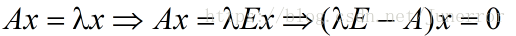
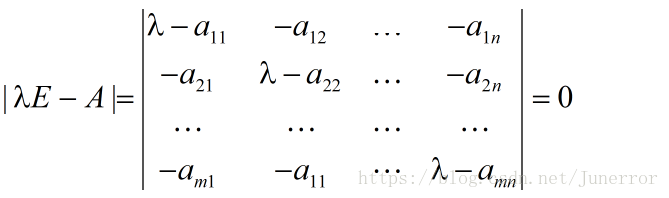
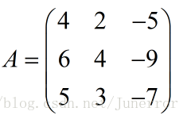
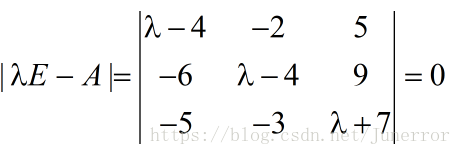

计算A的特征值与特征向量


```c++
//https://blog.csdn.net/weixin_46537710/article/details/106337476
Mat src;
image.convertTo(src, CV_32FC1);
cv::Mat eValuesMat;//特征值
cv::Mat eVectorsMat;//特征向量
eigen(src, eValuesMat, eVectorsMat);//通过openCV中eigen函数得到特征值与特征向量
```
求出特征值和特征向量有什么好处呢？ 就是我们可以将矩阵A特征分解。如果我们求出了矩阵A的n个特征值 ，以及这n个特征值所对应的特征向量。那么矩阵A就可以用下式的特征分解表示：


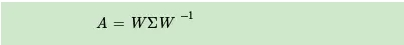

其中W是这n个特征向量所张成的n×n维矩阵，而Σ为这n个特征值为主对角线的n×n维矩阵。要进行特征分解，矩阵A必须为方阵。

### 矩阵分解
#### svd分解
SVD也是对矩阵进行分解，但是和特征分解不同，SVD并不要求要分解的矩阵为方阵。假设我们的矩阵A是一个m×n的矩阵，那么我们定义矩阵A的SVD为：

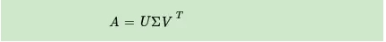

其中U是一个m * m的矩阵， 中间的是一个m * n的矩阵，除了主对角线上的元素以外全为0，主对角线上的每个元素都称为奇异值， V是一个 n*n的矩阵。 U和V都是酉矩阵，即满足它的共轭转置与自身相乘等于单位矩阵。酉矩阵是满秩的，每一列都是单位向量，其每两列都是正交的。这类矩阵性质非常好。

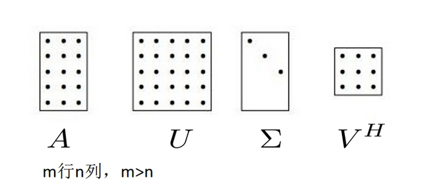

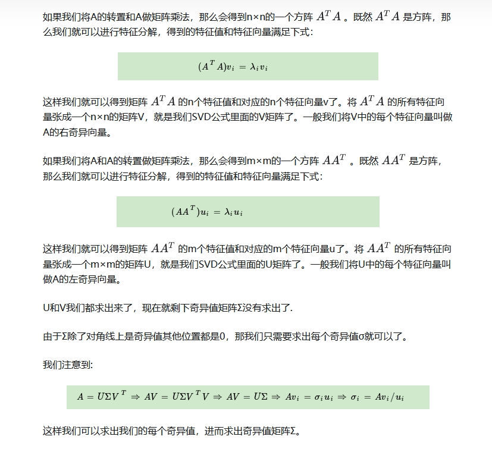

对于奇异值,它跟我们特征分解中的特征值类似，在奇异值矩阵中也是按照从大到小排列，而且奇异值的减少特别的快，在很多情况下，前10%甚至1%的奇异值的和就占了全部的奇异值之和的99%以上的比例。也就是说，我们也可以用最大的k个的奇异值和对应的左右奇异向量来近似描述矩阵。

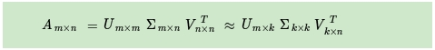

如下图所示，现在我们的矩阵A只需要灰色的部分的三个小矩阵就可以近似描述了。

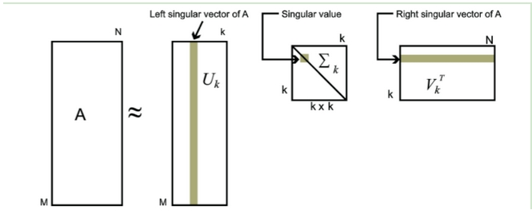

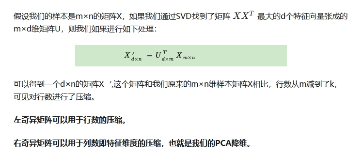


#### QR分解


## 二维变化

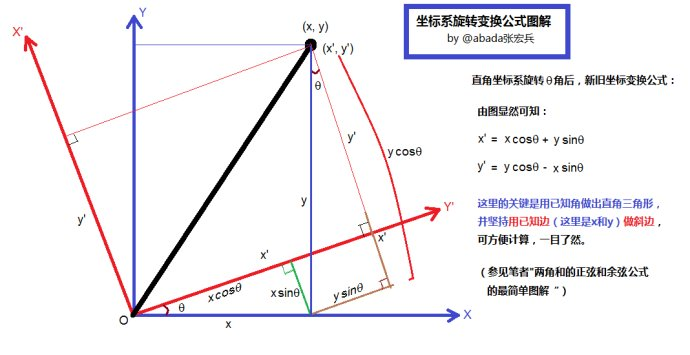

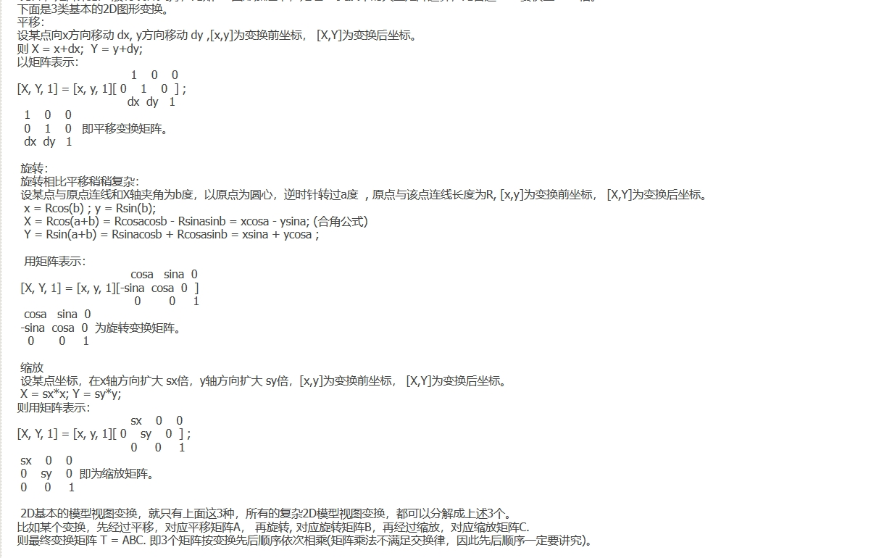


## 三维空间中的旋转变换

绕Z轴旋转

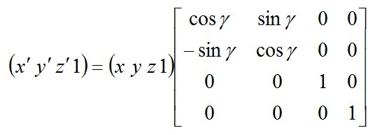

绕X轴旋转

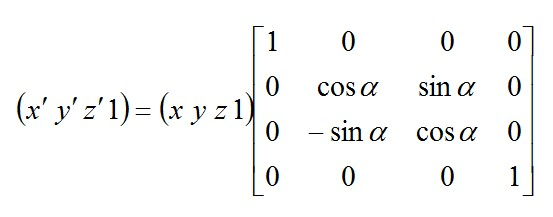

绕Y轴旋转

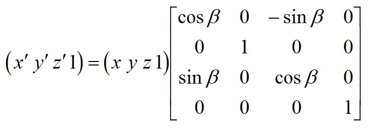

绕任意轴旋转的公式：给定具有单位长的

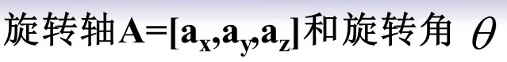

则物体绕OA轴旋转变换的矩阵表示可确定如下：

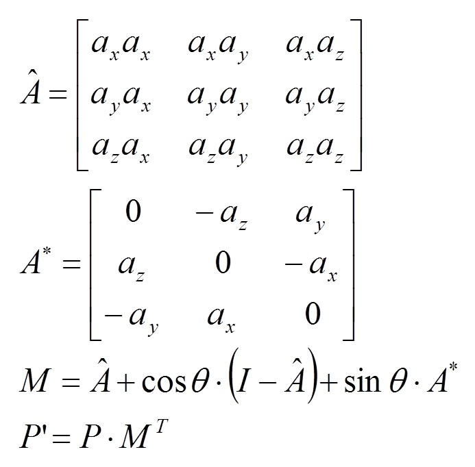


### 根据对应的三维点估计刚体变换的旋转平移矩阵
```c++
 //公式推导与python代码 https://blog.csdn.net/u012836279/article/details/80203170
 //c++ 代码  https://blog.csdn.net/kewei9/article/details/74157236

 void test_affine3d(std::vector<cv::Point3f> srcPoints, std::vector<cv::Point3f>dstPoints, int pointsNum, TRigidTrans3D& transform) {
	cv::Mat src_avg, dst_avg,src_rep,dst_rep, srcMat, dstMat;
	cv::Mat src_mat = cv::Mat(srcPoints, true).reshape(1, pointsNum);
	cv::Mat dst_mat = cv::Mat(dstPoints, true).reshape(1, pointsNum);
	cv::reduce(src_mat, src_avg, 0, cv::REDUCE_AVG);
	cv::reduce(dst_mat, dst_avg, 0, cv::REDUCE_AVG);
	cv::repeat(src_avg, pointsNum, 1, src_rep);
	cv::repeat(dst_avg, pointsNum, 1, dst_rep);
	srcMat  = (src_mat - src_rep).t();
	dstMat  = (dst_mat - dst_rep).t();

	cv::Mat matS = srcMat * dstMat.t();
	cv::Mat matU, matW, matV;
	cv::SVDecomp(matS, matW, matU, matV);

	cv::Mat matTemp = matU * matV;
	float det = cv::determinant(matTemp); //计算矩阵的行列式

	float datM[] = { 1, 0, 0, 0, 1, 0, 0, 0, det };
	cv::Mat matM(3, 3, CV_32FC1, datM);
	cv::Mat matR = matV.t() * matM * matU.t();

	transform.matR = matR.clone();
	float* datR = (float*)(matR.data);
	transform.X = dst_avg.at<float>(0, 0)- (src_avg.at<float>(0, 0) * datR[0] + src_avg.at<float>(0, 1) * datR[1] + src_avg.at<float>(0, 2) * datR[2]);
	transform.Y = dst_avg.at<float>(0, 1)- (src_avg.at<float>(0, 0) * datR[3] + src_avg.at<float>(0, 1) * datR[4] + src_avg.at<float>(0, 2) * datR[5]);
	transform.Z = dst_avg.at<float>(0, 2)- (src_avg.at<float>(0, 0) * datR[6] + src_avg.at<float>(0, 1) * datR[7] + src_avg.at<float>(0, 2) * datR[8]);
}
#include <random>
#define _USE_MATH_DEFINES
#include <math.h>

void test_data() {
	//旋转矩阵关系  https://blog.csdn.net/changbaolong/article/details/8307052
	//测试的旋转矩阵，平移矩阵
	cv::Mat matR = (cv::Mat_<float>(3, 3) << std::cos(30.0 / 180.0 * M_PI), std::sin(30.0 / 180.0 * M_PI), 0.f,-std::sin(30.0 / 180.0 * M_PI), std::cos(30.0 / 180.0 * M_PI), 0.f,0.f, 0.f, 1.f);
	cv::Mat matT = (cv::Mat_<float>(3, 1) << 246.f, 102.f, 58.f);

	std::vector<cv::Point3f> srcPoints, dstPoints;
	cv::RNG rng;
	for (int i = 0; i < 10;i++) srcPoints.emplace_back(rng.uniform((double)0, (double)1000), rng.uniform((double)0, (double)1000), rng.uniform((double)0, (double)1000));

	//根据原始数据，生成目标点，需要注意类型
	for (int i = 0; i < 10;i++) {
		cv::Mat src = (cv::Mat_<float>(3, 1) << srcPoints[i].x, srcPoints[i].y, srcPoints[i].z);
		cv::Mat dst = matR * src + matT;
		dstPoints.emplace_back(dst.at<float>(0, 0), dst.at<float>(1, 0), dst.at<float>(2, 0));
	}
	TRigidTrans3D transform;
	test_affine3d(srcPoints, dstPoints,10,transform);

	XLOG << transform.matR << std::endl;
	XLOG << transform.X << std::endl;
	XLOG << transform.Y << std::endl;
	XLOG << transform.Z << std::endl;

	//第二种方法
	std::vector<cv::Point3f> srcPoints_vec, dstPoints_vec;
	for (int j = 0; j < 10;j++) {
		srcPoints_vec.push_back(srcPoints[j]);
		dstPoints_vec.push_back(dstPoints[j]);
	}
	cv::Mat aff(3, 4, CV_64F);
	std::vector<uchar> inliers;
	cv::estimateAffine3D(srcPoints_vec, dstPoints_vec,aff,inliers);
	XLOG << aff << std::endl;
	return;
}

```

## eigen