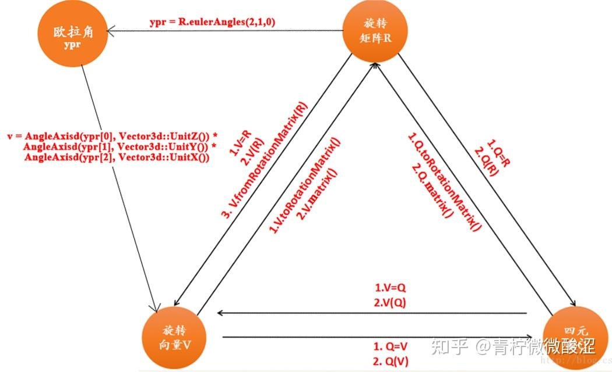

# 01-03-Eigen教程

> 父节点: [[01-00-数学之美]]
> 源文件: `math/linear.md`
> 相关: [[01-02-线性代数与矩阵分解]] | [[01-04-三维变换]] | [[04-00-OpenCV视觉算法]]


## 相关笔记

[[04-02-霍夫变换]]

---

### eigen基础
参考链接： https://zhuanlan.zhihu.com/p/111727894

Eigen 矩阵定义

```c++
#include <Eigen/Dense>

Matrix<double, 3, 3> A;               // Fixed rows and cols. Same as Matrix3d.
Matrix<double, 3, Dynamic> B;         // Fixed rows, dynamic cols.
Matrix<double, Dynamic, Dynamic> C;   // Full dynamic. Same as MatrixXd.
Matrix<double, 3, 3, RowMajor> E;     // Row major; default is column-major.
Matrix3f P, Q, R;                     // 3x3 float matrix.
Vector3f x, y, z;                     // 3x1 float matrix.
RowVector3f a, b, c;                  // 1x3 float matrix.
VectorXd v;
```

Eigen 基础使用
```c++
// Eigen          // Matlab           // comments
x.size()          // length(x)        // vector size
C.rows()          // size(C,1)        // number of rows
C.cols()          // size(C,2)        // number of columns
x(i)              // x(i+1)           // Matlab is 1-based
C(i,j)            // C(i+1,j+1)       //

A.resize(4, 4);   // Runtime error if assertions are on.
B.resize(4, 9);   // Runtime error if assertions are on.
A.resize(3, 3);   // Ok; size didn't change.
B.resize(3, 9);   // Ok; only dynamic cols changed.

A << 1, 2, 3,     // Initialize A. The elements can also be
     4, 5, 6,     // matrices, which are stacked along cols
     7, 8, 9;     // and then the rows are stacked.
B << A, A, A;     // B is three horizontally stacked A's.
A.fill(10);       // Fill A with all 10's.
```
Eigen 特殊矩阵生成
```c++
// Eigen                            // Matlab
MatrixXd::Identity(rows,cols)       // eye(rows,cols)
C.setIdentity(rows,cols)            // C = eye(rows,cols)
MatrixXd::Zero(rows,cols)           // zeros(rows,cols)
C.setZero(rows,cols)                // C = ones(rows,cols)
MatrixXd::Ones(rows,cols)           // ones(rows,cols)
C.setOnes(rows,cols)                // C = ones(rows,cols)
MatrixXd::Random(rows,cols)         // rand(rows,cols)*2-1        // MatrixXd::Random returns uniform random numbers in (-1, 1).
C.setRandom(rows,cols)              // C = rand(rows,cols)*2-1
VectorXd::LinSpaced(size,low,high)   // linspace(low,high,size)'
v.setLinSpaced(size,low,high)        // v = linspace(low,high,size)'

```
Eigen 矩阵分块
```c++
// Matrix slicing and blocks. All expressions listed here are read/write.
// Templated size versions are faster. Note that Matlab is 1-based (a size N
// vector is x(1)...x(N)).
// Eigen                           // Matlab
x.head(n)                          // x(1:n)
x.head<n>()                        // x(1:n)
x.tail(n)                          // x(end - n + 1: end)
x.tail<n>()                        // x(end - n + 1: end)
x.segment(i, n)                    // x(i+1 : i+n)
x.segment<n>(i)                    // x(i+1 : i+n)
P.block(i, j, rows, cols)          // P(i+1 : i+rows, j+1 : j+cols)
P.block<rows, cols>(i, j)          // P(i+1 : i+rows, j+1 : j+cols)
P.row(i)                           // P(i+1, :)
P.col(j)                           // P(:, j+1)
P.leftCols<cols>()                 // P(:, 1:cols)
P.leftCols(cols)                   // P(:, 1:cols)
P.middleCols<cols>(j)              // P(:, j+1:j+cols)
P.middleCols(j, cols)              // P(:, j+1:j+cols)
P.rightCols<cols>()                // P(:, end-cols+1:end)
P.rightCols(cols)                  // P(:, end-cols+1:end)
P.topRows<rows>()                  // P(1:rows, :)
P.topRows(rows)                    // P(1:rows, :)
P.middleRows<rows>(i)              // P(i+1:i+rows, :)
P.middleRows(i, rows)              // P(i+1:i+rows, :)
P.bottomRows<rows>()               // P(end-rows+1:end, :)
P.bottomRows(rows)                 // P(end-rows+1:end, :)
P.topLeftCorner(rows, cols)        // P(1:rows, 1:cols)
P.topRightCorner(rows, cols)       // P(1:rows, end-cols+1:end)
P.bottomLeftCorner(rows, cols)     // P(end-rows+1:end, 1:cols)
P.bottomRightCorner(rows, cols)    // P(end-rows+1:end, end-cols+1:end)
P.topLeftCorner<rows,cols>()       // P(1:rows, 1:cols)
P.topRightCorner<rows,cols>()      // P(1:rows, end-cols+1:end)
P.bottomLeftCorner<rows,cols>()    // P(end-rows+1:end, 1:cols)
P.bottomRightCorner<rows,cols>()   // P(end-rows+1:end, end-cols+1:end)
```

Eigen 矩阵元素交换
```c++
// Of particular note is Eigen's swap function which is highly optimized.
// Eigen                           // Matlab
R.row(i) = P.col(j);               // R(i, :) = P(:, i)
R.col(j1).swap(mat1.col(j2));      // R(:, [j1 j2]) = R(:, [j2, j1])
```
Eigen 矩阵转置
```c++
// Views, transpose, etc; all read-write except for .adjoint().
// Eigen                           // Matlab
R.adjoint()                        // R'
R.transpose()                      // R.' or conj(R')
R.diagonal()                       // diag(R)
x.asDiagonal()                     // diag(x)
R.transpose().colwise().reverse(); // rot90(R)
R.conjugate()                      // conj(R)
```

Eigen 矩阵乘积
```c++
// All the same as Matlab, but matlab doesn't have *= style operators.
// Matrix-vector.  Matrix-matrix.   Matrix-scalar.
y  = M*x;          R  = P*Q;        R  = P*s;
a  = b*M;          R  = P - Q;      R  = s*P;
a *= M;            R  = P + Q;      R  = P/s;
                   R *= Q;          R  = s*P;
                   R += Q;          R *= s;
                   R -= Q;          R /= s;

```
Eigen 矩阵单个元素操作

```c++
// Vectorized operations on each element independently
// Eigen                  // Matlab
R = P.cwiseProduct(Q);    // R = P .* Q
R = P.array() * s.array();// R = P .* s
R = P.cwiseQuotient(Q);   // R = P ./ Q
R = P.array() / Q.array();// R = P ./ Q
R = P.array() + s.array();// R = P + s
R = P.array() - s.array();// R = P - s
R.array() += s;           // R = R + s
R.array() -= s;           // R = R - s
R.array() < Q.array();    // R < Q
R.array() <= Q.array();   // R <= Q
R.cwiseInverse();         // 1 ./ P
R.array().inverse();      // 1 ./ P
R.array().sin()           // sin(P)
R.array().cos()           // cos(P)
R.array().pow(s)          // P .^ s
R.array().square()        // P .^ 2
R.array().cube()          // P .^ 3
R.cwiseSqrt()             // sqrt(P)
R.array().sqrt()          // sqrt(P)
R.array().exp()           // exp(P)
R.array().log()           // log(P)
R.cwiseMax(P)             // max(R, P)
R.array().max(P.array())  // max(R, P)
R.cwiseMin(P)             // min(R, P)
R.array().min(P.array())  // min(R, P)
R.cwiseAbs()              // abs(P)
R.array().abs()           // abs(P)
R.cwiseAbs2()             // abs(P.^2)
R.array().abs2()          // abs(P.^2)
(R.array() < s).select(P,Q);  // (R < s ? P : Q)
```
Eigen 矩阵化简

```c++
// Reductions.
int r, c;
// Eigen                  // Matlab
R.minCoeff()              // min(R(:))
R.maxCoeff()              // max(R(:))
s = R.minCoeff(&r, &c)    // [s, i] = min(R(:)); [r, c] = ind2sub(size(R), i);
s = R.maxCoeff(&r, &c)    // [s, i] = max(R(:)); [r, c] = ind2sub(size(R), i);
R.sum()                   // sum(R(:))
R.colwise().sum()         // sum(R)
R.rowwise().sum()         // sum(R, 2) or sum(R')'
R.prod()                  // prod(R(:))
R.colwise().prod()        // prod(R)
R.rowwise().prod()        // prod(R, 2) or prod(R')'
R.trace()                 // trace(R)
R.all()                   // all(R(:))
R.colwise().all()         // all(R)
R.rowwise().all()         // all(R, 2)
R.any()                   // any(R(:))
R.colwise().any()         // any(R)
R.rowwise().any()         // any(R, 2)
```
Eigen 矩阵点乘
```c++
// Dot products, norms, etc.
// Eigen                  // Matlab
x.norm()                  // norm(x).    Note that norm(R) doesn't work in Eigen.
x.squaredNorm()           // dot(x, x)   Note the equivalence is not true for complex
x.dot(y)                  // dot(x, y)
x.cross(y)                // cross(x, y) Requires #include <Eigen/Geometry>
```
Eigen 矩阵类型转换
```c++
//// Type conversion
// Eigen                           // Matlab
A.cast<double>();                  // double(A)
A.cast<float>();                   // single(A)
A.cast<int>();                     // int32(A)
A.real();                          // real(A)
A.imag();                          // imag(A)

// if the original type equals destination type, no work is done
// Note that for most operations Eigen requires all operands to have the same type:

MatrixXf F = MatrixXf::Zero(3,3);
A += F;                // illegal in Eigen. In Matlab A = A+F is allowed
A += F.cast<double>(); // F converted to double and then added (generally, conversion happens on-the-fly)

// Eigen can map existing memory into Eigen matrices.

float array[3];
Vector3f::Map(array).fill(10);            // create a temporary Map over array and sets entries to 10
int data[4] = {1, 2, 3, 4};
Matrix2i mat2x2(data);                    // copies data into mat2x2
Matrix2i::Map(data) = 2*mat2x2;           // overwrite elements of data with 2*mat2x2
MatrixXi::Map(data, 2, 2) += mat2x2;      // adds mat2x2 to elements of data (alternative syntax if size is not know at compile time)

```
Eigen 求解线性方程组 Ax = b
```c++
// Solve Ax = b. Result stored in x. Matlab: x = A \ b.
x = A.ldlt().solve(b));  // A sym. p.s.d.    #include <Eigen/Cholesky>
x = A.llt() .solve(b));  // A sym. p.d.      #include <Eigen/Cholesky>
x = A.lu()  .solve(b));  // Stable and fast. #include <Eigen/LU>
x = A.qr()  .solve(b));  // No pivoting.     #include <Eigen/QR>
x = A.svd() .solve(b));  // Stable, slowest. #include <Eigen/SVD>
// .ldlt() -> .matrixL() and .matrixD()
// .llt()  -> .matrixL()
// .lu()   -> .matrixL() and .matrixU()
// .qr()   -> .matrixQ() and .matrixR()
// .svd()  -> .matrixU(), .singularValues(), and .matrixV()
```
Eigen 矩阵特征值
```c++
// Eigenvalue problems
// Eigen                          // Matlab
A.eigenvalues();                  // eig(A);
EigenSolver<Matrix3d> eig(A);     // [vec val] = eig(A)
eig.eigenvalues();                // diag(val)
eig.eigenvectors();               // vec
// For self-adjoint matrices use SelfAdjointEigenSolver<>

```

Eigen 几何

    旋转矩阵（3X3）:Eigen::Matrix3d
    旋转向量（3X1）:Eigen::AngleAxisd
    四元数（4X1）:Eigen::Quaterniond
    平移向量（3X1）:Eigen::Vector3d
    变换矩阵（4X4）:Eigen::Isometry3d
<center></center>
中间变量t_V t_R t_Q

```c++
AngleAxisd t_V(M_PI / 4, Vector3d(0, 0, 1));
Matrix3d t_R = t_V.matrix();
Quaterniond t_Q(t_V);
```

对旋转向量（角轴）赋值

```c++
AngleAxisd V1(M_PI / 4, Vector3d(0, 0, 1));  //以（0,0,1）为旋转轴，旋转45度

----------------
AngleAxisd V2;
V2.fromRotationMatrix(t_R);

AngleAxisd V3;
V3 = t_R;

AngleAxisd V4(t_R);

---------------
AngleAxisd V5;
V5 = t_Q;

AngleAxisd V6(t_Q);
```

对四元数赋值
```c++
//注意Eigen库中的四元数前三维是虚部,最后一维是实部 q = (x, y, z, w)

    //1.使用旋转的角度和旋转轴向量（此向量为单位向量）来初始化四元数,即使用
        q=[cos(A/2),n_x*sin(A/2),n_y*sin(A/2),n_z*sin(A/2)]

        Quaterniond Q1(cos((M_PI / 4) / 2), 0 * sin((M_PI / 4) / 2), 0 * sin((M_PI / 4) / 2), 1 * sin((M_PI / 4) / 2));     //以（0,0,1）为旋转轴，旋转45度

    //第一种输出四元数的方式
    cout << "Quaternion1" << endl << Q1.coeffs() << endl;

    //第二种输出四元数的方式
    cout << Q1.x() << endl << endl;
    cout << Q1.y() << endl << endl;
    cout << Q1.z() << endl << endl;
    cout << Q1.w() << endl << endl;

//2. 使用旋转矩阵
    Quaterniond Q2;
    Q2 = t_R;

    Quaterniond Q3(t_R);


//3. 使用旋转向量
    Quaterniond Q4;
    Q4 = t_V;

    Quaterniond Q5(t_V);
```
旋转矩阵赋值

```c++
//1.使用旋转矩阵的函数来初始化旋转矩阵
    Matrix3d R1=Matrix3d::Identity();

//2. 使用旋转向量
    Matrix3d R2;
    R2 = t_V.matrix();

    Matrix3d R3;
    R3 = t_V.toRotationMatrix();


//3. 使用四元数
    Matrix3d R4;
    R4 = t_Q.matrix();

    Matrix3d R5;
    R5 = t_Q.toRotationMatrix();
```
欧拉角相关

```c++
Vector3d ypr(yaw_rad, pitch_rad, roll_rad);  //弧度制
Vector3d v;
v = AngleAxisd(ypr[0], Vector3d::UnitZ()) *
    AngleAxisd(ypr[1], Vector3d::UnitY()) *
    AngleAxisd(ypr[2], Vector3d::UnitX());
Vector3d ypr = R.eulerAngles(2,1,0); // ZYX顺序，yaw,pitch,roll

```

### eigen示例
```c++
#include <iostream>
using namespace std;
#include <ctime>
// Eigen 核心部分
#include <Eigen/Core>
// 稠密矩阵的代数运算（逆，特征值等）
#include <Eigen/Dense>
using namespace Eigen;
#define MATRIX_SIZE 50
/****************************
* 本程序演示了 Eigen 基本类型的使用
****************************/
int main(int argc, char **argv) {
  // Eigen 中所有向量和矩阵都是Eigen::Matrix，它是一个模板类。它的前三个参数为：数据类型，行，列
  // 声明一个2*3的float矩阵
  Matrix<float, 2, 3> matrix_23;

  // 同时，Eigen 通过 typedef 提供了许多内置类型，不过底层仍是Eigen::Matrix
  // 例如 Vector3d 实质上是 Eigen::Matrix<double, 3, 1>，即三维向量
  Vector3d v_3d;
  // 这是一样的
  Matrix<float, 3, 1> vd_3d;

  // Matrix3d 实质上是 Eigen::Matrix<double, 3, 3>
  Matrix3d matrix_33 = Matrix3d::Zero(); //初始化为零
  // 如果不确定矩阵大小，可以使用动态大小的矩阵
  Matrix<double, Dynamic, Dynamic> matrix_dynamic;
  // 更简单的
  MatrixXd matrix_x;
  // 这种类型还有很多，我们不一一列举

  // 下面是对Eigen阵的操作
  // 输入数据（初始化）
  matrix_23 << 1, 2, 3, 4, 5, 6;
  // 输出
  cout << "matrix 2x3 from 1 to 6: \n" << matrix_23 << endl;

  // 用()访问矩阵中的元素
  cout << "print matrix 2x3: " << endl;
  for (int i = 0; i < 2; i++) {
    for (int j = 0; j < 3; j++) cout << matrix_23(i, j) << "\t";
    cout << endl;
  }

  // 矩阵和向量相乘（实际上仍是矩阵和矩阵）
  v_3d << 3, 2, 1;
  vd_3d << 4, 5, 6;

  // 但是在Eigen里你不能混合两种不同类型的矩阵，像这样是错的
  // Matrix<double, 2, 1> result_wrong_type = matrix_23 * v_3d;
  // 应该显式转换
  Matrix<double, 2, 1> result = matrix_23.cast<double>() * v_3d;
  cout << "[1,2,3;4,5,6]*[3,2,1]=" << result.transpose() << endl;

  Matrix<float, 2, 1> result2 = matrix_23 * vd_3d;
  cout << "[1,2,3;4,5,6]*[4,5,6]: " << result2.transpose() << endl;

  // 同样你不能搞错矩阵的维度
  // 试着取消下面的注释，看看Eigen会报什么错
  // Eigen::Matrix<double, 2, 3> result_wrong_dimension = matrix_23.cast<double>() * v_3d;

  // 一些矩阵运算
  // 四则运算就不演示了，直接用+-*/即可。
  matrix_33 = Matrix3d::Random();      // 随机数矩阵
  cout << "random matrix: \n" << matrix_33 << endl;
  cout << "transpose: \n" << matrix_33.transpose() << endl;      // 转置
  cout << "sum: " << matrix_33.sum() << endl;            // 各元素和
  cout << "trace: " << matrix_33.trace() << endl;          // 迹
  cout << "times 10: \n" << 10 * matrix_33 << endl;               // 数乘
  cout << "inverse: \n" << matrix_33.inverse() << endl;        // 逆
  cout << "det: " << matrix_33.determinant() << endl;    // 行列式

  // 特征值
  // 实对称矩阵可以保证对角化成功
  SelfAdjointEigenSolver<Matrix3d> eigen_solver(matrix_33.transpose() * matrix_33);
  cout << "Eigen values = \n" << eigen_solver.eigenvalues() << endl;
  cout << "Eigen vectors = \n" << eigen_solver.eigenvectors() << endl;

  // 解方程
  // 我们求解 matrix_NN * x = v_Nd 这个方程
  // N的大小在前边的宏里定义，它由随机数生成
  // 直接求逆自然是最直接的，但是求逆运算量大

  Matrix<double, MATRIX_SIZE, MATRIX_SIZE> matrix_NN
      = MatrixXd::Random(MATRIX_SIZE, MATRIX_SIZE);
  matrix_NN = matrix_NN * matrix_NN.transpose();  // 保证半正定
  Matrix<double, MATRIX_SIZE, 1> v_Nd = MatrixXd::Random(MATRIX_SIZE, 1);

  clock_t time_stt = clock(); // 计时
  // 直接求逆
  Matrix<double, MATRIX_SIZE, 1> x = matrix_NN.inverse() * v_Nd;
  cout << "time of normal inverse is "
       << 1000 * (clock() - time_stt) / (double) CLOCKS_PER_SEC << "ms" << endl;
  cout << "x = " << x.transpose() << endl;

  // 通常用矩阵分解来求，例如QR分解，速度会快很多
  time_stt = clock();
  x = matrix_NN.colPivHouseholderQr().solve(v_Nd);
  cout << "time of Qr decomposition is "
       << 1000 * (clock() - time_stt) / (double) CLOCKS_PER_SEC << "ms" << endl;
  cout << "x = " << x.transpose() << endl;

  // 对于正定矩阵，还可以用cholesky分解来解方程
  time_stt = clock();
  x = matrix_NN.ldlt().solve(v_Nd);
  cout << "time of ldlt decomposition is "
       << 1000 * (clock() - time_stt) / (double) CLOCKS_PER_SEC << "ms" << endl;
  cout << "x = " << x.transpose() << endl;

  return 0;
}

```

### eigen 旋转变换
```c++
#include <iostream>
#include <cmath>
using namespace std;
#include <Eigen/Core>
#include <Eigen/Geometry>
using namespace Eigen;
// 本程序演示了 Eigen 几何模块的使用方法
int main(int argc, char **argv) {

  // Eigen/Geometry 模块提供了各种旋转和平移的表示
  // 3D 旋转矩阵直接使用 Matrix3d 或 Matrix3f
  Matrix3d rotation_matrix = Matrix3d::Identity();
  // 旋转向量使用 AngleAxis, 它底层不直接是Matrix，但运算可以当作矩阵（因为重载了运算符）
  AngleAxisd rotation_vector(M_PI / 4, Vector3d(0, 0, 1));     //沿 Z 轴旋转 45 度
  cout.precision(3);
  cout << "rotation matrix =\n" << rotation_vector.matrix() << endl;   //用matrix()转换成矩阵
  // 也可以直接赋值
  rotation_matrix = rotation_vector.toRotationMatrix();
  // 用 AngleAxis 可以进行坐标变换
  Vector3d v(1, 0, 0);
  Vector3d v_rotated = rotation_vector * v;
  cout << "(1,0,0) after rotation (by angle axis) = " << v_rotated.transpose() << endl;
  // 或者用旋转矩阵
  v_rotated = rotation_matrix * v;
  cout << "(1,0,0) after rotation (by matrix) = " << v_rotated.transpose() << endl;

  // 欧拉角: 可以将旋转矩阵直接转换成欧拉角
  Vector3d euler_angles = rotation_matrix.eulerAngles(2, 1, 0); // ZYX顺序，即yaw-pitch-roll顺序
  cout << "yaw pitch roll = " << euler_angles.transpose() << endl;

  // 欧氏变换矩阵使用 Eigen::Isometry
  Isometry3d T = Isometry3d::Identity();                // 虽然称为3d，实质上是4＊4的矩阵
  T.rotate(rotation_vector);                                     // 按照rotation_vector进行旋转
  T.pretranslate(Vector3d(1, 3, 4));                     // 把平移向量设成(1,3,4)
  cout << "Transform matrix = \n" << T.matrix() << endl;

  // 用变换矩阵进行坐标变换
  Vector3d v_transformed = T * v;                              // 相当于R*v+t
  cout << "v tranformed = " << v_transformed.transpose() << endl;

  // 对于仿射和射影变换，使用 Eigen::Affine3d 和 Eigen::Projective3d 即可，略

  // 四元数
  // 可以直接把AngleAxis赋值给四元数，反之亦然
  Quaterniond q = Quaterniond(rotation_vector);
  cout << "quaternion from rotation vector = " << q.coeffs().transpose()
       << endl;   // 请注意coeffs的顺序是(x,y,z,w),w为实部，前三者为虚部
  // 也可以把旋转矩阵赋给它
  q = Quaterniond(rotation_matrix);
  cout << "quaternion from rotation matrix = " << q.coeffs().transpose() << endl;
  // 使用四元数旋转一个向量，使用重载的乘法即可
  v_rotated = q * v; // 注意数学上是qvq^{-1}
  cout << "(1,0,0) after rotation = " << v_rotated.transpose() << endl;
  // 用常规向量乘法表示，则应该如下计算
  cout << "should be equal to " << (q * Quaterniond(0, 1, 0, 0) * q.inverse()).coeffs().transpose() << endl;

  return 0;
}

```

## opencv 的旋转变换