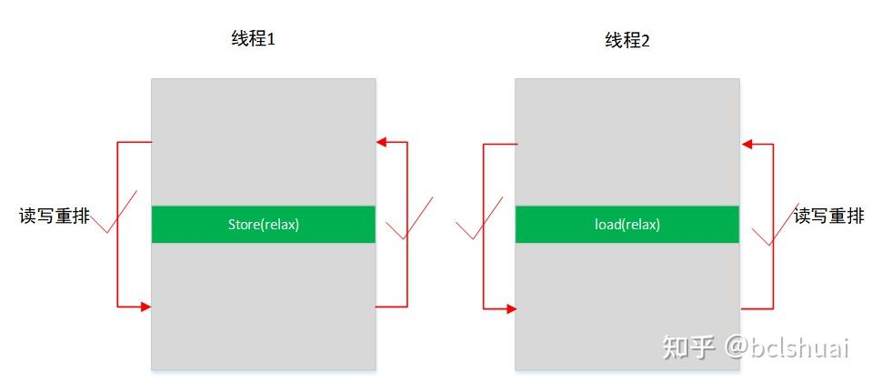
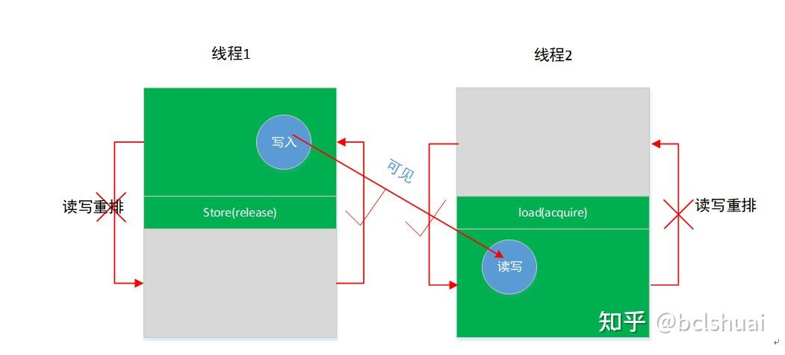
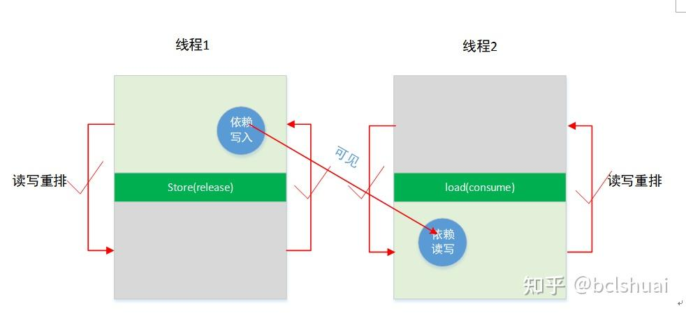
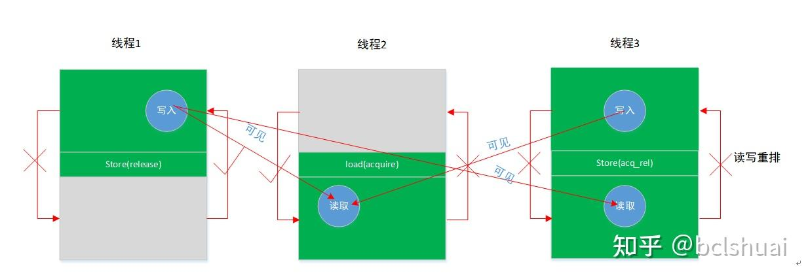
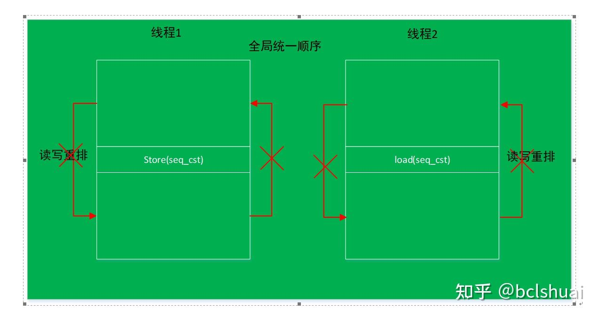
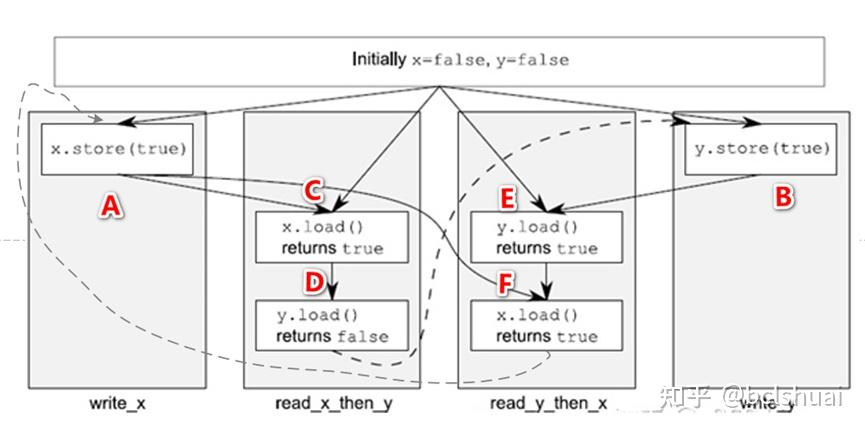

# 02-03-原子操作与内存序

> 父节点: [[02-00-C++现代编程]]
> 源文件: `cxx/cxx.md`
> 相关: [[02-04-无锁队列]] | [[05-00-Nvidia-CUDA与SIMD]]


## 相关笔记

[[02-05-OpenMP并行]] [[05-03-CUDA内存层次]]

---

atomic对象可以通过指定不同的memory orders来控制其对其他非原子对象的访问顺序和可见性，从而实现线程安全。常用的memory orders包括：

	memory_order_relaxed、
    memory_order_acquire、
    memory_order_release、
    memory_order_acq_rel
    memory_order_seq_cst等。

is_lock_free函数

is_lock_free函数是一个成员函数，用于检查当前atomic对象是否支持无锁操作。调用此成员函数不会启动任何数据竞争。

```c++
#include <iostream>
#include <atomic>
int main()
{
    std::atomic<int> a;
    std::cout << std::boolalpha                // 显示 true 或 false，而不是 1 或 0
              << "std::atomic<int> is "
              << (a.is_lock_free() ? "" : "not ")
              << "lock-free\n";

    return 0;
}
```
std::atomic_flag 是 C++ 中的一个原子布尔类型，它用于实现原子锁操作。

    std::atomic_flag 默认是清除状态（false）。可以使用 ATOMIC_FLAG_INIT 宏进行初始化，例如：std::atomic_flag flag = ATOMIC_FLAG_INIT;
    std::atomic_flag 提供了两个成员函数 test_and_set() 和 clear() 来测试和设置标志位。test_and_set() 函数会将标志位置为 true，并返回之前的值；clear() 函数将标志位置为 false。
    std::atomic_flag 的 test_and_set() 和 clear() 操作是原子的，可以保证在多线程环境下正确执行。
    std::atomic_flag 只能表示两种状态，即 true 或 false，不能做其他比较操作。通常情况下，std::atomic_flag 被用作简单的互斥锁，而不是用来存储信息。

使用 std::atomic_flag 进行原子锁操作：

```c++
#include <iostream>
#include <atomic>
#include <thread>

std::atomic_flag flag = ATOMIC_FLAG_INIT;

void func(int id) {
    while (flag.test_and_set(std::memory_order_acquire)) {
        // 等待其他线程释放锁
    }

    std::cout << "Thread " << id << " acquired the lock." << std::endl;

    // 模拟业务处理
    std::this_thread::sleep_for(std::chrono::seconds(1));

    flag.clear(std::memory_order_release);  // 释放锁
    std::cout << "Thread " << id << " released the lock." << std::endl;
}
int main() {
    std::thread t1(func, 1);
    std::thread t2(func, 2);

    t1.join();
    t2.join();

    return 0;
}

```
std::atomic_flag 是 C++ 中用于实现原子锁操作的类型，它提供了 test_and_set() 和 clear() 函数来测试和设置标志位，并且保证这些操作是原子的。

store函数

std::atomic<T>::store()是一个成员函数，用于将给定的值存储到原子对象中。
```c++
void store(T desired, std::memory_order order = std::memory_order_seq_cst) volatile noexcept;
void store(T desired, std::memory_order order = std::memory_order_seq_cst) noexcept;
//desired：要存储的值。
//order：存储操作的内存顺序。默认是std::memory_order_seq_cst（顺序一致性）。
```
存储操作的内存顺序参数：

| value                | 内存顺序               | 描述                                                                                                                                           |
| -------------------- | ---------------------- | ---------------------------------------------------------------------------------------------------------------------------------------------- |
| memory_order_relaxed | 无序的内存访问         | 不做任何同步，仅保证该原子类型变量的操作是原子化的，对于在访问原子变量周围的同步或者内存重排行为, 则一概不管                                                     |
| memory_order_acquire | 获取关系的顺序         | 在读取到此原子变量后面的所有读取/写入指令, 不可以被重排到读取此原子变量的前面.                                       |
| memory_order_release | 释放关系的顺序         |  在写入此变量之前的所有读取/写入指令, 不可以重排到写入此原子变量的后面，并且其他线程可以看到该变量的存储结果。                                         |
| memory_order_acquire_release | 与消费者关系有关的顺序 | 相当于一次完全内存屏障. 这种内存序需要一次read-modify-write操作, 既有acquire又有release. 用在两个线程交换什么东西的时候.                                      |
| memory_order_seq_cst | 顺序一致性的顺序       | 序列化一致性和acquire-release区别不大. 比如, 在单生产者单消费者的情况下, 二者没有区别. 区别在于多线程的情况下, 序列化一致性保证, 多个线程观察到修改时, 顺序是一致的. |
| memory_order_consume | 与消费者关系有关的顺序 | 假如一个线程通过这个内存序load的一个值, 那么与这个值相关的load和store, 不能重排到前面; 如果通过这个内存序Store一个值, 那么与这个值相关的load和store, 不能重排到后 面                              |

```c++
#include <iostream>
#include <atomic>
int main()
{
    std::atomic<int> atomic_int(0);

    int val = 10;
    atomic_int.store(val);

    std::cout << "Value stored in atomic object: " << atomic_int << std::endl;

    return 0;
}
```

输出`Value stored in atomic object: 10`
例子中，首先定义了一个std::atomic<int>类型的原子变量atomic_int，初始值为0。然后，使用store()函数将变量val的值存储到atomic_int中。最后，打印出存储在原子对象中的值。

需要注意的是，在多线程环境下使用原子变量和操作时，需要使用适当的内存顺序来保证数据的正确性和一致性。因此，store()函数中的order参数可以用来指定不同的内存顺序。如果不确定如何选择内存顺序，请使用默认值std::memory_order_seq_cst，它是最常用和最保险的。

load函数

load函数用于获取原子变量的当前值。它有以下两种形式：
```c++
T load(memory_order order = memory_order_seq_cst) const noexcept;
operator T() const noexcept;
```
使用load函数时，如果不指定memory_order，则默认为memory_order_seq_cst。

load函数的返回值类型为T，即原子变量的类型。在使用load函数时需要指定类型参数T。如果使用第二种形式的load函数，则无需指定类型参数T，程序会自动根据上下文推断出类型。

```c++
std::atomic<int> foo (0);

int x;
do {
    x = foo.load(std::memory_order_relaxed);  // get value atomically
} while (x==0);
```

exchange函数

访问和修改包含的值，将包含的值替换并返回它前面的值。
```c++
template< class T >
T exchange( volatile std::atomic<T>* obj, T desired );
//其中，obj参数指向需要替换值的atomic对象，desired参数为期望替换成的值。如果替换成功，则返回原来的值。
//整个操作是原子的（原子读-修改-写操作）：从读取（要返回）值的那一刻到此函数修改值的那一刻，该值不受其他线程的影响。
```
```c++
#include <iostream>       // std::cout
#include <atomic>         // std::atomic
#include <thread>         // std::thread
#include <vector>         // std::vector

std::atomic<bool> ready (false);
std::atomic<bool> winner (false);

void count1m (int id) {
  while (!ready) {}                  // wait for the ready signal
  for (int i=0; i<1000000; ++i) {}   // go!, count to 1 million
  if (!winner.exchange(true)) { std::cout << "thread #" << id << " won!\n"; }
};

int main ()
{
  std::vector<std::thread> threads;
  std::cout << "spawning 10 threads that count to 1 million...\n";
  for (int i=1; i<=10; ++i) threads.push_back(std::thread(count1m,i));
  ready = true;
  for (auto& th : threads) th.join();

  return 0;
}
```
compare_exchange_weak函数

这个函数的作用是比较一个值和一个期望值是否相等，如果相等则将该值替换成一个新值，并返回true；否则不做任何操作并返回false。
```c++
bool compare_exchange_weak (T& expected, T val,memory_order sync = memory_order_seq_cst) volatile noexcept;
bool compare_exchange_weak (T& expected, T val,memory_order sync = memory_order_seq_cst) noexcept;
bool compare_exchange_weak (T& expected, T val,memory_order success, memory_order failure) volatile noexcept;
bool compare_exchange_weak (T& expected, T val,memory_order success, memory_order failure) noexcept;
//expected：期望值的地址，也是输入参数，表示要比较的值；
//val：新值，也是输入参数，表示期望值等于该值时需要替换的值；
//success：表示函数执行成功时内存序的类型，默认为memory_order_seq_cst；
//failure：表示函数执行失败时内存序的类型，默认为memory_order_seq_cst。
```
该函数的返回值为bool类型，表示操作是否成功。

注意，compare_exchange_weak函数是一个弱化版本的原子操作函数，因为在某些平台上它可能会失败并重试。如果需要保证严格的原子性，则应该使用compare_exchange_strong函数。

```c++
#include <iostream>       // std::cout
#include <atomic>         // std::atomic
#include <thread>         // std::thread
#include <vector>         // std::vector

// a simple global linked list:
struct Node { int value; Node* next; };
std::atomic<Node*> list_head (nullptr);

void append (int val) {     // append an element to the list
  Node* oldHead = list_head;
  Node* newNode = new Node {val,oldHead};

  // what follows is equivalent to: list_head = newNode, but in a thread-safe way:
  while (!list_head.compare_exchange_weak(oldHead,newNode))
    newNode->next = oldHead;
}

int main ()
{
  // spawn 10 threads to fill the linked list:
  std::vector<std::thread> threads;
  for (int i=0; i<10; ++i) threads.push_back(std::thread(append,i));
  for (auto& th : threads) th.join();

  // print contents:
  for (Node* it = list_head; it!=nullptr; it=it->next)
    std::cout << ' ' << it->value;
  std::cout << '\n';

  // cleanup:
  Node* it; while (it=list_head) {list_head=it->next; delete it;}

  return 0;
}
```
compare_exchange_strong函数

这个函数的作用和compare_exchange_weak类似，都是比较一个值和一个期望值是否相等，并且在相等时将该值替换成一个新值。不同的是，compare_exchange_strong会保证原子性，并且如果比较失败则会返回当前值。
```c++
bool compare_exchange_strong(T& expected, T desired,
                             memory_order success = memory_order_seq_cst,
                             memory_order failure = memory_order_seq_cst) noexcept;

//expected：期望值的地址，也是输入参数，表示要比较的值；
//desired：新值，也是输入参数，表示期望值等于该值时需要替换的值；
//success：表示函数执行成功时内存序的类型，默认为memory_order_seq_cst；
//failure：表示函数执行失败时内存序的类型，默认为memory_order_seq_cst。
```
该函数的返回值为bool类型，表示操作是否成功。

注意，compare_exchange_strong函数保证原子性，因此它的效率可能比compare_exchange_weak低。在使用时应根据具体情况选择适合的函数。

专业化支持的操作

| 操作      | 描述                                                               |
| --------- | ------------------------------------------------------------------ |
| fetch_add | 添加到包含的值并返回它在操作之前具有的值                           |
| fetch_sub | 从包含的值中减去，并返回它在操作之前的值。                         |
| fetch_and | 读取包含的值，并将其替换为在读取值和 之间执行按位 AND 运算的结果。 |
| fetch_or  | 读取包含的值，并将其替换为在读取值和 之间执行按位 OR 运算的结果。  |
| fetch_xor | 读取包含的值，并将其替换为在读取值和 之间执行按位 XOR 运算的结果。 |

```c++
// atomic::load/store example
#include <iostream> // std::cout
#include <atomic> // std::atomic, std::memory_order_relaxed
#include <thread> // std::thread
//std::atomic<int> count = 0;//错误初始化
std::atomic<int> count(0); // 准确初始化
void set_count(int x)
{
	std::cout << "set_count:" << x << std::endl;
	count.store(x, std::memory_order_relaxed); // set value atomically
}
void print_count()
{
	int x;
	do {
		x = count.load(std::memory_order_relaxed); // get value atomically
	} while (x==0);
	std::cout << "count: " << x << '\n';
}
int main ()
{
	std::thread t1 (print_count);
	std::thread t2 (set_count, 10);
	t1.join();
	t2.join();
	std::cout << "main finish\n";
	return 0;
}

```
### CAS(Compare & Set/Compare & Swap)


参考链接：

https://blog.csdn.net/www_dong/article/details/118659528

https://zhuanlan.zhihu.com/p/571284028

编译器和CPU指令重排

代码顺序：就是你按照代码一行一行从上往下的顺序；

编译器对代码可能进行指令重排。也就是编译生成的二进制（机器码）的顺序与源代码可能不同，例如一个线程中有两行代码x++；y++；虽然y++在x++之后，但是编译器可能会把y++放到x++之前。而且CPU内部也有指令重排，也就是说，CPU执行指令的顺序，也不见得是完全严格按照机器码的顺序。当代CPU的IPC（每时钟执行指令数）一般都远大于1，也就是所谓的多发射，很多命令都是同时执行的。比如，当代CPU当中（一个核心）一般会有2套以上的整数ALU（加法器），2套以上的浮点ALU（加法器），往往还有独立的乘法器，以及，独立的Load和Store执行器。Load和Store模块往往还有8个以上的队列，也就是可以同时进行8个以上内存地址（cache line）的读写交换。

依赖关系

单线程中指令重排也不会乱排，不相关的指令可以重排，相关的指令不能重排；例如线程1中有两条指令x++；y++；这两条指令是完全不相关的，可以任意调整顺序。但是如果是x++；y=x;那这两条指令是依赖关系，那么一定是按照代码顺序去执行。

memoryorder作用

memory order，其实就是限制编译器以及CPU对单线程当中的指令执行顺序进行重排的程度（此外还包括对cache的控制方法）。这种限制，决定了以atomic操作为基准点（边界），对其之前后的内存访问命令，能够在多大的范围内自由重排（或者反过来，需要施加多大的保序限制），也被称为栅栏。从而形成了6种模式。它本身与多线程无关，是限制的单一线程当中指令执行顺序。


| 编号 | 顺序关系                                                | 说明                                                                                                                                                                                                                                                        |
| ---- | ------------------------------------------------------- | ----------------------------------------------------------------------------------------------------------------------------------------------------------------------------------------------------------------------------------------------------------- |
| 1    | Relaxed order限制相关变量的原子操作。                   | 只保证线程1中的g.Store和线程2中的g.load操作是原子操作。不保证线程之间的g操作指令同步顺序。也不限制其他变量的顺序。                                                                                                                                          |
| 2    | Release-acquire同步多线程顺序，强制其他变量的顺带关系。 | （1）线程1中，g.store(release)之前读写操作不允许重排到g.store(release)后面。（2）g.load(acquire)之后的读写操作不允许被重排到g.load(acquire)之前。（3）如果g.store()在gload()之前执行，那么g.store(release)之前的所有写操作对g.load(acquire)之后的命令可见。 |
| 3    | Release-consume只同步同步顺序，强制其他变量的顺带关系。 | （1）只保证原子操作，不会影响非依赖关系变量的重排顺序限制。（2）对有依赖关系的变量，如果g.store()在gload()之前执行，限制g.store(release)之前的所有写操作对g.load(acquire)之后的命令可见。                                                                   |
| 4    | memory_order_acq_rel                                    | （1）在当前线程对读取和写入施加 acquire-release 语义，语句后的不能重排到前面，语句前的不能重排到后面。（2）可以看见其他线程施加 release 语义之前的所有写入，同时自己的 release 结束后所有写入对其他施加 acquire 语义的线程可见。                            |
| 5    | memory_order_seq_cst                                    | 顺序一致性模型，（1）对变量施加acq_rel语义限制的限制，（2）同时还建立一个对所有原子变量操作的全局唯一修改顺序，所有线程看到的内存操作的顺序都是一样的。                                                                                                     |


 Relaxed ordering
<div align="center"></div>
Relaxed ordering，放松的排序，只保证操作是原子操作，但是不保证任何顺序，单线程中除了依赖关系的按照代码顺序，没有依赖关系的则排序任意。举个例子。如下建立两个原子变量，线程1中执行赋值操作A，B，线程2中执行读取操作C，D。因为Relaxed ordering只保证操作A,B,C,D是原子操作，A,B之间没有依赖关系，C,D之间也没有依赖关系，所以线程1中执行顺序可以是A,B，也可以是B,A，线程2中执行顺序可以是C,D，也可以是D，C，线程1和线程2之间也没有任何同步关系，所以线程1和线程2同时执行时，A,B,C,D可以是任意顺序，如果D在A之前执行，例如执行顺序是B,D,C,A，则D指令断言会出现失败，因为A操作还没有写入f为true。例子中C操作的 while循环，只是保证B操作执行完。实际应用中可以不用循环。

```c++
atomic<bool> f=false;
atomic<bool> g=false;
// thread1
f.store(true, memory_order_relaxed);//A
g.store(true, memory_order_relaxed);//B
// thread2
while(!g.load(memory_order_relaxed));//C
assert(f.load(memory_order_relaxed));//D
```
如果存在依赖关系，把B改成g.store(f, memory_order_relaxed);，g依赖于f，则线程1中执行顺序只能是A,B，线程2中还是任意顺序CD，或者DC。线程1和线程2中执行顺序还是任意顺序，只是A必须在B前面。可以是ABCD、ACBD，DABC等；D还是有可能在A之前执行，所以D还是会出现断言失败。怎么保证A一定在D之前执行，让断言不失败呢，也是要控制两个线程中的两条指令的顺序，可以使用Release – acquire顺序关系来实现。


 Release – acquire
<div align="center"></div>
多线程并发是为了提高效率，多线程同步是为了解决同时访问同一个变量的问题，线程1中g.store（release）写变量和线程2中g.load(acquire)读变量组合使用，并不是保证g.store（release）一定在g.load(acquire)之前执行，如果线程1一直sleep几秒，线程2会执行g.load(acquire)命令。这里的同步是指线程1中g.store（release）之前读写不能被重排到g.store（release）之后，线程2 g.load(acquire)之后的读写不能被重排到g.load(acquire)之前，如果g.store（release）先于g.load(acquire)之前执行（前提），那么线程1中g.store（release）之前的读写对线程2中g.load(acquire)之后的读写可见。如果g.load(acquire)先于g.store（release）之前执行，那么无法保证线程1中g.store（release）之前的读写对线程2中g.load(acquire)之后的读写可见。总结三点如下：

	（1） load(acquire)所在的线程中load(acquire)之后的所有写操作（包含非依赖关系），不允许被移动到这个load()的前面，一定在load之后执行。
	（2） store（release）之前的所有读写操作（包含非依赖关系），不允许被重排到这个store(release)的后面，一定在store之前执行。
	（3） 如果store(release)在load（acquire）之前执行了（前提），那么store(release)之前的写操作对 load(acquire)之后的读写操作可见。

```c++
bool f=false;
atomic<bool> g=false;
// thread1
f=true//A
g.store(true, memory_order_release);//B
// thread2
while(!g.load(memory_order_ acquire));//C
assert(f));//D
```

根据规则（1），线程1中A不允许被重排到B之后，根据规则（2）D不允许被重排到C之前，根据规则（3），因为C中有while循环，一直等待，等到B执行完了，C中循环才退出，保证B在C之前执行完，A又一定在B之前执行完，那么D读到就永远是true，永远不会失败。如果C没 循环，即使加了release和acquire，也不能保证B在C之前执行，D也可能会出现失败。

release -- acquire 有个牛逼的副作用：线程 1 中所有发生在 B 之前的A操作，都会在B之前执行，D也一定在C之后执行，A，D好像很无辜，无缘无故的就被强制顺序了。如果不想让A,D被顺带强制顺序，可以使用Release – consume。

Release – consume
<div align="center"></div>
Release – consume实例,Release – consume也是实现多线程之间指令的同步问题，与Release – acquire不同的是，Release – consume不会限制线程中其他变量的顺序重排，不会顺带强制其前后其他指令（无依赖关系）的顺序。避免了其他指令强制顺序带来的额外开销。例如：
```c++
bool f=false;
atomic<bool> g=false;
// thread1
f=true//A
g.store(true, memory_order_release);//B
// thread2
while(!g.load(memory_order_consume);//C
assert(f));//D
```
同样的例子例子中使用了release和consume关系，不会限制A、B和C、D指令的顺序，可以任意重排，线程1中可以是AB，BA，线程2中可以是CD，DC。线程1和线程2可以是任意的排列组合。所以D有可能断言失败。这种情况和relax是一样的。

Release – consume依赖关系变量限制重排,有依赖关系的变量的指令顺序还是会按照代码顺序去执行，如果AB之间有依赖关系例如下面的例子：
```c++
bool f=false;
atomic<bool> g=false;
// thread1
f=true//A
g.store(f, memory_order_release);//B g依赖于f
// thread2
while(!g.load(memory_order_consume);//C
assert(f));//D
```
因为B中的变量g依赖于f，所以线程1中指令顺序只能是AB，线程2中D一定成功，因为在线程1中g依赖于f，所以A一定在B之前执行，线程2中D也被限制不能重排到C之前，C中的while循环会一直等到g变为true，说明f已经为true，那么D永远成功。

relax和consume的区别

那么relax和consume不是一样吗？都是线程中有依赖关系就按照代码顺序。否则可以任意排序，relax和consume的区别是什么？如下面的例子所示，将release和consume都换成relax。

```c++
bool f=false;
atomic<bool> g=false;
// thread1
f=true//A
g.store(f, memory_order_relax);//B g依赖于f
// thread2
while(!g.load(memory_order_ relax);//C
assert(f));//D
```
线程1中g依赖于f，所以按照代码顺序，A在B之前执行。因为在线程2中CD之间没有依赖关系，所以线程2中CD可以任意重排。而如果是consume，那么线程2中就只能是CD顺序，不能被重排。因为线程1中依赖关系也影响了线程2中的指令重排限制，线程中B之前的依赖变量写入对线程2中C之后的依赖变量的读取可见。这就是relax和consume的区别。

memory_order_acq_rel
<div align="center"></div>
 对读取和写入施加 acquire-release 语义，也就是g.store(acquire-release)或者g.load（acquire-release）前面无法被重排到后面，后面无法被重排到前面。

可以看见其他线程施加 release 之前的所有写入，同时自己之前所有写入对其他施加 acquire 语义的线程可见。例如下面的例子：

```c++
bool f=false;
atomic<bool> g=false;
bool h=false;
// thread1
f=true//A
g.store(true, memory_order_release);//B
// thread2
while(!g.load(memory_order_ acquire);//C
assert(f));//D
assert(h);//E
//thread3
h=true;//F
while(!g.load(memory_order_acq_rel);//G
assert(f));//H
```
根据规则，线程1中A操作不允许被重排到B之后，线程2中DE操作不允许被重排到C之前。线程3中F操作不允许被重排到G之后，H操作不允许被重排到G之前。

线程1中A操作写入对线程2中D读取以及线程3中H操作的读取都是可见，即DH在g为true的前提下，读到的一定是true；同时线程3中F操作的写入对线程2中E操作的读取可见，即E操作在g为true的前提下，读到的一定是true。

Sequentially-consistent ordering
<div align="center"></div>
默认情况下，std::atomic使用的是 Sequentially-consistent ordering，除了包含release/acquire的限制，同时还建立一个对所有原子变量操作的全局唯一修改顺序。即采用统一的全局顺序，所有的线程看到的顺序是一致的。会在多个线程间切换，达到多个线程仿佛在一个线程内顺序执行的效果。即单线程中按照代码顺序，多线程之间按照一个全局统一顺序，具体什么顺序按照时间片的分配。
```c++
// 顺序一致

std::atomic<bool> x,y;
std::atomic<int> z;
void write_x()
{
x.store(true,std::memory_order_seq_cst);//A
}
void write_y()
{
y.store(true,std::memory_order_seq_cst);//B
}
void read_x_then_y()
{
while(!x.load(std::memory_order_seq_cst));//C
if(y.load(std::memory_order_seq_cst))//D
	++z;
}

void read_y_then_x()
{
while(!y.load(std::memory_order_seq_cst));//E
if(x.load(std::memory_order_seq_cst))F
	++z;
}
int main()
{
	x=false;
	y=false;
	z=0;

	std::thread a(write_x);
	std::thread b(write_y);
	std::thread c(read_x_then_y);
	std::thread d(read_y_then_x);

	a.join();
	b.join();
	c.join();
	d.join();
	assert(z.load()!=0);
}
```
上面一共四个线程，假如四个线程同时启动，那ABCDEF6条指令按照什么顺序执行呢？四个线程并发执行，都可能先执行，总的全局顺序会选择下图中的一条环线顺序开始执行，而且对所有的线程来说都是按照这个全局顺序执行。

例如按照ACDBEF的顺序执行，假如线程write_x先分配到时间片，A先执行，x变为true，线程read_x_then_y中C操作while循环退出，D操作执行，B执行，y变为true，E中while循环退出，执行F。

再比如ABCDEF,ACBEDF等，只是C一定在D之前，E一定在F之前。
<div align="center"></div>
六种模型参数本质上是限制单线程内部的指令重排顺序，并不是同步不同线程之间的指令顺序，而是通过限制单线程中指令的重排，以控制带有模型参数的变量前后的指令被重排顺序限制。这种限制，决定了以atomic操作为基准点（边界），对其之前的内存访问命令，以及之后的内存访问命令，能够在多大的范围内自由重排。上面的例子中，使用while循环，来一直等待，是为了保证store为true后，load为true，从而退出while循环，因为store之前的写指令在store之前完成，所以store之前的写指令对while（load（acquire））之后的写指令可见，while循环一直等待，强制了多线程间两个指令的顺序，这样写只是为了说明原理，实际应用中不会这样去编程。


其他资料

	memory_order_relaxed: 最宽松的内存序，不提供任何同步保证。它只保证原子操作本身是原子的，但不保证操作之间的顺序。
	memory_order_consume: 消费者内存序，用于同步依赖关系。它保证了依赖于原子操作结果的后续操作将按照正确的顺序执行。
	memory_order_acquire: 获取内存序，用于同步对共享数据的访问。它保证了在获取操作之后对共享数据的所有读取操作都将看到最新的数据。
	memory_order_release: 释放内存序，用于同步对共享数据的访问。它保证了在释放操作之前对共享数据的所有写入操作都已完成，并且对其他线程可见。
	memory_order_acq_rel: 获取-释放内存序，结合了获取和释放两种内存序的特点。它既保证了获取操作之后对共享数据的所有读取操作都将看到最新的数据，又保证了在释放操作之前对共享数据的所有写入操作都已完成，并且对其他线程可见。
	memory_order_seq_cst: 顺序一致性内存序，提供了最严格的同步保证。它保证了所有线程都将看到相同的操作顺序，并且所有原子操作都将按照程序顺序执行。


下面是一个简单的例子，展示了如何使用 memory_order_acquire 和 memory_order_release 来实现一个简单的生产者-消费者模型：
```c++
#include <atomic>
#include <iostream>
#include <thread>

std::atomic<int> data;
std::atomic<bool> ready(false);

void producer() {
    data.store(42, std::memory_order_relaxed);
    ready.store(true, std::memory_order_release);
}

void consumer() {
    while (!ready.load(std::memory_order_acquire))
        ;
    std::cout << data.load(std::memory_order_relaxed) << std::endl;
}

int main() {
    std::thread t1(producer);
    std::thread t2(consumer);
    t1.join();
    t2.join();
    return 0;
}
```
在这个例子中，生产者线程使用 memory_order_release 来确保数据被正确地初始化，并且在 ready 变量被设置为 true 之前对其他线程可见。消费者线程则使用 memory_order_acquire 来确保在读取 data 变量之前，ready 变量已经被设置为 true。

下面是另一个例子，展示了如何使用 memory_order_seq_cst 来实现一个简单的计数器：
```c++
#include <atomic>
#include <iostream>
#include <thread>
#include <vector>

std::atomic<int> counter(0);

void worker(int n) {
    for (int i = 0; i < n; ++i) {
        counter.fetch_add(1, std::memory_order_seq_cst);
    }
}

int main() {
    const int n = 100000;
    const int num_threads = 4;
    std::vector<std::thread> threads;
    for (int i = 0; i < num_threads; ++i) {
        threads.emplace_back(worker, n);
    }
    for (auto& t : threads) {
        t.join();
    }
    std::cout << counter << std::endl;
    return 0;
}
```
在这个例子中，我们创建了4个线程，每个线程都对一个原子计数器进行了 n 次增加操作。由于我们使用了 memory_order_seq_cst 来保证原子操作的顺序一致性，所以最终计数器的值将恰好等于 n * num_threads。

## c++ 17 20