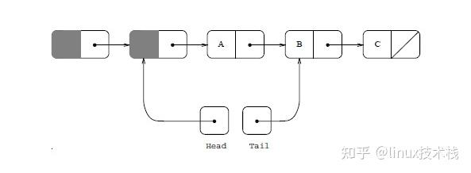
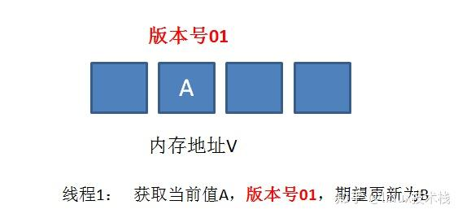
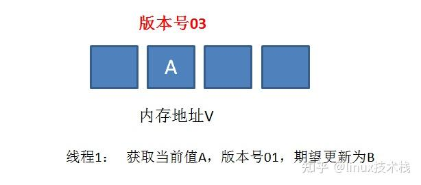
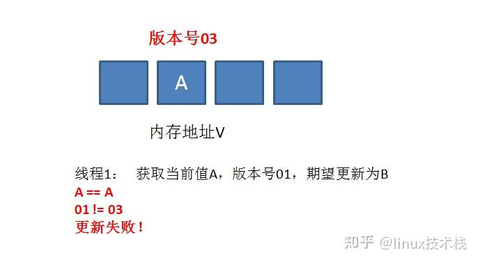

# 02-04-无锁队列

> 父节点: [[02-00-C++现代编程]]
> 源文件: `cxx/cxx.md`
> 相关: [[02-03-原子操作与内存序]] | [[12-00-算法集锦]]


## 相关笔记

[[02-06-设计模式]]

---

CAS是解决多线程并行情况下使用锁造成性能损耗的一种机制。

    CAS操作包含三个操作数——内存位置（V）、预期原值（A）、新值(B)。
    如果内存位置的值与预期原值相匹配，那么处理器会自动将该位置值更新为新值。
    否则，处理器不做任何操作。
    无论哪种情况，它都会在CAS指令之前返回该位置的值。
    CAS有效地说明了“我认为位置V应该包含值A；如果包含该值，则将B放到这个位置；否则，不要更改该位置，只告诉我这个位置现在的值即可。

一个 CAS 涉及到以下操作：假设内存中的原数据V，旧的预期值A，需要修改的新值B

    比较 A 与 V 是否相等
    如果比较相等，将 B 写入 V
    返回操作是否成功

CAS算法原理描述

    在对变量进行计算之前(如 ++ 操作)，首先读取原变量值，称为 旧的预期值 A
    然后在更新之前再获取当前内存中的值，称为 当前内存值 V
    如果 A==V 则说明变量从未被其他线程修改过，此时将会写入新值 B
    如果 A!=V 则说明变量已经被其他线程修改过，当前线程应当什么也不做。

用C语言来描述该操作
看一看内存*reg里的值是不是oldval，如果是的话，则对其赋值newval。
```c++
int compare_and_swap (int* reg, int oldval, int newval)
{
      int old_reg_val = *reg;
      if (old_reg_val == oldval)
               *reg = newval;
      return old_reg_val;
}
```
变种为返回bool值形式的操作
返回 bool值的好处在于，调用者可以知道有没有更新成功

```c++
bool compare_and_swap (int *accum, int *dest, int newval)
{
      if ( *accum == *dest )
      {
           *dest = newval;
           return true;
      }
      return false;
}
```
GCC的CAS，GCC4.1+版本中支持CAS的原子操作。
```c++
1）bool __sync_bool_compare_and_swap (type *ptr, type oldval, type newval, ...)
2）type __sync_val_compare_and_swap (type *ptr, type oldval, type newval, ...)
```
C++11中的CAS，C++11中的STL中的atomic类的函数可以让你跨平台。
```c++
template< class T > bool atomic_compare_exchange_weak( std::atomic* obj,T* expected, T desired );
template< class T > bool atomic_compare_exchange_weak( volatile std::atomic* obj,T* expected, T desired );
```
基于链表的非阻塞堆栈实现
```c++
//数据结构
template
class Stack {
    typedef struct Node {
                          T data;
                          Node* next;
                          Node(const T& d) : data(d), next(0) { }
                        } Node;
    Node *top;
    public:
       Stack( ) : top(0) { }
       void push(const T& data);
       T pop( ) throw (…);
};
//在非阻塞堆栈中压入数据(push)
void Stack::push(const T& data)
{
    Node *n = new Node(data);
    while (1) {
        n->next = top;
        if (__sync_bool_compare_and_swap(&top, n->next, n)) { // CAS
            break;
        }
    }
}
```
上述过程描述：

    从单一线程的角度来看，创建了一个新节点，它的 next 指针指向堆栈的顶部。
    接下来，调用 CAS 内置函数，把新的节点复制到 top 位置。
    从多个线程的角度来看，完全可能有两个或更多线程同时试图把数据压入堆栈。
    假设线程 A 试图把 20 压入堆栈，线程 B 试图压入 30，而线程 A 先获得了时间片。
    但是，在 n->next = top 指令结束之后，调度程序暂停了线程 A。
    现在，线程 B 获得了时间片（它很幸运），它能够完成 CAS，把 30 压入堆栈后结束。
    接下来，线程 A 恢复执行，显然对于这个线程 *top 和 n->next 不匹配，因为线程 B 修改了 top 位置的内容。
    因此，代码回到循环的开头，指向正确的 top 指针（线程 B 修改后的），调用 CAS，把 20 压入堆栈后结束。
    整个过程没有使用任何锁。

```c++
//从非阻塞堆栈弹出数据(pop)
T Stack::pop( )
{
    while (1) {
        Node* result = top;
        if (result == NULL)
           throw std::string(“Cannot pop from empty stack”);
        if (top && __sync_bool_compare_and_swap(&top, result, result->next)) { // CAS
            return result->data;
        }
    }
}

```
这样，即使线程 B 在线程 A 试图弹出数据的同时修改了堆栈顶，也可以确保不会跳过堆栈中的元素

无锁队列的链表实现

用CAS实现的入队操作
```c++
EnQueue(x)//进队列
{
    //准备新加入的结点数据
    q = newrecord();
    q->value = x;
    q->next = NULL;

    do{
        p = tail; //取链表尾指针的快照
    }while( CAS(p->next, NULL, q) != TRUE); //如果没有把结点链上，再试

    CAS(tail, p, q); //置尾结点
}
```
我们可以看到，程序中的那个 do- while 的 Re-Try-Loo。就是说，很有可能我在准备在队列尾加入结点时，别的线程已经加成功了，于是tail指针就变了，于是我的CAS返回了false，于是程序再试，直到试成功为止。

为什么我们的“置尾结点”的操作不判断是否成功:

    如果有一个线程T1，它的while中的CAS如果成功的话，那么其它所有随后线程的CAS都会失败，然后就会再循环，
    此时，如果T1 线程还没有更新tail指针，其它的线程继续失败，因为tail->next不是NULL了。
    直到T1线程更新完tail指针，于是其它的线程中的某个线程就可以得到新的tail指针，继续往下走了。

这里有一个潜在的问题——如果T1线程在用CAS更新tail指针的之前，线程停掉了，那么其它线程就进入死循环了。下面是改良版的EnQueue()

```c++
EnQueue(x)//进队列改良版
{
    q = newrecord();
    q->value = x;
    q->next = NULL;

    p = tail;
    oldp = p
    do{
        while(p->next != NULL)
            p = p->next;
    }while( CAS(p.next, NULL, q) != TRUE); //如果没有把结点链上，再试

    CAS(tail, oldp, q); //置尾结点
}
```

我们让每个线程，自己fetch 指针 p 到链表尾。但是这样的fetch会很影响性能。而通实际情况看下来，99.9%的情况不会有线程停转的情况，所以，更好的做法是，你可以接合上述的这两个版本，如果retry的次数超了一个值的话（比如说3次），那么，就自己fetch指针。

用CAS实现的出队操作

```c++
DeQueue()//出队列
{
    do{
        p = head;
        if(p->next == NULL){
            returnERR_EMPTY_QUEUE;
        }
    while( CAS(head, p, p->next) != TRUE );
    returnp->next->value;
}

```
<center></center>
DeQueue的代码操作的是 head->next，而不是head本身。这样考虑是因为一个边界条件，我们需要一个dummy的头指针来解决链表中如果只有一个元素，head和tail都指向同一个结点的问题，这样EnQueue和DeQueue要互相排斥了。

总结:上述我们设计了支持并发访问的数据结构。可以看到，设计可以基于互斥锁，也可以是无锁的。无论采用哪种方式，要考虑的问题不仅仅是这些数据结构的基本功能 — 具体来说，必须一直记住线程会争夺执行权，要考虑线程重新执行时如何恢复操作。目前，解决方案（尤其是无锁解决方案）与平台/编译器紧密相关。


CAS的ABA问题

ABA问题描述：

    进程P1在共享变量中读到值为A
    P1被抢占了，进程P2执行
    P2把共享变量里的值从A改成了B，再改回到A，此时被P1抢占。
    P1回来看到共享变量里的值没有被改变，于是继续执行。


举例1：

    比如上述的DeQueue()函数，因为我们要让head和tail分开，所以我们引入了一个dummy指针给head，当我们做CAS的之前，如果head的那块内存被回收并被重用了，而重用的内存又被EnQueue()进来了，这会有很大的问题。（内存管理中重用内存基本上是一种很常见的行为）

举例2：

    我们假设一个提款机的例子。假设有一个遵循CAS原理的提款机，小灰有100元存款，要用这个提款机来提款50元。
    由于提款机硬件出了点问题，小灰的提款操作被同时提交了两次，开启了两个线程，两个线程都是获取当前值100元，要更新成50元。
    理想情况下，应该一个线程更新成功，一个线程更新失败，小灰的存款值被扣一次。
    线程1首先执行成功，把余额从100改成50.线程2因为某种原因阻塞。这时，小灰的妈妈刚好给小灰汇款50元。
    线程2仍然是阻塞状态，线程3执行成功，把余额从50改成了100。
    线程2恢复运行，由于阻塞之前获得了“当前值”100，并且经过compare检测，此时存款实际值也是100，所以会成功把变量值100更新成50。
    原本线程2应当提交失败，小灰的正确余额应该保持100元，结果由于ABA问题提交成功了。


解决ABA问题

真正要做到严谨的CAS机制，我们在compare阶段不仅要比较期望值A和地址V中的实际值，还要比较变量的版本号是否一致。

举个栗子：

    假设地址V中存储着变量值A，当前版本号是01。线程1获取了当前值A和版本号01，想要更新为B，但是被阻塞了。
<center></center>
    这时候，内存地址V中变量发生了多次改变，版本号提升为03，但是变量值仍然是A。
<center></center>
    随后线程1恢复运行，进行compare操作。经过比较，线程1所获得的值和地址的实际值都是A，但是版本号不相等，所以这一次更新失败
<center></center>
CAS的问题

ABA问题

    因为CAS需要在操作值的时候，检查值有没有发生变化，没有发生变化才去更新。
    但是如果一个值原来是A变成了B，又变成了A，CAS检查会判断该值未发生变化，实际却变化了。
    解决思路：增加版本号，每次变量更新时把版本号+1，A-B-A就变成了1A-2B-3A。JDK5之后的atomic包提供了AtomicStampedReference来解决ABA问题，它的compareAndSet方法会首先检查当前引用是否等于预期引用，并且当前标志是否等于预期标志。全部相等，才会以原子方式将该引用、该标志的值设置为更新值。

时间长、开销大

    自旋CAS如果长时间不成功，会给CPU带来非常大的执行开销。


只能保证一个共享变量的原子操作

    对一个共享变量执行操作时，可以循环CAS方式确保原子操作。
    但是对多个共享变量，就不灵了。
    这里可以使用锁，或把多个共享变量合并为1个共享变量，如i=2,j=a,合并为ij=2a。然后用CAS操作ij。在JDK5后，提供了AtomicReference类来保证对象间的原子性，可以把多个共享变量放在一个对象里进行CAS操作。

### 原子内存序