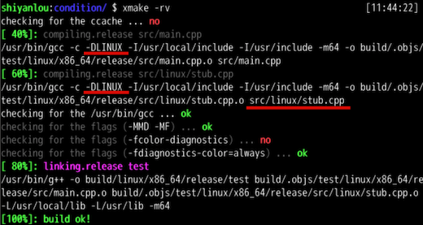
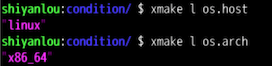
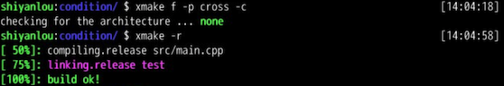
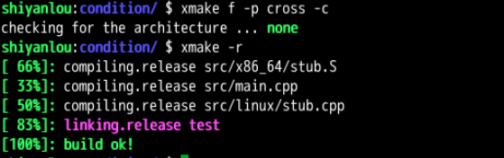
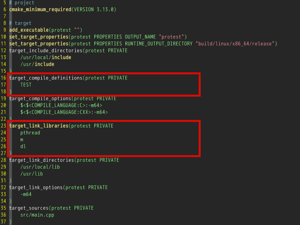
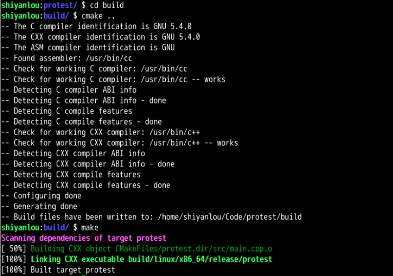

# 03-03-交叉编译

> 父节点: [[03-00-编译工具链]]
> 源文件: `compile/compile.md`
> 相关: [[03-01-xmake教程]] | [[03-02-CMake教程]] | [[05-00-Nvidia-CUDA与SIMD]]


## 相关笔记

[[05-03-CUDA内存层次]] [[09-03-深度学习Dockerfile]]

---

<!-- from line 1501 -->

target_link_libraries(main add sub mul)
```


## opencv
### 安卓交叉编译

参考链接

https://blog.csdn.net/manonggou/article/details/106105111

https://blog.51cto.com/u_16213462/13137452

https://blog.csdn.net/peterwanye/article/details/129797789

```bash

#生成工具链

./build/tools/make-standalone-toolchain.sh --arch=arm64 --platform=android-26 --install-dir=/home/naonao/demo/3rdparty/my_toolchain


# 下载安卓NDK  https://github.com/android/ndk/wiki/Unsupported-Downloads
#设置环境变量
export ANDROID_NDK=/path/to/android-ndk


# 进入opencv
cd opencv
mkdir build && cd build

cmake -DCMAKE_TOOLCHAIN_FILE=$ANDROID_NDK/build/cmake/android.toolchain.cmake \
-DCMAKE_ANDROID_NDK=$ANDROID_NDK \
-DANDROID_NATIVE_API_LEVEL=26 \
-DBUILD_ANDROID_PROJECTS=OFF \
-DBUILD_ANDROID_EXAMPLES=OFF \
-DANDROID_STL=c++_shared \
-DBUILD_SHARED_LIBS=ON \
-DCMAKE_BUILD_TYPE=Release  \
-DBUILD_JAVA=OFF  \


<!-- from line 1568 -->

project(OpenCVExample)

SET(EXECUTABLE_OUTPUT_PATH ${PROJECT_SOURCE_DIR}/bin)

set(CMAKE_INSTALL_PREFIX "../install")
set(OpenCV_DIR /home/naonao/demo/3rdparty/test/opencv410_android/sdk/native/jni) # xxxx目录包含OpenCVConfig.cmake
find_package(OpenCV REQUIRED) # 找到opencv库
message(${OpenCV_LIBRARIES})
include_directories(${OpenCV_INCLUDE_DIRS})
# aux_source_directory(./src SRCS)

FILE(GLOB SRCS ./src/*.cpp)
add_executable(${PROJECT_NAME} ${SRCS}) # *.cpp指要编译的那些源文件

target_link_libraries(${PROJECT_NAME} ${OpenCV_LIBRARIES})
install(TARGETS ${PROJECT_NAME}
    RUNTIME DESTINATION bin # 可执行文件安装路径
)

```

``` bash
export ANDROID_NDK=/home/naonao/demo/3rdparty/android-ndk-r17c
## 编译命令
cmake -DCMAKE_TOOLCHAIN_FILE=$ANDROID_NDK/build/cmake/android.toolchain.cmake \
    -DANDROID_ABI="arm64-v8a" \
    -DANDROID_NDK=$ANDROID_NDK \
    -DANDROID_PLATFORM=android-26 \
	-DANDROID_STL=c++_shared \
    ..

# 将 libc++_shared.so push 到板子上

adb push libc++_shared.so /data/www_test
# 板子上执行需要 环境变量
export LD_LIBRARY_PATH=/data/www_test/:$LD_LIBRARY_PATH

#执行
./OpenCVExample
```


<!-- from line 1609 -->

```cmake
cmake_minimum_required(VERSION 3.10)

SET(CMAKE_TOOLCHAIN_FILE /home/naonao/demo/3rdparty/android-ndk-r17c/build/cmake/android.toolchain.cmake)
SET(ANDROID_ABI "arm64-v8a")
SET(ANDROID_NDK /home/naonao/demo/3rdparty/android-ndk-r17c)
SET(ANDROID_PLATFORM android-26)
SET(ANDROID_STL c++_shared)
SET(CMAKE_VERBOSE_MAKEFILE ON)

message(STATUS "${CMAKE_TOOLCHAIN_FILE}")
message(STATUS "${ANDROID_ABI}")
message(STATUS "${ANDROID_NDK}")
message(STATUS "${ANDROID_PLATFORM}")
message(STATUS "${ANDROID_STL}")

project(OpenCVExample)

if(NOT WIN32)
    string(ASCII 27 Esc)
    set(ColourReset "${Esc}[m")
    set(ColourBold "${Esc}[1m")
    set(Red "${Esc}[31m")
    set(Green "${Esc}[32m")
    set(Yellow "${Esc}[33m")
    set(Blue "${Esc}[34m")
    set(Magenta "${Esc}[35m")
    set(Cyan "${Esc}[36m")
    set(White "${Esc}[37m")
    set(BoldRed "${Esc}[1;31m")
    set(BoldGreen "${Esc}[1;32m")
    set(BoldYellow "${Esc}[1;33m")
    set(BoldBlue "${Esc}[1;34m")
    set(BoldMagenta "${Esc}[1;35m")
    set(BoldCyan "${Esc}[1;36m")
    set(BoldWhite "${Esc}[1;37m")
endif()

# install 设置
SET(EXECUTABLE_OUTPUT_PATH ${PROJECT_SOURCE_DIR}/bin)


<!-- from line 1689 -->

     cprint("${green}  BIUD TARGET: %s", target:targetfile())
    end)
rule_end()


set_plat("android")
set_arch("arm64-v8a")
set_config("ndk", "/home/naonao/demo/3rdparty/android-ndk-r17c")
set_config("ndk_sdkver", "26")
set_config("runtimes", "c++_shared")


--[[
OpenCVConfig.cmake 文件的路径
方式一，自动添加路径
add_requires("cmake::OpenCV", {alias = "opencv", system = true,configs = {envs = {CMAKE_PREFIX_PATH = "/home/naonao/demo/3rdparty/test/opencv410_android/sdk/native/jni"}}})
add_packages("opencv")
方式二，手动添加opencv 的路径
add_includedirs(
        "$(projectdir)",
        "/home/naonao/demo/3rdparty/test/opencv410_android/sdk/native/jni/include"
    )
    add_linkdirs("/home/naonao/demo/3rdparty/test/opencv410_android/sdk/native/libs/arm64-v8a"

    )
    add_links("opencv_calib3d",
    "opencv_core",
    "opencv_dnn",
    "opencv_features2d",
    "opencv_flann",
    "opencv_gapi",
    "opencv_imgcodecs",
    "opencv_imgproc",
    "opencv_ml",
    "opencv_objdetect",
    "opencv_photo",
    "opencv_stitching",
    "opencv_video",
    "opencv_videoio")
--]]


<!-- from line 1732 -->

target("test02")
    set_kind("binary")
    add_packages("opencv")
    add_includedirs(
        "$(projectdir)"
        --"/home/naonao/demo/3rdparty/test/opencv410_android/sdk/native/jni/include"
    )
    -- add_linkdirs("/home/naonao/demo/3rdparty/test/opencv410_android/sdk/native/libs/arm64-v8a")
    -- add_links("opencv_calib3d",
    -- "opencv_core",
    -- "opencv_dnn",
    -- "opencv_features2d",
    -- "opencv_flann",
    -- "opencv_gapi",
    -- "opencv_imgcodecs",
    -- "opencv_imgproc",
    -- "opencv_ml",
    -- "opencv_objdetect",
    -- "opencv_photo",
    -- "opencv_stitching",
    -- "opencv_video",
    -- "opencv_videoio")

    add_ldflags(
        "--sysroot /home/naonao/demo/3rdparty/android-ndk-r17c/platforms/android-26/arch-arm64"
    )
    add_files("src/*.cpp")

```


## 英伟达 jetson 编译脚本
```lua

set_project("HQ_AI_Model")
set_version("0.0.1")
set_languages("c++17")

add_rules("mode.debug", "mode.release")


<!-- from line 3650 -->
<center></center>
另外需要说明的是，目标编译平台是可以通过 `xmake f -p linux` 显式设置的，它会跟 `is_plat("linux")` 保持一致，如果编译前没有配置过平台，那么默认会使用当前主机平台来作为目标编译平台。

而显式指定编译平台，通常在交叉编译时候非常有用，例如在 Linux 系统上使用 Android NDK 编译 android 库程序，就可以通过 `xmake f -p android` 切换 Android 目标平台编译，这个时候就是对应条件配置 `is_plat("android")` 而不是 Linux。

由于 Android 也是基于 Linux 系统，所以有些配置是可以跟 Linux 保持一致的，这个时候，我们可以使用 `is_plat("android", "linux")` 来判断多个平台，它们之间是属于`或`的关系。

```lua
if is_plat("linux", "android") then
    add_defines("LINUX")
    add_files("src/linux/*.cpp")
end
```

关于 Android 等其它平台的切换编译详情，可以看下 [官方文档](https://xmake.io/#/zh-cn/guide/configuration?id=android)，这里就不多做介绍了。

而目前 xmake 支持的所有平台可以简单列举下：

- Windows
- Cross
- Linux
- macOS
- Android
- Iphoneos
- Watchos
- Freebsd

#### 判断编译指令架构

编译指令架构指的是生成的目标程序实际执行的指令架构，例如：x86_86、i386、armv7 等指令集。

在 Windows 系统上通常是 x64、x86 指令集，而在 Linux/macOS 系统上通常是 x86_64、i386 指令集，另外在一些嵌入式设备、移动端操作系统上通常是 armv7、arm64、mips 等指令架构。

通过判断指令架构，我们可以针对性配置处理不同架构的编译宏、代码以及特殊编译优化选项等。比如可以判断当前编译指令架构如果是 x86_64 的话，就再额外编译 `src/x86_64/stub.S` 汇编文件，里面可以针对这个架构实现一些特殊的汇编优化代码。

将 condition/xmake.lua 修改为如下配置。

```lua


<!-- from line 3712 -->


#### 判断宿主平台架构

除了上述的目标程序实际运行平台和架构，有时候我们还需要判断当前宿主环境的系统平台和指令架构（也就是编译器实际运行的系统平台）。

更直观点说，比如我们在 Linux 上编译生成 Android 系统的 so 库程序，那么 Linux 就是宿主平台，而 android 就是实际的目标程序平台，这通常在交叉编译环境中，更需要做如此区分。

但是对于编译的目标程序也是在当前系统环境下运行的，那么宿主平台和目标平台是完全一致的。

可以通过 `is_host()` 配置接口来判断宿主平台，xmake 不会从 `xmake f -p/--plat` 中去取目标平台的实际值，因为宿主平台在 xmake 运行时候就是固定的，所以我们可以直接从 `os.host()` 和 `os.arch()` 接口去取对应的值，例如执行如下命令，直接查看当前的宿主平台和架构是多少。

```bash
xmake l os.host
xmake l os.arch
```

运行结果如下图。
<center></center>
至于刚刚所说的交叉编译，也就是在当前主机环境下使用交叉编译工具链生成只能在其它设备才能运行的目标程序，如果在 Linux 上编译 Android 程序或者编译其它 arm，mips 等架构的嵌入式目标程序，这些编译后的目标程序在当前的宿主环境是没办法执行的，只能在对应的设备上才能运行。

这个时候，宿主平台就是我们的 Linux 系统平台，也就是交叉编译工具链的执行环境，而目标平台就是对应程序所在设备上的系统平台，它并不一定是宿主系统的 Linux 环境。

除了一些已知的 Android，Iphoneos 等特定系统平台，其它各种交叉编译工具链平台，我们都可以统一使用 `xmake -p cross` 交叉编译平台来编译。

这里为了演示宿主平台和目标平台的区别，我们可以通过 `xmake f -p cross` 命令切换到 cross 交叉编译平台下执行 `xmake -r` 重新编译，这个时候目标平台就不再是 Linux 了。这里由于切换了平台，因此我们追加 `-c` 强制触发下编译环境的检测。

```bash
xmake f -p cross -c
xmake -r
```

由于这个时候我们的配置还是判断的目标平台，但已经通过命令切换到了 cross 编译平台下，所以不再是 Linux 和 x86_64 了，实际的编译就会变成下图所示。
<center></center>
Linux 和 x86_64 相关的代码文件就不再参与编译了，接下来我们将之前的配置改成判断宿主平台和架构。

```lua


<!-- from line 3766 -->

```bash
xmake f -p cross -c
xmake -r
```

这回我们看到，Linux 和 x86_64 的代码重新参与了编译，这是因为虽然编译平台切换到了 cross 交叉编译，但是实际 xmake 运行的宿主平台还是我们的 Linux 实验环境，永远不会改变。
<center></center>
虽然 xmake 提供了默认的编译模式规则可以让大家很方便的通过 `xmake f -m debug` 切换各种编译模式，不过有时候内置的 `mode.debug`，`mode.release` 等编译模式不一定完全满足需求。这个时候，就需要大家自己来判断当前处于什么编译模式，然后自己去控制编译优化、调试符号等各种编译选项的开启和关闭。

下面，我们将尝试完全使用 `is_mode()` 来自定义判断配置 debug 和 release 编译模式下的一些特定编译选项，实现和内置的 `add_rules("mode.release", "mode.debug")` 编译规则一样的控制效果。

继续修改 condition/xmake.lua 文件的配置为如下所示。

```lua
if is_mode("release") then
    set_symbols("hidden")
    set_optimize("fastest")
    set_strip("all")
elseif is_mode("debug") then
    set_symbols("debug")
    set_optimize("none")
end

target("test")
    set_kind("binary")
    add_files("src/*.cpp")
```

这次我们通过 `is_mode()` 来条件判断当前编译模式是否为 debug 还是 release，然后分别设置不同的编译选项，并且把这些选项设置到全局根域，这样可以对所有 target 生效，也就避免了每个 target 都去重复设置一遍。

如果是 release 编译，也就是 xmake 默认的编译模式，那么配置中，我们启用了 fastest 优化编译，并且去除了所有调试符号信息，相对于 gcc 编译选项就是 `-fvisibility=hidden -fvisibility-inlines-hidden -O3`。

执行如下命令切换到 release 编译模式进行验证。

```bash
xmake f -m release


<!-- from line 4608 -->

- 跨平台编译开发相关基础知识，不同编译器之间的差异性
- 头文件、库接口的存在性检测
- C/C++ 代码片段的检测
- 编译器特性的支持力度检测

如果 C/C++ 项目在开发和构建中要考虑跨平台问题，需要同时支持 Linux、macOS 和 Windows 系统，甚至还要支持 Android 和 IOS 等移动端系统，那么我们需要考虑很多跟平台相关的一些差异化因素，才能支持跨平台，其涉及并需要解决的一些平台差异有如下这些。

1. 代码差异，比如依赖的系统库 API 不同，不同编译器对 C++ 标准的支持力度不同。
2. 编译工具链的差异，以及对应的编译器特性、编译选项差异。
3. 运行时环境的差异。

抛开运行环境不谈，如果要在不同平台提供的编译工具链上通过编译，首先要解决代码自身支持跨平台的问题，然后不同的工具链、系统提供的 API 接口各不相同，很难能保证写一份代码，随处编译。

即使有 posix 接口、libc 库接口等保证一定程度上调用的 API 是跨平台的，但实际上不同平台对这些接口的支持力度都各不相同，就拿 `strncasecmp` 接口来说，gcc 和 clang 编译器通常都会提供，但是对于 msvc 编译器，是没有这个接口，只提供了等价的 `_strnicmp` 接口。

这个时候，如果我们要支持跨平台编译和运行，那么就需要在代码中判断当前的编译器和工具链是否提供了这个接口，如果有就调用，没有就用其它解决方案，例如。

```c
#ifdef _MSC_VER
    _strnicmp(s1, s2, n);
#else
    strncasecmp(s1, s2, n);
#endif
```

但是这样还是不可靠的，因为我们不能保证 msvc 的所有版本都提供了 `_strnicmp` 接口，有可能老版本里面也没这个接口，同时也不能保证所有 gcc 和 clang 的工具链都提供了 `strncasecmp`，有些嵌入式系统的交叉编译工具链为了精简，可能会去掉部分 libc 接口也是有可能的。

因此，单纯的判断编译器是不行的，我们应该直接检测当前使用的编译工具链里面有没有这个接口，如果有就用，没有就不去用它。但是，这种检测在代码中通过宏是完成不了的，这时候就需要构建工具去提供支持才行。

例如，我们在编译的时候，构建工具先自动检测当前的编译工具链里面是否能够正常使用 `_strnicmp` 接口，如果检测通过，那么可以自动给编译器传递一个宏定义，例如 `HAVE_STRNICMP`，这样就可以在代码中进行更准确的判断处理。

```c
#if defined(HAVE_STRNICMP)
    _strnicmp(s1, s2, n);
#elif defined(HAVE_STRNCASECMP)
    strncasecmp(s1, s2, n);
#else
#    error "not supported"
#endif
```


<!-- from line 6315 -->


#### 生成 CMakeLists.txt

xmake 除了能够生成 Makefile 文件，还可以生成 CMakeLists.txt 文件（这是 cmake 专属的工程描述文件），使用户能够通过 cmake 来编译项目。虽然 cmake 也只不过是工程文件生成器，还是需要生成 Makefile 等文件才能继续编译。

这样感觉似乎有点多此一举，中间还多饶了一下，其实大部分情况下是这样的，但是毕竟很多 IDE 程序对 cmake 的支持力度会更好些，比如 Android Studio 下对 cmake 程序的调试支持会更加的完善。因此在某些特定场景，通过生成 CMakeLists.txt 还是可以变相解决不少问题的，也方便一些习惯使用 cmake 的用户来编译项目。

为了能够生成 CMakeLists.txt，其实我们不需要做什么改动，只需要执行下面的命令即可生成。

```bash
xmake project -k cmake
```

如果生成成功，我们会看到项目根目录下的 CMakeLists.txt 文件，然后我们执行 `gvim CMakeLists.txt` 看下里面的内容。
<center></center>
从上图可以看出，红框部分就是在 xmake.lua 配置中加入的宏定义和链接选项配置，这些也已经被正常加入到了 CMakeLists.txt 文件中。

在尝试使用 cmake 来处理生成的 CMakeLists.txt 之前，我们需要先执行 `cmake --version`，确认 cmake 已经被安装到实验环境，如果还没有安装，可以执行下面的命令安装下。

```bash
sudo apt update
sudo apt install cmake
```

如果已经安装完成，就可以使用 cmake 来编译项目了，因为我们已经通过 xmake 生成了 CMakeLists.txt 文件，因此只需要执行下面的命令进入 build 目录后生成 makefile 文件，然后执行 make 来编译即可。

```bash
cd build
cmake .. # 调用 cmake 去生成 Makefile 文件
make
```

运行结果如下图，也正常完成了编译。
<center></center>
#### 生成 build.ninja