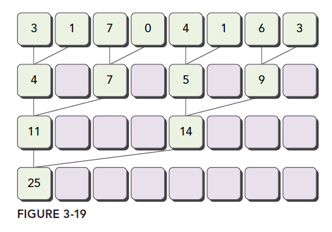
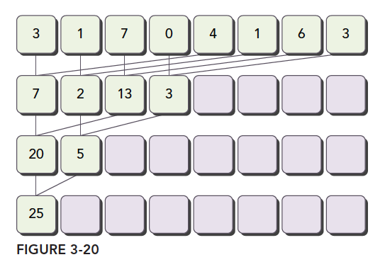

# 05-04-Reduction优化

> 父节点: [[05-00-Nvidia-CUDA与SIMD]]
> 源文件: `nvidia/nvidia.md`
> 相关: [[05-03-CUDA内存层次]] | [[05-05-Bank冲突]] | [[12-00-算法集锦]]


## 相关笔记

[[01-02-线性代数与矩阵分解]]

---


#### 跨度

相邻配对：元素与他们相邻的元素配对



```c++
/*
在这个kernel里面，有两个global memory array，一个用来存放数组所有数据，另一个用来存放部分和。所有block独立的执行求和操作。__syncthreads用来保证每次迭代，所有的求和操作都做完，然后进入下一步迭代。
因为没有办法让所有的block同步，所以最后将所有block的结果送回host来进行串行计算，
*/
__global__ void reduceNeighbored(int *g_idata, int *g_odata, unsigned int n) {
    // set thread ID
    unsigned int tid = threadIdx.x;
    // convert global data pointer to the local pointer of this block
    int *idata = g_idata + blockIdx.x * blockDim.x;
    // boundary check
    if (idx >= n) return;
        // in-place reduction in global memory
    for (int stride = 1; stride < blockDim.x; stride *= 2) {
        if ((tid % (2 * stride)) == 0) {
            idata[tid] += idata[tid + stride];
        }
        // synchronize within block
        __syncthreads();
    }
    // write result for this block to global mem
    if (tid == 0) g_odata[blockIdx.x] = idata[0];
}
```

考虑上节if判断条件： `if ((tid % (2 * stride)) == 0)`因为这表达式只对偶数ID的线程为true，所以其导致很高的divergent warps。第一次迭代只有偶数ID的线程执行了指令，但是所有线程都要被调度；第二次迭代，只有四分之的thread是active的，但是所有thread仍然要被调度。我们可以重新组织每个线程对应的数组索引来强制ID相邻的thread来处理求和操作。

```c++
__global__ void reduceNeighboredLess (int *g_idata, int *g_odata, unsigned int n) {
    // set thread ID
    unsigned int tid = threadIdx.x;
    unsigned int idx = blockIdx.x * blockDim.x + threadIdx.x;
    // convert global data pointer to the local pointer of this block
    int *idata = g_idata + blockIdx.x*blockDim.x;
    // boundary check
    if(idx >= n) return;
    // in-place reduction in global memory
    for (int stride = 1; stride < blockDim.x; stride *= 2) {
        // convert tid into local array index
        int index = 2 * stride * tid;
        if (index < blockDim.x) {
            idata[index] += idata[index + stride];
        }
        // synchronize within threadblock
        __syncthreads();
    }
    // write result for this block to global mem
    if (tid == 0) g_odata[blockIdx.x] = idata[0];
}
```
注意这行代码,`int index = 2 * stride * tid;`,因为步调乘以了2，下面的语句使用block的前半部分thread来执行求和
`if (index < blockDim.x)`

对于一个有512个thread的block来说，前八个warp执行第一轮reduction，剩下八个warp什么也不干；第二轮，前四个warp执行，剩下十二个什么也不干。因此，就彻底不存在divergence了（重申，divergence只发生于同一个warp）。最后的五轮还是会导致divergence，因为这个时候需要执行threads已经凑不够一个warp了。

交错配对：元素与一定距离的元素配对



 Interleaved Pair模式的初始步调是block大小的一半，每个thread处理像个半个block的两个数据求和。和之前的图示相比，工作的thread数目没有变化，但是，每个thread的load/store global memory的位置是不同的。

```c++
/// Interleaved Pair Implementation with less divergence
__global__ void reduceInterleaved (int *g_idata, int *g_odata, unsigned int n) {
// set thread ID
unsigned int tid = threadIdx.x;
unsigned int idx = blockIdx.x * blockDim.x + threadIdx.x;
// convert global data pointer to the local pointer of this block
int *idata = g_idata + blockIdx.x * blockDim.x;
// boundary check
if(idx >= n) return;
// in-place reduction in global memory
for (int stride = blockDim.x / 2; stride > 0; stride >>= 1) {
if (tid < stride) {
idata[tid] += idata[tid + stride];
}
__syncthreads();
}
// write result for this block to global mem
if (tid == 0) g_odata[blockIdx.x] = idata[0];
}
```

注意下面的语句，步调被初始化为block大小的一半：`for (int stride = blockDim.x / 2; stride > 0; stride >>= 1)`下面的语句使得第一次迭代时，block的前半部分thread执行相加操作，第二次是前四分之一，以此类推`if (tid < stride)`


#### Unrolling

在前文的reduceInterleaved中，每个block处理一部分数据，我们给这数据起名data block。下面的代码是reduceInterleaved的修正版本，每个block，都是以两个data block作为源数据进行操作，（前文中，每个block处理一个data block）。这是一种cyclic partitioning：每个thread作用于多个data block，并且从每个data block中取出一个元素处理。

```c++
__global__ void reduceUnrolling2 (int *g_idata, int *g_odata, unsigned int n) {
    // set thread ID
    unsigned int tid = threadIdx.x;
    unsigned int idx = blockIdx.x * blockDim.x * 2 + threadIdx.x;

    // convert global data pointer to the local pointer of this block
    int *idata = g_idata + blockIdx.x * blockDim.x * 2;

    // unrolling 2 data blocks
    if (idx + blockDim.x < n) g_idata[idx] += g_idata[idx + blockDim.x];
    __syncthreads();

    // in-place reduction in global memory
    for (int stride = blockDim.x / 2; stride > 0; stride >>= 1) {
        if (tid < stride) {
            idata[tid] += idata[tid + stride];
        }
        // synchronize within threadblock
        __syncthreads();
    }

    // write result for this block to global mem
    if (tid == 0) g_odata[blockIdx.x] = idata[0];
}
```
注意下面的语句，每个thread从相邻的data block中取数据，这一步实际上就是将两个data block规约成一个.`if (idx + blockDim.x < n) g_idata[idx] += g_idata[idx+blockDim.x];`
由于每个block处理两个data block，所以需要调整grid的配置： `reduceUnrolling2<<<grid.x / 2, block>>>(d_idata, d_odata, size);`

__syncthreads是用来同步block内部thread的（请看warp解析篇）。在reduction kernel中，他被用来在每次循环中年那个保证所有thread的写global memory的操作都已完成，这样才能进行下一阶段的计算。

那么，当kernel进行到只需要少于或等32个thread（也就是一个warp）呢？由于我们是使用的SIMT模式，warp内的thread 是有一个隐式的同步过程的。最后六次迭代可以用下面的语句展开：

```c++
if (tid < 32) {
    volatile int *vmem = idata;
    vmem[tid] += vmem[tid + 32];
    vmem[tid] += vmem[tid + 16];
    vmem[tid] += vmem[tid + 8];
    vmem[tid] += vmem[tid + 4];
    vmem[tid] += vmem[tid + 2];
    vmem[tid] += vmem[tid + 1];
}
```
warp unrolling避免了__syncthreads同步操作，因为这一步本身就没必要
这里注意下volatile修饰符，他告诉编译器每次执行赋值时必须将vmem[tid]的值store回global memory。如果不这样做的话，编译器或cache可能会优化我们读写global/shared memory。有了这个修饰符，编译器就会认为这个值会被其他thread修改，从而使得每次读写都直接去memory而不是去cache或者register。

```c++
__global__ void reduceUnrollWarps8 (int *g_idata, int *g_odata, unsigned int n) {
    // set thread ID
    unsigned int tid = threadIdx.x;
    unsigned int idx = blockIdx.x*blockDim.x*8 + threadIdx.x;

    // convert global data pointer to the local pointer of this block
    int *idata = g_idata + blockIdx.x*blockDim.x*8;

    // unrolling 8
    if (idx + 7*blockDim.x < n) {
        int a1 = g_idata[idx];
        int a2 = g_idata[idx+blockDim.x];
        int a3 = g_idata[idx+2*blockDim.x];
        int a4 = g_idata[idx+3*blockDim.x];
        int b1 = g_idata[idx+4*blockDim.x];
        int b2 = g_idata[idx+5*blockDim.x];
        int b3 = g_idata[idx+6*blockDim.x];
        int b4 = g_idata[idx+7*blockDim.x];
        g_idata[idx] = a1+a2+a3+a4+b1+b2+b3+b4;
    }
    __syncthreads();

    // in-place reduction in global memory
    for (int stride = blockDim.x / 2; stride > 32; stride >>= 1) {

        if (tid < stride) {
            idata[tid] += idata[tid + stride];
        }

        // synchronize within threadblock
        __syncthreads();
    }

    // unrolling warp
    if (tid < 32) {
        volatile int *vmem = idata;
        vmem[tid] += vmem[tid + 32];
        vmem[tid] += vmem[tid + 16];
        vmem[tid] += vmem[tid + 8];
        vmem[tid] += vmem[tid + 4];
        vmem[tid] += vmem[tid + 2];
        vmem[tid] += vmem[tid + 1];
    }

    // write result for this block to global mem
    if (tid == 0) g_odata[blockIdx.x] = idata[0];
}

```
因为处理的data block变为八个，kernel调用变为; `reduceUnrollWarps8<<<grid.x / 8, block>>> (d_idata, d_odata, size);`

```c++
__global__ void reduceCompleteUnrollWarps8 (int *g_idata, int *g_odata,
unsigned int n) {
    // set thread ID
    unsigned int tid = threadIdx.x;
    unsigned int idx = blockIdx.x * blockDim.x * 8 + threadIdx.x;

    // convert global data pointer to the local pointer of this block
    int *idata = g_idata + blockIdx.x * blockDim.x * 8;

    // unrolling 8
    if (idx + 7*blockDim.x < n) {
        int a1 = g_idata[idx];
        int a2 = g_idata[idx + blockDim.x];
        int a3 = g_idata[idx + 2 * blockDim.x];
        int a4 = g_idata[idx + 3 * blockDim.x];
        int b1 = g_idata[idx + 4 * blockDim.x];
        int b2 = g_idata[idx + 5 * blockDim.x];
        int b3 = g_idata[idx + 6 * blockDim.x];
        int b4 = g_idata[idx + 7 * blockDim.x];
        g_idata[idx] = a1 + a2 + a3 + a4 + b1 + b2 + b3 + b4;
    }
    __syncthreads();

    // in-place reduction and complete unroll
    if (blockDim.x>=1024 && tid < 512) idata[tid] += idata[tid + 512];
    __syncthreads();

    if (blockDim.x>=512 && tid < 256) idata[tid] += idata[tid + 256];
    __syncthreads();

    if (blockDim.x>=256 && tid < 128) idata[tid] += idata[tid + 128];
    __syncthreads();

    if (blockDim.x>=128 && tid < 64) idata[tid] += idata[tid + 64];
    __syncthreads();

    // unrolling warp
    if (tid < 32) {
        volatile int *vsmem = idata;
        vsmem[tid] += vsmem[tid + 32];
        vsmem[tid] += vsmem[tid + 16];
        vsmem[tid] += vsmem[tid + 8];
        vsmem[tid] += vsmem[tid + 4];
        vsmem[tid] += vsmem[tid + 2];
        vsmem[tid] += vsmem[tid + 1];
    }

    // write result for this block to global mem
    if (tid == 0) g_odata[blockIdx.x] = idata[0];
}
```
main中调用： `reduceCompleteUnrollWarps8<<<grid.x / 8, block>>>(d_idata, d_odata, size);`

CUDA代码支持模板，我们可以如下设置block大小：

```c++
template <unsigned int iBlockSize>
__global__ void reduceCompleteUnroll(int *g_idata, int *g_odata, unsigned int n) {
// set thread ID
unsigned int tid = threadIdx.x;
unsigned int idx = blockIdx.x * blockDim.x * 8 + threadIdx.x;

// convert global data pointer to the local pointer of this block
int *idata = g_idata + blockIdx.x * blockDim.x * 8;

// unrolling 8
if (idx + 7*blockDim.x < n) {
int a1 = g_idata[idx];
int a2 = g_idata[idx + blockDim.x];
int a3 = g_idata[idx + 2 * blockDim.x];
int a4 = g_idata[idx + 3 * blockDim.x];
int b1 = g_idata[idx + 4 * blockDim.x];
int b2 = g_idata[idx + 5 * blockDim.x];
int b3 = g_idata[idx + 6 * blockDim.x];
int b4 = g_idata[idx + 7 * blockDim.x];
g_idata[idx] = a1+a2+a3+a4+b1+b2+b3+b4;
}
__syncthreads();

// in-place reduction and complete unroll
if (iBlockSize>=1024 && tid < 512) idata[tid] += idata[tid + 512];
__syncthreads();

if (iBlockSize>=512 && tid < 256) idata[tid] += idata[tid + 256];
__syncthreads();

if (iBlockSize>=256 && tid < 128) idata[tid] += idata[tid + 128];
__syncthreads();

if (iBlockSize>=128 && tid < 64) idata[tid] += idata[tid + 64];
__syncthreads();

// unrolling warp
if (tid < 32) {
volatile int *vsmem = idata;
vsmem[tid] += vsmem[tid + 32];
vsmem[tid] += vsmem[tid + 16];
vsmem[tid] += vsmem[tid + 8];
vsmem[tid] += vsmem[tid + 4];
vsmem[tid] += vsmem[tid + 2];
vsmem[tid] += vsmem[tid + 1];
}

// write result for this block to global mem
if (tid == 0) g_odata[blockIdx.x] = idata[0];
}

```
对于if的条件，如果值为false，那么在编译时就会去掉该语句，这样效率更好。例如，如果调用kernel时的blocksize是256，那么，下面的语句将永远为false，编译器会将他移除不予执行：`IBlockSize>=1024 && tid < 512`这个kernel必须以一个switch-case来调用
```c++
switch (blocksize) {
    case 1024:
        reduceCompleteUnroll<1024><<<grid.x/8, block>>>(d_idata, d_odata, size);
        break;
    case 512:
        reduceCompleteUnroll<512><<<grid.x/8, block>>>(d_idata, d_odata, size);
        break;
    case 256:
        reduceCompleteUnroll<256><<<grid.x/8, block>>>(d_idata, d_odata, size);
        break;
    case 128:
        reduceCompleteUnroll<128><<<grid.x/8, block>>>(d_idata, d_odata, size);
        break;
    case 64:
        reduceCompleteUnroll<64><<<grid.x/8, block>>>(d_idata, d_odata, size);
        break;
}
```

#### bank冲突