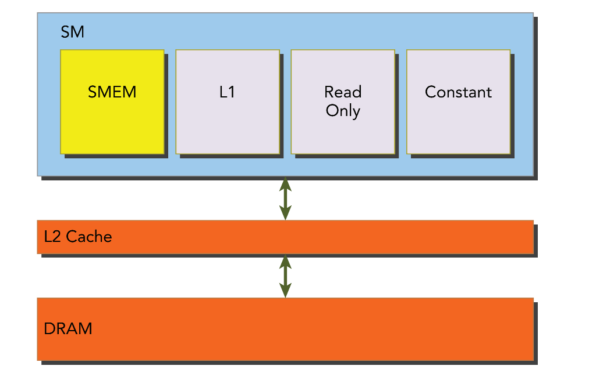
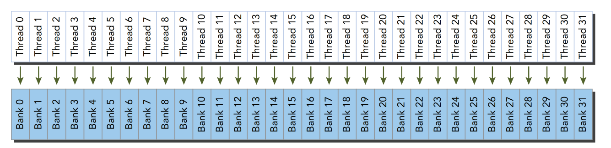
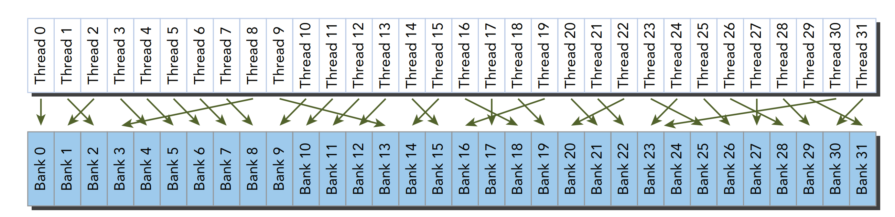
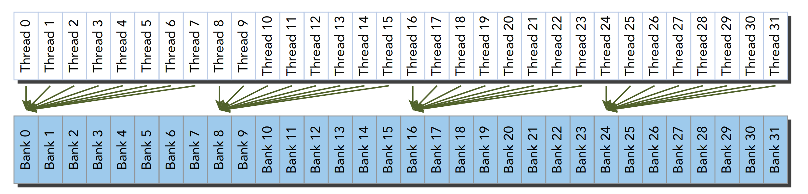
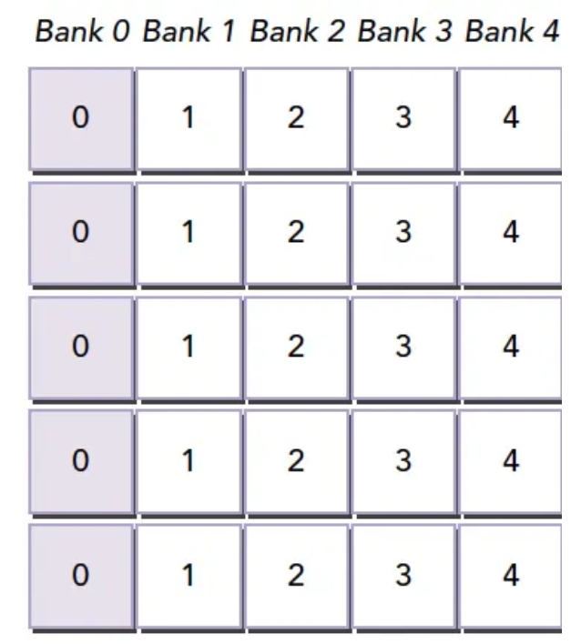
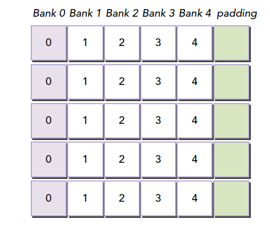
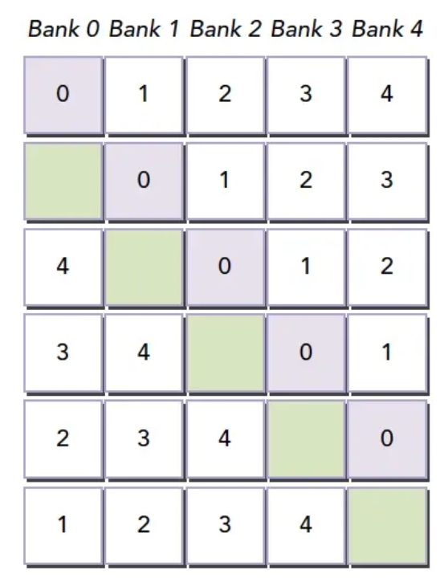
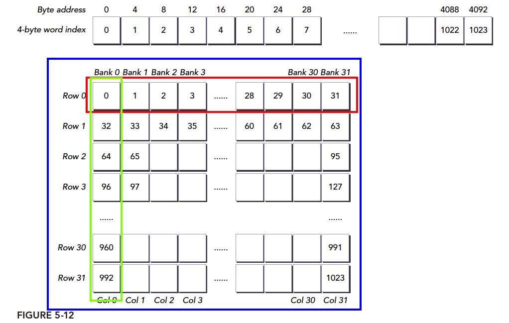

# 05-05-Bank冲突

> 父节点: [[05-00-Nvidia-CUDA与SIMD]]
> 源文件: `nvidia/nvidia.md`
> 相关: [[05-03-CUDA内存层次]] | [[05-04-Reduction优化]] | [[12-00-算法集锦]]

---

https://zhuanlan.zhihu.com/p/622972092

https://zhuanlan.zhihu.com/p/632244210

如图黄色部分为共享内存，可以发现相对于DRAM(全局内存)，共享内存在物理上距离SM更近，所以共享内存更快。当每个线程块(注意共享内存是在Block内共享) 开始执行时，会分配给它一定数量的共享内存。所以共享内存被SM中所有常驻线程块划分，因此，共享内存是限制设备并行性的关键资源。一个核函数使用的共享内存越多，处于并发活跃状态的线程块就越少。



共享内存分配方式

```c++
__shared__ //共享内存关键字
__shared__ float a[size_x][size_y]; //声明一个二维浮点数共享内存数组
```

如果想动态声明一个共享内存数组，可以使用extern关键字，并在核函数启动时添加第三个参数

```c++
extern __shared__ int tile[];
kernel<<<grid,block,isize*sizeof(int)>>>(...); //isize就是共享内存要存储的数组的大小
//注意，动态声明只支持一维数组。
```

为了获得更高内存带宽，共享内存被分为32个同样大小的内存模型，被称之为存储体(bank)，它们能被同时访问。有32个存储体是因为在一个线程束中有32个线程，如果线程束需要对共享内存进行访问，且在每个bank上只访问不多于一个的内存地址，那么该操作可由一个内存事务完成。

最优访问模式 并行不冲突



不规则的访问 并行不冲突



不规则的访问 当线程访问同一个bank中的不同地址时就会冲突，访问同一个bank中的相同地址时则以广播的方式



对于共享内存的访问，主要就是要避免共享内存访问的bank冲突，而bank冲突就是当一个线程束中的不同线程访问一个bank中不同的字地址时，就会发生bank冲突。而一旦在访问共享内存时发生bank冲突，那就需要多个内存事务才能完成，进而就会影响核函数的效率。

当我们使用线程索引采用固定步长来访问共享内存数组时

```c++
extern __shared__ int shared[];
int data = shared[baseIndex + s * tid]; //baseIndex是0点位置，s是步长 tid是线程索引
//这里记一个结论: 按此种方式访问共享内存，当步长s为奇数时不会发生bank冲突
```
假设当s=2时，即步长为2，那么0-15号线程分别访问bank0的0地址、bank2的2地址......bank30的30地址，而16-31号线程则又访问bank0的32号地址........bank30的62地址，因为线程束中不同线程访问了同一bank的不同地址，所以就产生了bank冲突


bank冲突会影响核函数的性能，所以为了降低bank冲突，可以使用填充的办法让数据错位，来降低冲突。

假设当前有5个bank(实际应该是32个，这里为了方便理解，用5举例)，我们定义一个如下的共享内存数组

`__shared__ int a[5][5];`

那么这个共享内存数组，在bank中的内存布局将是如下所示，假设在某一种情况下，多个线程访问bank0中不同地址的数据(即a[0] [0]、a[1] [0]、...、a[4] [0])，那么就会发生一个5线程的冲突



而所谓内存填充，即在对数据进行定义时，多考虑一个bank，即多定义一列，如下所示

```c++
__shared__ int a[5][6];
```


这样定义之后，因为物理只有5个bank，所以实际的内存布局就如下所示，此时再对a[0] [0]、a[1] [0]、...、a[4] [0]数据进行并行访问时，就发现他们不再同属于一个bank，这样就避免了bank冲突



方形共享内存布局

定义一个二维共享内存数组，它按行主序进行储存，所以它的存储内存布局示意图如下所示

```c++
#define N 32
__shared__ int x[N][N];
```


当我们使用访问这个二维数组时，一般可以通过二维线程块来访问

```c++
int a=x[threadIdx.y][threadIdx.x];
//或
int a=x[threadIdx.x][threadIdx.y];
```

CUDA明确的告诉你，是顺着x切的，也就是一个线程束中的threadIdx.x 连续变化。既然线程块是沿着x方向划分线程束，又因为bank存储是按行主序进行储存的，所以这两种访问方式会产生不同的效果，很明显上图中红色框方式更优，绿色框方式会产生大量bank冲突

```c++
int a=x[threadIdx.y][threadIdx.x]; //红色框访问访问
int a=x[threadIdx.x][threadIdx.y]; //绿色框访问访问
```


#### CudaGraph