# 06-04-魔术方法

> 父节点: [[06-00-Python生态]]
> 源文件: `py/tips.md`
> 相关: [[06-01-asyncio协程]] | [[06-05-collections]]

## 相关笔记

[[02-07-模板元编程]]

---

参考链接:  https://mp.weixin.qq.com/s/AEI3gYxQ1FRxAU1zByEPKw

__missing__ ： 消除防御性代码的字典秘密

适用场景： 配置对象、计数器、缓存字典，或任何在获取有可能缺失的键时不抛出异常的情况。

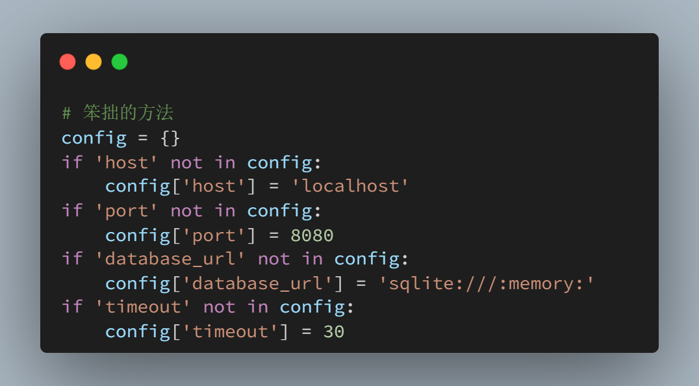
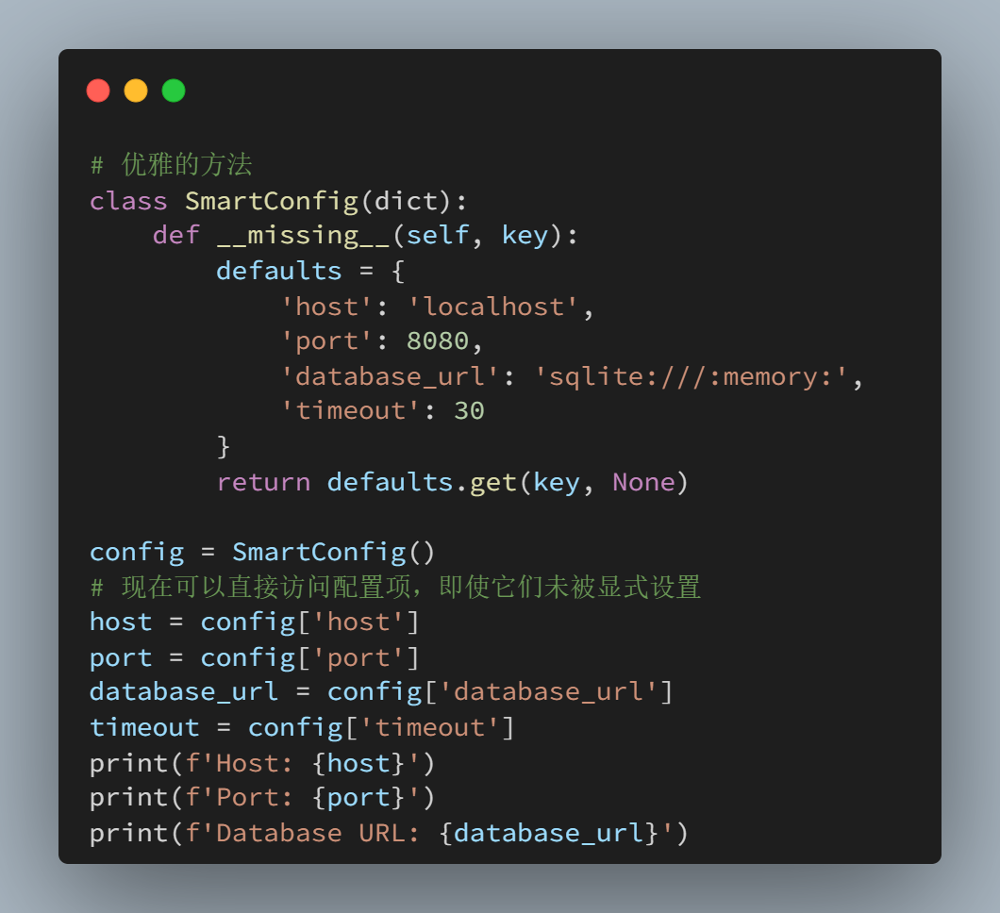

__index__：使自定义对象与切片一起协作

想让你的自定义对象与 Python 的切片语法无缝协作吗？ \__index__ 会将你的对象转换为整数，以便在序列中使用。

适用场景： 任何表示域中数值位置或索引的对象——例如时间戳、偏移量或自定义范围对象。

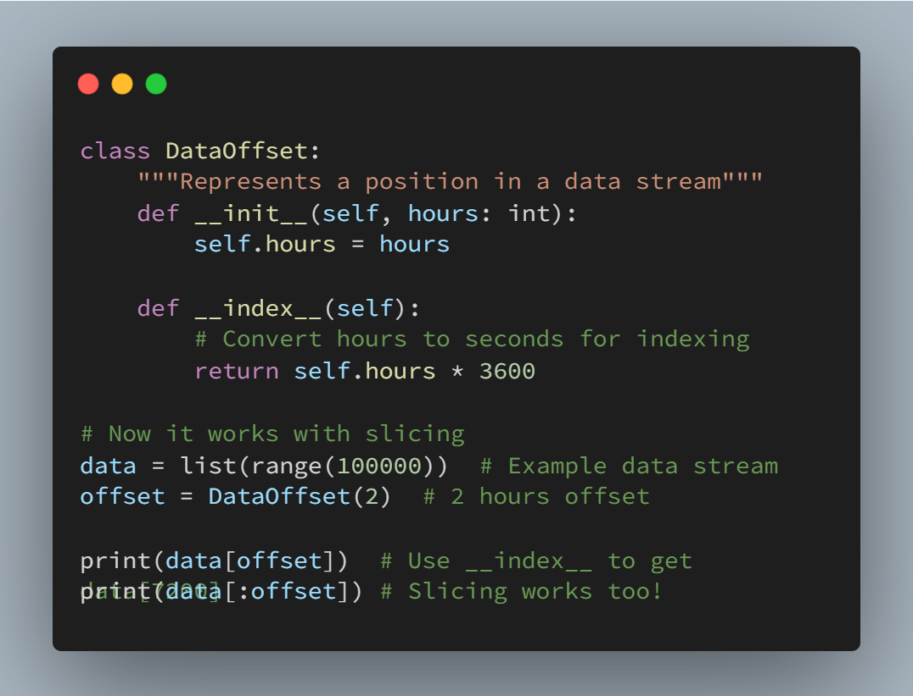

__matmul__：使用 @ 运算符的矩阵乘法

@ 运算符不仅仅用于装饰器。当你实现 \__matmul__ 接口时，你的对象可以使用 @ 来进行运算，从而显著提高代码的可读性。

适用场景： 数据转换、数学计算或任何需要频繁使用矩阵运算的领域。比如在机器学习流程中使用它来简化转换链。

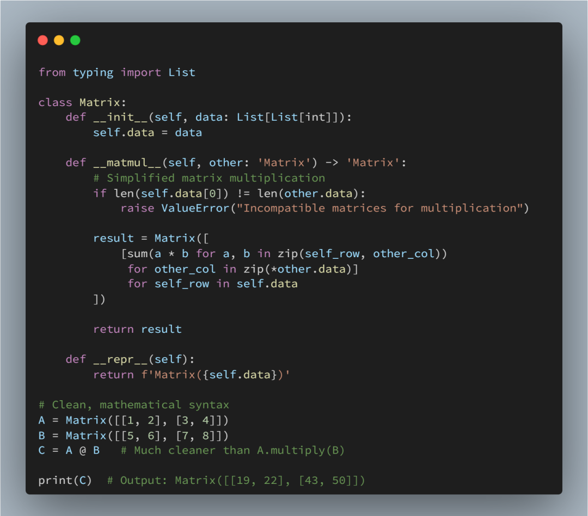

__slots__：拯救生产系统的内存秘密

当创建数百万个对象时，内存使用情况会变得至关重要。\__slots__ 会限制对象可以拥有的属性，从而消除每个实例的 \__dict__ ，并显著降低内存使用量。

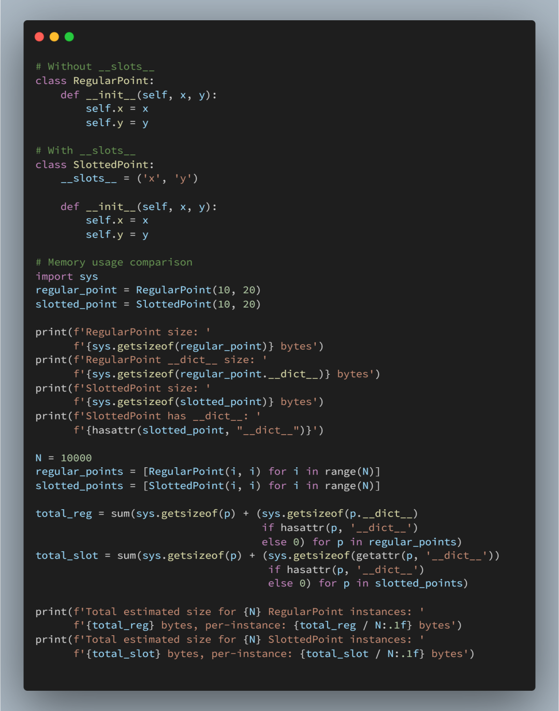

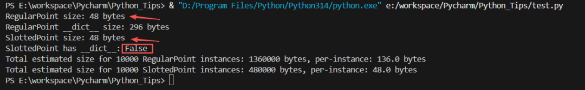

缺点： 将失去动态属性赋值和每个实例的 __dict__ 功能。适用于拥有多个具有固定属性的简单对象实例的情况

注意：最开始的单个实例的内存大小都是 48 个字节，是因为：

    sys.getsizeof(obj) 只返回该 Python 对象本身在 CPython 下的字节大小（对象头/结构），不包含它引用的其他对象（例如 __dict__、字符串、列表等）。
    对于普通实例（有 __dict__），实例对象本身和属性字典是两个独立的对象：
        sys.getsizeof(instance) 只测实例的 C 结构（通常是 48 bytes 左右）。
        sys.getsizeof(instance.__dict__) 测量属性字典的大小（例如示例中是 296 bytes）。
        对于使用 __slots__ 的类，默认没有 __dict__（除非你在 __slots__ 中包含 '__dict__'），属性存放在更紧凑的内部结构中，所以：
        单个实例的 sys.getsizeof 仍可能显示与普通实例相同的基础对象大小（因为那部分是对象头等固定开销）。
        真正的内存节省来自“没有为每个实例分配一个 dict 对象”这一点 — 这在大量实例时才显著。

__enter__ / __exit__：上下文管理器魔法

上下文管理器确保即使发生异常也能正确清理资源。与其到处依赖 try/finally 代码块，不如创建能够与 Python 的 with 语句无缝集成的对象。

专业提示： 使用 contextlib 模块可以简化上下文管理器，但当需要基于类的状态管理时，需要手动实现 \__enter__ / \__exit__ 。适用场景：资源管理、临时状态变更、监控或任何需要确保资源释放的操作。

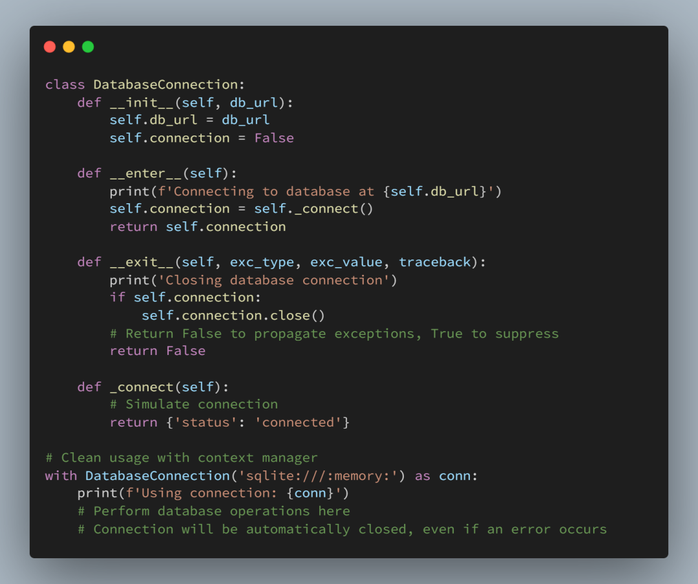

__fspath__：使自定义对象与路径兼容

通过实现路径协议，使您的自定义对象与 Python 的文件系统函数无缝协作。

适用场景： 构建需要与现有文件系统功能配合使用的文件/路径抽象。非常适合路径遵循特定模式的数据工程应用。

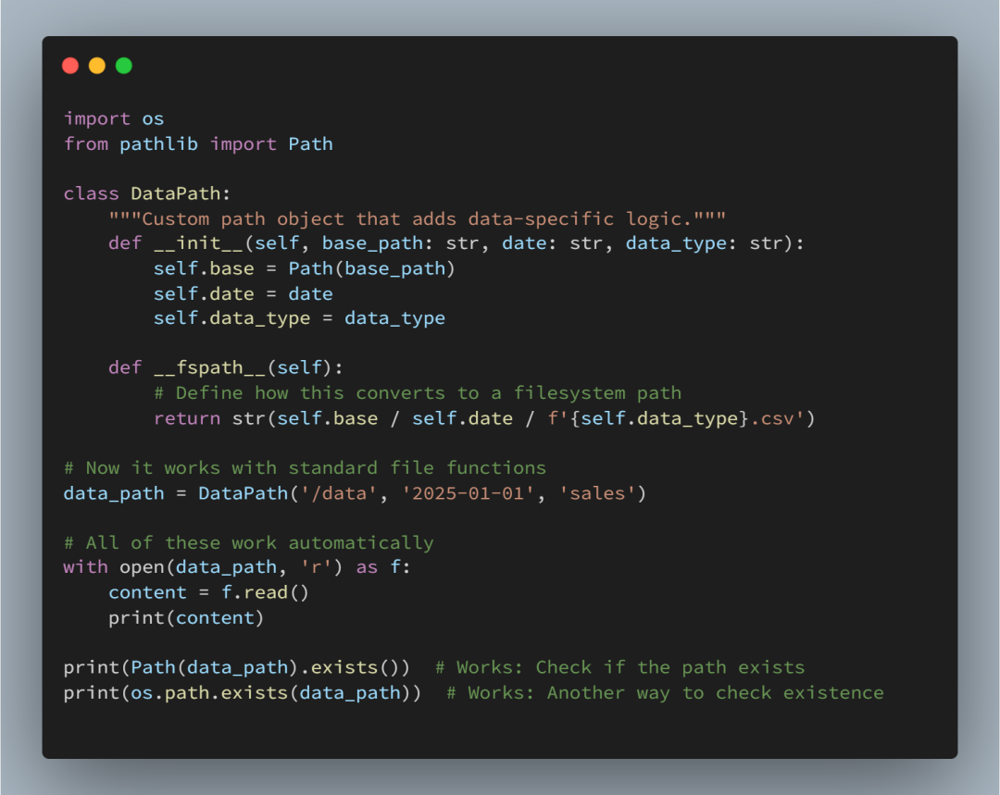

__anext__ + __aiter__：异步迭代的正确

\__aiter__ 和 \__anext__ 是 Python 中定义 异步迭代器协议（Asynchronous Iterator Protocol） 的两个“魔术方法”。对于异步数据处理，这些方法允许你创建与 async for 循环一起使用的对象，非常适合流式数据或异步生成器。这组协议与同步世界中的 \__iter__ 和 \__next__ 相对应。

    同步 for 循环:
        for item in my_list:
        Python 在背后调用 my_list.__iter__() 来获取一个迭代器。
        循环调用该迭代器的 __next__() 方法获取每一项，直到触发 StopIteration 异常。
    异步 async for 循环:
    async for item in my_async_iterable:
    Python 在背后调用 my_async_iterable.__aiter__() 来获取一个异步迭代器。
    循环调用该迭代器的 __anext__() 方法（这是一个 async 方法，所以它返回一个可等待对象），await 它的结果来获取每一项，直到触发 StopAsyncIteration 异常。

真实场景案例：异步 API 分页器

假设您需要从一个提供分页（Pagination）数据的 API 中获取大量数据。例如，一个 /api/items 接口，您必须通过 ?page=1, ?page=2... 逐页请求才能获取所有项目。

我们不希望一次性请求所有页面（可能导致内存溢出或被 API 限流），也不希望在请求一页时阻塞整个程序。我们希望创建一个对象，可以让我们像遍历一个普通列表一样，使用 async for 来遍历所有项目，而这个对象会在后台自动、异步地处理分页请求。

示例代码

我们将模拟一个网络请求，使用 asyncio.sleep 来代表真实的 I/O 等待时间。

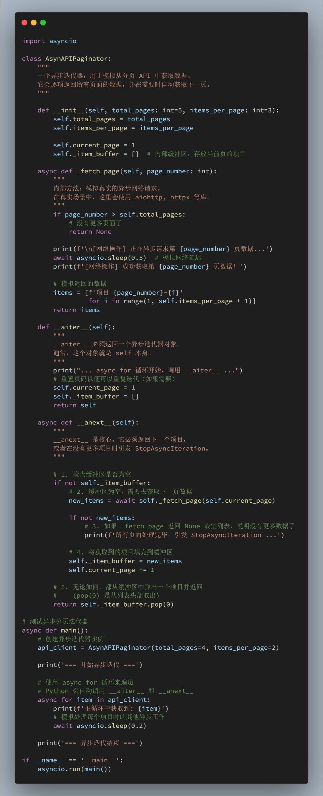

核心思想是：当“获取下一个”这个动作本身是一个需要等待的I/O操作时，你就应该使用这个协议。

这允许您的代码在等待数据时（例如等待网络响应）去执行其他任务，而不是完全卡住。

主要适用场景包括：

    流式数据处理 (Streaming Data)
    •WebSockets：async for message in websocket:。__anext__ 内部会 await websocket.recv()，等待下一条消息的到来。
    •服务器发送事件 (SSE)：与 WebSockets 类似，等待事件流中的下一个事件。
    •IoT 传感器数据：等待来自某个硬件或传感器的下一个读数。

    网络请求分页 (Network Request Pagination)
    •如上例所示：处理 GitHub、Twitter、Slack 或任何返回分页结果的 REST API。__anext__ 负责在需要时透明地获取下一页。

    数据库游标 (Database Cursors)
    •当您从数据库中查询一个非常大的结果集（例如数百万行）时，您不希望将它们全部加载到内存中。
    •像 asyncpg (PostgreSQL驱动) 这样的库允许您使用异步游标。__anext__ 会在内部 await cursor.fetchrow() 来异步获取下一行数据。

    异步文件 I/O
    •使用 aiofiles 库逐行读取一个非常大的文件。__anext__ 可以在内部 await f.readline()，在等待磁盘I/O时释放控制权。

    消息队列消费者 (Message Queue Consumers)
    •从 RabbitMQ, Kafka 或 Redis Pub/Sub 中消费消息。__anext__ 内部会 await queue.get()，异步地等待队列中的下一条消息。

总而言之，\__aiter__ / \__anext__ 协议是构建高性能、非阻塞 I/O 数据管道的基础。它让您能用一个干净的 async for 循环来处理那些“一次来一点”的异步数据源。

__await__：让对象本身可等待

适用场景： 数据库连接、文件操作或任何代表异步操作本身的对象。使 API 使用起来更加自然。

\__await__ 不是返回可等待的对象，而是使对象本身可等待。这使得异步 API 更加简洁。

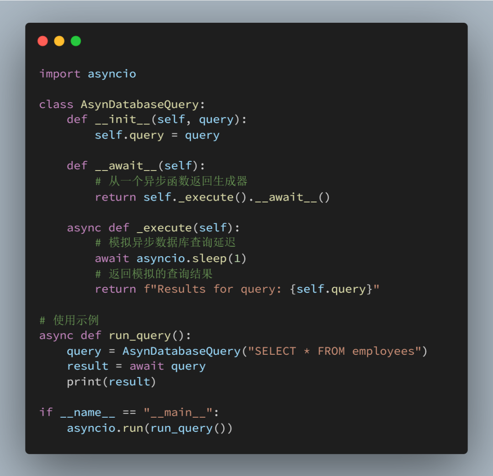

__getattr__ 与 __getattribute__：属性访问陷阱

这两种方法都控制属性访问，但它们的工作原理完全不同。混用它们可能会导致无限递归或意想不到的行为。

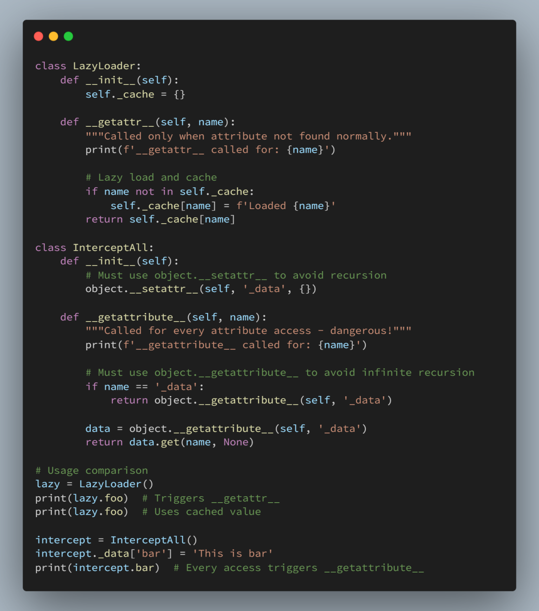

    关键规则：
    •使用 __getattr__ 作为备用方案（更安全）
    •仅当需要拦截所有访问时才使用 __getattribute__
    •始终在 __getattribute__ 中使用 object.__getattribute__() 以避免递归。

适用场景： 使用 __getattr__ 来获取代理对象和延迟加载。除非绝对必要，否则绝对别使用 __getattribute__ 。

__call__：将对象转换为函数

将对象转换为可调用实体，创建强大的模式，例如可配置转换器或有状态函数。

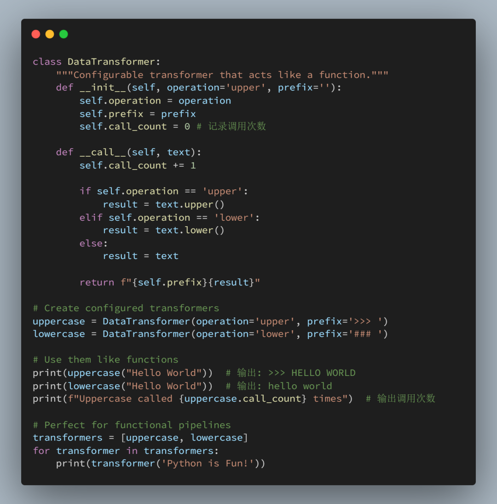

适用场景： 可配置处理器、有状态函数、回调对象，或任何需要面向对象设计并具有函数式接口的场景。

__prepare__：控制类创建（高级）

此元类方法允许你在类创建期间控制使用的类字典对象。最常用于保持类属性声明的顺序。

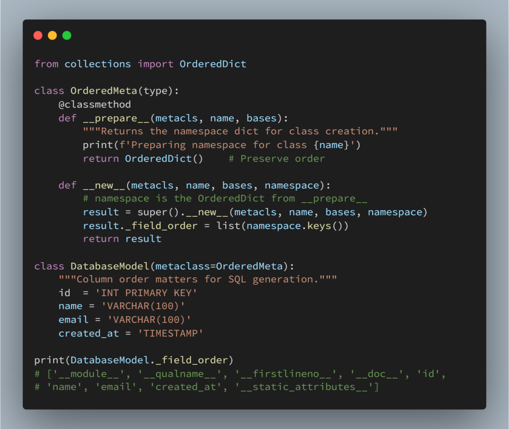

    适用场景：
    •ORM 定义中，列顺序对 SQL 生成至关重要
    •处理顺序重要的配置类
    •需要保留声明顺序的模式定义
    •任何声明顺序都有其语义含义的领域特定语言（DSL）

---