# 知识图谱总览

> 基于「闹闹 3.5」个人知识仓库整理 | 源仓库: `/Users/naonao/demo/repo/gist`
> 本文档用 `[[页面名]]` 建立 Obsidian Wiki 链接，可在 Obsidian 中打开以浏览知识图谱。
> **当前已拆分为 63 个细粒度子笔记**，每篇文章独立成 `.md` 文件，用交叉引用互连。


## 相关笔记

[[01-00-数学之美]] [[02-00-C++现代编程]] [[03-00-编译工具链]] [[04-00-OpenCV视觉算法]] [[05-00-Nvidia-CUDA与SIMD]] [[06-00-Python生态]] [[07-00-工业相机与HALCON]] [[08-00-Linux系统工具]] [[11-00-大模型与深度学习]] [[12-00-算法集锦]] [[13-00-工具手册]]

---

## 项目信息

# 爱喝可乐的闹闹

> [Github](https://github.com/naonao-cola)

> [Gitee](https://gitee.com/naoano)

# **Sponsor/赞助**

如果有帮助你的话请 star 这个仓库 (点击右上角的 star)

 **"Buy Me a cup of Coffee"（谢谢大爹）**
<center></center>
---

## 细粒度知识图谱索引

### 01-数学之美（4 个子笔记）

| 序号 | 子笔记 | 内容 |
|------|--------|------|
| 1 | [[01-01-平面几何]] | 平面几何、直线与线段、点到直线距离、轮廓面积、极坐标 |
| 2 | [[01-02-线性代数与矩阵分解]] | 特征值与特征向量、SVD 分解、QR 分解 |
| 3 | [[01-03-Eigen教程]] | Eigen 矩阵定义、基础使用、特殊矩阵、分块、转置、乘积、化简、旋转变换 |
| 4 | [[01-04-三维变换]] | OpenCV 旋转变换、三维空间变换 |

### 02-C++现代编程（7 个子笔记）

| 序号 | 子笔记 | 内容 |
|------|--------|------|
| 1 | [[02-01-C++17-20新特性]] | C++17/20：variant/optional/any/string_view、结构化绑定、fold 表达式 |
| 2 | [[02-02-智能指针]] | std::move、std::unique_ptr、shared_ptr、weak_ptr、内存对齐 |
| 3 | [[02-03-原子操作与内存序]] | 原子变量、6 种内存序（relaxed/release-acquire/seq_cst） |
| 4 | [[02-04-无锁队列]] | CAS、无锁队列链表实现、ABA 问题 |
| 5 | [[02-05-OpenMP并行]] | 多线程、OpenMP 并行编程、自旋锁、线程池 |
| 6 | [[02-06-设计模式]] | 22 种设计模式的 C++ 实现概览 |
| 7 | [[02-07-模板元编程]] | 模板编程基础、模板元编程图片笔记 |

### 03-编译工具链（3 个子笔记）

| 序号 | 子笔记 | 内容 |
|------|--------|------|
| 1 | [[03-01-xmake教程]] | xmake 7 章完整教程：安装、命令、配置、包管理、lua 脚本 |
| 2 | [[03-02-CMake教程]] | CMake 入口 + 编译综合实践 + 常用模板 |
| 3 | [[03-03-交叉编译]] | Android 交叉编译 OpenCV、英伟达 Jetson 编译脚本 |

### 04-OpenCV视觉算法（7 个子笔记）

| 序号 | 子笔记 | 内容 |
|------|--------|------|
| 1 | [[04-01-区域生长]] | 区域生长算法实现 |
| 2 | [[04-02-霍夫变换]] | 霍夫变换图像分割、直线/圆检测 |
| 3 | [[04-03-OPTICS聚类]] | OPTICS 聚类算法完整实现（含可达性距离） |
| 4 | [[04-04-光斑拟合]] | 高斯拟合求光斑中心、海森矩阵求光斑 |
| 5 | [[04-05-FLANN匹配]] | FLANN 快速最近邻搜索与特征匹配 |
| 6 | [[04-06-LineMod]] | LineMod 模板匹配算法 |
| 7 | [[04-07-图像编码]] | JPEG/BMP/PNG 图像编码格式（含 svpng 源码） |

### 05-Nvidia-CUDA与SIMD（6 个子笔记）

| 序号 | 子笔记 | 内容 |
|------|--------|------|
| 1 | [[05-01-SSE-AVX指令集]] | SSE/AVX/AVX512 向量寄存器、数据类型、MIPP 使用 |
| 2 | [[05-02-MIPP跨平台]] | MIPP 跨平台 SIMD 封装库使用 |
| 3 | [[05-03-CUDA内存层次]] | CUDA grid/block、全局/共享/寄存器内存、同步、计时 |
| 4 | [[05-04-Reduction优化]] | Reduction 逐步优化：交错归约、展开、模板化 |
| 5 | [[05-05-Bank冲突]] | 共享内存 Bank 冲突原理、填充优化、方形布局 |
| 6 | [[05-06-Nsight工具]] | Nsight Compute/Systems 性能分析工具 |

### 06-Python生态（5 个子笔记）

| 序号 | 子笔记 | 内容 |
|------|--------|------|
| 1 | [[06-01-asyncio协程]] | 协程实现、async/await、事件循环、asyncio 用法 |
| 2 | [[06-02-Cython打包]] | Python 程序打包（Cython + setup.py + bdist_wheel） |
| 3 | [[06-03-PPQ量化]] | PPQ 量化工具使用 |
| 4 | [[06-04-魔术方法]] | Python 魔术方法（__init__/__call__/__enter__ 等） |
| 5 | [[06-05-collections]] | Python collections 包（Counter/OrderedDict/defaultdict/ChainMap） |

### 07-工业相机与HALCON（7 个子笔记）

| 序号 | 子笔记 | 内容 |
|------|--------|------|
| 1 | [[07-01-相机选型]] | 工业相机选型（分辨率/帧率/靶面/像元/接口）、相机标定原理 |
| 2 | [[07-02-结构光标定]] | 结构光系统标定（上篇/下篇） |
| 3 | [[07-03-图像分割]] | HALCON 图像分割：阈值/自动阈值/局部阈值/Canny/区域生长/Hough/分水岭 |
| 4 | [[07-04-特征提取]] | 区域面积/中心点/内接圆/外接矩形/灰度特征提取 |
| 5 | [[07-05-形态学]] | 腐蚀/膨胀/开闭运算/顶帽底帽/边界提取/孔洞填充/骨架提取 |
| 6 | [[07-06-3D视觉]] | 图像模板匹配（像素/形状/图像金字塔）+ 3D 立体视觉 |
| 7 | [[07-07-银行卡识别]] | HALCON 卡号识别系统完整案例 |

### 08-Linux系统工具（8 个子笔记）

| 序号 | 子笔记 | 内容 |
|------|--------|------|
| 1 | [[08-01-grep]] | grep 文本搜索完整教程 |
| 2 | [[08-02-sed]] | sed 流编辑器完整教程 |
| 3 | [[08-03-awk]] | awk 文本处理语言 |
| 4 | [[08-04-xargs]] | xargs 参数传递与并行执行 |
| 5 | [[08-05-ldd-objdump]] | Linux 动态库问题排查（ldd/objdump/readelf） |
| 6 | [[08-06-frp内网穿透]] | frp 内网穿透部署指南 |
| 7 | [[08-07-tmux]] | tmux 终端复用器使用 |
| 8 | [[08-08-WSL2]] | WSL2 安装 CUDA 与驱动配置 |

### 09-Docker容器（4 个子笔记）

| 序号 | 子笔记 | 内容 |
|------|--------|------|
| 1 | [[09-01-nvidia-docker]] | Docker 基础安装 + nvidia-docker GPU 环境配置 |
| 2 | [[09-02-Compose-GPU]] | Docker Compose 多容器编排（含 GPU 配置） |
| 3 | [[09-03-深度学习Dockerfile]] | 深度学习 Docker 部署 + Dockerfile 写法 |
| 4 | [[09-04-数据卷]] | Docker 数据卷管理（挂载/备份/恢复） |

### 10-Git与GitHub（4 个子笔记）

| 序号 | 子笔记 | 内容 |
|------|--------|------|
| 1 | [[10-01-Git场景速查]] | Git 全场景操作速查（clone/commit/push/branch/merge/rebase） |
| 2 | [[10-02-Commit规范]] | Commit 消息规范 + GitHub 代理 + PR 流程 + Gitee 同步 |
| 3 | [[10-03-cherry-pick]] | cherry-pick 用法与场景 |
| 4 | [[10-04-CICD]] | GitHub Actions 持续集成部署 |

### 11-大模型与深度学习（8 个子笔记）

| 序号 | 子笔记 | 内容 |
|------|--------|------|
| 1 | [[11-01-PyTorch教程]] | PyTorch 深度学习 19 章完整教程 |
| 2 | [[11-02-Prompt工程]] | Prompt 工程目录与技巧 |
| 3 | [[11-03-Transformer架构]] | Transformer 架构概览、注意力机制 |
| 4 | [[11-04-vLLM]] | vLLM 高性能推理框架 |
| 5 | [[11-05-SGLang]] | SGLang 推理服务框架 |
| 6 | [[11-06-LangChain]] | LangChain LLM 应用开发框架 |
| 7 | [[11-07-LangGraph]] | LangGraph 图状编排扩展 |
| 8 | [[11-08-LLM基础概念]] | LLM、微调、推理优化、RAG、Agent、训练基础设施 |

### 12-算法集锦（MOC 索引，内容分散在各子笔记中）

| 序号 | 关联子笔记 | 内容 |
|------|-----------|------|
| 1 | [[01-02-线性代数与矩阵分解]] | 矩阵分解（SVD/QR/特征值） |
| 2 | [[01-03-Eigen教程]] | Eigen 矩阵运算库 |
| 3 | [[04-03-OPTICS聚类]] | OPTICS 聚类算法 |
| 4 | [[04-04-光斑拟合]] | 高斯拟合 / 海森矩阵 |
| 5 | [[04-02-霍夫变换]] | 霍夫变换 |
| 6 | [[05-04-Reduction优化]] | CUDA Reduction 并行规约 |
| 7 | [[05-05-Bank冲突]] | 共享内存 Bank 冲突 |
| 8 | [[02-04-无锁队列]] | CAS / 无锁队列链表 |
| 9 | [[02-06-设计模式]] | 22 种设计模式 |
| 10 | [[02-03-原子操作与内存序]] | 原子变量与 6 种内存序 |

### 13-工具手册（MOC 索引，内容分散在各子笔记中）

| 序号 | 关联子笔记 | 内容 |
|------|-----------|------|
| 1 | [[03-01-xmake教程]] | xmake 命令与配置 |
| 2 | [[03-02-CMake教程]] | CMake 模板与最佳实践 |
| 3 | [[08-01-grep]] | grep 文本搜索 |
| 4 | [[08-02-sed]] | sed 流编辑器 |
| 5 | [[08-03-awk]] | awk 文本处理 |
| 6 | [[08-04-xargs]] | xargs 参数传递 |
| 7 | [[08-07-tmux]] | tmux 终端复用器 |
| 8 | [[09-00-Docker容器]] | Docker 命令与部署 |
| 9 | [[10-00-Git与GitHub]] | Git 操作速查 |

---

## 知识关联图谱（细粒度拆分后）

```mermaid
graph TD
    %% MOC 节点
    A[知识图谱总览] 

    %% 01-数学之美 → 4 子笔记
    B1[01-01-平面几何]
    B2[01-02-线性代数与矩阵分解]
    B3[01-03-Eigen教程]
    B4[01-04-三维变换]

    %% 02-C++ → 7 子笔记
    C1[02-01-C++17-20新特性]
    C2[02-02-智能指针]
    C3[02-03-原子操作与内存序]
    C4[02-04-无锁队列]
    C5[02-05-OpenMP并行]
    C6[02-06-设计模式]
    C7[02-07-模板元编程]

    %% 03-编译工具链 → 3 子笔记
    D1[03-01-xmake教程]
    D2[03-02-CMake教程]
    D3[03-03-交叉编译]

    %% 04-OpenCV → 7 子笔记
    E1[04-01-区域生长]
    E2[04-02-霍夫变换]
    E3[04-03-OPTICS聚类]
    E4[04-04-光斑拟合]
    E5[04-05-FLANN匹配]
    E6[04-06-LineMod]
    E7[04-07-图像编码]

    %% 05-CUDA → 6 子笔记
    F1[05-01-SSE-AVX指令集]
    F2[05-02-MIPP跨平台]
    F3[05-03-CUDA内存层次]
    F4[05-04-Reduction优化]
    F5[05-05-Bank冲突]
    F6[05-06-Nsight工具]

    %% 06-Python → 5 子笔记
    G1[06-01-asyncio协程]
    G2[06-02-Cython打包]
    G3[06-03-PPQ量化]
    G4[06-04-魔术方法]
    G5[06-05-collections]

    %% 07-HALCON → 7 子笔记
    H1[07-01-相机选型]
    H2[07-02-结构光标定]
    H3[07-03-图像分割]
    H4[07-04-特征提取]
    H5[07-05-形态学]
    H6[07-06-3D视觉]
    H7[07-07-银行卡识别]

    %% 08-Linux → 8 子笔记
    I1[08-01-grep]
    I2[08-02-sed]
    I3[08-03-awk]
    I4[08-04-xargs]
    I5[08-05-ldd-objdump]
    I6[08-06-frp内网穿透]
    I7[08-07-tmux]
    I8[08-08-WSL2]

    %% 09-Docker → 4 子笔记
    J1[09-01-nvidia-docker]
    J2[09-02-Compose-GPU]
    J3[09-03-深度学习Dockerfile]
    J4[09-04-数据卷]

    %% 10-Git → 4 子笔记
    K1[10-01-Git场景速查]
    K2[10-02-Commit规范]
    K3[10-03-cherry-pick]
    K4[10-04-CICD]

    %% 11-大模型 → 8 子笔记
    L1[11-01-PyTorch教程]
    L2[11-02-Prompt工程]
    L3[11-03-Transformer架构]
    L4[11-04-vLLM]
    L5[11-05-SGLang]
    L6[11-06-LangChain]
    L7[11-07-LangGraph]
    L8[11-08-LLM基础概念]

    %% === 核心跨域关联 ===

    %% 01 内链 + 外链
    B2 --> B3
    B3 --> B4
    B3 --> E2
    B4 --> E4
    B2 --> F4

    %% 02 内链 + 外链
    C3 --> C4
    C1 --> C7
    C3 --> F3
    C5 --> F3

    %% 03 外链
    D1 --> D3
    D2 --> D3
    D3 --> F3

    %% 04 内链 + 外链
    E2 --> E3
    E3 --> E4
    E4 --> B2
    E3 --> E5
    E5 --> E6
    E6 --> H4

    %% 05 内链 + 外链
    F1 --> F2
    F3 --> F4
    F4 --> F5
    F3 --> L1
    F3 --> J1

    %% 06 内链 + 外链
    G1 --> G4
    G4 --> G5
    G3 --> L1

    %% 07 内链 + 外链
    H1 --> H2
    H3 --> H4
    H4 --> H5
    H2 --> H6
    H4 --> H7
    H3 --> E2

    %% 08 内链 + 外链
    I1 --> I2
    I2 --> I3
    I3 --> I4
    I5 --> D1
    I6 --> J2
    I8 --> F3

    %% 09 内链 + 外链
    J1 --> J3
    J2 --> J4
    J3 --> L1

    %% 10 内链 + 外链
    K1 --> K2
    K1 --> K3
    K2 --> K4

    %% 11 内链 + 外链
    L1 --> L2
    L3 --> L4
    L3 --> L5
    L6 --> L7
    L6 --> L8
    L1 --> F3
    L1 --> G1
    L3 --> L8
```



---

## 源仓库结构

```
gist/
├── README.md / _coverpage.md / _sidebar.md / index.html
├── math/      数学之美 (md + 12张线性代数图片)
├── cxx/       C++ 现代编程 (md + Template.html + 24张图片)
├── compile/   编译工具链 (cmake/compile/xmake)
├── opencv/    OpenCV 视觉算法
├── nvidia/    CUDA 与 SIMD (md + 18张图片 + 2 PDF)
├── py/        Python 生态 (md + numpy.html + 13张图片)
├── camera/    工业相机与 HALCON (md + 14个 HTML)
├── linux/     Linux 系统工具
├── docker/    Docker 容器 (md + HTML)
├── github/    Git 与 GitHub (md + HTML)
└── images/    通用图片资源 (含 xmake 示例截图 248 张)
```

---

> 所有源文件保留在 `/Users/naonao/demo/repo/gist` 中未做任何修改或删除。本文档完整保留了原始知识点的代码示例、公式推导、步骤说明等全部细节。

---

## 资源文件

所有图片、HTML 等资源文件统一存放在 `resource/` 目录下：

- `resource/html/` — 所有 HTML 文件
- `resource/image/math/` — 数学相关图片
- `resource/image/cxx/` — C++ 相关图片
- `resource/image/compile/` — 编译工具链截图
- `resource/image/nvidia/` — CUDA/SIMD 图片
- `resource/image/py/` — Python 相关图片
- `resource/image/common/` — 通用图片