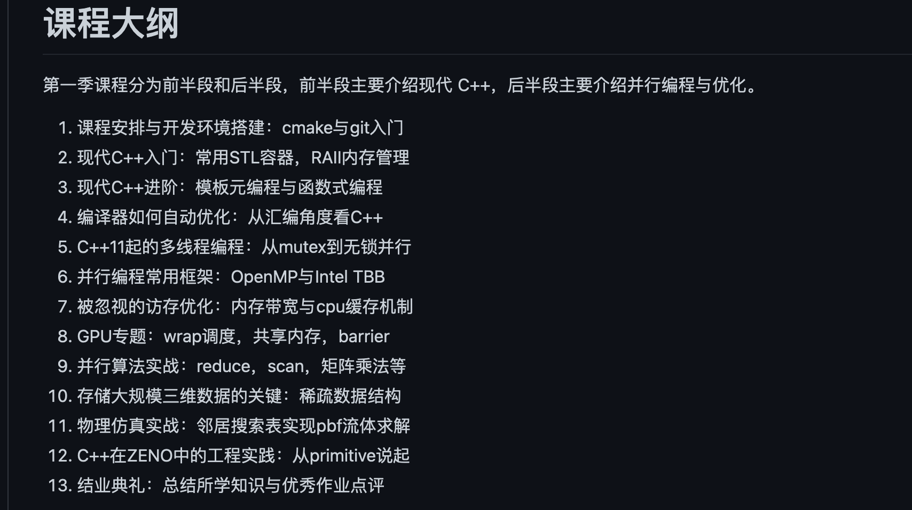

## 现代c++ 教程
高速上手C++ 11/14/17/20
参考链接：

https://zhuanlan.zhihu.com/p/266554398

https://github.com/changkun/modern-cpp-tutorial
## 编码

跨win/linux项目的编码选择和编译选项设置，首选： UTF-8 With BOOM，以下是对编码造成问题的说明

参考链接

 https://github.com/lovepika/thinking_file_encoding_cpp

Visual Studio Code 配置 C/C++ 开发环境的最佳实践(VSCode + Clangd + XMake)

参考链接

 https://zhuanlan.zhihu.com/p/398790625

---

## c++代码调试的艺术

微信读书，讲解了VS2022的调试，以及linux下c++的调试技巧

参考链接: https://weread.qq.com/web/reader/423320c07228f7b6423975a

在VS studio中调试dll的方法(软件调用dll)，可以附加到进程，也可以开启本地调试

参考链接：https://blog.csdn.net/daidi1989/article/details/79916399

在VS studio查看内存的办法

```c++
#可以查看此地址的内存变量，适用于指针数组
（float*）,0xxxx00000,1000
```

---

## c++性能优化

要优化程序执行效率，第一步就是发现执行过程中的热点问题。大多数情况下，需要依靠专门的工具采集信息，并且将性能问题可视化。比如：火焰图、调用链路耗时分布图，cpu cache命中次数，段页切换次数等。
常见工具：gpref，valgrind，profiling(CLion内置，可一键生成火焰图)，SLS（特别适用于分布式场景，强烈推荐），vld，Arthas(阿里出品，Java程序性能分析神器)，apiMonitor，permon(windows自带性能分析工具)

参考链接：http://www.chunel.cn/archives/topic-01-performanceoptimization

---

## C++ DLL导出类 知识大全

普通的导入导出C++类的方式都是使用_declspec(dllexport) /_declspec(dllimport)来导入导出类，但是在公司的开发中我们没有导入导出，而是定义了一些只有纯虚函数的抽象类，然后定义了一个工厂类，将这个工厂类注册到框架的服务中心中，使用时从服务中心拿到这个工厂类，就可以创建Dll中的其它类。

参考链接

https://www.cnblogs.com/lidabo/p/7121745.html

```c++
//2011.10.6//cswuyg//dll导出类//dll跟其使用者共用的头文件
#pragma  once
#ifdef MATUREAPPROACH_EXPORTS
#define MATUREAPPROACH_API __declspec(dllexport)
#else
#define MATUREAPPROACH_API __declspec(dllimport)
#endif
class IExport
{
    public:
    virtual void Hi() = 0;
    virtual void Test() = 0;
    virtual void Release() = 0;
};
extern "C" MATUREAPPROACH_API IExport* _stdcall CreateExportObj();
extern "C" MATUREAPPROACH_API void _stdcall DestroyExportObj(IExport* pExport);
```

```c++
//2011.10.6//cswuyg//dll导出类// 实现类
#pragma once
#include "MatureApproach.h"
class ExportImpl : public IExport
{
    public:    virtual void Hi();
    virtual void Test();
    virtual void Release();
    ~ExportImpl();
    private:
};
```

---

## std::move

在开发过程中，全程传参和赋值中，采用的都是std::move和emplace的传递方式，尽可能的避免出现中间流程无意义copy的情况。

---

## std::unique_ptr

shared_ptr和unique_ptr在反复多次申请和来回赋值的情况下，有一定的性能差距，同时shared_ptr自身内存占用也比unique_ptr大（主要都是因为shared_ptr中的cas校验机制）。很多大型项目，是明文禁止使用shared_ptr的。大家平日写代码的时候，可以注意一下不需要共享所有权时应该使用unique_ptr而不是shared_ptr.
unique_ptr从概念上更简单，动作更加可预见（你知道析构动作什么时候发生）而且更快（不需要隐式维护使用计数）。
如果函数使用shared_ptr管理其内局部分配的对象，但是从来没有返回该智能指针或者将其传递个一个需要shared_ptr&的函数，发出警告。建议使用unique_ptr。

```c++
//反面示例
void f()
 {
     shared_ptr<Base> base = make_shared<Derived>();
     // use base locally, without copying it -- refcount never exceeds 1
 } // destroy base

 //下面的代码更高效
 void f()
 {
     unique_ptr<Base> base = make_unique<Derived>();
     // use base locally
 } // destroy base
```

---

## 模板编程

github 的一个仓库这个可以主要看一下。参考链接： https://github.com/wuye9036/CppTemplateTutorial

小彭老师的课程也可以看一下,看一下模板编程的内容。

B站主页： https://space.bilibili.com/263032155/channel/collectiondetail?sid=53025

github链接： https://github.com/parallel101/course



---

## 设计模式

22种设计模式的C++实现
参考链接：

https://zhuanlan.zhihu.com/p/476220724

另外的比较简洁的代码实现。
参考链接：

https://gitee.com/naoano/design_pattern

常用的设计模式：工厂模式，桥接模式，观察者模式，状态模式。

---

## 多线程

---

## 线程池
