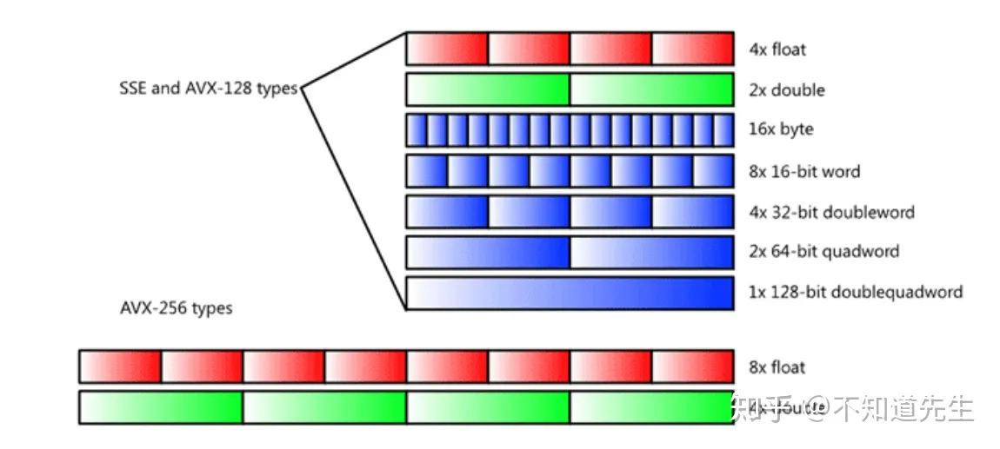

## SMID 指令

单指令流多数据流(SIMD, Single Instruction stream Multiple Data stream)

github 仓库：

https://github.com/xtensor-stack/xsimd

https://github.com/aff3ct/MIPP

参考资料

https://blog.csdn.net/m0_37870649/article/details/132310600

https://zhuanlan.zhihu.com/p/591900754

### 基础概念

位（bit）是计算机内部数据储存的最小单位，11010100是一个8位二进制数。

字节（byte）是计算机中数据处理的基本单位，规定一个字节由八个二进制位构成。1个字节等于8个比特（1Byte=8bit）通常1个字节可以存入一个ASCII码，2个字节可以存放一个汉字国标码。

| 序号	|类型	|存储大小	|值范围|
|-------|------|----------|------|
|1	    |char  |1字节	  |-128到127|
|2	    |unsigned char	|1字节	|0到255|
|3	    |int	|（1）2字节（2）4字节	|（1）-32,728到32,767（2） -2,147,483,648到2,147,483,647|
|4	    |unsigned int	|（1）2字节（2）4字节	|（1）0到65,535（2） 0到4,294,967,295|
|5	    |short	|2字节	|-32,728到32,767|
|6	    |unsigned int	|2字节|	0到65,535|
|7	    |long	|4字节	|-2,147,483,648到2,147,483,647|
|8	    |unsigned long	|4字节	|0到4,294,967,295|
|9	    |long long	|8字节	|-|
|10	    |unsigned long long	|8字节|-|
|11	    |float	|4字节	|1.2E-38到3.4E+38，	6位小数|
|12	    |double	|8字节	|2.3E-308到1.7E+308，15位小数|
|13	    |long double|	16字节|	3.4E-4932到1.1E+4932，	19位小数|

C语言的浮点类型有float、double和long double类型。

C标准规定，float类型必须至少能表示6位有效数字，且取值范围至少是10^-37 ～ 10^+37 。

float类型的格式，1位符号，8位指数，23位小数：

double类型的格式，1位符号，11位指数，52位小数：
### 向量寄存器

SSE 和 AVX 各自有16个寄存器，SSE 的16个寄存器为 XMM0 - XMM15，XMM是128位寄存器，而YMM是256位寄存器。XMM寄存器也可以用于使用类似x86-SSE的单精度值或者双精度值执行标量浮点运算。

支持AVX的x86-64处理器包含16个256位大小的寄存器，名为YMM0 ~ YMM15。每个YMM寄存器的低阶128位的别名是相对应的XMM寄存器。大多数AVX指令可以使用任何一个XMM或者YMM寄存器作为SIMD操作数。

AVX512 将每个AVX SIMD 寄存器的大小从256 位扩展到512位，称为ZMM寄存器；符合AVX512标准的处理器包含32个ZMM寄存器，名为ZMM0 ~ ZMM31。YMM 和 XMM 寄存器分别对应于每个ZMM寄存器的低阶 256 位和 128 位别名。AVX512 处理器还包括八个名为K0~K7的新的操作掩码寄存器；

### 数据类型

SSE 有三种类型定义 __m128, __m128d 和 __m128i，分别用以表示单精度浮点型、双精度浮点型和整型。

AVX/AVX2 有三种类型定义 __m256, __m256d 和 __m256i，分别用以表示单精度浮点型、双精度浮点型和整型。

AVX512 有三种类型定义 __m512, __m512d 和 __512i，分别用以表示单精度浮点型、双精度浮点型和整型。

|数据类型	|描述	|大小|
|-------|-------|--------|
|__m128	|包含4个单精度浮点数的128位向量|	4 x 32 bit|
|__m128d|包含2个双精度浮点数的128位向量|	2 x 64 bit|
|__m128i|包含数个整型数值的128位向量|	128 bit|
|__m256	|包含8个单精度浮点数的256位向量|	8 x 32 bit|
|__m256d|包含4个双精度浮点数的256位向量|	4 x 64 bit|
|__m256i|包含数个整型数值的256位向量|	256 bit|
|__m512	|包含16个单精度浮点数的512位向量|	16 x 32 bit|
|__m512d|包含8个双精度浮点数的512位向量	|8 x 64 bit|
|__m512i|包含数个整型数值的512位向量	|512 bit|

char, short, int, long 均属于整型。


__m128 _mm_set_ps (float e3, float e2, float e1, float e0)

__m256 _mm256_add_pd (__m256 a, __m256 b)

__m512 _mm512_max_epi64 (__m512 a, __m512 b)

return_type, 如 m128、m256 和 m512 代表函数的返回值类型，m128 代表128位的向量，m256代表256位的向量，m512代表512位的向量。

vector_size , 如 mm、mm256 和 mm512 代表函数操作的数据向量的位长度，mm 代表 128 位的数据向量（SSE），mm256 代表256位的数据向量（AVX 和 AVX2）, mm512 代表512位的数据向量。

intrin_op，如 set、add 和 max 非常直观的解释函数功能。函数基础功能可以分为数值计算、数据传输、比较和转型四种，参阅 Intel Intrinsics Guide 和 x86 Intrinsics Cheat Sheet。

suffix, 如ps、pd、epi64代表函数参数的数据类型，其中 p = packed，s = 单精度浮点数，d = 双精度浮点数，ep

ps: 由float类型数据组成的向量

pd:由double类型数据组成的向量

epi8/epi16/epi32/epi64: 由8位/16位/32位/64位的有符号整数组成的向量

epu8/epu16/epu32/epu64: 包含8位/16位/32位/64位的无符号整数组成的向量

si128/si256: 未指定的128位或者256位向量
```c++
#include <iostream>

#ifdef __AVX__
  #include <immintrin.h>
#else
  #warning No AVX support - will not compile
#endif

int main(int argc, char **argv)
{
    __m256 a = _mm256_set_ps(8.0, 7.0, 6.0, 5.0,
                             4.0, 3.0, 2.0, 1.0);
    __m256 b = _mm256_set_ps(18.0, 17.0, 16.0, 15.0,
                             14.0, 13.0, 12.0, 11.0);
    __m256 c = _mm256_add_ps(a, b);

    float d[8];
    _mm256_storeu_ps(d, c);

    std::cout << "result equals " << d[0] << "," << d[1]
              << "," << d[2] << "," << d[3] << ","
              << d[4] << "," << d[5] << "," << d[6] << ","
              << d[7] << std::endl;

    return 0;
}

```
AVX256位寄存器与SSE128位寄存器的关系



SSE/AVX指令主要定义于以下一些头文件中：

    <xmmintrin.h> : SSE, 支持同时对4个32位单精度浮点数的操作。
    <emmintrin.h> : SSE 2, 支持同时对2个64位双精度浮点数的操作。
    <pmmintrin.h> : SSE 3, 支持对SIMD寄存器的水平操作(horizontal operation)，如hadd, hsub等...。
    <tmmintrin.h> : SSSE 3, 增加了额外的instructions。
    <smmintrin.h> : SSE 4.1, 支持点乘以及更多的整形操作。
    <nmmintrin.h> : SSE 4.2, 增加了额外的instructions。
    <immintrin.h> : AVX, 支持同时操作8个单精度浮点数或4个双精度浮点数。

每一个头文件都包含了之前的所有头文件，所以如果你想要使用SSE4.2以及之前SSE3, SSE2, SSE中的所有函数就只需要包含<nmmintrin.h>头文件。

## 资料

GPU编程  谭升的博客

https://face2ai.com/program-blog/#GPU%E7%BC%96%E7%A8%8B%EF%BC%88CUDA%EF%BC%89

博客园，苹果妖

https://www.cnblogs.com/1024incn/category/695134.html

CSDN cuda并行编程，主要介绍了一些并行策略，并行方式

https://blog.csdn.net/sunmc1204953974/category_6156113.html

https://blog.csdn.net/langb2014/category_6219832.html

cuda 内存访问，知乎

https://zhuanlan.zhihu.com/p/632244210

nvprof工具的使用

https://zhuanlan.zhihu.com/p/595136588

nsight systems 使用

https://blog.csdn.net/HaoZiHuang/article/details/121885850

https://blog.csdn.net/NXHYD/article/details/112915968

https://thnum.blog.csdn.net/article/details/109952643


《CUDA C 编程指南》

https://zhuanlan.zhihu.com/p/53773183

资源小集合

https://zhuanlan.zhihu.com/p/346910129
## 常用命令

```bash
//代码简单时，编译器会进行优化
nvprof --metrics branch_efficiency

// 每个SM在每个cycle能够达到的最大active warp数目占总warp的比例
nvprof --metrics achieved_occupancy

//带宽  全局内存加载事务数
nvprof --metrics gld_throughput

//带宽比值
nvprof --metrics gld_efficiency


nvprof --metrics gst_efficiency

//每个warp上执行的指令数目的平均值
nvprof --metrics inst_per_warp

//同一个thread中如果能有更多的独立的load/store操作
nvprof --metrics dram_read_throughput


//用来验证由于__syncthreads导致更少的warp
nvprof --metrics stall_sync

//图表
nvvp

//设备 主机 调用情况
nvprof

//
nvprof --devices 0 --metrics gld_efficiency

//全局内存存储事务数
nvprof --devices 0 --metrics gld_efficiency --metrics gst_efficiency

nvprof --devices 0 --metrics gld_efficiency,gst_efficiency

//功能被转移到ncu了
ncu --metrics
```

