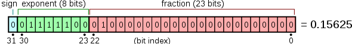
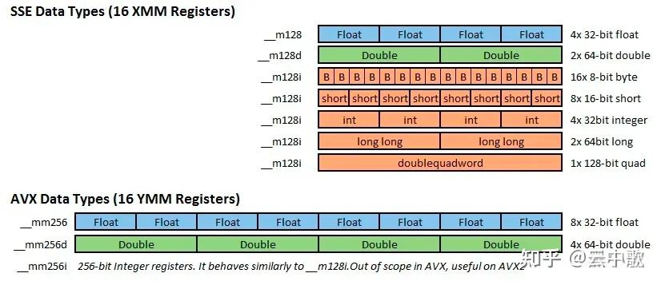

## SMID 指令

单指令流多数据流(SIMD, Single Instruction stream Multiple Data stream)

github 仓库：

https://github.com/xtensor-stack/xsimd

https://github.com/aff3ct/MIPP

参考资料

https://blog.csdn.net/m0_37870649/article/details/132310600

https://zhuanlan.zhihu.com/p/591900754

### 基础概念

位（bit）是计算机内部数据储存的最小单位，11010100是一个8位二进制数。

字节（byte）是计算机中数据处理的基本单位，规定一个字节由八个二进制位构成。1个字节等于8个比特（1Byte=8bit）通常1个字节可以存入一个ASCII码，2个字节可以存放一个汉字国标码。

| 序号	|类型	|存储大小	|值范围|
|-------|------|----------|------|
|1	    |char  |1字节	  |-128到127|
|2	    |unsigned char	|1字节	|0到255|
|3	    |int	|（1）2字节（2）4字节	|（1）-32,728到32,767（2） -2,147,483,648到2,147,483,647|
|4	    |unsigned int	|（1）2字节（2）4字节	|（1）0到65,535（2） 0到4,294,967,295|
|5	    |short	|2字节	|-32,728到32,767|
|6	    |unsigned int	|2字节|	0到65,535|
|7	    |long	|4字节	|-2,147,483,648到2,147,483,647|
|8	    |unsigned long	|4字节	|0到4,294,967,295|
|9	    |long long	|8字节	|-|
|10	    |unsigned long long	|8字节|-|
|11	    |float	|4字节	|1.2E-38到3.4E+38，	6位小数|
|12	    |double	|8字节	|2.3E-308到1.7E+308，15位小数|
|13	    |long double|	16字节|	3.4E-4932到1.1E+4932，	19位小数|

C语言的浮点类型有float、double和long double类型。

C标准规定，float类型必须至少能表示6位有效数字，且取值范围至少是10^-37 ～ 10^+37 。

float类型的格式，1位符号，8位指数，23位小数：



double类型的格式，1位符号，11位指数，52位小数：

### 向量寄存器

SSE 和 AVX 各自有16个寄存器，SSE 的16个寄存器为 XMM0 - XMM15，XMM是128位寄存器，而YMM是256位寄存器。XMM寄存器也可以用于使用类似x86-SSE的单精度值或者双精度值执行标量浮点运算。

支持AVX的x86-64处理器包含16个256位大小的寄存器，名为YMM0 ~ YMM15。每个YMM寄存器的低阶128位的别名是相对应的XMM寄存器。大多数AVX指令可以使用任何一个XMM或者YMM寄存器作为SIMD操作数。

AVX512 将每个AVX SIMD 寄存器的大小从256 位扩展到512位，称为ZMM寄存器；符合AVX512标准的处理器包含32个ZMM寄存器，名为ZMM0 ~ ZMM31。YMM 和 XMM 寄存器分别对应于每个ZMM寄存器的低阶 256 位和 128 位别名。AVX512 处理器还包括八个名为K0~K7的新的操作掩码寄存器；

### 数据类型

SSE 有三种类型定义 __m128, __m128d 和 __m128i，分别用以表示单精度浮点型、双精度浮点型和整型。

AVX/AVX2 有三种类型定义 __m256, __m256d 和 __m256i，分别用以表示单精度浮点型、双精度浮点型和整型。

AVX512 有三种类型定义 __m512, __m512d 和 __512i，分别用以表示单精度浮点型、双精度浮点型和整型。

|数据类型	|描述	|大小|
|-------|-------|--------|
|__m128	|包含4个单精度浮点数的128位向量|	4 x 32 bit|
|__m128d|包含2个双精度浮点数的128位向量|	2 x 64 bit|
|__m128i|包含数个整型数值的128位向量|	128 bit|
|__m256	|包含8个单精度浮点数的256位向量|	8 x 32 bit|
|__m256d|包含4个双精度浮点数的256位向量|	4 x 64 bit|
|__m256i|包含数个整型数值的256位向量|	256 bit|
|__m512	|包含16个单精度浮点数的512位向量|	16 x 32 bit|
|__m512d|包含8个双精度浮点数的512位向量	|8 x 64 bit|
|__m512i|包含数个整型数值的512位向量	|512 bit|

char, short, int, long 均属于整型。


__m128 _mm_set_ps (float e3, float e2, float e1, float e0)

__m256 _mm256_add_pd (__m256 a, __m256 b)

__m512 _mm512_max_epi64 (__m512 a, __m512 b)

return_type, 如 m128、m256 和 m512 代表函数的返回值类型，m128 代表128位的向量，m256代表256位的向量，m512代表512位的向量。

vector_size , 如 mm、mm256 和 mm512 代表函数操作的数据向量的位长度，mm 代表 128 位的数据向量（SSE），mm256 代表256位的数据向量（AVX 和 AVX2）, mm512 代表512位的数据向量。

intrin_op，如 set、add 和 max 非常直观的解释函数功能。函数基础功能可以分为数值计算、数据传输、比较和转型四种，参阅 Intel Intrinsics Guide 和 x86 Intrinsics Cheat Sheet。

suffix, 如ps、pd、epi64代表函数参数的数据类型，其中 p = packed，s = 单精度浮点数，d = 双精度浮点数，ep

ps: 由float类型数据组成的向量

pd:由double类型数据组成的向量

epi8/epi16/epi32/epi64: 由8位/16位/32位/64位的有符号整数组成的向量

epu8/epu16/epu32/epu64: 包含8位/16位/32位/64位的无符号整数组成的向量

si128/si256: 未指定的128位或者256位向量
```c++
#include <iostream>

#ifdef __AVX__
  #include <immintrin.h>
#else
  #warning No AVX support - will not compile
#endif

int main(int argc, char **argv)
{
    __m256 a = _mm256_set_ps(8.0, 7.0, 6.0, 5.0,
                             4.0, 3.0, 2.0, 1.0);
    __m256 b = _mm256_set_ps(18.0, 17.0, 16.0, 15.0,
                             14.0, 13.0, 12.0, 11.0);
    __m256 c = _mm256_add_ps(a, b);

    float d[8];
    _mm256_storeu_ps(d, c);

    std::cout << "result equals " << d[0] << "," << d[1]
              << "," << d[2] << "," << d[3] << ","
              << d[4] << "," << d[5] << "," << d[6] << ","
              << d[7] << std::endl;

    return 0;
}

```
AVX256位寄存器与SSE128位寄存器的关系


SSE/AVX指令主要定义于以下一些头文件中：

    <xmmintrin.h> : SSE, 支持同时对4个32位单精度浮点数的操作。
    <emmintrin.h> : SSE 2, 支持同时对2个64位双精度浮点数的操作。
    <pmmintrin.h> : SSE 3, 支持对SIMD寄存器的水平操作(horizontal operation)，如hadd, hsub等...。
    <tmmintrin.h> : SSSE 3, 增加了额外的instructions。
    <smmintrin.h> : SSE 4.1, 支持点乘以及更多的整形操作。
    <nmmintrin.h> : SSE 4.2, 增加了额外的instructions。
    <immintrin.h> : AVX, 支持同时操作8个单精度浮点数或4个双精度浮点数。

每一个头文件都包含了之前的所有头文件，所以如果你想要使用SSE4.2以及之前SSE3, SSE2, SSE中的所有函数就只需要包含<nmmintrin.h>头文件。


### MIPP 使用
编译选项
```lua
--如果当前平台是arm平台
if is_arch("armv7") then
    add_cxxflags("-mfpu=neon")
elseif is_arch("armv8") then
    add_cxxflags("-march=native")
else
    add_cxxflags("-march=native")
end


-- 另外一种写法
if is_arch("arm.*") then
    add_cxxflags("-mfpu=neon")
else
    add_cxxflags("-march=native")
    --# SSE only
    --add_cxxflags("-msse -msse2 -msse3 -msse4 -mssse3")
end
```
```c++

//矢量寄存器声明,只需使用 mipp::Reg<T> 类型。mipp::Reg<T> r1, r2, r3;
/*
我们不知道这里每个寄存器的元素数。这个数字 元素可以通过调用 mipp::N<T>() 函数 （ T 是一个 template 参数，它可以是 double， float， int64_t， uint64_t， int32_t， uint32_t， int16_t， uint16_t， int8_t 或 uint8_t 类型）。

运算支持 加减乘除 与或非，开平方，排序，比较，蒙版 选择，左旋右旋等

*/
#include <cstdlib> // rand()
#include "mipp.h"

int main()
{
	// data allocation
	const int n = 32000; // size of the vA, vB, vC vectors
	mipp::vector<float> vA(n); // in
	mipp::vector<float> vB(n); // in
	mipp::vector<float> vC(n); // out

	// data initialization
	for (int i = 0; i < n; i++) vA[i] = rand() % 10;
	for (int i = 0; i < n; i++) vB[i] = rand() % 10;

	// declare 3 vector registers
	mipp::Reg<float> rA, rB, rC;

	// compute rC with the MIPP vectorized functions
	for (int i = 0; i < n; i += mipp::N<float>()) {
		rA.load(&vA[i]); // unaligned load by default (use the -DMIPP_ALIGNED_LOADS
		rB.load(&vB[i]); // macro definition to force aligned loads and stores).
		rC = rA + rB;
		rC.store(&vC[i]);
	}

	return 0;
}


////已有的vector
// ...
// compute the vectorized loop size which is a multiple of 'mipp::N<float>()'.
auto vecLoopSize = (n / mipp::N<float>()) * mipp::N<float>();
mipp::Reg<float> rout, rin1, rin2;
for (int i = 0; i < vecLoopSize; i += mipp::N<float>()) {
	rin1.load(&in1[i]); // unaligned load by default (use the -DMIPP_ALIGNED_LOADS
	rin2.load(&in2[i]); // macro definition to force aligned loads and stores).
	// the '0.75f' constant will be broadcast in a vector but it has to be at
	// the right of a 'mipp::Reg<T>', this is why it has been moved at the right
	// of the 'rin1' register. Notice that 'std::exp' has been replaced by
	// 'mipp::exp'.
	rout = rin1 * 0.75f * mipp::exp(rin2);
	rout.store(&out[i]);
}

// scalar tail loop: compute the remaining elements that can't be vectorized.
for (int i = vecLoopSize; i < n; i++) {
	out[i] = 0.75f * in1[i] * std::exp(in2[i]);
}
// ...
```
## CUDA
### 资料

GPU编程  谭升的博客

https://face2ai.com/program-blog/#GPU%E7%BC%96%E7%A8%8B%EF%BC%88CUDA%EF%BC%89

博客园，苹果妖

https://www.cnblogs.com/1024incn/category/695134.html

CSDN cuda并行编程，主要介绍了一些并行策略，并行方式

https://blog.csdn.net/sunmc1204953974/category_6156113.html

https://blog.csdn.net/langb2014/category_6219832.html

cuda 内存访问，知乎

https://zhuanlan.zhihu.com/p/632244210

nvprof工具的使用

https://zhuanlan.zhihu.com/p/595136588

nsight systems 使用

https://blog.csdn.net/HaoZiHuang/article/details/121885850

https://blog.csdn.net/NXHYD/article/details/112915968

https://thnum.blog.csdn.net/article/details/109952643


《CUDA C 编程指南》

https://zhuanlan.zhihu.com/p/53773183

资源小集合

https://zhuanlan.zhihu.com/p/346910129

### 常用命令

```bash
//代码简单时，编译器会进行优化
nvprof --metrics branch_efficiency

// 每个SM在每个cycle能够达到的最大active warp数目占总warp的比例
nvprof --metrics achieved_occupancy

//带宽  全局内存加载事务数
nvprof --metrics gld_throughput

//带宽比值
nvprof --metrics gld_efficiency


nvprof --metrics gst_efficiency

//每个warp上执行的指令数目的平均值
nvprof --metrics inst_per_warp

//同一个thread中如果能有更多的独立的load/store操作
nvprof --metrics dram_read_throughput


//用来验证由于__syncthreads导致更少的warp
nvprof --metrics stall_sync

//图表
nvvp

//设备 主机 调用情况
nvprof

//
nvprof --devices 0 --metrics gld_efficiency

//全局内存存储事务数
nvprof --devices 0 --metrics gld_efficiency --metrics gst_efficiency

nvprof --devices 0 --metrics gld_efficiency,gst_efficiency

//功能被转移到ncu了
ncu --metrics
```

### 理论

#### grid与block

#### 内存

全局内存

```c++
//全局声明
__device__ float devData;
// initialize the global variable
float value = 3.14f;
CHECK(cudaMemcpyToSymbol(devData, &value, sizeof(float)));
// invoke the kernel
checkGlobalVariable<<<1, 1>>>();
// copy the global variable back to the host
CHECK(cudaMemcpyFromSymbol(&value, devData, sizeof(float)));
```

静态共享内存

```c++
__global__ void setColReadCol(int *out)
{
    // static shared memory
    __shared__ int tile[BDIMX][BDIMY];
    // mapping from thread index to global memory index
    unsigned int idx = threadIdx.y * blockDim.x + threadIdx.x;
    // shared memory store operation
    tile[threadIdx.x][threadIdx.y] = idx;
    // wait for all threads to complete
    __syncthreads();
    // shared memory load operation
    out[idx] = tile[threadIdx.x][threadIdx.y];
}

//核函数调用
setColReadCol<<<grid, block>>>(d_C);
```

动态共享内存

```c++
__global__ void setRowReadColDyn(int *out)
{
    // dynamic shared memory
    extern  __shared__ int tile[];
    // mapping from thread index to global memory index
    unsigned int idx = threadIdx.y * blockDim.x + threadIdx.x;
    // convert idx to transposed (row, col)
    unsigned int irow = idx / blockDim.y;
    unsigned int icol = idx % blockDim.y;
    // convert back to smem idx to access the transposed element
    unsigned int col_idx = icol * blockDim.x + irow;
    // shared memory store operation
    tile[idx] = idx;
    // wait for all threads to complete
    __syncthreads();
    // shared memory load operation
    out[idx] = tile[col_idx];
}

//核函数调用，第三个参数是动态共享内存的大小
setRowReadColDyn<<<grid, block, BDIMX*BDIMY*sizeof(int)>>>(d_C);
```

常量内存

```c++
#define RADIUS 4
#define BDIM 32
// constant memory
__constant__ float coef[RADIUS + 1];

// FD coeffecient
#define a0     0.00000f
#define a1     0.80000f
#define a2    -0.20000f
#define a3     0.03809f
#define a4    -0.00357f
//设置常量内存
void setup_coef_constant (void)
{
    const float h_coef[] = {a0, a1, a2, a3, a4};
    CHECK(cudaMemcpyToSymbol( coef, h_coef, (RADIUS + 1) * sizeof(float)));
}

```
#### 复制方式

申请的方式

cudaMalloc：   普通内存的时候有在使用

cudaFree：     普通内存的时候有在使用

cudaMallocHost：锁页内存的时候有在使用

cudaFreeHost：  锁页内存的时候有在使用

cudaMallocManaged:   nvidia自己管理内存的时候使用

cudaMemcpyToSymbol：全局内存与常量内存的时候有在使用

cudaHostAlloc：    零拷贝内存的时候有在使用

cudaMemcpy的方向：

cudaMemcpyHostToDevice： 主机到设备

cudaMemcpyDeviceToHost： 设备到主机

cudaHostAllocMapped： 零拷贝内存的时候有在使用


从主机到设备，设备到主机

```c++
float *h_a = (float *)malloc(nbytes);
float *d_a;
CHECK(cudaMalloc((float **)&d_a, nbytes));
for(unsigned int i = 0; i < isize; i++) h_a[i] = 0.5f;
CHECK(cudaMemcpy(d_a, h_a, nbytes, cudaMemcpyHostToDevice));
CHECK(cudaMemcpy(h_a, d_a, nbytes, cudaMemcpyDeviceToHost));
CHECK(cudaFree(d_a));
free(h_a);
```


锁页内存

```c++
//查询是否支持锁页内存
cudaDeviceProp deviceProp;
CHECK(cudaGetDeviceProperties(&deviceProp, dev));
if (!deviceProp.canMapHostMemory)
{
    printf("Device %d does not support mapping CPU host memory!\n", dev);
    CHECK(cudaDeviceReset());
    exit(EXIT_SUCCESS);
}

printf("%s starting at ", argv[0]);
printf("device %d: %s memory size %d nbyte %5.2fMB canMap %d\n", dev,
        deviceProp.name, isize, nbytes / (1024.0f * 1024.0f),
        deviceProp.canMapHostMemory);

// allocate pinned host memory
float *h_a;
CHECK(cudaMallocHost ((float **)&h_a, nbytes));
// allocate device memory
float *d_a;
CHECK(cudaMalloc((float **)&d_a, nbytes));
// initialize host memory
memset(h_a, 0, nbytes);
for (int i = 0; i < isize; i++) h_a[i] = 100.10f;
// transfer data from the host to the device
CHECK(cudaMemcpy(d_a, h_a, nbytes, cudaMemcpyHostToDevice));
// transfer data from the device to the host
CHECK(cudaMemcpy(h_a, d_a, nbytes, cudaMemcpyDeviceToHost));
// free memory
CHECK(cudaFree(d_a));
CHECK(cudaFreeHost(h_a));
```

零拷贝复制

```c++
float *h_A, *h_B;
float *d_A, *d_B;
CHECK(cudaHostAlloc((void **)&h_A, nBytes, cudaHostAllocMapped));
CHECK(cudaHostAlloc((void **)&h_B, nBytes, cudaHostAllocMapped));
// initialize data at host side
initialData(h_A, nElem);
initialData(h_B, nElem);
memset(hostRef, 0, nBytes);
memset(gpuRef,  0, nBytes);
// pass the pointer to device
//相当于将指针给了设备的数据
CHECK(cudaHostGetDevicePointer((void **)&d_A, (void *)h_A, 0));
CHECK(cudaHostGetDevicePointer((void **)&d_B, (void *)h_B, 0));
// execute kernel with zero copy memory
sumArraysZeroCopy<<<grid, block>>>(d_A, d_B, d_C, nElem);
// copy kernel result back to host side
CHECK(cudaMemcpy(gpuRef, d_C, nBytes, cudaMemcpyDeviceToHost));
CHECK(cudaFree(d_C));
CHECK(cudaFreeHost(h_A));
CHECK(cudaFreeHost(h_B));
```

cudaMallocManaged管理内存

```c++

// malloc host memory
float *A, *B, *hostRef, *gpuRef;
CHECK(cudaMallocManaged((void **)&A, nBytes));
CHECK(cudaMallocManaged((void **)&B, nBytes));
CHECK(cudaMallocManaged((void **)&gpuRef,  nBytes);  );
CHECK(cudaMallocManaged((void **)&hostRef, nBytes););

// initialize data at host side
initialData(A, nxy);
initialData(B, nxy);
memset(hostRef, 0, nBytes);
//invoke kernel func
sumMatrixGPU<<<grid, block>>>(A, B, gpuRef, nx, ny);

// free device global memory
CHECK(cudaFree(A));
CHECK(cudaFree(B));
CHECK(cudaFree(hostRef));
CHECK(cudaFree(gpuRef));
```


#### 同步

同步主要可以通过流与事件同步

```c++
//在主机端同步函数
CHECK(cudaDeviceSynchronize());
//在设备端同步的函数
// synchronize within threadblock
__syncthreads();
```

使用流来同步

```c++
cudaStreamSynchronize()
```

```c++
//回调函数
void CUDART_CB my_callback(cudaStream_t stream, cudaError_t status, void *data)
{
    printf("callback from stream %d\n", *((int *)data));
}

//主函数里面，
// Allocate and initialize an array of stream handles
int n_streams=4;
//流数组
cudaStream_t *streams = (cudaStream_t *) malloc(n_streams * sizeof(cudaStream_t));
//流在创建的时候可以指定优先级
for (int i = 0 ; i < n_streams ; i++)
{
    CHECK(cudaStreamCreate(&(streams[i])));
}

dim3 block (1);
dim3 grid  (1);
//事件
cudaEvent_t start_event, stop_event;
CHECK(cudaEventCreate(&start_event));
CHECK(cudaEventCreate(&stop_event));

int stream_ids[n_streams];

CHECK(cudaEventRecord(start_event, 0));

for (int i = 0; i < n_streams; i++)
{
    stream_ids[i] = i;
    kernel_1<<<grid, block, 0, streams[i]>>>();
    kernel_2<<<grid, block, 0, streams[i]>>>();
    kernel_3<<<grid, block, 0, streams[i]>>>();
    kernel_4<<<grid, block, 0, streams[i]>>>();
    //第三个参数是回调函数的参数
    CHECK(cudaStreamAddCallback(streams[i], my_callback,(void *)(stream_ids + i), 0));
}
CHECK(cudaEventRecord(stop_event, 0));
CHECK(cudaEventSynchronize(stop_event));
float elapsed_time;
CHECK(cudaEventElapsedTime(&elapsed_time, start_event, stop_event));

 // release all stream
for (int i = 0 ; i < n_streams ; i++)
{
    CHECK(cudaStreamDestroy(streams[i]));
}
free(streams);

// destroy events
CHECK(cudaEventDestroy(start_event));
CHECK(cudaEventDestroy(stop_event));
```

事件同步

```c++
 // Allocate and initialize an array of stream handles
int n_streams=4;
cudaStream_t *streams = (cudaStream_t *) malloc(n_streams * sizeof(cudaStream_t));
for (int i = 0 ; i < n_streams ; i++)
{
    CHECK(cudaStreamCreate(&(streams[i])));
}

 // creat events
cudaEvent_t start, stop;
CHECK(cudaEventCreate(&start));
CHECK(cudaEventCreate(&stop));

cudaEvent_t *kernelEvent;
kernelEvent = (cudaEvent_t *) malloc(n_streams * sizeof(cudaEvent_t));
for (int i = 0; i < n_streams; i++)
{
    CHECK(cudaEventCreateWithFlags(&(kernelEvent[i]),cudaEventDisableTiming));
}

 // record start event
CHECK(cudaEventRecord(start, 0));

// dispatch job with depth first ordering
for (int i = 0; i < n_streams; i++)
{
    kernel_1<<<grid, block, 0, streams[i]>>>();
    kernel_2<<<grid, block, 0, streams[i]>>>();
    kernel_3<<<grid, block, 0, streams[i]>>>();
    kernel_4<<<grid, block, 0, streams[i]>>>();

    CHECK(cudaEventRecord(kernelEvent[i], streams[i]));
    //在最后一个流中插入其他流的事件，最后一个流必须等到其他流的事件执行之后才开始执行
    CHECK(cudaStreamWaitEvent(streams[n_streams - 1], kernelEvent[i], 0));
}

// record stop event
CHECK(cudaEventRecord(stop, 0));
//阻塞stop
CHECK(cudaEventSynchronize(stop));

// calculate elapsed time
CHECK(cudaEventElapsedTime(&elapsed_time, start, stop));
printf("Measured time for parallel execution = %.3fs\n",elapsed_time / 1000.0f);
// release all stream
for (int i = 0 ; i < n_streams ; i++)
{
    CHECK(cudaStreamDestroy(streams[i]));
    CHECK(cudaEventDestroy(kernelEvent[i]));
}
free(streams);
free(kernelEvent);

```

#### 计时

使用事件计时

```c++
cudaEvent_t     start, stop;
cudaEventCreate( &start );
cudaEventCreate( &stop ) ;
cudaEventRecord( start, 0 ) ;

//在GPU上执行的一些操作

cudaEventRecord( stop, 0 ) ;
//很幸运，有一种事件API函数，告诉CPU在某个事件上同步
cudaEventSynchronize( stop );

float   elapsedTime;
cudaEventElapsedTime( &elapsedTime,start, stop ) );
printf( "Time to generate:  %3.1f ms\n", elapsedTime );

cudaEventDestroy( start );
cudaEventDestroy( stop );

```

#### 优化案列

memory padding


### 代码

common.h 获取错误信息

```c++
 /**
 * @FilePath     : /cuda-learn/src/common/common.h
 * @Description  :
 * @Author       : naonao 1319144981@qq.com
 * @Version      : 0.0.1
 * @LastEditors  : naonao 1319144981@qq.com
 * @LastEditTime : 2024-02-27 17:34:56
 * @Copyright    : G AUTOMOBILE RESEARCH INSTITUTE CO.,LTD Copyright (c) 2024.
 **/

#ifndef COMMON_COMMON_H
#define COMMON_COMMON_H

#define CHECK(call)                                                \
    {                                                              \
        const cudaError_t error = call;                            \
        if (error != cudaSuccess) {                                \
            fprintf(stderr, "Error: %s:%d, ", __FILE__, __LINE__); \
            fprintf(stderr, "code: %d, reason: %s\n", error,       \
                cudaGetErrorString(error));                        \
        }                                                          \
    }

#define CHECK_CUBLAS(call)                                                   \
    {                                                                        \
        cublasStatus_t err;                                                  \
        if ((err = (call)) != CUBLAS_STATUS_SUCCESS) {                       \
            fprintf(stderr, "Got CUBLAS error %d at %s:%d\n", err, __FILE__, \
                __LINE__);                                                   \
            exit(1);                                                         \
        }                                                                    \
    }

#define CHECK_CURAND(call)                                                   \
    {                                                                        \
        curandStatus_t err;                                                  \
        if ((err = (call)) != CURAND_STATUS_SUCCESS) {                       \
            fprintf(stderr, "Got CURAND error %d at %s:%d\n", err, __FILE__, \
                __LINE__);                                                   \
            exit(1);                                                         \
        }                                                                    \
    }

#define CHECK_CUFFT(call)                                                   \
    {                                                                       \
        cufftResult err;                                                    \
        if ((err = (call)) != CUFFT_SUCCESS) {                              \
            fprintf(stderr, "Got CUFFT error %d at %s:%d\n", err, __FILE__, \
                __LINE__);                                                  \
            exit(1);                                                        \
        }                                                                   \
    }

#define CHECK_CUSPARSE(call)                                                     \
    {                                                                            \
        cusparseStatus_t err;                                                    \
        if ((err = (call)) != CUSPARSE_STATUS_SUCCESS) {                         \
            fprintf(stderr, "Got error %d at %s:%d\n", err, __FILE__, __LINE__); \
            cudaError_t cuda_err = cudaGetLastError();                           \
            if (cuda_err != cudaSuccess) {                                       \
                fprintf(stderr, "  CUDA error \"%s\" also detected\n",           \
                    cudaGetErrorString(cuda_err));                               \
            }                                                                    \
            exit(1);                                                             \
        }                                                                        \
    }

#include <chrono>
#include <iostream>
#include <string>
#define TICK(x) auto bench_##x = std::chrono::high_resolution_clock::now();
#define TOCK(x) std::cout << #x ": " << std::chrono::duration_cast<std::chrono::microseconds>(std::chrono::high_resolution_clock::now() - bench_##x).count() << "us" << std::endl;
inline double seconds(void)
{
    auto epoch_time = std::chrono::system_clock::now().time_since_epoch();
    auto ret = std::chrono::duration_cast<std::chrono::microseconds>(epoch_time).count();
    return ret;
}
#endif
```

check_device_info.cuh, 获取cuda设备信息
```c++
//check_device_info.cuh
#include "../common/common.h"
#include <cuda_runtime.h>
#include <stdio.h>
/*
 * Display a variety of information on the first CUDA device in this system,
 * including driver version, runtime version, compute capability, bytes of
 * global memory, etc.
 */
int get_device_info();
/*
 * Display the dimensionality of a thread block and grid from the host and
 * device.
 */
void check_dimensions() ;
/*
 * This example helps to visualize the relationship between thread/block IDs and
 * offsets into data. For each CUDA thread, this example displays the
 * intra-block thread ID, the inter-block block ID, the global coordinate of a
 * thread, the calculated offset into input data, and the input data at that
 * offset.
 */
 void check_thread_idx();
 /*
 * Demonstrate defining the dimensions of a block of threads and a grid of
 * blocks from the host.
 */
 void def_grid_block();

//check_device_info.cu
#include "./check_device_info.cuh"
int get_device_info()
{
    int deviceCount = 0;
    cudaGetDeviceCount(&deviceCount);

    if (deviceCount == 0)
    {
        printf("There are no available device(s) that support CUDA\n");
    }
    else
    {
        printf("Detected %d CUDA Capable device(s)\n", deviceCount);
    }


    int dev = 0, driverVersion = 0, runtimeVersion = 0;
    CHECK(cudaSetDevice(dev));
    cudaDeviceProp deviceProp;
    CHECK(cudaGetDeviceProperties(&deviceProp, dev));
    printf("Device %d: \"%s\"\n", dev, deviceProp.name);

    cudaDriverGetVersion(&driverVersion);
    cudaRuntimeGetVersion(&runtimeVersion);
    printf("  CUDA Driver Version / Runtime Version          %d.%d / %d.%d\n",driverVersion / 1000, (driverVersion % 100) / 10,runtimeVersion / 1000, (runtimeVersion % 100) / 10);
    printf("  CUDA Capability Major/Minor version number:    %d.%d\n",deviceProp.major, deviceProp.minor);
    printf("  Total amount of global memory:                 %.2f MBytes (%llu ""bytes)\n", (float)deviceProp.totalGlobalMem / pow(1024.0, 3),(unsigned long long)deviceProp.totalGlobalMem);
    printf("  GPU Clock rate:                                %.0f MHz (%0.2f ""GHz)\n", deviceProp.clockRate * 1e-3f,deviceProp.clockRate * 1e-6f);
    printf("  Memory Clock rate:                             %.0f Mhz\n",deviceProp.memoryClockRate * 1e-3f);
    printf("  Memory Bus Width:                              %d-bit\n",deviceProp.memoryBusWidth);

    if (deviceProp.l2CacheSize)
    {
        printf("  L2 Cache Size:                                 %d bytes\n",deviceProp.l2CacheSize);
    }

    printf("  Max Texture Dimension Size (x,y,z)             1D=(%d), ""2D=(%d,%d), 3D=(%d,%d,%d)\n", deviceProp.maxTexture1D,deviceProp.maxTexture2D[0], deviceProp.maxTexture2D[1],
           deviceProp.maxTexture3D[0], deviceProp.maxTexture3D[1],
           deviceProp.maxTexture3D[2]);
    printf("  Max Layered Texture Size (dim) x layers        1D=(%d) x %d, ""2D=(%d,%d) x %d\n", deviceProp.maxTexture1DLayered[0],deviceProp.maxTexture1DLayered[1], deviceProp.maxTexture2DLayered[0],
           deviceProp.maxTexture2DLayered[1],
           deviceProp.maxTexture2DLayered[2]);
    printf("  Total amount of constant memory:               %lu bytes\n",deviceProp.totalConstMem);
    printf("  Total amount of shared memory per block:       %lu bytes\n",deviceProp.sharedMemPerBlock);
    printf("  Total number of registers available per block: %d\n",deviceProp.regsPerBlock);
    printf("  Warp size:                                     %d\n",deviceProp.warpSize);
    printf("  Maximum number of threads per multiprocessor:  %d\n",deviceProp.maxThreadsPerMultiProcessor);
    printf("  Maximum number of threads per block:           %d\n",deviceProp.maxThreadsPerBlock);
    printf("  Maximum sizes of each dimension of a block:    %d x %d x %d\n",deviceProp.maxThreadsDim[0],deviceProp.maxThreadsDim[1],deviceProp.maxThreadsDim[2]);
    printf("  Maximum sizes of each dimension of a grid:     %d x %d x %d\n",
           deviceProp.maxGridSize[0],
           deviceProp.maxGridSize[1],
           deviceProp.maxGridSize[2]);
    printf("  Maximum memory pitch:                          %lu bytes\n",deviceProp.memPitch);
    exit(EXIT_SUCCESS);
}

__global__ void checkIndex(void)
{
    printf("threadIdx:(%d, %d, %d)\n", threadIdx.x, threadIdx.y, threadIdx.z);
    printf("blockIdx:(%d, %d, %d)\n", blockIdx.x, blockIdx.y, blockIdx.z);
    printf("blockDim:(%d, %d, %d)\n", blockDim.x, blockDim.y, blockDim.z);
    printf("gridDim:(%d, %d, %d)\n", gridDim.x, gridDim.y, gridDim.z);
}

void check_dimensions() {
    int nElem = 6;
    // define grid and block structure
    dim3 block(3);
    dim3 grid((nElem + block.x - 1) / block.x);
    // check grid and block dimension from host side
    printf("grid.x %d grid.y %d grid.z %d\n", grid.x, grid.y, grid.z);
    printf("block.x %d block.y %d block.z %d\n", block.x, block.y, block.z);
    // check grid and block dimension from device side
    checkIndex<<<grid, block>>>();
    // reset device before you leave
    CHECK(cudaDeviceReset());
}
void printMatrix(int *C, const int nx, const int ny)
{
    int *ic = C;
    printf("\nMatrix: (%d.%d)\n", nx, ny);
    for (int iy = 0; iy < ny; iy++)
    {
        for (int ix = 0; ix < nx; ix++)
        {
            printf("%3d", ic[ix]);
        }
        ic += nx;
        printf("\n");
    }
    printf("\n");
    return;
}
__global__ void printThreadIndex(int *A, const int nx, const int ny)
{
    int ix = threadIdx.x + blockIdx.x * blockDim.x;
    int iy = threadIdx.y + blockIdx.y * blockDim.y;
    unsigned int idx = iy * nx + ix;
    printf("thread_id (%d,%d) block_id (%d,%d) coordinate (%d,%d) global index"" %2d ival %2d\n", threadIdx.x, threadIdx.y, blockIdx.x, blockIdx.y,ix, iy, idx, A[idx]);
}
 void check_thread_idx(){
    // get device information
    int dev = 0;
    cudaDeviceProp deviceProp;
    CHECK(cudaGetDeviceProperties(&deviceProp, dev));
    printf("Using Device %d: %s\n", dev, deviceProp.name);
    CHECK(cudaSetDevice(dev));
    // set matrix dimension
    int nx = 8;
    int ny = 6;
    int nxy = nx * ny;
    int nBytes = nxy * sizeof(float);
    // malloc host memory
    int *h_A;
    h_A = (int *)malloc(nBytes);
    // iniitialize host matrix with integer
    for (int i = 0; i < nxy; i++)
        h_A[i] = i;
    printMatrix(h_A, nx, ny);

    // malloc device memory
    int *d_MatA;
    CHECK(cudaMalloc((void **)&d_MatA, nBytes));
    // transfer data from host to device
    CHECK(cudaMemcpy(d_MatA, h_A, nBytes, cudaMemcpyHostToDevice));
    // set up execution configuration
    dim3 block(4, 2);
    dim3 grid((nx + block.x - 1) / block.x, (ny + block.y - 1) / block.y);
    // invoke the kernel
    printThreadIndex<<<grid, block>>>(d_MatA, nx, ny);
    CHECK(cudaGetLastError());
    // free host and devide memory
    CHECK(cudaFree(d_MatA));
    free(h_A);
    // reset device
    CHECK(cudaDeviceReset());

 }


  void def_grid_block(){
  // define total data element
    int nElem = 1024;
    // define grid and block structure
    dim3 block (1024);
    dim3 grid  ((nElem + block.x - 1) / block.x);
    printf("grid.x %d block.x %d \n", grid.x, block.x);
    // reset block
    block.x = 512;
    grid.x  = (nElem + block.x - 1) / block.x;
    printf("grid.x %d block.x %d \n", grid.x, block.x);
    // reset block
    block.x = 256;
    grid.x  = (nElem + block.x - 1) / block.x;
    printf("grid.x %d block.x %d \n", grid.x, block.x);

    // reset block
    block.x = 128;
    grid.x  = (nElem + block.x - 1) / block.x;
    printf("grid.x %d block.x %d \n", grid.x, block.x);
    // reset device before you leave
    CHECK(cudaDeviceReset());
  }
```