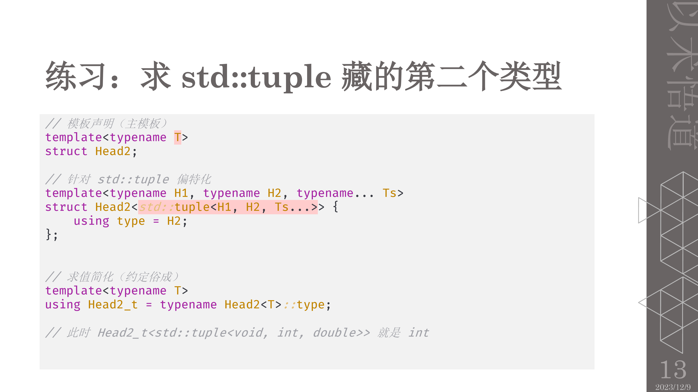

## 小工具
```c++
#pragma once
#ifndef __TOOLS_H__
#define __TOOLS_H__
#include <mutex>
#include <iostream>
#include <fstream>
#include <sstream>
#include <utility>
#include <type_traits>
namespace nao {
	namespace xx {
		class Cout {
		public:
			Cout() { this->mutex().lock(); }
			Cout(const char* file, unsigned int line) {
				this->mutex().lock();
				this->stream() << '[' << file << ':' << line << ']' << ' ';
			}
			~Cout() {
				this->stream() << std::endl;
				::fwrite(this->stream().str().c_str(), 1, this->stream().str().size(), stderr);
				//清空数据
				this->stream().str("");
				this->mutex().unlock();
			}
			std::mutex& mutex() {
				static std::mutex kMtx;
				return kMtx;
			}
			std::ostringstream& stream() {
				static std::ostringstream  kStream;
				return kStream;
			}
		};//class Cout

		//defer的实现
		template <typename F>
		struct Defer {
			Defer(F&& f) : _f(std::forward<F>(f)) {}
			~Defer() { _f(); }
			typename std::remove_reference<F>::type _f;
		};

		template <typename F>
		inline Defer<F> create_defer(F&& f)
		{
			return Defer<F>(std::forward<F>(f));
		}
#define _nao_defer_name_cat(x, n) x##n
#define _nao_defer_make_name(x, n) _nao_defer_name_cat(x, n)
#define _nao_defer_name _nao_defer_make_name(_nao_defer_, __LINE__)
	}//namaspace xx

	namespace now {
		typedef int64_t int64;
		typedef uint32_t uint32;
		//时间戳
		int64 now_ms();
		int64 now_us();
		// "%Y-%m-%d %H:%M:%S" ==> 2018-08-08 08:08:08
		std::string str_time(const char* fm = "%Y-%m-%d %H:%M:%S");
		//自1970-01-01 00:00:00以来的时间,现在时刻的时间戳。使用这个
		int64 epoch_ms();
		int64 epoch_us();
		//休眠
		void sleep_sec(uint32 n);
		void sleep_ms(uint32 n);
		//计时器
		class Timer {
		public:
			Timer() {
				_start = now_us();
			}
			void restart() {
				_start = now_us();
			}
			int64 us() const {
				return now_us() - _start;
			}
			int64 ms()const {
				return this->us() / 1000;
			}
		private:
			int64 _start;
		};//class Timer
	}//namespace now
	//类型转换函数
	template <typename in_type, typename out_type>
	void typeConvert(const in_type& in_value, out_type& out_value) {
		std::stringstream stream;
		stream << in_value;
		stream >> out_value;
	}
}//namespace nao
//控制台输出
#define XOUT   nao::xx::Cout().stream()
#define XLOG   nao::xx::Cout(__FILE__, __LINE__).stream()
//Defer 功能
#define DEFER(e) auto _nao_defer_name = nao::xx::create_defer([&](){ e; })
//禁止拷贝与赋值
#define DISALLOW_COPY_AND_ASSIGN(ClassName) \
    ClassName(const ClassName&) = delete; \
    void operator=(const ClassName&) = delete
//unlikely 功能
#if (defined(__GNUC__) && __GNUC__ >= 3) || defined(__clang__)
static inline bool (likely)(bool x) { return __builtin_expect((x), true); }
static inline bool (unlikely)(bool x) { return __builtin_expect((x), false); }
#else
static inline bool (likely)(bool x) { return x; }
static inline bool (unlikely)(bool x) { return x; }
#endif

#define CLIP_RANGE(value, min, max)  ( (value) > (max) ? (max) : (((value) < (min)) ? (min) : (value)) )
#define SWAP(a, b, t)  do { t = a; a = b; b = t; } while(0)
#include <chrono>
#define TICK(x) auto bench_##x = std::chrono::high_resolution_clock::now();
#define TOCK(x) std::cout << #x ": " << std::chrono::duration_cast<std::chrono::microseconds>(std::chrono::high_resolution_clock::now() - bench_##x).count() << "us" << std::endl;


#endif  //__TOOLS_H__
/*----------------------------------------------------------------------------- (C) COPYRIGHT LEI *****END OF FILE------------------------------------------------------------------------------*/
```

```c++
#include "tools.h"
#ifdef _WIN32
//windows 平台
#include <time.h>
// for struct timeval
#include <winsock2.h>
#ifndef WIN32_LEAN_AND_MEAN
#define WIN32_LEAN_AND_MEAN
#endif
#include <Windows.h>
namespace nao {
	namespace _Mono {
		typedef int64_t int64;
		inline int64 _QueryFrequency() {
			LARGE_INTEGER freq;
			QueryPerformanceFrequency(&freq);
			return freq.QuadPart;
		}

		inline int64 _QueryCounter() {
			LARGE_INTEGER counter;
			QueryPerformanceCounter(&counter);
			return counter.QuadPart;
		}

		inline const int64& _Frequency() {
			static int64 freq = _QueryFrequency();
			return freq;
		}

		inline int64 ms() {
			int64 count = _QueryCounter();
			const int64& freq = _Frequency();
			return (count / freq) * 1000 + (count % freq * 1000 / freq);
		}

		inline int64 us() {
			int64 count = _QueryCounter();
			const int64& freq = _Frequency();
			return (count / freq) * 1000000 + (count % freq * 1000000 / freq);
		}
	}// namespace _Mono
	namespace now {
		int64 now_ms() {
			return _Mono::ms();
		}

		int64 now_us() {
			return _Mono::us();
		}

		std::string str_time(const char* fm) {
			int64 x = time(0);
			struct tm t;
			_localtime64_s(&t, &x);
			char buf[256];
			const std::size_t r = strftime(buf, sizeof(buf), fm, &t);
			return std::string(buf, r);
		}

		inline int64 filetime() {
			FILETIME ft;
			LARGE_INTEGER x;
			GetSystemTimeAsFileTime(&ft);
			x.LowPart = ft.dwLowDateTime;
			x.HighPart = ft.dwHighDateTime;
			return x.QuadPart - 116444736000000000ULL;
		}

		int64 epoch_ms() {
			return filetime() / 10000;
		}

		int64 epoch_us() {
			return filetime() / 10;
		}

		void sleep_sec(uint32 n) {
			::Sleep(n * 1000);
		}

		void sleep_ms(uint32 n) {
			::Sleep(n);
		}
	}//namespace now
}//namespace nao

#else
//非windows平台
#include <time.h>
#include <sys/time.h>
namespace nao {
	namespace _Mono {
#ifdef CLOCK_MONOTONIC
		inline int64 ms() {
			struct timespec t;
			clock_gettime(CLOCK_MONOTONIC, &t);
			return static_cast<int64>(t.tv_sec) * 1000 + t.tv_nsec / 1000000;
		}

		inline int64 us() {
			struct timespec t;
			clock_gettime(CLOCK_MONOTONIC, &t);
			return static_cast<int64>(t.tv_sec) * 1000000 + t.tv_nsec / 1000;
		}
#else
		inline int64 ms() {
			return epoch::ms();
		}

		inline int64 us() {
			return epoch::us();
		}
#endif
	} //namespace  _Mono
	namespace now {
		int64 now_ms() {
			return _Mono::ms();
		}

		int64 now_us() {
			return _Mono::us();
		}

		std::string str_time(const char* fm) {
			time_t x = time(0);
			struct tm t;
			localtime_r(&x, &t);
			char buf[256];
			const size_t r = strftime(buf, sizeof(buf), fm, &t);
			return std::string(buf, r);
		}

		int64 epoch_ms() {
			struct timeval t;
			gettimeofday(&t, 0);
			return static_cast<int64>(t.tv_sec) * 1000 + t.tv_usec / 1000;
		}

		int64 epoch_us() {
			struct timeval t;
			gettimeofday(&t, 0);
			return static_cast<int64>(t.tv_sec) * 1000000 + t.tv_usec;
		}

		void sleep_sec(uint32 n) {
			struct timespec ts;
			ts.tv_sec = n;
			ts.tv_nsec = 0;
			while (nanosleep(&ts, &ts) == -1 && errno == EINTR);
		}

		void sleep_ms(uint32 n) {
			struct timespec ts;
			ts.tv_sec = n / 1000;
			ts.tv_nsec = n % 1000 * 1000000;
			while (nanosleep(&ts, &ts) == -1 && errno == EINTR);
		}
	}//namespace now
}//namespace nao
#endif //_WIN32

```

## 智能指针
```c++
#include <iostream>
#include <string>
#include <memory>

//智能指针的测试
class Student
{

public:
	Student() {};
	Student(int id, int grades, std::string name) :ID(id), Grades(grades), Name(name) {};
	~Student() {};
	int ID;
	int Grades;
	std::string Name;

public:
	void SetStudent(int id,int grades, std::string name)
	{
		this->ID = id;
		this->Grades = grades;
		this->Name = name;
	}
	void PrintStudent()
	{
		std::cout << this->ID << " " << this->Grades << " " << this->Name << std::endl;
	}
};

/*
///参考链接
https://blog.csdn.net/hp_cpp/article/details/103452196
https://blog.csdn.net/qq_41543888/article/details/90269614
https://blog.csdn.net/baidu_41388533/article/details/106559310

*/

void Delete(Student* s)
{
	delete[] s;
}
int main()
{
	Student student0(0,90,"nity");
	student0.PrintStudent();


	//智能指针的方式(构造单个对象)
	std::shared_ptr<Student> student1(new Student(1,91,"nity_noe"), [](Student*s){delete s; });
	//lamba表达式删除
	std::shared_ptr<Student> student2(new Student[5], [](Student*s) {delete[] s;});
	//默认删除
	std::shared_ptr<Student> student3(new Student[5], std::default_delete<Student[]>());
	//函数删除
	std::shared_ptr<Student> student4(new Student[5], Delete);

	//构造单个对象，无参构造
	std::shared_ptr<Student> student5(new Student(), [](Student*s) {delete s;});


	std::shared_ptr<Student> student6(new Student, std::default_delete<Student>());
	//student1->PrintStudent();
	std::weak_ptr<Student> p(student1);
	//引用计数
	std::cout<<p.use_count()<<std::endl;

	//二维指针数组
	//参考 https://segmentfault.com/q/1010000008242849?sort=created
	//参考 https://blog.csdn.net/goldenhawking/article/details/78162094
	//二维数组第一维是动态的，第二维是静态的
	std::shared_ptr<Student[1024][10]> pt(new Student[1024][10], [=](Student(*p)[10])->void {delete[] p; });

	pt[1023][20].ID = 5;
	student5->ID = 5;
	student5->Grades = 95;
	student5->Name = "nity_five";
	student5->PrintStudent();
	system("pause");
	return 0;
}


注意事项：

1、unique_ptr的数组智能指针，没有*和->操作，但支持下标操作[]
2、shared_ptr的数组智能指针，有*和->操作，但不支持下标操作[]，只能通过get()去访问数组的元素。
3、shared_ptr的数组智能指针，必须要自定义deleter，定义可以参考上面的内容。
 参考链接
 https://blog.csdn.net/weixin_30929195/article/details/98524505

unique_str的使用与初始化。
std::unique_ptr<int[]> pnColhistT(new int[nCol] {0});
std::unique_ptr<int[]> pnRowhist(new int[nRow] {0});
其他的初始化方法：
//方法1
std::unique_ptr<int[]> ptr1{ new int[5]{1,2,3,4,5} };
//方法2
auto ptr2 = std::make_unique<std::array<int, 5>>(std::array<int, 5>{1, 2, 3, 4, 5});
//方法3，但还是建议使用vector来表示数组
shared_ptr<vector<int>> ptr3 = make_shared<vector<int>>();


//妙用
class Lock{
public:
//使用某个Mutex初始化shared_ptr,并以unlock函数作为删除器
	explict Lock(Mutex* pm):mutexPtr(pm,unlock){
		lock(mutexPtr.get());
	}
private:
	std::shared_ptr<Mutex> mutexPtr;
}
```

## lamba
[C++ Lambda表达式基本用法（言简意赅，非常清楚)](https://www.cnblogs.com/findumars/p/8062299.html)

lambda表达式的语法归纳如下：

[ caputrue ] ( params ) opt -> ret { body; };

    1).capture是捕获列表；

    2).params是参数表；(选填)

    3).opt是函数选项；可以填mutable,exception,attribute（选填）

    mutable说明lambda表达式体内的代码可以修改被捕获的变量，并且可以访问被捕获的对象的non-const方法。

    exception说明lambda表达式是否抛出异常以及何种异常。

    attribute用来声明属性。

    4).ret是返回值类型。(选填)

    5).body是函数体。

捕获列表：lambda表达式的捕获列表精细控制了lambda表达式能够访问的外部变量，以及如何访问这些变量。

    1).[]不捕获任何变量。

    2).[&]捕获外部作用域中所有变量，并作为引用在函数体中使用（按引用捕获）。

    3).[=]捕获外部作用域中所有变量，并作为副本在函数体中使用(按值捕获)。

    4).[=,&foo]按值捕获外部作用域中所有变量，并按引用捕获foo变量。

    5).[bar]按值捕获bar变量，同时不捕获其他变量。

    6).[this]捕获当前类中的this指针，让lambda表达式拥有和当前类成员函数同样的访问权限。如果已经使用了&或者=，就默认添加此选项。捕获this的目的是可以在lamda中使用当前类的成员函数和成员变量。

虽然按值捕获的变量值均补复制一份存储在lambda表达式变量中， 修改他们也并不会真正影响到外部，但我们却仍然无法修改它们。

那么如果希望去修改按值捕获的外部变量，需要显示指明lambda表达式为mutable。需要注意：被mutable修饰的lambda表达式就算没有参数也要写明参数列表。原因：lambda表达式可以说是就地定义仿函数闭包的“语法糖”。它的捕获列表捕获住的任何外部变量，最终均会变为闭包类型的成员变量。按照C++标准，lambda表达式的operator()默认是const的，一个const成员函数是无法修改成员变量的值的。而mutable的作用，就在于取消operator()的const。

## 将文件间的编译依存关系降至最低
Effective C++条款31：在说这一条款之前，先要了解一下C/C++的编译知识，假设有三个类ComplexClass, SimpleClass1和SimpleClass2，采用头文件将类的声明与类的实现分开，这样共对应于6个文件，分别是ComplexClass.h，ComplexClass.cpp，SimpleClass1.h，SimpleClass1.cpp，SimpleClass2.h，SimpleClass2.cpp。

ComplexClass复合两个BaseClass，SimpleClass1与SimpleClass2之间是独立的，ComplexClass的.h是这样写的：
```c++
#ifndef COMPLESS_CLASS_H
#define COMPLESS_CLASS_H
#include “SimpleClass1.h”
#include “SimpleClass2.h”

class ComplexClass
{
    SimpleClass1 xx;
    SimpleClass2 xxx;
};
…
#endif /* COMPLESS _CLASS_H */
```
我们来考虑以下几种情况：
 Case 1：

现在SimpleClass1.h发生了变化，比如添加了一个新的成员变量，那么没有疑问，SimpleClass1.cpp要重编，SimpleClass2因为与SimpleClass1是独立的，所以SimpleClass2是不需要重编的。

那么现在的问题是，ComplexClass需要重编吗？

答案是“是”，因为ComplexClass的头文件里面包含了SimpleClass1.h（使用了SimpleClass1作为成员对象的类），而且所有使用ComplexClass类的对象的文件，都需要重新编译！

如果把ComplexClass里面的#include “SimpleClass1.h”给去掉，当然就不会重编ComplexClass了，但问题是也不能通过编译了，因为ComplexClass里面声明了SimpleClass1的对象xx。那如果把#include “SimpleClass1.h”换成类的声明class SimpleClass1，会怎么样呢？能通过编译吗？

答案是“否”，因为编译器需要知道ComplexClass成员变量SimpleClass1对象的大小，而这些信息仅由class SimpleClass1是不够的，但如果SimpleClass1作为一个函数的形参，或者是函数返回值，用class SimpleClass1声明就够了。如：
```c++
// ComplexClass.h
class SimpleClass1;
…
SimpleClass1 GetSimpleClass1() const;
…
```
但如果换成指针呢？像这样：
```c++
// ComplexClass.h
#include “SimpleClass2.h”
class SimpleClass1;

class ComplexClass:
{
    SimpleClass1* xx;
    SimpleClass2 xxx;
};
```
 答案是“是”，因为编译器视所有指针为一个字长（在32位机器上是4字节），因此class SimpleClass1的声明是够用了。但如果要想使用SimpleClass1的方法，还是要包含SimpleClass1.h，但那是ComplexClass.cpp做的，因为ComplexClass.h只负责类变量和方法的声明。

那么还有一个问题，如果使用SimpleClass1*代替SimpleClass1后，SimpleClass1.h变了，ComplexClass需要重编吗？

先看Case2：

回到最初的假定上（成员变量不是指针），现在SimpleClass1.cpp发生了变化，比如改变了一个成员函数的实现逻辑（换了一种排序算法等），但SimpleClass1.h没有变，那么SimpleClass1一定会重编，SimpleClass2因为独立性不需要重编，那么现在的问题是，ComplexClass需要重编吗？
答案是“否”，因为编译器重编的条件是发现一个变量的类型或者大小跟之前的不一样了，但现在SimpleClass1的接口并没有任务变化，只是改变了实现的细节，所以编译器不会重编。

Case 3：结合Case1和Case2，现在我们来看看下面的做法：
```c++
// ComplexClass.h
#include “SimpleClass2.h”

class SimpleClass1;

class ComplexClass
{
    SimpleClass1* xx;
    SimpleClass2 xxx;
};


// ComplexClass.cpp

void ComplexClass::Fun()
{
    SimpleClass1->FunMethod();
}
```

请问上面的ComplexClass.cpp能通过编译吗？

答案是“否”，因为这里用到了SimpleClass1的具体的方法，所以需要包含SimpleClass1的头文件，但这个包含的行为已经从ComplexClass里面拿掉了（换成了class SimpleClass1），所以不能通过编译。

如果解决这个问题呢？其实很简单，只要在ComplexClass.cpp里面加上#include “SimpleClass1.h”就可以了。换言之，我们其实做的就是将ComplexClass.h的#include “SimpleClass1.h”移至了ComplexClass1.cpp里面，而在原位置放置class SimpleClass1。如下：

```c++
// ComplexClass.h
#include “SimpleClass2.h”
class SimpleClass1;
class ComplexClass
{
    SimpleClass1* xx;
    SimpleClass2 xxx;
};

// ComplexClass.cpp
#include "SimpleClass1.h"
void ComplexClass::Fun()
{
    SimpleClass1->FunMethod();
}
```
这样做是为了什么？假设这时候SimpleClass1.h发生了变化，会有怎样的结果呢？

SimpleClass1自身一定会重编，SimpleClass2当然还是不用重编的，ComplexClass.cpp因为包含了SimpleClass1.h，所以需要重编，但换来的好处就是所有用到ComplexClass的其他地方，它们所在的文件不用重编了！因为ComplexClass的头文件没有变化，接口没有改变！

总结一下，对于C++类而言，如果它的头文件变了，那么所有这个类的对象所在的文件都要重编，但如果它的实现文件（cpp文件）变了，而头文件没有变（对外的接口不变），那么所有这个类的对象所在的文件都不会因之而重编。

因此，避免大量依赖性编译的解决方案就是：在头文件中用class声明外来类，用指针或引用代替变量的声明；在cpp文件中包含外来类的头文件。

上述方法称为Handle classes， 降低文件间的编译依存关系还有一种方法，称为Interface classes，如下

从上面也可以看出，避免重编的诀窍就是保持头文件（接口）不变化，而保持接口不变化的诀窍就是不在里面声明编译器需要知道大小的变量，Handler Classes的处理就是把变量换成变量的地址（指针），头文件只有class xxx的声明，而在cpp里面才包含xxx的头文件。Interface Classes则是利用继承关系和多态的特性，在父类里面只包含成员方法（成员函数），而没有成员变量，像这样：

```c++
// Person.h
#include <string>
using namespace std;

class MyAddress;
class MyDate;
class RealPerson;

class Person
{
public:
    virtual string GetName() const = 0;
    virtual string GetBirthday() const = 0;
    virtual string GetAddress() const = 0;
    virtual ~Person(){}
};
```
```c++
// RealPerson.h
#include "Person.h"
#include "MyAddress.h"
#include "MyDate.h"

class RealPerson: public Person
{
private:
    string Name;
    MyAddress Address;
    MyDate Birthday;
public:
    RealPerson(string name, const MyAddress& addr, const MyDate& date):Name(name), Address(addr), Birthday(date){}
    virtual string GetName() const;
    virtual string GetAddress() const;
    virtual string GetBirthday() const;
};
```
在RealPerson.cpp里面去实现GetName()等方法。从这里我们可以看到，只有子类里面才有成员变量，也就是说，如果Address的头文件变化了，那么子类一定会重编，所有用到子类头文件的文件也要重编，所以为了防止重编，应该尽量少用子类的对象。利用多态特性，我们可以使用父类的指针，像这样Person* p = new RealPerson(xxx)，然后p->GetName()实际上是调用了子类的GetName()方法。

但这样还有一个问题，就是new RealPerson()这句话一写，就需要RealPerson的构造函数，那么RealPerson的头文件就要暴露了，这样可不行。还是只能用Person的方法，所以我们在Person.h里面加上这个方法：

```c++
// Person.h
#include <string>
using namespace std;

class MyAddress;
class MyDate;
class RealPerson;

class Person
{
public:
    static Person* CreatePerson(const string &name, const MyAddress& addr, const MyDate& date);
    virtual string GetName() const = 0;
    virtual string GetBirthday() const = 0;
    virtual string GetAddress() const = 0;
    virtual ~Person(){}
};
```

注意这个方法是静态的（没有虚特性），它被父类和所有子类共有，可以在子类中去实现它：
```c++
// RealPerson.cpp
#include “Person.h”
Person* Person::CreatePerson(string name, const MyAddress& addr, const MyDate& date)
{
    return new RealPerson(name, addr, date);
}
```
这样在客户端代码里面，可以这样写：
```c++
// Main.h
class MyAddress;
class MyDate;
void ProcessPerson(const string& name, const MyAddress& addr, const MyDate& date);
```
```c++
// Main.cpp
#include "Person.h"
#include “MyAddress.h”;
#include “MyDate.h”;

void ProcessPerson(const string& name, const MyAddress& addr, const MyDate& date)
{
    Person* p = Person::CreatePerson(name, addr, date);
…
}
```
 就可以减少编译依赖了。

总结一下，Handler classes与Interface classes解除了接口和实现之间的耦合关系，从而降低文件间的编译依存性。减少编译依存性的关键在于保持.h文件不变化，具体地说，是保持被大量使用的类的.h文件不变化，这里谈到了两个方法：Handler classes与Interface classes。

Handler classes化类的成员变量为指针，在.h文件里面只包含class xxx的外来类声明，而不包含其头文件，在.cpp涉及到具体外来类的使用时，才包含xxx.h的头文件，这样最多只影响本身类的cpp重编，但因为.h文件没有变化，所以此类的对象存在的文件不必重编。

当然，书上说的Handler classes更想让我们在类A的基础上另造一个中间类AImp（成员函数完全与类A一致），这个中间类的成员中里面放置了所有类A需要的外来类的对象，然后类的逻辑细节完全在Almp.cpp中实现，而在A.cpp里面只是去调用Almp.cpp的同名方法。A.h的成员变量只有Almp的指针，这看上去好像一个Handler，因此而得名。

Interface classes则是将细节放在子类中，父类只是包含虚方法和一个静态的Create函数声明，子类将虚方法实现，并实现Create接口。利用多态特性，在客户端只需要使用到Person的引用或者指针，就可以访问到子类的方法。由于父类的头文件里面不包含任何成员变量，所以不会导致重编（其实由于父类是虚基类，不能构造其对象，所以也不用担心由于父类头文件变化导致的重编问题）。

 请记住：

	1. 支持“编译依存性最小化”的一般构想是：相依于声明式，不要相依于定义式，基于此构想的两个手段是Handler classes和Interface classes。

	2. 程序库头文件应该以“完全且仅有声明式”的形式存在，这种做法不论是否涉及templates都适用。

## 强制类型转换运算符

C++ 引入了四种功能不同的强制类型转换运算符以进行强制类型转换：static_cast、reinterpret_cast、const_cast 和 dynamic_cast。
static_cast 用于进行比较“自然”和低风险的转换，如整型和浮点型、字符型之间的互相转换。另外，如果对象所属的类重载了强制类型转换运算符 T（如 T是 int、int* 或其他类型名），则 static_cast 也能用来进行对象到 T 类型的转换。

static_cast 不能用于在不同类型的指针之间互相转换，也不能用于整型和指针之间的互相转换，当然也不能用于不同类型的引用之间的转换。因为这些属于风险比较高的转换。

static_cast 用法示例如下：
```c++
#include <iostream>

using namespace std;

class A
{
public:
    operator int() { return 1; }
    operator char*() { return NULL; }
};

int main()
{
    A a;
    int n;
    const char* p = "This is a str for static_cast";
    n = static_cast <int> (3.14);       // n 的值变为 3
    n = static_cast <int> (a);              // 调用 a.operator int, n 的值变为 1
    p = static_cast <char*> (a);            // 调用 a.operator char*，p 的值变为 NULL
    // n = static_cast <int> (p);           // 编译错误，static_cast不能将指针转换成整型
    // p = static_cast <char*> (n);     // 编译错误，static_cast 不能将整型转换成指针
    return 0;
}
```
reinterpret_cast

reinterpret_cast 用于进行各种不同类型的指针之间、不同类型的引用之间以及指针和能容纳指针的整数类型之间的转换，reinterpret_cast 转换时，执行的过程是逐个比特复制的操作。

这种转换提供了很强的灵活性，但转换的安全性只能由程序员的细心来保证了。例如，程序员执意要把一个 int* 指针、函数指针或其他类型的指针转换成 string* 类型的指针也是可以的，至于以后用转换后的指针调用 string 类的成员函数引发错误，程序员也只能自行承担查找错误的烦琐工作：（C++ 标准不允许将函数指针转换成对象指针，但有些编译器，如 Visual Studio 2010，则支持这种转换）。

reinterpret_cast 用法示例如下：

```c++
#include <iostream>

using namespace std;

class A
{
public:
    int i;
    int j;
    A(int n) :i(n), j(n) { }
};

int main()
{
    A a(100);
    int &r = reinterpret_cast<int&>(a);             // 强行让 r 引用 a
    r = 200;                                                            // 把 a.i 变成了 200
    cout << a.i << "," << a.j << endl;                  // 输出 200,100
    int n = 300;
    A *pa = reinterpret_cast<A*> (&n);              // 强行让 pa 指向 n
    pa->i = 400;                                                    // n 变成 400
    pa->j = 500;                                                    // 此条语句不安全，很可能导致程序崩溃
    cout << n << endl;                                          // 输出 400
    long long la = 0x12345678abcdLL;
    pa = reinterpret_cast<A*>(la);                      // la太长，只取低32位0x5678abcd拷贝给pa
    unsigned int u = reinterpret_cast<unsigned int>(pa);    // pa逐个比特拷贝到u
    cout << hex << u << endl;                               // 输出 5678abcd
    typedef void(*PF1) (int);
    typedef int(*PF2) (int, char *);
    PF1 pf1 = nullptr;
    PF2 pf2;
	pf2 = reinterpret_cast<PF2>(pf1);                   // 两个不同类型的函数指针之间可以互相转换
}
```
在编译的过程中，就会有强行转换的截断提示了。所以不建议强行转换某些类型。

第 19 行的代码不安全，因为在编译器看来，pa->j 的存放位置就是 n 后面的 4 个字节。 本条语句会向这 4 个字节中写入 500。但这 4 个字节不知道是用来存放什么的，贸然向其中写入可能会导致程序错误甚至崩溃。

const_cast

const_cast 运算符仅用于进行去除 const 属性的转换，它也是四个强制类型转换运算符中唯一能够去除 const 属性的运算符。

将 const 引用转换为同类型的非 const 引用，将 const 指针转换为同类型的非 const 指针时可以使用 const_cast 运算符。例如：
```c++
const string s = "Inception";
string& p = const_cast <string&> (s);
string* ps = const_cast <string*> (&s);  // &s 的类型是 const string*
```
```c++
#include <iostream>
#include <string>

using namespace std;

class A
{
public:
    const double i = 5.0;
    const int j = 10;
    const string m_s = "Test String.";
    float f = 2.0f;
};

int main()
{
    A a;
    cout << a.i << '\t' << a.j << '\t' << a.m_s << endl;
    string& p_str = const_cast<string&> (a.m_s);
    p_str = "New Test String!.";
    cout << a.i << '\t' << a.j << '\t' << a.m_s << endl;
    cout << p_str << endl;
    string* ps = const_cast<string*>(&a.m_s);
    *ps = "Point Test String";
    cout << a.i << '\t' << a.j << '\t' << a.m_s << endl;
    cout << ps << '\t' << *ps << endl;
    // int& p_i = const_cast<int&>(a.i); //  不允许修改基础类型的const，只能改类型限定符
    // p_i = 200;
	const A ca;
    A& pa = const_cast<A&>(ca);
    pa.f = 30.0f;
    cout << ca.i << '\t' << ca.j << '\t' << ca.m_s << '\t' << ca.f << endl;
    cout << pa.i << '\t' << pa.j << '\t' << pa.m_s << '\t' << pa.f << endl;
}
```
dynamic_cast

用 reinterpret_cast 可以将多态基类（包含虚函数的基类）的指针强制转换为派生类的指针，但是这种转换不检查安全性，即不检查转换后的指针是否确实指向一个派生类对象。dynamic_cast专门用于将多态基类的指针或引用强制转换为派生类的指针或引用，而且能够检查转换的安全性。对于不安全的指针转换，转换结果返回 NULL 指针。

dynamic_cast 是通过“运行时类型检查”来保证安全性的。dynamic_cast 不能用于将非多态基类的指针或引用强制转换为派生类的指针或引用——这种转换没法保证安全性，只好用 reinterpret_cast 来完成。

dynamic_cast 示例程序如下：
```c++
#include <iostream>
#include <string>

using namespace std;

class Base
{
//有虚函数，因此是多态基类
public:
    virtual ~Base() {}
};

class Derived : public Base { };

int main()
{
    Base b;
    Derived d;
    Derived* pd;
    pd = reinterpret_cast <Derived*> (&b);
    if (pd == NULL)
        //此处pd不会为 NULL。reinterpret_cast不检查安全性，总是进行转换
        cout << "unsafe reinterpret_cast" << endl; //不会执行
    pd = dynamic_cast <Derived*> (&b);
    if (pd == NULL)  //结果会是NULL，因为 &b 不指向派生类对象，此转换不安全
        cout << "unsafe dynamic_cast1" << endl;  //会执行
    pd = dynamic_cast <Derived*> (&d);  //安全的转换
    if (pd == NULL)  //此处 pd 不会为 NULL
        cout << "unsafe dynamic_cast2" << endl;  //不会执行
    return 0;
}
```
那该如何判断该转换是否安全呢？

不存在空引用，因此不能通过返回值来判断转换是否安全。C++ 的解决办法是：dynamic_cast 在进行引用的强制转换时，如果发现转换不安全，就会拋出一个异常，通过处理异常，就能发现不安全的转换。

## 异步基础
c++ 多线程的资料教程很多，就不自己写了了，放一点自己看到不错的链接。

[unique_lock与lock_guard](https://www.cnblogs.com/fnlingnzb-learner/p/9542183.html)

[条件变量2](https://www.jianshu.com/p/a31d4fb5594f)

[shared_lock/shared_mutex读写锁](https://www.cnblogs.com/chen-cs/p/13065948.html)

[c++并发指南](https://www.cnblogs.com/huty/p/8516997.html)

[c++正则表达式](https://www.cnblogs.com/jerrywossion/p/10086051.html)

### 原子变量
atomic对象可以通过指定不同的memory orders来控制其对其他非原子对象的访问顺序和可见性，从而实现线程安全。常用的memory orders包括：

	memory_order_relaxed、
    memory_order_acquire、
    memory_order_release、
    memory_order_acq_rel
    memory_order_seq_cst等。

is_lock_free函数

is_lock_free函数是一个成员函数，用于检查当前atomic对象是否支持无锁操作。调用此成员函数不会启动任何数据竞争。

```c++
#include <iostream>
#include <atomic>
int main()
{
    std::atomic<int> a;
    std::cout << std::boolalpha                // 显示 true 或 false，而不是 1 或 0
              << "std::atomic<int> is "
              << (a.is_lock_free() ? "" : "not ")
              << "lock-free\n";

    return 0;
}
```
std::atomic_flag 是 C++ 中的一个原子布尔类型，它用于实现原子锁操作。

    std::atomic_flag 默认是清除状态（false）。可以使用 ATOMIC_FLAG_INIT 宏进行初始化，例如：std::atomic_flag flag = ATOMIC_FLAG_INIT;
    std::atomic_flag 提供了两个成员函数 test_and_set() 和 clear() 来测试和设置标志位。test_and_set() 函数会将标志位置为 true，并返回之前的值；clear() 函数将标志位置为 false。
    std::atomic_flag 的 test_and_set() 和 clear() 操作是原子的，可以保证在多线程环境下正确执行。
    std::atomic_flag 只能表示两种状态，即 true 或 false，不能做其他比较操作。通常情况下，std::atomic_flag 被用作简单的互斥锁，而不是用来存储信息。

使用 std::atomic_flag 进行原子锁操作：

```c++
#include <iostream>
#include <atomic>
#include <thread>

std::atomic_flag flag = ATOMIC_FLAG_INIT;

void func(int id) {
    while (flag.test_and_set(std::memory_order_acquire)) {
        // 等待其他线程释放锁
    }

    std::cout << "Thread " << id << " acquired the lock." << std::endl;

    // 模拟业务处理
    std::this_thread::sleep_for(std::chrono::seconds(1));

    flag.clear(std::memory_order_release);  // 释放锁
    std::cout << "Thread " << id << " released the lock." << std::endl;
}
int main() {
    std::thread t1(func, 1);
    std::thread t2(func, 2);

    t1.join();
    t2.join();

    return 0;
}

```
std::atomic_flag 是 C++ 中用于实现原子锁操作的类型，它提供了 test_and_set() 和 clear() 函数来测试和设置标志位，并且保证这些操作是原子的。

store函数

std::atomic<T>::store()是一个成员函数，用于将给定的值存储到原子对象中。
```c++
void store(T desired, std::memory_order order = std::memory_order_seq_cst) volatile noexcept;
void store(T desired, std::memory_order order = std::memory_order_seq_cst) noexcept;
//desired：要存储的值。
//order：存储操作的内存顺序。默认是std::memory_order_seq_cst（顺序一致性）。
```
存储操作的内存顺序参数：

| value                | 内存顺序               | 描述  |
| ---------------------| ----------------------| ---------- |
| memory_order_relaxed | 无序的内存访问         |不做任何同步，仅保证该原子类型变量的操作是原子化的，并不保证其对其他线程的可见性和正确性。|
| memory_order_consume | 与消费者关系有关的顺序  |保证本次读取之前所有依赖于该原子类型变量值的操作都已经完成，但不保证其他线程对该变量的存储结果已经可见。|
| memory_order_acquire | 获取关系的顺序         |保证本次读取之前所有先于该原子类型变量写入内存的操作都已经完成，并且其他线程对该变量的存储结果已经可见。|
| memory_order_seq_cst | 顺序一致性的顺序       |保证本次操作以及之前和之后的所有原子操作都按照一个全局的内存顺序执行，从而保证多线程环境下对变量的读写的正确性和一致性。这是最常用的内存顺序。|
| memory_order_release | 释放关系的顺序         |保证本次写入之后所有后于该原子类型变量写入内存的操作都已经完成，并且其他线程可以看到该变量的存储结果。|

```c++
#include <iostream>
#include <atomic>
int main()
{
    std::atomic<int> atomic_int(0);

    int val = 10;
    atomic_int.store(val);

    std::cout << "Value stored in atomic object: " << atomic_int << std::endl;

    return 0;
}
```
输出`Value stored in atomic object: 10`
例子中，首先定义了一个std::atomic<int>类型的原子变量atomic_int，初始值为0。然后，使用store()函数将变量val的值存储到atomic_int中。最后，打印出存储在原子对象中的值。

需要注意的是，在多线程环境下使用原子变量和操作时，需要使用适当的内存顺序来保证数据的正确性和一致性。因此，store()函数中的order参数可以用来指定不同的内存顺序。如果不确定如何选择内存顺序，请使用默认值std::memory_order_seq_cst，它是最常用和最保险的。

load函数

load函数用于获取原子变量的当前值。它有以下两种形式：
```c++
T load(memory_order order = memory_order_seq_cst) const noexcept;
operator T() const noexcept;
```
使用load函数时，如果不指定memory_order，则默认为memory_order_seq_cst。

load函数的返回值类型为T，即原子变量的类型。在使用load函数时需要指定类型参数T。如果使用第二种形式的load函数，则无需指定类型参数T，程序会自动根据上下文推断出类型。

```c++
std::atomic<int> foo (0);

int x;
do {
    x = foo.load(std::memory_order_relaxed);  // get value atomically
} while (x==0);
```

exchange函数

访问和修改包含的值，将包含的值替换并返回它前面的值。
```c++
template< class T >
T exchange( volatile std::atomic<T>* obj, T desired );
//其中，obj参数指向需要替换值的atomic对象，desired参数为期望替换成的值。如果替换成功，则返回原来的值。
//整个操作是原子的（原子读-修改-写操作）：从读取（要返回）值的那一刻到此函数修改值的那一刻，该值不受其他线程的影响。
```
```c++
#include <iostream>       // std::cout
#include <atomic>         // std::atomic
#include <thread>         // std::thread
#include <vector>         // std::vector

std::atomic<bool> ready (false);
std::atomic<bool> winner (false);

void count1m (int id) {
  while (!ready) {}                  // wait for the ready signal
  for (int i=0; i<1000000; ++i) {}   // go!, count to 1 million
  if (!winner.exchange(true)) { std::cout << "thread #" << id << " won!\n"; }
};

int main ()
{
  std::vector<std::thread> threads;
  std::cout << "spawning 10 threads that count to 1 million...\n";
  for (int i=1; i<=10; ++i) threads.push_back(std::thread(count1m,i));
  ready = true;
  for (auto& th : threads) th.join();

  return 0;
}
```
compare_exchange_weak函数

这个函数的作用是比较一个值和一个期望值是否相等，如果相等则将该值替换成一个新值，并返回true；否则不做任何操作并返回false。
```c++
bool compare_exchange_weak (T& expected, T val,memory_order sync = memory_order_seq_cst) volatile noexcept;
bool compare_exchange_weak (T& expected, T val,memory_order sync = memory_order_seq_cst) noexcept;
bool compare_exchange_weak (T& expected, T val,memory_order success, memory_order failure) volatile noexcept;
bool compare_exchange_weak (T& expected, T val,memory_order success, memory_order failure) noexcept;
//expected：期望值的地址，也是输入参数，表示要比较的值；
//val：新值，也是输入参数，表示期望值等于该值时需要替换的值；
//success：表示函数执行成功时内存序的类型，默认为memory_order_seq_cst；
//failure：表示函数执行失败时内存序的类型，默认为memory_order_seq_cst。
```
该函数的返回值为bool类型，表示操作是否成功。

注意，compare_exchange_weak函数是一个弱化版本的原子操作函数，因为在某些平台上它可能会失败并重试。如果需要保证严格的原子性，则应该使用compare_exchange_strong函数。

```c++
#include <iostream>       // std::cout
#include <atomic>         // std::atomic
#include <thread>         // std::thread
#include <vector>         // std::vector

// a simple global linked list:
struct Node { int value; Node* next; };
std::atomic<Node*> list_head (nullptr);

void append (int val) {     // append an element to the list
  Node* oldHead = list_head;
  Node* newNode = new Node {val,oldHead};

  // what follows is equivalent to: list_head = newNode, but in a thread-safe way:
  while (!list_head.compare_exchange_weak(oldHead,newNode))
    newNode->next = oldHead;
}

int main ()
{
  // spawn 10 threads to fill the linked list:
  std::vector<std::thread> threads;
  for (int i=0; i<10; ++i) threads.push_back(std::thread(append,i));
  for (auto& th : threads) th.join();

  // print contents:
  for (Node* it = list_head; it!=nullptr; it=it->next)
    std::cout << ' ' << it->value;
  std::cout << '\n';

  // cleanup:
  Node* it; while (it=list_head) {list_head=it->next; delete it;}

  return 0;
}
```
compare_exchange_strong函数

这个函数的作用和compare_exchange_weak类似，都是比较一个值和一个期望值是否相等，并且在相等时将该值替换成一个新值。不同的是，compare_exchange_strong会保证原子性，并且如果比较失败则会返回当前值。
```c++
bool compare_exchange_strong(T& expected, T desired,
                             memory_order success = memory_order_seq_cst,
                             memory_order failure = memory_order_seq_cst) noexcept;

//expected：期望值的地址，也是输入参数，表示要比较的值；
//desired：新值，也是输入参数，表示期望值等于该值时需要替换的值；
//success：表示函数执行成功时内存序的类型，默认为memory_order_seq_cst；
//failure：表示函数执行失败时内存序的类型，默认为memory_order_seq_cst。
```
该函数的返回值为bool类型，表示操作是否成功。

注意，compare_exchange_strong函数保证原子性，因此它的效率可能比compare_exchange_weak低。在使用时应根据具体情况选择适合的函数。

专业化支持的操作

|   操作                |  描述                 |
| ---------------------| ----------------------|
|fetch_add	|添加到包含的值并返回它在操作之前具有的值|
|fetch_sub|	从包含的值中减去，并返回它在操作之前的值。|
|fetch_and	|读取包含的值，并将其替换为在读取值和 之间执行按位 AND 运算的结果。|
|fetch_or	|读取包含的值，并将其替换为在读取值和 之间执行按位 OR 运算的结果。|
|fetch_xor	|读取包含的值，并将其替换为在读取值和 之间执行按位 XOR 运算的结果。|

```c++
// atomic::load/store example
#include <iostream> // std::cout
#include <atomic> // std::atomic, std::memory_order_relaxed
#include <thread> // std::thread
//std::atomic<int> count = 0;//错误初始化
std::atomic<int> count(0); // 准确初始化
void set_count(int x)
{
	std::cout << "set_count:" << x << std::endl;
	count.store(x, std::memory_order_relaxed); // set value atomically
}
void print_count()
{
	int x;
	do {
		x = count.load(std::memory_order_relaxed); // get value atomically
	} while (x==0);
	std::cout << "count: " << x << '\n';
}
int main ()
{
	std::thread t1 (print_count);
	std::thread t2 (set_count, 10);
	t1.join();
	t2.join();
	std::cout << "main finish\n";
	return 0;
}

```
### CAS机制
## c++ 17 20
参考链接：

https://zhuanlan.zhihu.com/p/415516809?utm_medium=social&utm_oi=572853033025671168&utm_psn=1736904619257839616&utm_source=wechat_session

结构化绑定
```c++
std::tuple<int, double> func() {
    return std::tuple(1, 2.2);
}
int main() {
    auto[i, d] = func(); //是C++11的tie吗？更高级
    cout << i << endl;
    cout << d << endl;
}
//==========================
void f() {
    map<int, string> m = {
      {0, "a"},
      {1, "b"},
    };
    for (const auto &[i, s] : m) {
        cout << i << " " << s << endl;
    }
}

// ====================
int main() {
    std::pair a(1, 2.3f);
    auto[i, f] = a;
    cout << i << endl; // 1
    cout << f << endl; // 2.3f
    return 0;
}
// 进化，可以通过结构化绑定改变对象的值，结构化绑定还可以改变对象的值，使用引用即可：
int main() {
    std::pair a(1, 2.3f);
    auto& [i, f] = a;
    i = 2;
    cout << a.first << endl; // 2
}

int array[3] = {1, 2, 3};
auto [a, b, c] = array;
cout << a << " " << b << " " << c << endl;
//结构化绑定不止可以绑定pair和tuple，还可以绑定数组和结构体等
// 注意这里的struct的成员一定要是public的
struct Point {
    int x;
    int y;
};
Point func() {
    return {1, 2};
}
const auto [x, y] = func();
```

if-switch语句初始化
```c++
// if (init; condition)
if (int a = GetValue()); a < 101) {
    cout << a;
}
string str = "Hi World";
if (auto [pos, size] = pair(str.find("Hi"), str.size()); pos != string::npos) {
    std::cout << pos << " Hello, size is " << size;
}
```
内联变量,C++17前只有内联函数，现在有了内联变量，我们印象中C++类的静态成员变量在头文件中是不能初始化的，但是有了内联变量，就可以达到此目的：
```c++
// header file
struct A {
    static const int value;
};
inline int const A::value = 10;

// ==========或者========
struct A {
    inline static const int value = 10;
}
```
折叠表达式
```c++
template <typename ... Ts>
auto sum(Ts ... ts) {
    return (ts + ...);
}
int a {sum(1, 2, 3, 4, 5)}; // 15
std::string a{"hello "};
std::string b{"world"};
cout << sum(a, b) << endl; // hello world
```
namespace嵌套
```c++
namespace A::B::C {
    void func();)
}
```
__has_include预处理表达式,可以判断是否有某个头文件，代码可能会在不同编译器下工作，不同编译器的可用头文件有可能不同，所以可以使用此来判断.
```c++
#if defined __has_include
#if __has_include(<charconv>)
#define has_charconv 1
#include <charconv>
#endif
#endif

std::optional<int> ConvertToInt(const std::string& str) {
    int value{};
#ifdef has_charconv
    const auto last = str.data() + str.size();
    const auto res = std::from_chars(str.data(), last, value);
    if (res.ec == std::errc{} && res.ptr == last) return value;
#else
    // alternative implementation...
    其它方式实现
#endif
    return std::nullopt;
}
```

```c++
[[carries_dependency]] 让编译期跳过不必要的内存栅栏指令
[[noreturn]] 函数不会返回
[[deprecated]] 函数将弃用的警告

[[noreturn]] void terminate() noexcept;
[[deprecated("use new func instead")]] void func() {}
```
[[fallthrough]]，用在switch中提示可以直接落下去，不需要break，让编译期忽略警告
```c++
switch (i) {}
    case 1:
        xxx; // warning
    case 2:
        xxx;
        [[fallthrough]];      // 警告消除
    case 3:
        xxx;
       break;
}
```
[[nodiscard]] ：表示修饰的内容不能被忽略，可用于修饰函数，标明返回值一定要被处理
```c++
[[nodiscard]] int func();
void F() {
    func(); // warning 没有处理函数返回值
}
```

[[maybe_unused]] ：提示编译器修饰的内容可能暂时没有使用，避免产生警告

```c++
void func1() {}
[[maybe_unused]] void func2() {} // 警告消除
void func3() {
    int x = 1;
    [[maybe_unused]] int y = 2; // 警告消除
}
```

std::variant,C++17增加std::variant实现类似union的功能，但却比union更高级，举个例子union里面不能有string这种类型，但std::variant却可以，还可以支持更多复杂类型，如map等
```c++
int main() { // c++17可编译
    std::variant<int, std::string> var("hello");
    cout << var.index() << endl;
    var = 123;
    cout << var.index() << endl;

    try {
        var = "world";
        std::string str = std::get<std::string>(var); // 通过类型获取值
        var = 3;
        int i = std::get<0>(var); // 通过index获取对应值
        cout << str << endl;
        cout << i << endl;
    } catch(...) {
        // xxx;
    }
    return 0;
}
```
注意：一般情况下variant的第一个类型一般要有对应的构造函数，否则编译失败：
```c++
struct A {
    A(int i){}
};
int main() {
    std::variant<A, int> var; // 编译失败
}
```
如何避免这种情况呢，可以使用std::monostate来打个桩，模拟一个空状态
```c++
std::variant<std::monostate, A> var; // 可以编译成功
```
std::optional,我们有时候可能会有需求，让函数返回一个对象，如下
```c++
struct A {};
A func() {
    if (flag) return A();
    else {
        // 异常情况下，怎么返回异常值呢，想返回个空呢
    }
}
```
有一种办法是返回对象指针，异常情况下就可以返回nullptr啦，但是这就涉及到了内存管理，也许你会使用智能指针，但这里其实有更方便的办法就是std::optional。
```c++
std::optional<int> StoI(const std::string &s) {
    try {
        return std::stoi(s);
    } catch(...) {
        return std::nullopt;
    }
}

void func() {
    std::string s{"123"};
    std::optional<int> o = StoI(s);
    if (o) {
        cout << *o << endl;
    } else {
        cout << "error" << endl;
    }
}
```
std::any,C++17引入了any可以存储任何类型的单个值，见代码：
```c++
int main() { // c++17可编译
    std::any a = 1;
    cout << a.type().name() << " " << std::any_cast<int>(a) << endl;
    a = 2.2f;
    cout << a.type().name() << " " << std::any_cast<float>(a) << endl;
    if (a.has_value()) {
        cout << a.type().name();
    }
    a.reset();
    if (a.has_value()) {
        cout << a.type().name();
    }
    a = std::string("a");
    cout << a.type().name() << " " << std::any_cast<std::string>(a) << endl;
    return 0;
}
```
std::apply,使用std::apply可以将tuple展开作为函数的参数传入，见代码：
```c++
int add(int first, int second) { return first + second; }
auto add_lambda = [](auto first, auto second) { return first + second; };
int main() {
    std::cout << std::apply(add, std::pair(1, 2)) << '\n';
    std::cout << add(std::pair(1, 2)) << "\n"; // error
    std::cout << std::apply(add_lambda, std::tuple(2.0f, 3.0f)) << '\n';
}

```
std::make_from_tuple,使用make_from_tuple可以将tuple展开作为构造函数参数
```c++
struct Foo {
    Foo(int first, float second, int third) {
        std::cout << first << ", " << second << ", " << third << "\n";
    }
};
int main() {
   auto tuple = std::make_tuple(42, 3.14f, 0);
   std::make_from_tuple<Foo>(std::move(tuple));
}
```
std::string_view,通常我们传递一个string时会触发对象的拷贝操作，大字符串的拷贝赋值操作会触发堆内存分配，很影响运行效率，有了string_view就可以避免拷贝操作，平时传递过程中传递string_view即可。
```c++
void func(std::string_view stv) { cout << stv << endl; }
int main(void) {
    std::string str = "Hello World";
    std::cout << str << std::endl;

    std::string_view stv(str.c_str(), str.size());
    cout << stv << endl;
    func(stv);
    return 0;
}
```
as_const,C++17使用as_const可以将左值转成const类型
```c++
std::string str = "str";
const std::string& constStr = std::as_const(str);
```

## 以术悟道 模板元编程





