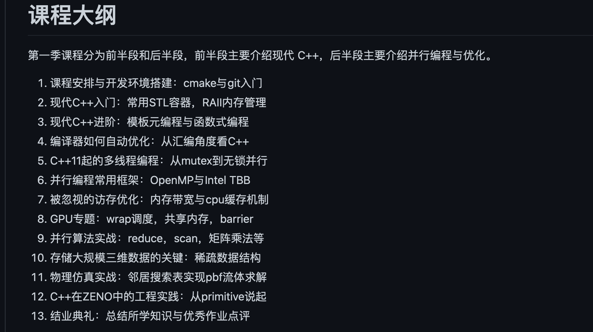

## 现代c++ 教程
高速上手C++ 11/14/17/20参考链接：

https://changkun.de/modern-cpp/pdf/modern-cpp-tutorial-zh-cn.pdf

https://zhuanlan.zhihu.com/p/266554398

https://github.com/changkun/modern-cpp-tutorial


c++那些事，参考链接：

https://light-city.github.io/

## 编码
跨win/linux项目的编码选择和编译选项设置，首选： UTF-8 With BOOM，以下是对编码造成问题的说明,参考链接

 https://github.com/lovepika/thinking_file_encoding_cpp

Visual Studio Code 配置 C/C++ 开发环境的最佳实践(VSCode + Clangd + XMake),参考链接

https://zhuanlan.zhihu.com/p/398790625

---

## c++代码调试的艺术

微信读书，讲解了VS2022的调试，以及linux下c++的调试技巧,参考链接:

https://weread.qq.com/web/reader/423320c07228f7b6423975a

在VS studio中调试dll的方法(软件调用dll)，可以附加到进程，也可以开启本地调试,参考链接：

https://blog.csdn.net/daidi1989/article/details/79916399

在VS studio查看内存的办法

```c++
#可以查看此地址的内存变量，适用于指针数组
（float*）,0xxxx00000,1000
```

---

## c++性能优化

要优化程序执行效率，第一步就是发现执行过程中的热点问题。大多数情况下，需要依靠专门的工具采集信息，并且将性能问题可视化。比如：火焰图、调用链路耗时分布图，cpu cache命中次数，段页切换次数等。
常见工具：gpref，valgrind，profiling(CLion内置，可一键生成火焰图)，SLS（特别适用于分布式场景，强烈推荐），vld，Arthas(阿里出品，Java程序性能分析神器)，apiMonitor，permon(windows自带性能分析工具)

参考链接：http://www.chunel.cn/archives/topic-01-performanceoptimization

---

## C++ DLL导出类 知识大全

普通的导入导出C++类的方式都是使用_declspec(dllexport) /_declspec(dllimport)来导入导出类，但是在公司的开发中我们没有导入导出，而是定义了一些只有纯虚函数的抽象类，然后定义了一个工厂类，将这个工厂类注册到框架的服务中心中，使用时从服务中心拿到这个工厂类，就可以创建Dll中的其它类。

参考链接

https://www.cnblogs.com/lidabo/p/7121745.html

```c++
//2011.10.6//cswuyg//dll导出类//dll跟其使用者共用的头文件
#pragma  once
#ifdef MATUREAPPROACH_EXPORTS
#define MATUREAPPROACH_API __declspec(dllexport)
#else
#define MATUREAPPROACH_API __declspec(dllimport)
#endif
class IExport
{
    public:
    virtual void Hi() = 0;
    virtual void Test() = 0;
    virtual void Release() = 0;
};
extern "C" MATUREAPPROACH_API IExport* _stdcall CreateExportObj();
extern "C" MATUREAPPROACH_API void _stdcall DestroyExportObj(IExport* pExport);
```

```c++
//2011.10.6//cswuyg//dll导出类// 实现类
#pragma once
#include "MatureApproach.h"
class ExportImpl : public IExport
{
    public:    virtual void Hi();
    virtual void Test();
    virtual void Release();
    ~ExportImpl();
    private:
};
```

---

## std::move

在开发过程中，全程传参和赋值中，采用的都是std::move和emplace的传递方式，尽可能的避免出现中间流程无意义copy的情况。

---

## std::unique_ptr

shared_ptr和unique_ptr在反复多次申请和来回赋值的情况下，有一定的性能差距，同时shared_ptr自身内存占用也比unique_ptr大（主要都是因为shared_ptr中的cas校验机制）。很多大型项目，是明文禁止使用shared_ptr的。大家平日写代码的时候，可以注意一下不需要共享所有权时应该使用unique_ptr而不是shared_ptr.
unique_ptr从概念上更简单，动作更加可预见（你知道析构动作什么时候发生）而且更快（不需要隐式维护使用计数）。
如果函数使用shared_ptr管理其内局部分配的对象，但是从来没有返回该智能指针或者将其传递个一个需要shared_ptr&的函数，发出警告。建议使用unique_ptr。

```c++
//反面示例
void f()
 {
     shared_ptr<Base> base = make_shared<Derived>();
     // use base locally, without copying it -- refcount never exceeds 1
 } // destroy base

 //下面的代码更高效
 void f()
 {
     unique_ptr<Base> base = make_unique<Derived>();
     // use base locally
 } // destroy base
```

---

## 模板编程

github 的一个仓库这个可以主要看一下。参考链接： https://github.com/wuye9036/CppTemplateTutorial

小彭老师的课程也可以看一下,看一下模板编程的内容。

B站主页： https://space.bilibili.com/263032155/channel/collectiondetail?sid=53025

github链接： https://github.com/parallel101/course




[filename](./Template.html ':include width=1200 height=1600px' )

---

## 设计模式

22种设计模式的C++实现
参考链接：

https://zhuanlan.zhihu.com/p/476220724

另外的比较简洁的代码实现。
参考链接：

https://gitee.com/naoano/design_pattern

常用的设计模式：工厂模式，桥接模式，观察者模式，状态模式。

---

## 多线程

### openmp
```c++
 void main()
{
    int beginClock = clock();//记录开始时间
#pragma omp parallel for
    for (int testtime = 0; testtime<8; testtime++)
    {
        test();//运行计算
    }
    printf("运行时间为：%dms\n", clock() - beginClock);//输出图像处理花费时间信息
    system("pause");
}

#pragma omp parallel for num_threads(12)
    for (int i = 0; i < basis_info_vec.size(); i++) {
        // 循环检测每个小基座
        basis_find_line(src, algo_result, basis_info_vec[i], i);
    }


//归约
void blog4::Test2(int argc, char* argv[])
{
    int thread_count = strtol(argv[1], NULL, 10);

    double global_result = 0.0;

#pragma omp parallel num_threads(thread_count) reduction(+: global_result)
    {
        global_result += Trap(0, 3, 1024);
    }


    printf("%f\n", global_result);
}

/*
for循环还是被自动分成N份来并行执行，但我们用#pragma omp critical将 if (temp > max) max = temp 括了起来，
它的意思是：各个线程还是并行执行for里面的语句，但当你们执行到critical里面时，要注意有没有其他线程正在里面执行，
如果有的话，要等其他线程执行完再进去执行。这样就避免了race condition问题，但显而易见，它的执行速度会变低，因为可能存在线程等待的情况。
*/
#include <iostream>
int main()
{
    int max = 0;
    int a[10] = {11,2,33,49,113,20,321,250,689,16};
#pragma omp parallel for
    for (int i=0;i<10;i++)
    {
        int temp = a[i];
#pragma omp critical10
        {
        if (temp > max)
        max = temp;
        }
    }
    std::cout<<"max: "<<max<<std::endl;
    return 0;
}
/*
parallel sections里面的内容要并行执行，具体分工上，每个线程执行其中的一个section，如果section数大于线程数，
那么就等某线程执行完它的section后，再继续执行剩下的section。在时间上，这种方式与人为用vector构造for循环的方式差不多，
但无疑该种方式更方便，而且在单核机器上或没有开启openMP的编译器上，该种方式不需任何改动即可正确编译，并按照单核串行方式执行。
*/
#pragma omp parallel sections
{
    #pragma omp section
    {
        function1();
    }
    #pragma omp section
    {
        function2();
    }
}
//高级用法
/*
自定义规约操作，适用于vector 的push
参考：	https://github.com/meiqua/shape_based_matching
原理实例： https://blog.mangoeffect.net/parallel-programming/learn-openmp-custom-reduction
*/
#pragma omp declare reduction \
    (omp_insert: std::vector<Match>: omp_out.insert(omp_out.end(), omp_in.begin(), omp_in.end()))

#pragma omp parallel for reduction(omp_insert:matches)

/*
第二部分参考
https://juejin.cn/post/7154346614566584356
*/
#include <stdio.h>
#include <omp.h>
#include <time.h>
/*
请利用指令 reduction 编写程序实现对实数数组 x(i,j) = (i + j) / (i * j) (i,j = 1~10) 取最小值并指出最小值对应的下标。
*/

#define m 100
#define n 100
double x[m + 1][n + 1];
struct compare
{
    float val;
    int index;
    int index1;
};
struct compare add_matrix(struct compare X, struct compare Y)
{
    struct compare temp;
    if (X.val < Y.val)
    {
        temp.val = X.val;
        temp.index = X.index;
        temp.index1 = X.index1;
    }
    else
    {
        temp.val = Y.val;
        temp.index = Y.index;
        temp.index1 = Y.index1;
    }
    return temp;
}
int main()
{
    int tid, nthreads;
    for (int i = 1; i <= m; i++)

    {
        for (int j = 1; j <= n; j++)

        {
            x[i][j] = (float)(i + j) / (i * j);
        }
    }

    double x_mymin = 1000;
    int mymin_i, mymin_j;
    // omp_set_nested(1);
    omp_set_dynamic(0);
    omp_set_num_threads(10);
    struct compare mymin;
    mymin.val = x[1][1];
    mymin.index = 1;
    mymin.index1 = 1;
    int i = 1;
    int j = 1;
    clock_t begin, end;
    begin = clock();
#pragma omp declare reduction(p_add_matrix     \
                              : struct compare \
                              : omp_out = add_matrix(omp_out, omp_in)) initializer(omp_priv = {100})
    {
#pragma omp parallel for private(tid, nthreads, i, j) shared(x) reduction(p_add_matrix \
                                                                          : mymin)

        for (i = 1; i <= m; i++)

        {
            for (j = 1; j <= n; j++)

            {
                tid = omp_get_thread_num();
                nthreads = omp_get_num_threads();
                if (x[i][j] < mymin.val)

                {
                    mymin.val = x[i][j];
                    mymin.index = i;
                    mymin.index1 = j;
                }

                // printf("*****inner:tid = %d,nthreads = %d,x[%d][%d] = %lf\n", tid, nthreads, i, j, x[i][j]);
            }
            // printf("*****outer:tid = %d,nthreads = %d,x[%d][%d] = %lf\n", tid, nthreads, mymin.index, mymin.index1, mymin.val);
        }
    }
    printf("mymin:--------x[%d][%d] = %lf ", mymin.index, mymin.index1, mymin.val);
    end = clock();
    double cost;
    cost = (double)(end - begin) / CLOCKS_PER_SEC;
    printf("CLOCKS_PER_SEC is %d\n", CLOCKS_PER_SEC);
    printf("time cost is: %lf secs\n", cost);
    return 0;
}

```


vs studio 不支持openmp高级写法，下面两种都可以。

```c++
//第一种写法

void Detector::matchClass(const LinearMemoryPyramid &lm_pyramid,
                          const std::vector<Size> &sizes,
                          float threshold, std::vector<Match> &matches,
                          const std::string &class_id,
                          const std::vector<TemplatePyramid> &template_pyramids) const
{
#pragma omp declare reduction \
    (omp_insert: std::vector<Match>: omp_out.insert(omp_out.end(), omp_in.begin(), omp_in.end()))

#pragma omp parallel for reduction(omp_insert:matches)
    for (size_t template_id = 0; template_id < template_pyramids.size(); ++template_id)
    {
        const TemplatePyramid &tp = template_pyramids[template_id];
        // First match over the whole image at the lowest pyramid level
        /// @todo Factor this out into separate function
        const std::vector<LinearMemories> &lowest_lm = lm_pyramid.back();

        std::vector<Match> candidates;
        {
            // Compute similarity maps for each ColorGradient at lowest pyramid level
            Mat similarities;
            int lowest_start = static_cast<int>(tp.size() - 1);
            int lowest_T = T_at_level.back();
            int num_features = 0;

            {
                const Template &templ = tp[lowest_start];
                num_features += static_cast<int>(templ.features.size());

                if (templ.features.size() < 64){
                    similarity_64(lowest_lm[0], templ, similarities, sizes.back(), lowest_T);
                    similarities.convertTo(similarities, CV_16U);
                }else if (templ.features.size() < 8192){
                    similarity(lowest_lm[0], templ, similarities, sizes.back(), lowest_T);
                }else{
                    CV_Error(Error::StsBadArg, "feature size too large");
                }
            }

            // Find initial matches
            for (int r = 0; r < similarities.rows; ++r)
            {
                ushort *row = similarities.ptr<ushort>(r);
                for (int c = 0; c < similarities.cols; ++c)
                {
                    int raw_score = row[c];
                    float score = (raw_score * 100.f) / (4 * num_features);

                    if (score > threshold)
                    {
                        int offset = lowest_T / 2 + (lowest_T % 2 - 1);
                        int x = c * lowest_T + offset;
                        int y = r * lowest_T + offset;
                        candidates.push_back(Match(x, y, score, class_id, static_cast<int>(template_id)));
                    }
                }
            }
        }


        // Locally refine each match by marching up the pyramid
        for (int l = pyramid_levels - 2; l >= 0; --l)
        {
            const std::vector<LinearMemories> &lms = lm_pyramid[l];
            int T = T_at_level[l];
            int start = static_cast<int>(l);
            Size size = sizes[l];
            int border = 8 * T;
            int offset = T / 2 + (T % 2 - 1);
            int max_x = size.width - tp[start].width - border;
            int max_y = size.height - tp[start].height - border;

            Mat similarities2;
            for (int m = 0; m < (int)candidates.size(); ++m)
            {
                Match &match2 = candidates[m];
                int x = match2.x * 2 + 1; /// @todo Support other pyramid distance
                int y = match2.y * 2 + 1;

                // Require 8 (reduced) row/cols to the up/left
                x = std::max(x, border);
                y = std::max(y, border);

                // Require 8 (reduced) row/cols to the down/left, plus the template size
                x = std::min(x, max_x);
                y = std::min(y, max_y);

                // Compute local similarity maps for each ColorGradient
                int numFeatures = 0;

                {
                    const Template &templ = tp[start];
                    numFeatures += static_cast<int>(templ.features.size());

                    if (templ.features.size() < 64){
                        similarityLocal_64(lms[0], templ, similarities2, size, T, Point(x, y));
                        similarities2.convertTo(similarities2, CV_16U);
                    }else if (templ.features.size() < 8192){
                        similarityLocal(lms[0], templ, similarities2, size, T, Point(x, y));
                    }else{
                        CV_Error(Error::StsBadArg, "feature size too large");
                    }
                }

                // Find best local adjustment
                float best_score = 0;
                int best_r = -1, best_c = -1;
                for (int r = 0; r < similarities2.rows; ++r)
                {
                    ushort *row = similarities2.ptr<ushort>(r);
                    for (int c = 0; c < similarities2.cols; ++c)
                    {
                        int score_int = row[c];
                        float score = (score_int * 100.f) / (4 * numFeatures);

                        if (score > best_score)
                        {
                            best_score = score;
                            best_r = r;
                            best_c = c;
                        }
                    }
                }
                // Update current match
                match2.similarity = best_score;
                match2.x = (x / T - 8 + best_c) * T + offset;
                match2.y = (y / T - 8 + best_r) * T + offset;
            }

            // Filter out any matches that drop below the similarity threshold
            std::vector<Match>::iterator new_end = std::remove_if(candidates.begin(), candidates.end(),
                                                                  MatchPredicate(threshold));
            candidates.erase(new_end, candidates.end());
        }

        matches.insert(matches.end(), candidates.begin(), candidates.end());
    }
}

//第二种写法

void Detector::matchClass(const LinearMemoryPyramid &lm_pyramid,
                          const std::vector<Size> &sizes,
                          float threshold, std::vector<Match> &matches,
                          const std::string &class_id,
                          const std::vector<TemplatePyramid> &template_pyramids) const
{
#ifdef _OPENMP
#pragma omp parallel
    {
#endif
        std::vector<Match> match_private;
#ifdef _OPENMP
#pragma omp for nowait
#endif
    for (int template_id = 0; template_id < template_pyramids.size(); ++template_id)
    {
        const TemplatePyramid &tp = template_pyramids[template_id];
        // First match over the whole image at the lowest pyramid level
        /// @todo Factor this out into separate function
        const std::vector<LinearMemories> &lowest_lm = lm_pyramid.back();

        std::vector<Match> candidates;
        {
            // Compute similarity maps for each ColorGradient at lowest pyramid level
            Mat similarities;
            int lowest_start = static_cast<int>(tp.size() - 1);
            int lowest_T = T_at_level.back();
            int num_features = 0;

            {
                const Template &templ = tp[lowest_start];
                num_features += static_cast<int>(templ.features.size());

                if (templ.features.size() < 64){
                    similarity_64(lowest_lm[0], templ, similarities, sizes.back(), lowest_T);
                    similarities.convertTo(similarities, CV_16U);
                }else if (templ.features.size() < 8192){
                    similarity(lowest_lm[0], templ, similarities, sizes.back(), lowest_T);
                }else{
                    CV_Error(Error::StsBadArg, "feature size too large");
                }
            }

            // Find initial matches
            for (int r = 0; r < similarities.rows; ++r)
            {
                ushort *row = similarities.ptr<ushort>(r);
                for (int c = 0; c < similarities.cols; ++c)
                {
                    int raw_score = row[c];
                    float score = (raw_score * 100.f) / (4 * num_features);

                    if (score > threshold)
                    {
                        int offset = lowest_T / 2 + (lowest_T % 2 - 1);
                        int x = c * lowest_T + offset;
                        int y = r * lowest_T + offset;
                        candidates.push_back(Match(x, y, score, class_id, static_cast<int>(template_id)));
                    }
                }
            }
        }


        // Locally refine each match by marching up the pyramid
        for (int l = pyramid_levels - 2; l >= 0; --l)
        {
            const std::vector<LinearMemories> &lms = lm_pyramid[l];
            int T = T_at_level[l];
            int start = static_cast<int>(l);
            Size size = sizes[l];
            int border = 8 * T;
            int offset = T / 2 + (T % 2 - 1);
            int max_x = size.width - tp[start].width - border;
            int max_y = size.height - tp[start].height - border;

            Mat similarities2;
            for (int m = 0; m < (int)candidates.size(); ++m)
            {
                Match &match2 = candidates[m];
                int x = match2.x * 2 + 1; /// @todo Support other pyramid distance
                int y = match2.y * 2 + 1;

                // Require 8 (reduced) row/cols to the up/left
                x = std::max(x, border);
                y = std::max(y, border);

                // Require 8 (reduced) row/cols to the down/left, plus the template size
                x = std::min(x, max_x);
                y = std::min(y, max_y);

                // Compute local similarity maps for each ColorGradient
                int numFeatures = 0;

                {
                    const Template &templ = tp[start];
                    numFeatures += static_cast<int>(templ.features.size());

                    if (templ.features.size() < 64){
                        similarityLocal_64(lms[0], templ, similarities2, size, T, Point(x, y));
                        similarities2.convertTo(similarities2, CV_16U);
                    }else if (templ.features.size() < 8192){
                        similarityLocal(lms[0], templ, similarities2, size, T, Point(x, y));
                    }else{
                        CV_Error(Error::StsBadArg, "feature size too large");
                    }
                }

                // Find best local adjustment
                float best_score = 0;
                int best_r = -1, best_c = -1;
                for (int r = 0; r < similarities2.rows; ++r)
                {
                    ushort *row = similarities2.ptr<ushort>(r);
                    for (int c = 0; c < similarities2.cols; ++c)
                    {
                        int score_int = row[c];
                        float score = (score_int * 100.f) / (4 * numFeatures);

                        if (score > best_score)
                        {
                            best_score = score;
                            best_r = r;
                            best_c = c;
                        }
                    }
                }
                // Update current match
                match2.similarity = best_score;
                match2.x = (x / T - 8 + best_c) * T + offset;
                match2.y = (y / T - 8 + best_r) * T + offset;
            }

            // Filter out any matches that drop below the similarity threshold
            std::vector<Match>::iterator new_end = std::remove_if(candidates.begin(), candidates.end(),
                                                                  MatchPredicate(threshold));
            candidates.erase(new_end, candidates.end());
        }

        match_private.insert(match_private.end(), candidates.begin(), candidates.end());
    }
#ifdef _OPENMP
#pragma omp critical
        {
#endif
        matches.insert(matches.end(), match_private.begin(), match_private.end());
#ifdef _OPENMP
        }
    }
#endif

}
```
```c++
cv::Mat duplicate_remove(cv::Mat data,double remain) {
	int length = data.rows;
	cv::Mat matrix = cv::Mat::zeros(length,length,CV_32FC1);
	double min_value = std::numeric_limits<double>::max();
	double max_value = 0.f;
	Timer t1;

#pragma omp parallel for reduction(min:min_value) reduction(max:max_value)
	for (int i = 0; i < data.rows;i++) {
		cv::Mat p1 = data.rowRange(i, i + 1);
		for (int j = 0; j < data.rows;j++) {
			cv::Mat p2 = data.rowRange(j,j+1);
			double diff = cv::norm((p1-p2))/(p1.cols *1.f);
			matrix.ptr<float>(i)[j] = diff;
			if (diff < min_value && diff >0.0000001) {
				min_value = diff;
			}
			if (diff > max_value) {
				max_value = diff;
			}
		}
	}
	t1.out("duplicate_remove 计算差值");
	double remain_max = max_value  - (max_value - min_value) * remain;
	cv::Mat remain_mat = matrix > remain_max;
	std::vector<std::pair<int, int>> d1;
	std::vector<std::vector<std::pair<int, int>>> local_d1(omp_get_max_threads());
#pragma omp parallel for
	for (int i = 0; i < remain_mat.rows; ++i) {
		uchar* p = remain_mat.ptr<uchar>(i);
		int thread_id = omp_get_thread_num(); // 获取当前线程的 ID
		for (int j = 0; j < remain_mat.cols; ++j) {
			if (i == j) continue;
			int value = p[j];
			if (value < 127) {
				local_d1[thread_id].push_back(std::make_pair(i, j));
			}
		}
	}
	// 合并所有线程的局部结果
	for (auto& local_vector : local_d1) {
		d1.insert(d1.end(), local_vector.begin(), local_vector.end());
	}
	t1.out("duplicate_remove 选择特征图");

	std::set<int> duploc;
	for (int i = 0; i < d1.size();i++) {
		duploc.insert(d1[i].first);
		duploc.insert(d1[i].second);
	}
	cv::Mat ret;
	for (int i = 0; i < length;i++) {
		if (duploc.count(i) > 0) {
			continue;
		}
		cv::Mat p1 = data.rowRange(i, i + 1);
		ret.push_back(p1);
	}
	return ret;
}

double work( double *a, double *b, size_t n )
{
    using batch_type = xsimd::batch<double, xsimd::default_arch>;
	std::size_t inc  = batch_type::size;
    std::size_t vec_size = n - n % inc;
    double sum = 0.0;
#pragma omp parallel for reduction(+:sum)
    for (long i=0; i < vec_size; i += inc) {
        batch_type v1 = xsimd::load_unaligned(a + i);
        batch_type v2 = xsimd::load_unaligned(b + i);
        batch_type batch_c = v1 + v2;
        sum += xsimd::reduce_add(batch_c);
    }
#pragma omp parallel for reduction(+:sum)
    for (long i = vec_size; i < n; ++i)
    {
        sum += (a[i] + b[i]);
    }

   return sum;
}

double sum_xsimd(const double* data, std::size_t size) {
    using batch_type = xsimd::batch<double>;
    constexpr std::size_t batch_size = batch_type::size;
    double sum = 0.0;

    // 处理整数倍于 batch_size 的部分
#pragma omp parallel for reduction(+:sum)
    for (long i = 0; i <= size - batch_size; i += batch_size) {
        auto batch = xsimd::load_unaligned(data + i);
        sum += xsimd::reduce_add(batch);
    }

    // 处理剩余的部分
#pragma omp parallel for reduction(+:sum)
    for (long i = (size / batch_size) * batch_size; i < size; ++i) {
        sum += data[i];
    }

    return sum;
}

```

使用openmp 的一些测评

https://zhuanlan.zhihu.com/p/685435667

https://blog.csdn.net/10km/article/details/84579465

```bash
# -fopenmp 打开OpenMP预处理指令支持开关，使用此选项，代码中的#pragma omp simd预处理指令才有效。
#-mavx2 指定使用intel AVX2指令集。如果目标CPU不支持AVX，也可以根据目标CPU的类型改为低版本的-msse4.1 -msse4.2 -msse4 -mavx
$ gcc -O3 -fopt-info  -fopenmp  -mavx2 -o test_simd test_simd.c
# 对于mips平台，编译方式是这样的,与x86平台唯一的不同就是-mavx2改为-mmsa
$ mips-linux-gnu-gcc  -O3 -fopt-info  -fopenmp  -mmsa -o test_simd_msa test_simd.c
# 如果是arm平台，编译方式应该是这样的
$ arm-none-linux-gnueabi-gcc -mfpu=neon -ftree-vectorize -ftree-vectorizer-verbose=1 -c test_simd.c

# 编译选项 https://gcc.gnu.org/onlinedocs/gcc/Option-Summary.html#Option-Summary
```

### 自旋锁
```c++
#include <atomic>
class USpinLock
{
public:
    /**
     * 加锁
     */
    void lock()
    {
        // memory_order_acquire 后面访存指令勿重排至此条指令之前
        while (flag_.test_and_set(std::memory_order_acquire)) {
        }
    }
    /**
     * 解锁
     */
    void unlock()
    {
        // memory_order_release 前面访存指令勿重排到此条指令之后
        flag_.clear(std::memory_order_release);
    }
    /**
     * 尝试加锁。若未加锁，会上锁
     * @return
     */
    bool tryLock()
    {
        return !flag_.test_and_set();
    }
private:
    std::atomic_flag flag_ = ATOMIC_FLAG_INIT;  // 标志位
};
```
---

## 线程池
```c++
//thread_pool.h
#pragma once
/*********************************************************************************************
*  @Copyright (c) , All rights reserved.
*  @file:       threadpool.h
*  @version:    ver 1.0
*  @author:     闹闹
*  @brief:      线程池代码整和
*  @change:
*  @email: 	1319144981@qq.com
*  Date             Version    Changed By      Changes
*  2021/5/10 16:18:20    1.0       闹闹            create
写一句自己最喜欢的话吧。
为天地立心，为生民立命，为往圣继绝学，为万世开太平。
**********************************************************************************************/
/*--------------------------------------------------------------------------------------------------
* modify_author:			闹闹
* modify_time:      2021/6/9 16:12:07
* modify_content:	修改部分内容
* modify_reference:
* modify_other:
* modify_version:  1.0.0.2
--------------------------------------------------------------------------------------------------*/
/*--------------------------------------------------------------------------------------------------
* modify_author:			闹闹
* modify_time:      2021/9/22 11:02:53
* modify_content:
* modify_reference:
* modify_other:
* modify_version:
--------------------------------------------------------------------------------------------------*/
#ifndef __THREAD_POOL_H__
#define __THREAD_POOL_H__
#include <thread>
#include <mutex>
#include <iostream>
#include <future>
#include <chrono>
#include <queue>
#include <vector>
#include <assert.h>
#include <stddef.h>
#include <condition_variable>
namespace nao {
	namespace threadpool {
		/**
		 * @brief Event是一个同步对象，它允许一条线程通知另外的一条或者多条线程特定的事件已经发生了。
		 * Event是一个同步对象，它允许一条线程通知另外的一条或者多条线程特定的事件已经发生了。
		 * 参考博客
		 * https://blog.csdn.net/FlushHip/article/details/82840301
		 * wait的函数解释
		 * https://zh.cppreference.com/w/cpp/thread/condition_variable/wait
		 * 使用Event特别容易出现死锁，避免把Event的操作放在锁的范围中，
		 * 因为Event本身就有一把锁，锁套锁，一不小心，加锁顺序错乱就死锁了。
		 * 用一个标志变量来标识特定的事件是否发生了(条件满足就设置标志变量，把业务逻辑分离出去)，
		 * 再用一个标志变量标识是否全部唤醒。
		*/
		class Event {
		private:
			//删除拷贝和赋值构造函数
			Event(const Event&) = delete;
			Event& operator=(const Event&) = delete;
		public:
			//一个标识变量标识特定事件是否发生
			bool _flag = false;
			//一个标志变量标识是否全部唤醒
			bool _all = false;
			std::mutex _mu;
			std::condition_variable _con;
		public:
			Event() = default;
			void wait();
			template<typename _Rep, typename _Period> bool waitFor(const std::chrono::duration<_Rep, _Period>& duration);
			template<typename _Clock, typename _Duration>bool waitUntil(const std::chrono::time_point<_Clock, _Duration>& point);
			void notifyOne();
			void notifyAll();
			void reset();
		};// class Event

		/**
		 * @brief C++中可以把变量和锁绑定在一起作为一个对象，
		 *        使得这个对象平时使用起来和变量无异，只不过这个对象带了一把锁。
		 * @tparam T
		 *	参考博客
		 *	https://blog.csdn.net/FlushHip/article/details/82852378
		 *	可变参数模板
		 *	https://www.cnblogs.com/qicosmos/p/4325949.html
		 *
		*/
		template<typename T>
		class MutexObject {
		private:
			T          _data;
			std::mutex _mu;
		public:
			MutexObject() {}
			template<typename... Args> MutexObject(Args... args) :_data(args...) {}
			MutexObject<T>& operator = (const T& data) {
				this->_data = data;
				return *this;
			}
			MutexObject<T>& operator = (const MutexObject<T>& other) {
				this->_data = other._data;
				return *this;
			}
			operator T& () { return _data; }
			operator T && () { return std::move(_data); }
			T* operator -> () { return &_data; }
			T* operator & () { return operator->(); }
			std::mutex& mutex() { return _mu; }
			T& data() { return _data; }
		}; //class MutexObject

#define MUTEXOBJECT_LOCK_GUARD(obj) std::lock_guard<std::mutex> lock(obj.mutex())
#define MUTEXOBJECT_UNIQUE_LOCK(obj) std::unique_lock<std::mutex> lock(obj.mutex())
		/**
		 * @brief
		 *   获取线程返回结果
		 *   std::future<int> fu[LEN];
		 *   fu[i] = pool.Submit(fun, i);
		 *   fu[i].get();
		 *   阻塞等待返回
		 *   fu.wait()
		 *   参考链接
		 *   https://blog.csdn.net/FlushHip/article/details/82882301#comments_13516343
		 *   https://blog.csdn.net/windpenguin/article/details/75581552
		 *   https://blog.csdn.net/u011726005/article/details/78266706
		 *
		*/
		class ThreadPool {
			typedef std::function<void()> Task;
			typedef std::queue<Task>  TaskQueue;
			typedef std::shared_ptr<std::thread> ThreadPtr;
			typedef std::vector<ThreadPtr> Pool;
		private:
			MutexObject<Pool>      _pool;
			MutexObject<TaskQueue> _taskQueue;
			Event                  _event_;
			std::size_t            _coreCnt;
			bool                   _expand;
			std::size_t            _maxCnt;
			std::atomic<bool>      _run;

		public:
			ThreadPool(std::size_t coreCnt = 1, bool expand = false, std::size_t maxCnt = std::thread::hardware_concurrency()) :_coreCnt(coreCnt), _expand(coreCnt ? expand : true), _maxCnt(maxCnt), _run(true) {}
			~ThreadPool();
			void start();
			void close();
			template<typename Fun, typename...Args> std::future<typename std::result_of<Fun(Args...)>::type> submit(Fun&& fun, Args&&... args);
		private:
			bool _needNewThread();
			void _newThread();
			void _dispath(bool core);
			void _killSelf();
			Task _pickOneTask();
		};//class ThreadPool
	}//namespace threadpool
}//namespace nao
#include "thread_pool-inl.h"
#endif  //__THREAD_POOL_H__
/*----------------------------------------------------------------------------- (C) COPYRIGHT LEI *****END OF FILE------------------------------------------------------------------------------*/


//thread_pool-inl.h
#include "thread_pool.h"
namespace nao {
	namespace threadpool {
		template<typename _Rep, typename _Period>
		bool Event::waitFor(const std::chrono::duration<_Rep, _Period>& duration) {
			std::unique_lock<std::mutex> lock(_mu);
			bool ret = true;
			ret = _con.wait_for(lock, duration, [this]() {return this->_flag || this->_all; });
			if (ret && !_all) _flag = false;
			return ret;
		}

		template<typename _Clock, typename _Duration>
		bool Event::waitUntil(const std::chrono::time_point<_Clock, _Duration>& point) {
			std::unique_lock<std::mutex> lock(_mu);
			bool ret = true;
			ret = _con.wait_until(lock, point, [this]() {return this->_flag || this->_all; });
			if (ret && !_all) _flag = false;
			return ret;
		}

		template<typename Fun, typename...Args>
		std::future<typename std::result_of<Fun(Args...)>::type> ThreadPool::submit(Fun&& fun, Args&&... args) {
			if (!_run.load())
				throw std::runtime_error("ThreadPool has closed");
			typedef typename std::result_of<Fun(Args...)>::type ReturnType;
			auto task = std::make_shared<std::packaged_task<ReturnType()>>(std::bind(std::forward<Fun>(fun), std::forward<Args>(args)...));
			do
			{
				MUTEXOBJECT_LOCK_GUARD(_taskQueue);
				_taskQueue->emplace([task]() {
					(*task)();
					});
				//std::cout << "任务队列加入任务" << std::endl;
			} while (false);
			_event_.notifyOne();
			if (_needNewThread())
			{
				_newThread();
			}
			return task->get_future();
		}
	}//namespace threadpool
}//namespace nao

//thread_pool.cpp
#include "thread_pool.h"
namespace nao {
	namespace threadpool {
		void Event::wait() {
			std::unique_lock<std::mutex> lock(_mu);
			//如果返回false， 此处阻塞，并释放锁，直到条件满足，再次返回此处，恢复锁的上锁状态，并继续执行。
			_con.wait(lock, [this]() {return this->_flag || this->_all; });
			if (!_all)_flag = false;
		}

		void Event::notifyOne() {
			std::lock_guard<std::mutex> lock(_mu);
			_flag = true;
			_con.notify_one();
		}

		void  Event::notifyAll() {
			std::lock_guard<std::mutex> lock(_mu);
			_all = true;
			_con.notify_all();
		}

		void Event::reset() {
			std::lock_guard<std::mutex> lock(_mu);
			_flag = _all = false;
		}

		ThreadPool::~ThreadPool() {
			close();
		}

		void ThreadPool::start() {
			_run = true;
			_event_.reset();
		}

		void ThreadPool::close() {
			_run = false;
			_event_.notifyAll();
			Pool vec;
			do {
				MUTEXOBJECT_LOCK_GUARD(_pool);
				vec = _pool.data();
			} while (false);
			std::for_each(std::begin(vec), std::end(vec), [](const ThreadPtr& it) {
				if (it->joinable()) {
					if (std::this_thread::get_id() == it->get_id()) {
						it->detach();
					}
					else {
						it->join();
					}
				}
				});
		}

		bool ThreadPool::_needNewThread() {
			do {
				MUTEXOBJECT_LOCK_GUARD(_pool);
				if (_pool->empty())
					return true;
				if (_pool->size() == _maxCnt)
					return false;
			} while (false);
			do {
				MUTEXOBJECT_LOCK_GUARD(_taskQueue);
				return _taskQueue->size() > 0;
			} while (false);
			assert(false);
		}

		void ThreadPool::_newThread() {
			MUTEXOBJECT_LOCK_GUARD(_pool);
			if (_pool->size() < _coreCnt) {
				_pool->emplace_back(new std::thread(std::bind(&ThreadPool::_dispath, this, true)));
			}
			else if (_expand) {
				_pool->emplace_back(new std::thread(std::bind(&ThreadPool::_dispath, this, false)));
			}
		}

		void ThreadPool::_dispath(bool core) {
			while (_run.load()) {
				if (Task task = _pickOneTask()) {
					task();
				}
				else if (!_event_.waitFor(std::chrono::minutes(1)) && !core) {
					_killSelf();
					break;
				}
			}
		}

		void ThreadPool::_killSelf() {
			MUTEXOBJECT_LOCK_GUARD(_pool);
			auto it = std::find_if(std::begin(_pool.data()), std::end(_pool.data()), [](const ThreadPtr& it) {
				return std::this_thread::get_id() == it->get_id();
				});

			(*it)->detach();
			_pool->erase(it);
		}

		ThreadPool::Task ThreadPool::_pickOneTask() {
			MUTEXOBJECT_LOCK_GUARD(_taskQueue);
			Task ret = nullptr;
			if (!_taskQueue->empty()) {
				ret = std::move(_taskQueue->front());
				_taskQueue->pop();
				//std::cout << "任务队列弹出任务" << std::endl;
			}
			return ret;
		}
	}//namespace threadpool
}//namespace nao

//example.cpp
#include "thread_pool.h"

#include <iostream>
using namespace nao::threadpool;

std::mutex g_mu;
int fun(int n)
{
	{
		//线程同步需要自己做
		std::unique_lock<std::mutex> lock(g_mu);
		std::cout << "Fun输出 n : " << n << std::endl;
		return n;
	}

	//std::this_thread::sleep_for(std::chrono::milliseconds(500));
}

void work()
{
	static const int LEN = 30;
	ThreadPool pool(4, true, 10);
	int n = 5;
	pool.submit(fun, n);

	{
		std::unique_lock<std::mutex> lock(g_mu);
		std::cout << "n : " << n << std::endl;
	}
	std::this_thread::sleep_for(std::chrono::seconds(2));
	pool.submit(fun, 1);
	pool.close();


	std::cout << "********************** " << std::endl;
	pool.start();
	std::future<int> fu[LEN];
	for (int i = 0; i < LEN; i++)
		fu[i] = pool.submit(fun, i);
	/*
	wait 是阻塞线程，等待线程结束
	*/
	for (int i = 0; i < LEN; fu[i++].wait()) {}
	std::cout << "获取结果******* " << std::endl;
	for (int i = 0; i < LEN;i++)
	{
		//get取得线程返回值
		int value = fu[i].get();
		std::cout << "第"<<i<<"个线程结果："<< value << std::endl;

	}
	pool.close();
}

int main()
{
	work();
	std::this_thread::sleep_for(std::chrono::seconds(2));

	system("pause");
	return 0;
}

```
高级线程池 ，包括主线程，辅线程，任务盗取，负载均衡，无锁队列。 参考链接： https://github.com/ChunelFeng/CThreadPool


## gdb调试
参考链接 https://www.cnblogs.com/zhoug2020/p/7283169.html

启动调试 			gdb a.out

显示当前代码		l

显示这个函数的代码   函数名

执行完当前函数返回到调用它的函数  finish

跳转执行程序到第5行   jump 5

打印变量的值        print var

打印变量地址        print &var

打印地址数据        print *address

查看指定文件代码    list file:N

重新运行调试程序    run

单步运行           step

执行下一步         next

检测表达式变化则停住  watch i != 10

强制返回当前函数     return

条件断点           break 46 if testsize==100

继续运行程序直接运行到下一个断点 continue

设置断点			break file:N

删除N号断点			delete N

删除全部断点		delete

查看断点			info breakpoint

显示当前调用函数堆栈中的函数 backtrace


## lldb调试

参考链接：

https://www.cnblogs.com/pandamohist/p/14166382.html