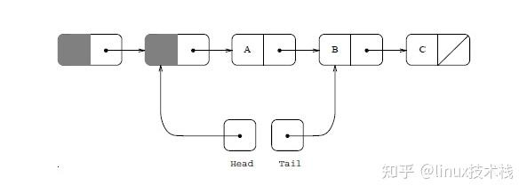
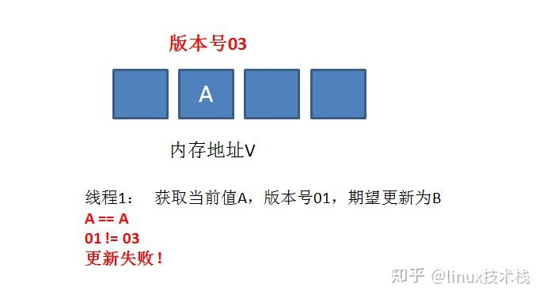
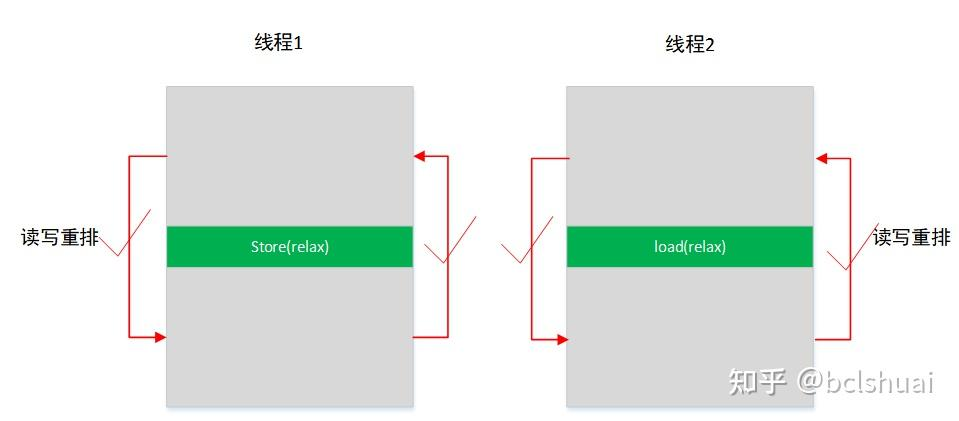
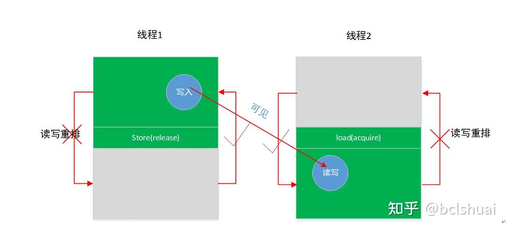
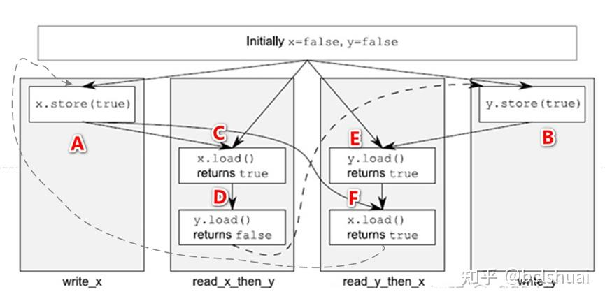
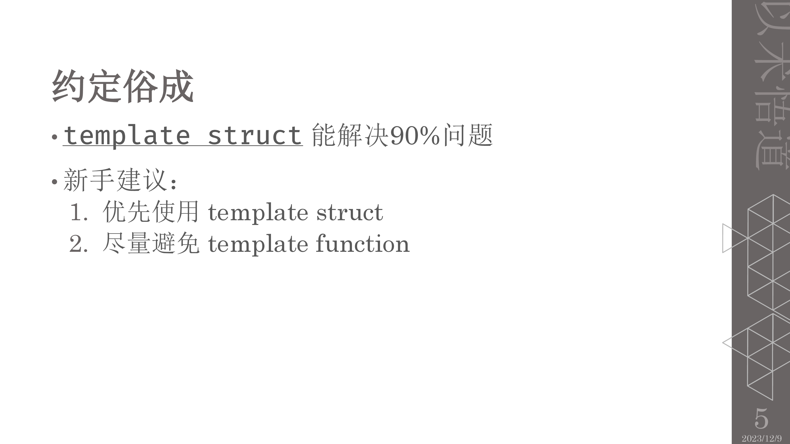
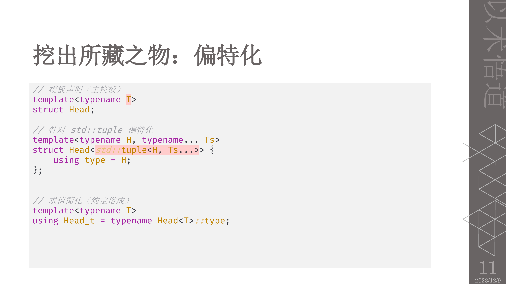
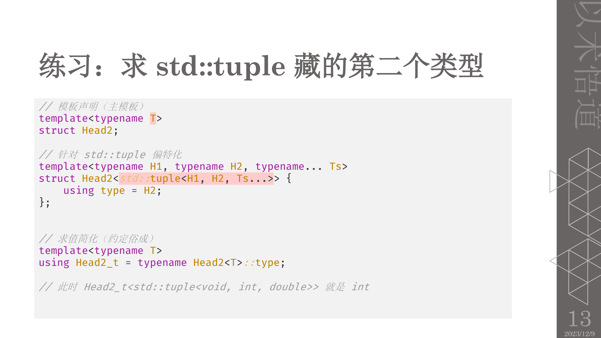
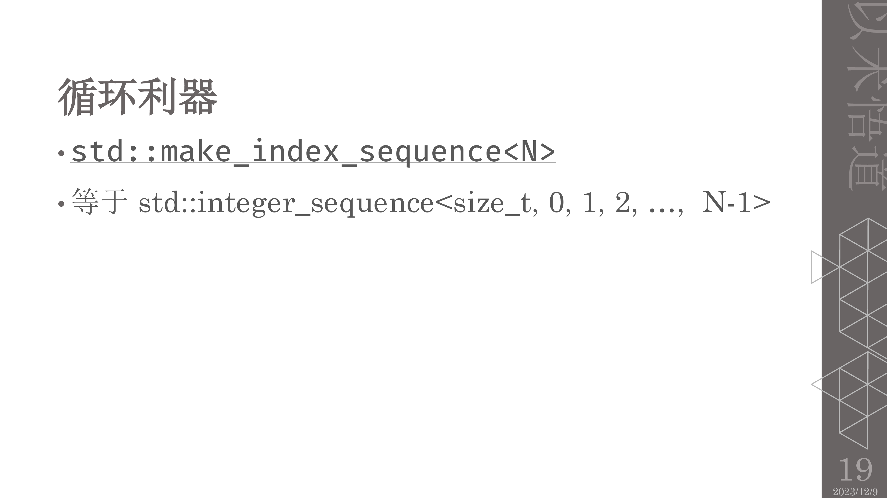
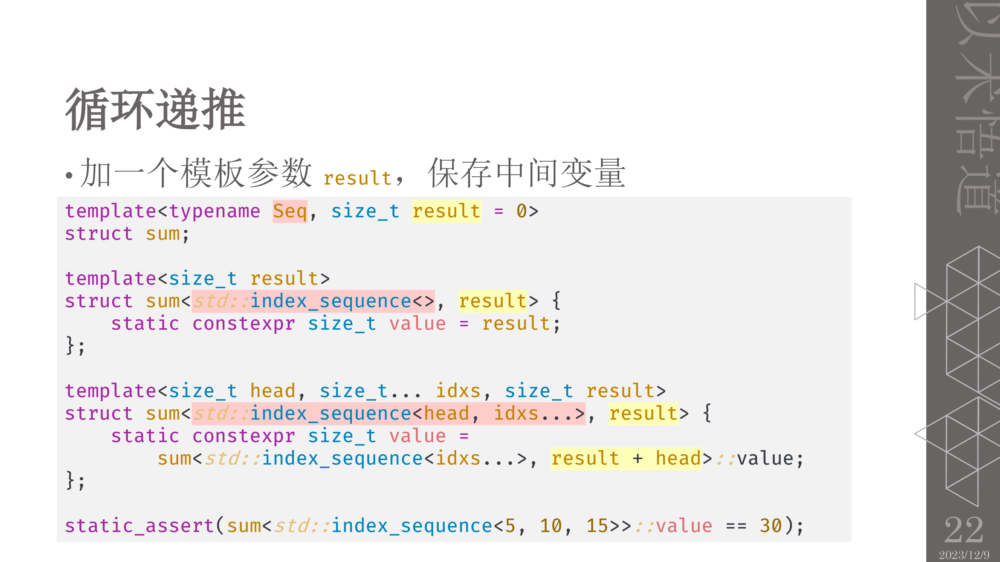



## 小工具
```c++
#pragma once
#ifndef __TOOLS_H__
#define __TOOLS_H__
#include <mutex>
#include <iostream>
#include <fstream>
#include <sstream>
#include <utility>
#include <type_traits>
namespace nao {
	namespace xx {
		class Cout {
		public:
			Cout() { this->mutex().lock(); }
			Cout(const char* file, unsigned int line) {
				this->mutex().lock();
				this->stream() << '[' << file << ':' << line << ']' << ' ';
			}
			~Cout() {
				this->stream() << std::endl;
				::fwrite(this->stream().str().c_str(), 1, this->stream().str().size(), stderr);
				//清空数据
				this->stream().str("");
				this->mutex().unlock();
			}
			std::mutex& mutex() {
				static std::mutex kMtx;
				return kMtx;
			}
			std::ostringstream& stream() {
				static std::ostringstream  kStream;
				return kStream;
			}
		};//class Cout

		//defer的实现
		template <typename F>
		struct Defer {
			Defer(F&& f) : _f(std::forward<F>(f)) {}
			~Defer() { _f(); }
			typename std::remove_reference<F>::type _f;
		};

		template <typename F>
		inline Defer<F> create_defer(F&& f)
		{
			return Defer<F>(std::forward<F>(f));
		}
#define _nao_defer_name_cat(x, n) x##n
#define _nao_defer_make_name(x, n) _nao_defer_name_cat(x, n)
#define _nao_defer_name _nao_defer_make_name(_nao_defer_, __LINE__)
	}//namaspace xx

	namespace now {
		typedef int64_t int64;
		typedef uint32_t uint32;
		//时间戳
		int64 now_ms();
		int64 now_us();
		// "%Y-%m-%d %H:%M:%S" ==> 2018-08-08 08:08:08
		std::string str_time(const char* fm = "%Y-%m-%d %H:%M:%S");
		//自1970-01-01 00:00:00以来的时间,现在时刻的时间戳。使用这个
		int64 epoch_ms();
		int64 epoch_us();
		//休眠
		void sleep_sec(uint32 n);
		void sleep_ms(uint32 n);
		//计时器
		class Timer {
		public:
			Timer() {
				_start = now_us();
			}
			void restart() {
				_start = now_us();
			}
			int64 us() const {
				return now_us() - _start;
			}
			int64 ms()const {
				return this->us() / 1000;
			}
		private:
			int64 _start;
		};//class Timer
	}//namespace now
	//类型转换函数
	template <typename in_type, typename out_type>
	void typeConvert(const in_type& in_value, out_type& out_value) {
		std::stringstream stream;
		stream << in_value;
		stream >> out_value;
	}
}//namespace nao
//控制台输出
#define XOUT   nao::xx::Cout().stream()
#define XLOG   nao::xx::Cout(__FILE__, __LINE__).stream()
//Defer 功能
#define DEFER(e) auto _nao_defer_name = nao::xx::create_defer([&](){ e; })
//禁止拷贝与赋值
#define DISALLOW_COPY_AND_ASSIGN(ClassName) \
    ClassName(const ClassName&) = delete; \
    void operator=(const ClassName&) = delete
//unlikely 功能
#if (defined(__GNUC__) && __GNUC__ >= 3) || defined(__clang__)
static inline bool (likely)(bool x) { return __builtin_expect((x), true); }
static inline bool (unlikely)(bool x) { return __builtin_expect((x), false); }
#else
static inline bool (likely)(bool x) { return x; }
static inline bool (unlikely)(bool x) { return x; }
#endif

#define CLIP_RANGE(value, min, max)  ( (value) > (max) ? (max) : (((value) < (min)) ? (min) : (value)) )
#define SWAP(a, b, t)  do { t = a; a = b; b = t; } while(0)
#include <chrono>
#define TICK(x) auto bench_##x = std::chrono::high_resolution_clock::now();
#define TOCK(x) std::cout << #x ": " << std::chrono::duration_cast<std::chrono::microseconds>(std::chrono::high_resolution_clock::now() - bench_##x).count() << "us" << std::endl;


#endif  //__TOOLS_H__
/*----------------------------------------------------------------------------- (C) COPYRIGHT LEI *****END OF FILE------------------------------------------------------------------------------*/
```

```c++
#include "tools.h"
#ifdef _WIN32
//windows 平台
#include <time.h>
// for struct timeval
#include <winsock2.h>
#ifndef WIN32_LEAN_AND_MEAN
#define WIN32_LEAN_AND_MEAN
#endif
#include <Windows.h>
namespace nao {
	namespace _Mono {
		typedef int64_t int64;
		inline int64 _QueryFrequency() {
			LARGE_INTEGER freq;
			QueryPerformanceFrequency(&freq);
			return freq.QuadPart;
		}

		inline int64 _QueryCounter() {
			LARGE_INTEGER counter;
			QueryPerformanceCounter(&counter);
			return counter.QuadPart;
		}

		inline const int64& _Frequency() {
			static int64 freq = _QueryFrequency();
			return freq;
		}

		inline int64 ms() {
			int64 count = _QueryCounter();
			const int64& freq = _Frequency();
			return (count / freq) * 1000 + (count % freq * 1000 / freq);
		}

		inline int64 us() {
			int64 count = _QueryCounter();
			const int64& freq = _Frequency();
			return (count / freq) * 1000000 + (count % freq * 1000000 / freq);
		}
	}// namespace _Mono
	namespace now {
		int64 now_ms() {
			return _Mono::ms();
		}

		int64 now_us() {
			return _Mono::us();
		}

		std::string str_time(const char* fm) {
			int64 x = time(0);
			struct tm t;
			_localtime64_s(&t, &x);
			char buf[256];
			const std::size_t r = strftime(buf, sizeof(buf), fm, &t);
			return std::string(buf, r);
		}

		inline int64 filetime() {
			FILETIME ft;
			LARGE_INTEGER x;
			GetSystemTimeAsFileTime(&ft);
			x.LowPart = ft.dwLowDateTime;
			x.HighPart = ft.dwHighDateTime;
			return x.QuadPart - 116444736000000000ULL;
		}

		int64 epoch_ms() {
			return filetime() / 10000;
		}

		int64 epoch_us() {
			return filetime() / 10;
		}

		void sleep_sec(uint32 n) {
			::Sleep(n * 1000);
		}

		void sleep_ms(uint32 n) {
			::Sleep(n);
		}
	}//namespace now
}//namespace nao

#else
//非windows平台
#include <time.h>
#include <sys/time.h>
namespace nao {
	namespace _Mono {
#ifdef CLOCK_MONOTONIC
		inline int64 ms() {
			struct timespec t;
			clock_gettime(CLOCK_MONOTONIC, &t);
			return static_cast<int64>(t.tv_sec) * 1000 + t.tv_nsec / 1000000;
		}

		inline int64 us() {
			struct timespec t;
			clock_gettime(CLOCK_MONOTONIC, &t);
			return static_cast<int64>(t.tv_sec) * 1000000 + t.tv_nsec / 1000;
		}
#else
		inline int64 ms() {
			return epoch::ms();
		}

		inline int64 us() {
			return epoch::us();
		}
#endif
	} //namespace  _Mono
	namespace now {
		int64 now_ms() {
			return _Mono::ms();
		}

		int64 now_us() {
			return _Mono::us();
		}

		std::string str_time(const char* fm) {
			time_t x = time(0);
			struct tm t;
			localtime_r(&x, &t);
			char buf[256];
			const size_t r = strftime(buf, sizeof(buf), fm, &t);
			return std::string(buf, r);
		}

		int64 epoch_ms() {
			struct timeval t;
			gettimeofday(&t, 0);
			return static_cast<int64>(t.tv_sec) * 1000 + t.tv_usec / 1000;
		}

		int64 epoch_us() {
			struct timeval t;
			gettimeofday(&t, 0);
			return static_cast<int64>(t.tv_sec) * 1000000 + t.tv_usec;
		}

		void sleep_sec(uint32 n) {
			struct timespec ts;
			ts.tv_sec = n;
			ts.tv_nsec = 0;
			while (nanosleep(&ts, &ts) == -1 && errno == EINTR);
		}

		void sleep_ms(uint32 n) {
			struct timespec ts;
			ts.tv_sec = n / 1000;
			ts.tv_nsec = n % 1000 * 1000000;
			while (nanosleep(&ts, &ts) == -1 && errno == EINTR);
		}
	}//namespace now
}//namespace nao
#endif //_WIN32

```
## 内存对齐
```c++

#pragma pack(1) //让编译器对这个结构作1字节对齐
struct test
{
char x1;
short x2;
float x3;
char x4;
};
#pragma pack() //取消1字节对齐，恢复为默认4字节对齐

```
## 智能指针
```c++
#include <iostream>
#include <string>
#include <memory>

//智能指针的测试
class Student
{

public:
	Student() {};
	Student(int id, int grades, std::string name) :ID(id), Grades(grades), Name(name) {};
	~Student() {};
	int ID;
	int Grades;
	std::string Name;

public:
	void SetStudent(int id,int grades, std::string name)
	{
		this->ID = id;
		this->Grades = grades;
		this->Name = name;
	}
	void PrintStudent()
	{
		std::cout << this->ID << " " << this->Grades << " " << this->Name << std::endl;
	}
};

/*
///参考链接
https://blog.csdn.net/hp_cpp/article/details/103452196
https://blog.csdn.net/qq_41543888/article/details/90269614
https://blog.csdn.net/baidu_41388533/article/details/106559310

*/

void Delete(Student* s)
{
	delete[] s;
}
int main()
{
	Student student0(0,90,"nity");
	student0.PrintStudent();


	//智能指针的方式(构造单个对象)
	std::shared_ptr<Student> student1(new Student(1,91,"nity_noe"), [](Student*s){delete s; });
	//lamba表达式删除
	std::shared_ptr<Student> student2(new Student[5], [](Student*s) {delete[] s;});
	//默认删除
	std::shared_ptr<Student> student3(new Student[5], std::default_delete<Student[]>());
	//函数删除
	std::shared_ptr<Student> student4(new Student[5], Delete);

	//构造单个对象，无参构造
	std::shared_ptr<Student> student5(new Student(), [](Student*s) {delete s;});


	std::shared_ptr<Student> student6(new Student, std::default_delete<Student>());
	//student1->PrintStudent();
	std::weak_ptr<Student> p(student1);
	//引用计数
	std::cout<<p.use_count()<<std::endl;

	//二维指针数组
	//参考 https://segmentfault.com/q/1010000008242849?sort=created
	//参考 https://blog.csdn.net/goldenhawking/article/details/78162094
	//二维数组第一维是动态的，第二维是静态的
	std::shared_ptr<Student[1024][10]> pt(new Student[1024][10], [=](Student(*p)[10])->void {delete[] p; });

	pt[1023][20].ID = 5;
	student5->ID = 5;
	student5->Grades = 95;
	student5->Name = "nity_five";
	student5->PrintStudent();
	system("pause");
	return 0;
}


注意事项：

1、unique_ptr的数组智能指针，没有*和->操作，但支持下标操作[]
2、shared_ptr的数组智能指针，有*和->操作，但不支持下标操作[]，只能通过get()去访问数组的元素。
3、shared_ptr的数组智能指针，必须要自定义deleter，定义可以参考上面的内容。
 参考链接
 https://blog.csdn.net/weixin_30929195/article/details/98524505

unique_str的使用与初始化。
std::unique_ptr<int[]> pnColhistT(new int[nCol] {0});
std::unique_ptr<int[]> pnRowhist(new int[nRow] {0});
其他的初始化方法：
//方法1
std::unique_ptr<int[]> ptr1{ new int[5]{1,2,3,4,5} };
//方法2
auto ptr2 = std::make_unique<std::array<int, 5>>(std::array<int, 5>{1, 2, 3, 4, 5});
//方法3，但还是建议使用vector来表示数组
shared_ptr<vector<int>> ptr3 = make_shared<vector<int>>();


//妙用
class Lock{
public:
//使用某个Mutex初始化shared_ptr,并以unlock函数作为删除器
	explict Lock(Mutex* pm):mutexPtr(pm,unlock){
		lock(mutexPtr.get());
	}
private:
	std::shared_ptr<Mutex> mutexPtr;
}
```

## lamba
[C++ Lambda表达式基本用法（言简意赅，非常清楚)](https://www.cnblogs.com/findumars/p/8062299.html)

lambda表达式的语法归纳如下：

[ caputrue ] ( params ) opt -> ret { body; };

    1).capture是捕获列表；

    2).params是参数表；(选填)

    3).opt是函数选项；可以填mutable,exception,attribute（选填）

    mutable说明lambda表达式体内的代码可以修改被捕获的变量，并且可以访问被捕获的对象的non-const方法。

    exception说明lambda表达式是否抛出异常以及何种异常。

    attribute用来声明属性。

    4).ret是返回值类型。(选填)

    5).body是函数体。

捕获列表：lambda表达式的捕获列表精细控制了lambda表达式能够访问的外部变量，以及如何访问这些变量。

    1).[]不捕获任何变量。

    2).[&]捕获外部作用域中所有变量，并作为引用在函数体中使用（按引用捕获）。

    3).[=]捕获外部作用域中所有变量，并作为副本在函数体中使用(按值捕获)。

    4).[=,&foo]按值捕获外部作用域中所有变量，并按引用捕获foo变量。

    5).[bar]按值捕获bar变量，同时不捕获其他变量。

    6).[this]捕获当前类中的this指针，让lambda表达式拥有和当前类成员函数同样的访问权限。如果已经使用了&或者=，就默认添加此选项。捕获this的目的是可以在lamda中使用当前类的成员函数和成员变量。

虽然按值捕获的变量值均补复制一份存储在lambda表达式变量中， 修改他们也并不会真正影响到外部，但我们却仍然无法修改它们。

那么如果希望去修改按值捕获的外部变量，需要显示指明lambda表达式为mutable。需要注意：被mutable修饰的lambda表达式就算没有参数也要写明参数列表。原因：lambda表达式可以说是就地定义仿函数闭包的“语法糖”。它的捕获列表捕获住的任何外部变量，最终均会变为闭包类型的成员变量。按照C++标准，lambda表达式的operator()默认是const的，一个const成员函数是无法修改成员变量的值的。而mutable的作用，就在于取消operator()的const。

## 将文件间的编译依存关系降至最低
Effective C++条款31：在说这一条款之前，先要了解一下C/C++的编译知识，假设有三个类ComplexClass, SimpleClass1和SimpleClass2，采用头文件将类的声明与类的实现分开，这样共对应于6个文件，分别是ComplexClass.h，ComplexClass.cpp，SimpleClass1.h，SimpleClass1.cpp，SimpleClass2.h，SimpleClass2.cpp。

ComplexClass复合两个BaseClass，SimpleClass1与SimpleClass2之间是独立的，ComplexClass的.h是这样写的：
```c++
#ifndef COMPLESS_CLASS_H
#define COMPLESS_CLASS_H
#include “SimpleClass1.h”
#include “SimpleClass2.h”

class ComplexClass
{
    SimpleClass1 xx;
    SimpleClass2 xxx;
};
…
#endif /* COMPLESS _CLASS_H */
```
我们来考虑以下几种情况：
 Case 1：

现在SimpleClass1.h发生了变化，比如添加了一个新的成员变量，那么没有疑问，SimpleClass1.cpp要重编，SimpleClass2因为与SimpleClass1是独立的，所以SimpleClass2是不需要重编的。

那么现在的问题是，ComplexClass需要重编吗？

答案是“是”，因为ComplexClass的头文件里面包含了SimpleClass1.h（使用了SimpleClass1作为成员对象的类），而且所有使用ComplexClass类的对象的文件，都需要重新编译！

如果把ComplexClass里面的#include “SimpleClass1.h”给去掉，当然就不会重编ComplexClass了，但问题是也不能通过编译了，因为ComplexClass里面声明了SimpleClass1的对象xx。那如果把#include “SimpleClass1.h”换成类的声明class SimpleClass1，会怎么样呢？能通过编译吗？

答案是“否”，因为编译器需要知道ComplexClass成员变量SimpleClass1对象的大小，而这些信息仅由class SimpleClass1是不够的，但如果SimpleClass1作为一个函数的形参，或者是函数返回值，用class SimpleClass1声明就够了。如：
```c++
// ComplexClass.h
class SimpleClass1;
…
SimpleClass1 GetSimpleClass1() const;
…
```
但如果换成指针呢？像这样：
```c++
// ComplexClass.h
#include “SimpleClass2.h”
class SimpleClass1;

class ComplexClass:
{
    SimpleClass1* xx;
    SimpleClass2 xxx;
};
```
 答案是“是”，因为编译器视所有指针为一个字长（在32位机器上是4字节），因此class SimpleClass1的声明是够用了。但如果要想使用SimpleClass1的方法，还是要包含SimpleClass1.h，但那是ComplexClass.cpp做的，因为ComplexClass.h只负责类变量和方法的声明。

那么还有一个问题，如果使用SimpleClass1*代替SimpleClass1后，SimpleClass1.h变了，ComplexClass需要重编吗？

先看Case2：

回到最初的假定上（成员变量不是指针），现在SimpleClass1.cpp发生了变化，比如改变了一个成员函数的实现逻辑（换了一种排序算法等），但SimpleClass1.h没有变，那么SimpleClass1一定会重编，SimpleClass2因为独立性不需要重编，那么现在的问题是，ComplexClass需要重编吗？
答案是“否”，因为编译器重编的条件是发现一个变量的类型或者大小跟之前的不一样了，但现在SimpleClass1的接口并没有任务变化，只是改变了实现的细节，所以编译器不会重编。

Case 3：结合Case1和Case2，现在我们来看看下面的做法：
```c++
// ComplexClass.h
#include “SimpleClass2.h”

class SimpleClass1;

class ComplexClass
{
    SimpleClass1* xx;
    SimpleClass2 xxx;
};


// ComplexClass.cpp

void ComplexClass::Fun()
{
    SimpleClass1->FunMethod();
}
```

请问上面的ComplexClass.cpp能通过编译吗？

答案是“否”，因为这里用到了SimpleClass1的具体的方法，所以需要包含SimpleClass1的头文件，但这个包含的行为已经从ComplexClass里面拿掉了（换成了class SimpleClass1），所以不能通过编译。

如果解决这个问题呢？其实很简单，只要在ComplexClass.cpp里面加上#include “SimpleClass1.h”就可以了。换言之，我们其实做的就是将ComplexClass.h的#include “SimpleClass1.h”移至了ComplexClass1.cpp里面，而在原位置放置class SimpleClass1。如下：

```c++
// ComplexClass.h
#include “SimpleClass2.h”
class SimpleClass1;
class ComplexClass
{
    SimpleClass1* xx;
    SimpleClass2 xxx;
};

// ComplexClass.cpp
#include "SimpleClass1.h"
void ComplexClass::Fun()
{
    SimpleClass1->FunMethod();
}
```
这样做是为了什么？假设这时候SimpleClass1.h发生了变化，会有怎样的结果呢？

SimpleClass1自身一定会重编，SimpleClass2当然还是不用重编的，ComplexClass.cpp因为包含了SimpleClass1.h，所以需要重编，但换来的好处就是所有用到ComplexClass的其他地方，它们所在的文件不用重编了！因为ComplexClass的头文件没有变化，接口没有改变！

总结一下，对于C++类而言，如果它的头文件变了，那么所有这个类的对象所在的文件都要重编，但如果它的实现文件（cpp文件）变了，而头文件没有变（对外的接口不变），那么所有这个类的对象所在的文件都不会因之而重编。

因此，避免大量依赖性编译的解决方案就是：在头文件中用class声明外来类，用指针或引用代替变量的声明；在cpp文件中包含外来类的头文件。

上述方法称为Handle classes， 降低文件间的编译依存关系还有一种方法，称为Interface classes，如下

从上面也可以看出，避免重编的诀窍就是保持头文件（接口）不变化，而保持接口不变化的诀窍就是不在里面声明编译器需要知道大小的变量，Handler Classes的处理就是把变量换成变量的地址（指针），头文件只有class xxx的声明，而在cpp里面才包含xxx的头文件。Interface Classes则是利用继承关系和多态的特性，在父类里面只包含成员方法（成员函数），而没有成员变量，像这样：

```c++
// Person.h
#include <string>
using namespace std;

class MyAddress;
class MyDate;
class RealPerson;

class Person
{
public:
    virtual string GetName() const = 0;
    virtual string GetBirthday() const = 0;
    virtual string GetAddress() const = 0;
    virtual ~Person(){}
};
```
```c++
// RealPerson.h
#include "Person.h"
#include "MyAddress.h"
#include "MyDate.h"

class RealPerson: public Person
{
private:
    string Name;
    MyAddress Address;
    MyDate Birthday;
public:
    RealPerson(string name, const MyAddress& addr, const MyDate& date):Name(name), Address(addr), Birthday(date){}
    virtual string GetName() const;
    virtual string GetAddress() const;
    virtual string GetBirthday() const;
};
```
在RealPerson.cpp里面去实现GetName()等方法。从这里我们可以看到，只有子类里面才有成员变量，也就是说，如果Address的头文件变化了，那么子类一定会重编，所有用到子类头文件的文件也要重编，所以为了防止重编，应该尽量少用子类的对象。利用多态特性，我们可以使用父类的指针，像这样Person* p = new RealPerson(xxx)，然后p->GetName()实际上是调用了子类的GetName()方法。

但这样还有一个问题，就是new RealPerson()这句话一写，就需要RealPerson的构造函数，那么RealPerson的头文件就要暴露了，这样可不行。还是只能用Person的方法，所以我们在Person.h里面加上这个方法：

```c++
// Person.h
#include <string>
using namespace std;

class MyAddress;
class MyDate;
class RealPerson;

class Person
{
public:
    static Person* CreatePerson(const string &name, const MyAddress& addr, const MyDate& date);
    virtual string GetName() const = 0;
    virtual string GetBirthday() const = 0;
    virtual string GetAddress() const = 0;
    virtual ~Person(){}
};
```

注意这个方法是静态的（没有虚特性），它被父类和所有子类共有，可以在子类中去实现它：
```c++
// RealPerson.cpp
#include “Person.h”
Person* Person::CreatePerson(string name, const MyAddress& addr, const MyDate& date)
{
    return new RealPerson(name, addr, date);
}
```
这样在客户端代码里面，可以这样写：
```c++
// Main.h
class MyAddress;
class MyDate;
void ProcessPerson(const string& name, const MyAddress& addr, const MyDate& date);
```
```c++
// Main.cpp
#include "Person.h"
#include “MyAddress.h”;
#include “MyDate.h”;

void ProcessPerson(const string& name, const MyAddress& addr, const MyDate& date)
{
    Person* p = Person::CreatePerson(name, addr, date);
…
}
```
 就可以减少编译依赖了。

总结一下，Handler classes与Interface classes解除了接口和实现之间的耦合关系，从而降低文件间的编译依存性。减少编译依存性的关键在于保持.h文件不变化，具体地说，是保持被大量使用的类的.h文件不变化，这里谈到了两个方法：Handler classes与Interface classes。

Handler classes化类的成员变量为指针，在.h文件里面只包含class xxx的外来类声明，而不包含其头文件，在.cpp涉及到具体外来类的使用时，才包含xxx.h的头文件，这样最多只影响本身类的cpp重编，但因为.h文件没有变化，所以此类的对象存在的文件不必重编。

当然，书上说的Handler classes更想让我们在类A的基础上另造一个中间类AImp（成员函数完全与类A一致），这个中间类的成员中里面放置了所有类A需要的外来类的对象，然后类的逻辑细节完全在Almp.cpp中实现，而在A.cpp里面只是去调用Almp.cpp的同名方法。A.h的成员变量只有Almp的指针，这看上去好像一个Handler，因此而得名。

Interface classes则是将细节放在子类中，父类只是包含虚方法和一个静态的Create函数声明，子类将虚方法实现，并实现Create接口。利用多态特性，在客户端只需要使用到Person的引用或者指针，就可以访问到子类的方法。由于父类的头文件里面不包含任何成员变量，所以不会导致重编（其实由于父类是虚基类，不能构造其对象，所以也不用担心由于父类头文件变化导致的重编问题）。

 请记住：

	1. 支持“编译依存性最小化”的一般构想是：相依于声明式，不要相依于定义式，基于此构想的两个手段是Handler classes和Interface classes。

	2. 程序库头文件应该以“完全且仅有声明式”的形式存在，这种做法不论是否涉及templates都适用。

## 强制类型转换运算符

C++ 引入了四种功能不同的强制类型转换运算符以进行强制类型转换：static_cast、reinterpret_cast、const_cast 和 dynamic_cast。
static_cast 用于进行比较“自然”和低风险的转换，如整型和浮点型、字符型之间的互相转换。另外，如果对象所属的类重载了强制类型转换运算符 T（如 T是 int、int* 或其他类型名），则 static_cast 也能用来进行对象到 T 类型的转换。

static_cast 不能用于在不同类型的指针之间互相转换，也不能用于整型和指针之间的互相转换，当然也不能用于不同类型的引用之间的转换。因为这些属于风险比较高的转换。

static_cast 用法示例如下：
```c++
#include <iostream>

using namespace std;

class A
{
public:
    operator int() { return 1; }
    operator char*() { return NULL; }
};

int main()
{
    A a;
    int n;
    const char* p = "This is a str for static_cast";
    n = static_cast <int> (3.14);       // n 的值变为 3
    n = static_cast <int> (a);              // 调用 a.operator int, n 的值变为 1
    p = static_cast <char*> (a);            // 调用 a.operator char*，p 的值变为 NULL
    // n = static_cast <int> (p);           // 编译错误，static_cast不能将指针转换成整型
    // p = static_cast <char*> (n);     // 编译错误，static_cast 不能将整型转换成指针
    return 0;
}
```
reinterpret_cast

reinterpret_cast 用于进行各种不同类型的指针之间、不同类型的引用之间以及指针和能容纳指针的整数类型之间的转换，reinterpret_cast 转换时，执行的过程是逐个比特复制的操作。

这种转换提供了很强的灵活性，但转换的安全性只能由程序员的细心来保证了。例如，程序员执意要把一个 int* 指针、函数指针或其他类型的指针转换成 string* 类型的指针也是可以的，至于以后用转换后的指针调用 string 类的成员函数引发错误，程序员也只能自行承担查找错误的烦琐工作：（C++ 标准不允许将函数指针转换成对象指针，但有些编译器，如 Visual Studio 2010，则支持这种转换）。

reinterpret_cast 用法示例如下：

```c++
#include <iostream>

using namespace std;

class A
{
public:
    int i;
    int j;
    A(int n) :i(n), j(n) { }
};

int main()
{
    A a(100);
    int &r = reinterpret_cast<int&>(a);             // 强行让 r 引用 a
    r = 200;                                                            // 把 a.i 变成了 200
    cout << a.i << "," << a.j << endl;                  // 输出 200,100
    int n = 300;
    A *pa = reinterpret_cast<A*> (&n);              // 强行让 pa 指向 n
    pa->i = 400;                                                    // n 变成 400
    pa->j = 500;                                                    // 此条语句不安全，很可能导致程序崩溃
    cout << n << endl;                                          // 输出 400
    long long la = 0x12345678abcdLL;
    pa = reinterpret_cast<A*>(la);                      // la太长，只取低32位0x5678abcd拷贝给pa
    unsigned int u = reinterpret_cast<unsigned int>(pa);    // pa逐个比特拷贝到u
    cout << hex << u << endl;                               // 输出 5678abcd
    typedef void(*PF1) (int);
    typedef int(*PF2) (int, char *);
    PF1 pf1 = nullptr;
    PF2 pf2;
	pf2 = reinterpret_cast<PF2>(pf1);                   // 两个不同类型的函数指针之间可以互相转换
}
```
在编译的过程中，就会有强行转换的截断提示了。所以不建议强行转换某些类型。

第 19 行的代码不安全，因为在编译器看来，pa->j 的存放位置就是 n 后面的 4 个字节。 本条语句会向这 4 个字节中写入 500。但这 4 个字节不知道是用来存放什么的，贸然向其中写入可能会导致程序错误甚至崩溃。

const_cast

const_cast 运算符仅用于进行去除 const 属性的转换，它也是四个强制类型转换运算符中唯一能够去除 const 属性的运算符。

将 const 引用转换为同类型的非 const 引用，将 const 指针转换为同类型的非 const 指针时可以使用 const_cast 运算符。例如：
```c++
const string s = "Inception";
string& p = const_cast <string&> (s);
string* ps = const_cast <string*> (&s);  // &s 的类型是 const string*
```
```c++
#include <iostream>
#include <string>

using namespace std;

class A
{
public:
    const double i = 5.0;
    const int j = 10;
    const string m_s = "Test String.";
    float f = 2.0f;
};

int main()
{
    A a;
    cout << a.i << '\t' << a.j << '\t' << a.m_s << endl;
    string& p_str = const_cast<string&> (a.m_s);
    p_str = "New Test String!.";
    cout << a.i << '\t' << a.j << '\t' << a.m_s << endl;
    cout << p_str << endl;
    string* ps = const_cast<string*>(&a.m_s);
    *ps = "Point Test String";
    cout << a.i << '\t' << a.j << '\t' << a.m_s << endl;
    cout << ps << '\t' << *ps << endl;
    // int& p_i = const_cast<int&>(a.i); //  不允许修改基础类型的const，只能改类型限定符
    // p_i = 200;
	const A ca;
    A& pa = const_cast<A&>(ca);
    pa.f = 30.0f;
    cout << ca.i << '\t' << ca.j << '\t' << ca.m_s << '\t' << ca.f << endl;
    cout << pa.i << '\t' << pa.j << '\t' << pa.m_s << '\t' << pa.f << endl;
}
```
dynamic_cast

用 reinterpret_cast 可以将多态基类（包含虚函数的基类）的指针强制转换为派生类的指针，但是这种转换不检查安全性，即不检查转换后的指针是否确实指向一个派生类对象。dynamic_cast专门用于将多态基类的指针或引用强制转换为派生类的指针或引用，而且能够检查转换的安全性。对于不安全的指针转换，转换结果返回 NULL 指针。

dynamic_cast 是通过“运行时类型检查”来保证安全性的。dynamic_cast 不能用于将非多态基类的指针或引用强制转换为派生类的指针或引用——这种转换没法保证安全性，只好用 reinterpret_cast 来完成。

dynamic_cast 示例程序如下：
```c++
#include <iostream>
#include <string>

using namespace std;

class Base
{
//有虚函数，因此是多态基类
public:
    virtual ~Base() {}
};

class Derived : public Base { };

int main()
{
    Base b;
    Derived d;
    Derived* pd;
    pd = reinterpret_cast <Derived*> (&b);
    if (pd == NULL)
        //此处pd不会为 NULL。reinterpret_cast不检查安全性，总是进行转换
        cout << "unsafe reinterpret_cast" << endl; //不会执行
    pd = dynamic_cast <Derived*> (&b);
    if (pd == NULL)  //结果会是NULL，因为 &b 不指向派生类对象，此转换不安全
        cout << "unsafe dynamic_cast1" << endl;  //会执行
    pd = dynamic_cast <Derived*> (&d);  //安全的转换
    if (pd == NULL)  //此处 pd 不会为 NULL
        cout << "unsafe dynamic_cast2" << endl;  //不会执行
    return 0;
}
```
那该如何判断该转换是否安全呢？

不存在空引用，因此不能通过返回值来判断转换是否安全。C++ 的解决办法是：dynamic_cast 在进行引用的强制转换时，如果发现转换不安全，就会拋出一个异常，通过处理异常，就能发现不安全的转换。


## 关键词
### volatile

volatile 关键字是一种类型修饰符，用它声明的类型变量表示可以被某些编译器未知的因素更改，比如：操作系统、硬件或者其它线程等。遇到这个关键字声明的变量，编译器对访问该变量的代码就不再进行优化，从而可以提供对特殊地址的稳定访问。声明时语法：int volatile vInt; 当要求使用 volatile 声明的变量的值的时候，系统总是重新从它所在的内存读取数据，即使它前面的指令刚刚从该处读取过数据。而且读取的数据立刻被保存。例如：
```c++
volatile int i=10;
int a = i;
...
// 其他代码，并未明确告诉编译器，对 i 进行过操作
int b = i;
```
volatile 指出 i 是随时可能发生变化的，每次使用它的时候必须从 i的地址中读取，因而编译器生成的汇编代码会重新从i的地址读取数据放在 b 中。而优化做法是，由于编译器发现两次从 i读数据的代码之间的代码没有对 i 进行过操作，它会自动把上次读的数据放在 b 中。而不是重新从 i 里面读。这样以来，如果 i是一个寄存器变量或者表示一个端口数据就容易出错，所以说 volatile 可以保证对特殊地址的稳定访问。注意，在 VC 6 中，一般调试模式没有进行代码优化，所以这个关键字的作用看不出来。下面通过插入汇编代码，测试有无 volatile 关键字，对程序最终代码的影响，输入下面的代码：
```c++
#include <stdio.h>

void main()
{
    int i = 10;
    int a = i;

    printf("i = %d", a);

    // 下面汇编语句的作用就是改变内存中 i 的值
    // 但是又不让编译器知道
    __asm {
        mov dword ptr [ebp-4], 20h
    }

    int b = i;
    printf("i = %d", b);
}
```
在 Debug 版本模式运行程序，输出结果如下：`i = 10  i = 32` 在 Release 版本模式运行程序，输出结果如下：`i = 10 i = 10`
输出的结果明显表明，Release 模式下，编译器对代码进行了优化，第二次没有输出正确的 i 值。下面，我们把 i 的声明加上 volatile 关键字，看看有什么变化：
```c++
#include <stdio.h>

void main
{
    volatile int i = 10;
    int a = i;

    printf("i = %d", a);
    __asm {
        mov dword ptr [ebp-4], 20h
    }

    int b = i;
    printf("i = %d", b);
}
```
分别在 Debug 和 Release 版本运行程序，输出都是：` i = 10  i = 32 `

这说明这个 volatile 关键字发挥了它的作用。其实不只是内嵌汇编操纵栈"这种方式属于编译无法识别的变量改变，另外更多的可能是多线程并发访问共享变量时，一个线程改变了变量的值，怎样让改变后的值对其它线程 visible。一般说来，volatile用在如下的几个地方：

    1) 中断服务程序中修改的供其它程序检测的变量需要加 volatile；
    2) 多任务环境下各任务间共享的标志应该加 volatile；
    3) 存储器映射的硬件寄存器通常也要加 volatile 说明，因为每次对它的读写都可能由不同意义；

多线程下的volatile

有些变量是用 volatile 关键字声明的。当两个线程都要用到某一个变量且该变量的值会被改变时，应该用 volatile 声明，该关键字的作用是防止优化编译器把变量从内存装入 CPU 寄存器中。如果变量被装入寄存器，那么两个线程有可能一个使用内存中的变量，一个使用寄存器中的变量，这会造成程序的错误执行。volatile 的意思是让编译器每次操作该变量时一定要从内存中真正取出，而不是使用已经存在寄存器中的值，如下：`volatile  BOOL  bStop  =  FALSE;`

```c++
//在一个线程中
while(  !bStop  )  {  ...  }
bStop  =  FALSE;
return;

//在另外一个线程中
bStop  =  TRUE;
while(  bStop  );  //等待上面的线程终止，如果bStop不使用volatile申明，那么这个循环将是一个死循环，因为bStop已经读取到了寄存器中，寄存器中bStop的值永远不会变成FALSE，加上volatile，程序在执行时，每次均从内存中读出bStop的值，就不会死循环了。
```
这个关键字是用来设定某个对象的存储位置在内存中，而不是寄存器中。因为一般的对象编译器可能会将其的拷贝放在寄存器中用以加快指令的执行速度，例如下段代码中：

```c++
...
int  nMyCounter  =  0;
for(;  nMyCounter<100;nMyCounter++)
{
...
}
...

```
在此段代码中，nMyCounter 的拷贝可能存放到某个寄存器中（循环中，对 nMyCounter 的测试及操作总是对此寄存器中的值进行），但是另外又有段代码执行了这样的操作：nMyCounter -= 1; 这个操作中，对 nMyCounter 的改变是对内存中的 nMyCounter 进行操作，于是出现了这样一个现象：nMyCounter 的改变不同步。

其他参考链接： https://zhuanlan.zhihu.com/p/112742540

### constexpr
在普通函数中的使用constexpr
```c++
#include <iostream>
constexpr int Getlen(int a ,int b ){
    return a+b;
}
int main(){
    int std::array[Getlen(1,2)];
    return 0;

}

```
未用constexpr时，数组的大小必须是常量，在声明数组array时，用函数返回值，此时会报错：error C2131: 表达式的计算结果不是常数，note: 对未定义的函数或为未声明为“constexpr”的函数的调用导致了故障。用constexpr关键字可以解决这种问题，在GetLen函数前加constexpr声明。
当然，constexpr修饰的函数也有一定的限制：

    函数体尽量只包含一个return语句，多个可能会编译出错；
    函数体可以包含其他语句，但是不能是运行期语句，只能是编译期语句；

编译器会将constexpr函数视为内联函数！所以在编译时若能求出其值，则会把函数调用替换成结果值。

在类的构造函数中也可以使用constexpr关键字
constexpr还能修饰类的构造函数，即保证传递给该构造函数的所有参数都是constexpr，那么产生的对象的所有成员都是constexpr。该对象是constexpr对象了，可用于只使用constexpr的场合。注意constexpr构造函数的函数体必须为空，所有成员变量的初始化都放到初始化列表中。

```c++
#include <iostream>
using namespace std;

class Test
{
public:
	constexpr Test(int num1, int num2) : m_num1(num1), m_num2(num2)
	{

	}

public:
	int m_num1;
	int m_num2;
};

int main(void)
{
	constexpr Test t1(1, 2);

	enum e
	{
		x = t1.m_num1,
		y = t1.m_num2
	};

	return 0;
}
```
const和constexpr对指针的修饰有什么差别呢？

    const 和 constexpr 变量之间的主要区别在于：const 变量的初始化可以延迟到运行时，而 constexpr 变量必须在编译时进行初始化。所有 constexpr 变量均为常量，因此必须使用常量表达式初始化。
    constexpr和指针
    在使用const时，如果关键字const出现在星号左边，表示被指物是常量；如果出现在星号右边，表示指针本身是常量；如果出现在星号两边，表示被指物和指针两者都是常量。

    与const不同，在constexpr声明中如果定义了一个指针，限定符constexpr仅对指针有效，与指针所指对象无关。
    constexpr是一种很强的约束，更好的保证程序的正确定语义不被破坏；编译器可以对constexper代码进行非常大的优化，例如：将用到的constexpr表达式直接替换成结果, 相比宏来说没有额外的开销。


```c++
#include <iostream>
using namespace std;

int g_tempA = 4;
const int g_conTempA = 4;
constexpr int g_conexprTempA = 4;

int main(void)
{
	int tempA = 4;
	const int conTempA = 4;
	constexpr int conexprTempA = 4;

	/*1.正常运行,编译通过*/
	const int *conptrA = &tempA;
	const int *conptrB = &conTempA;
	const int *conptrC = &conexprTempA;

	/*2.局部变量的地址要运行时才能确认，故不能在编译期决定，编译不过*/
	constexpr int *conexprPtrA = &tempA;
	constexpr int *conexprPtrB = &conTempA;
	constexpr int *conexprPtrC = &conexprTempA;

	/*3.第一个通过，后面两个不过,因为constexpr int *所限定的是指针是常量，故不能将常量的地址赋给顶层const*/
	constexpr int *conexprPtrD = &g_tempA;
	constexpr int *conexprPtrE = &g_conTempA;
	constexpr int *conexprPtrF = &g_conexprTempA;

	/*4.局部变量的地址要运行时才能确认，故不能在编译期决定，编译不过*/
	constexpr const int *conexprConPtrA = &tempA;
	constexpr const int *conexprConPtrB = &conTempA;
	constexpr const int *conexprConPtrC = &conexprTempA;
	/*5.正常运行，编译通过*/
	constexpr const int *conexprConPtrD = &g_tempA;
	constexpr const int *conexprConPtrE = &g_conTempA;
	constexpr const int *conexprConPtrF = &g_conexprTempA;

	return 0;
}
```

对引用的修饰

```c++
#include <iostream>
using namespace std;

int g_tempA = 4;
const int g_conTempA = 4;
constexpr int g_conexprTempA = 4;

int main(void)
{
	int tempA = 4;
	const int conTempA = 4;
	constexpr int conexprTempA = 4;
	/*1.正常运行，编译通过*/
	const int &conptrA = tempA;
	const int &conptrB = conTempA;
	const int &conptrC = conexprTempA;

	/*2.有两个问题：一是引用到局部变量，不能再编译器确定；二是conexprPtrB和conexprPtrC应该为constexpr const类型，编译不过*/
	constexpr int &conexprPtrA = tempA;
	constexpr int &conexprPtrB = conTempA;
	constexpr int &conexprPtrC = conexprTempA;

	/*3.第一个编译通过，后两个不通过，原因是因为conexprPtrE和conexprPtrF应该为constexpr const类型*/
	constexpr int &conexprPtrD = g_tempA;
	constexpr int &conexprPtrE = g_conTempA;
	constexpr int &conexprPtrF = g_conexprTempA;

	/*4.正常运行，编译通过*/
	constexpr const int &conexprConPtrD = g_tempA;
	constexpr const int &conexprConPtrE = g_conTempA;
	constexpr const int &conexprConPtrF = g_conexprTempA;

	return 0;
}
```
简单的说constexpr所引用的对象必须在编译期就决定地址。还有一个奇葩的地方就是可以通过上例conexprPtrD来修改g_tempA的值，也就是说constexpr修饰的引用不是常量，如果要确保其实常量引用需要constexpr const来修饰。


### mutable
mutable的中文意思是“可变的，易变的”，跟constant（既C++中的const）是反义词。

在C++中，mutable也是为了突破const的限制而设置的。被mutable修饰的变量，将永远处于可变的状态，即使在一个const函数中。

我们知道，如果类的成员函数不会改变对象的状态，那么这个成员函数一般会声明成const的。但是，有些时候，我们需要在const的函数里面修改一些跟类状态无关的数据成员，那么这个数据成员就应该被mutalbe来修饰。
```c++
class ClxTest
{
　public:
　　void Output() const;
};
void ClxTest::Output() const
{
　cout << "Output for test!" << endl;
}
void OutputTest(const ClxTest& lx)
{
　lx.Output();
}
```
类ClxTest的成员函数Output是用来输出的，不会修改类的状态，所以被声明为const的。

函数OutputTest也是用来输出的，里面调用了对象lx的Output输出方法，为了防止在函数中调用其他成员函数修改任何成员变量，所以参数也被const修饰。

如果现在，我们要增添一个功能：计算每个对象的输出次数。如果用来计数的变量是普通的变量的话，那么在const成员函数Output里面是不能修改该变量的值的；而该变量跟对象的状态无关，所以应该为了修改该变量而去掉Output的const属性。这个时候，就该我们的mutable出场了——只要用mutalbe来修饰这个变量，所有问题就迎刃而解了。

```c++
class ClxTest
{
　public:
　　ClxTest();
　　~ClxTest();

　　void Output() const;
　　int GetOutputTimes() const;

　private:
　　mutable int m_iTimes;
};

ClxTest::ClxTest()
{
　m_iTimes = 0;
}

ClxTest::~ClxTest()
{}

void ClxTest::Output() const
{
　cout << "Output for test!" << endl;
　m_iTimes++;
}

int ClxTest::GetOutputTimes() const
{
　return m_iTimes;
}

void OutputTest(const ClxTest& lx)
{
　cout << lx.GetOutputTimes() << endl;
　lx.Output();
　cout << lx.GetOutputTimes() << endl;
}

```
计数器m_iTimes被mutable修饰，那么它就可以突破const的限制，在被const修饰的函数里面也能被修改。

### noexecpt
该关键字告诉编译器，函数中不会发生异常,这有利于编译器对程序做更多的优化。
如果在运行时，noexecpt函数向外抛出了异常（如果函数内部捕捉了异常并完成处理，这种情况不算抛出异常），程序会直接终止，调用std::terminate()函数，该函数内部会调用std::abort()终止程序。

换一句话的意思就是，不传递异常，在异常处直接终止，便于查找bug。
```c++
    void swap(Type& x, Type& y) throw()   //C++11之前
    {
        x.swap(y);
    }
    void swap(Type& x, Type& y) noexcept  //C++11
    {
        x.swap(y);
    }

    void swap(Type& x, Type& y) noexcept(noexcept(x.swap(y)))    //C++11
    {
        x.swap(y);
    }

```
使用noexcept表明函数或操作不会发生异常，会给编译器更大的优化空间。然而，并不是加上noexcept就能提高效率，步子迈大了也容易扯着蛋。
以下情形鼓励使用noexcept：

    移动构造函数（move constructor）
    移动分配函数（move assignment）
    析构函数（destructor）。这里提一句，在新版本的编译器中，析构函数是默认加上关键字noexcept的。下面代码可以检测编译器是否给析构函数加上关键字noexcept。

```c++
    struct X
    {
        ~X() { };
    };

    int main()
    {
        X x;

        // This will not fire even in GCC 4.7.2 if the destructor is
        // explicitly marked as noexcept(true)
        static_assert(noexcept(x.~X()), "Ouch!");
    }
```
### explicit
C++中的explicit关键字只能用于修饰只有一个参数的类构造函数, 它的作用是表明该构造函数是显示的, 而非隐式的,

```c++
class CxString  // 没有使用explicit关键字的类声明, 即默认为隐式声明
{
public:
    char *_pstr;
    int _size;
    CxString(int size)
    {
        _size = size;                // string的预设大小
        _pstr = malloc(size + 1);    // 分配string的内存
        memset(_pstr, 0, size + 1);
    }
    CxString(const char *p)
    {
        int size = strlen(p);
        _pstr = malloc(size + 1);    // 分配string的内存
        strcpy(_pstr, p);            // 复制字符串
        _size = strlen(_pstr);
    }
    // 析构函数这里不讨论, 省略...
};

    // 下面是调用:

    CxString string1(24);     // 这样是OK的, 为CxString预分配24字节的大小的内存
    CxString string2 = 10;    // 这样是OK的, 为CxString预分配10字节的大小的内存
    CxString string3;         // 这样是不行的, 因为没有默认构造函数, 错误为: “CxString”: 没有合适的默认构造函数可用
    CxString string4("aaaa"); // 这样是OK的
    CxString string5 = "bbb"; // 这样也是OK的, 调用的是CxString(const char *p)
    CxString string6 = 'c';   // 这样也是OK的, 其实调用的是CxString(int size), 且size等于'c'的ascii码
    string1 = 2;              // 这样也是OK的, 为CxString预分配2字节的大小的内存
    string2 = 3;              // 这样也是OK的, 为CxString预分配3字节的大小的内存
    string3 = string1;        // 这样也是OK的, 至少编译是没问题的, 但是如果析构函数里用free释放_pstr内存指针的时候可能会报错, 完整的代码必须重载运算符"=", 并在其中处理内存释放
/*
上面的代码中, "CxString string2 = 10;" 这句为什么是可以的呢? 在C++中, 如果的构造函数只有一个参数时, 那么在编译的时候就会有一个缺省的转换操作:将该构造函数对应数据类型的数据转换为该类对象. 也就是说 "CxString string2 = 10;" 这段代码, 编译器自动将整型转换为CxString类对象, 实际上等同于下面的操作:
*/
CxString string2(10);
//或
CxString temp(10);
CxString string2 = temp;
/*
但是, 上面的代码中的_size代表的是字符串内存分配的大小, 那么调用的第二句 "CxString string2 = 10;" 和第六句 "CxString string6 = 'c';" 就显得不伦不类, 而且容易让人疑惑. 有什么办法阻止这种用法呢? 答案就是使用explicit关键字. 我们把上面的代码修改一下, 如下:
*/
class CxString  // 使用关键字explicit的类声明, 显示转换
{
public:
    char *_pstr;
    int _size;
    explicit CxString(int size)
    {
        _size = size;
        // 代码同上, 省略...
    }
    CxString(const char *p)
    {
        // 代码同上, 省略...
    }
};

    // 下面是调用:

    CxString string1(24);     // 这样是OK的
    CxString string2 = 10;    // 这样是不行的, 因为explicit关键字取消了隐式转换
    CxString string3;         // 这样是不行的, 因为没有默认构造函数
    CxString string4("aaaa"); // 这样是OK的
    CxString string5 = "bbb"; // 这样也是OK的, 调用的是CxString(const char *p)
    CxString string6 = 'c';   // 这样是不行的, 其实调用的是CxString(int size), 且size等于'c'的ascii码, 但explicit关键字取消了隐式转换
    string1 = 2;              // 这样也是不行的, 因为取消了隐式转换
    string2 = 3;              // 这样也是不行的, 因为取消了隐式转换
    string3 = string1;        // 这样也是不行的, 因为取消了隐式转换, 除非类实现操作符"="的重载
```

### __restrict__

restrict 用来定义指针变量，表明该变量没有别名，意思就是：除了该变量以外，没有别的方法可以访问其指向的地址空间。

```c++
/*
mov eax val;
add ptrA eax;
mov eax val;
add ptrB eax;
*/
void update(int *ptrA, int * ptrB, int * val)
{
          *ptrA +=*val;
          *ptrB +=*val;
}

/*
其中，变量val加载了两次。因为它不知道ptrA，ptrB是否与val有内存上的交叠，所以为了保险起见，只能每次用到val时都从内存里读。如果加上__restrict__:
mov eax val;
add ptrA eax;
add ptrB eax;

*/
void update_restrict(int * __restrict ptrA, int * __restrictptrB, int * __restrict val);

```

### register

为寄存器变量分配寄存器是动态完成的，因此，只有局部变量和形式参数才能定义为寄存器变量。寄存器的长度一般和机器的字长一致，所以，只有较短的类型如int、char、short等才适合定义为寄存器变量，诸如double等较大的类型，不推荐将其定义为寄存器类型。注意一般在多层循环用

``` c++
void floyd(){
	for(register int a=1;a<=v;a++){
		for(register int b=1;b<=v;b++)
        {
			for(register int c=1;c<=v;c++)
            {
				if(G[b][a]+G[a][c]<G[b][c])
                {
                    G[b][c]=G[b][a]+G[a][c];
                }
			}
		}
	}
}
```


## 构造函数

我们用对象a初始化对象b，后对象a我们就不在使用了，但是对象a的空间还在呀（在析构之前），既然拷贝构造函数，实际上就是把a对象的内容复制一份到b中，那么为什么我们不能直接使用a的空间呢？这样就避免了新的空间的分配，大大降低了构造的成本。这就是移动构造函数设计的初衷拷贝构造函数中，对于指针，我们一定要采用深层复制，而移动构造函数中，对于指针，我们采用浅层复制。浅层复制之所以危险，是因为两个指针共同指向一片内存空间，若第一个指针将其释放，另一个指针的指向就不合法了。所以我们只要避免第一个指针释放空间就可以了。避免的方法就是将第一个指针（比如a->value）置为NULL，这样在调用析构函数的时候，由于有判断是否为NULL的语句，所以析构a的时候并不会回收a->value指向的空间；移动构造函数的参数和拷贝构造函数不同，拷贝构造函数的参数是一个左值引用，但是移动构造函数的初值是一个右值引用。意味着，移动构造函数的参数是一个右值或者将亡值的引用。也就是说，只用用一个右值，或者将亡值初始化另一个对象的时候，才会调用移动构造函数。而那个move语句，就是将一个左值变成一个将亡值。

### 浅复制
```c++
#include<iostream>
#include<vector>
using namespace std;

class Test
{
public:
	Test(int num,char *ptr)
	{
		x = num; p = ptr;
		cout << "构造函数"<<endl;
	}
	Test(const Test& a) :x(a.x),p(a.p)  //浅复制
	{
		cout << "拷贝构造函数" << endl;
	}
	Test(Test&& a) : x(a.x)
	{
		p = a.p;
		a.p = NULL;
		cout << "移动构造函数" << endl;
	}
	~Test()
	{
		if (p != NULL)
			delete p;
	}
private:
	int x;
	char *p;
};

int main()
{
	int x = 8;
	char ch = 'A';
	Test a(x,&ch);
	Test b(a);
	Test c(move(a));

	return 0;
}
//b.p和c.p指向同一个内存，因为都是浅复制。有指针成员变量时，拷贝构造函数要深复制（自动生成的拷贝构造函数是浅复制）
```
### 深复制
```c++
#include<iostream>
#include<vector>
using namespace std;

class Test
{
public:
	Test(int num,char *ptr)
	{
		x = num; p = ptr;
		cout << "构造函数"<<endl;
	}
	Test(const Test& a) :x(a.x)
	{
		p = new char(1);    //深复制
		*p = *(a.p);
		cout << "拷贝构造函数" << endl;
	}
	Test(Test&& a) : x(a.x)
	{
		p = a.p;
		a.p = NULL;
		cout << "移动构造函数" << endl;
	}
	~Test()
	{
		if (p != NULL)
			delete p;
	}
	int x;
	char *p;
};

int main()
{
	int x = 2;
	char ch = '%';
	char*p = &ch;
	cout << (void *)p << endl; //输出指针的值要用void*
	Test a(x,p);
	Test b(a);
	Test c(move(a));

	return 0;
}
//b的p成员的值与a不同，c的p值与a.p相同
```

## 异步基础
c++ 多线程的资料教程很多，就不自己写了了，放一点自己看到不错的链接。

[unique_lock与lock_guard](https://www.cnblogs.com/fnlingnzb-learner/p/9542183.html)

[条件变量2](https://www.jianshu.com/p/a31d4fb5594f)

[shared_lock/shared_mutex读写锁](https://www.cnblogs.com/chen-cs/p/13065948.html)

[c++并发指南](https://www.cnblogs.com/huty/p/8516997.html)

[c++正则表达式](https://www.cnblogs.com/jerrywossion/p/10086051.html)

### 原子变量
atomic对象可以通过指定不同的memory orders来控制其对其他非原子对象的访问顺序和可见性，从而实现线程安全。常用的memory orders包括：

	memory_order_relaxed、
    memory_order_acquire、
    memory_order_release、
    memory_order_acq_rel
    memory_order_seq_cst等。

is_lock_free函数

is_lock_free函数是一个成员函数，用于检查当前atomic对象是否支持无锁操作。调用此成员函数不会启动任何数据竞争。

```c++
#include <iostream>
#include <atomic>
int main()
{
    std::atomic<int> a;
    std::cout << std::boolalpha                // 显示 true 或 false，而不是 1 或 0
              << "std::atomic<int> is "
              << (a.is_lock_free() ? "" : "not ")
              << "lock-free\n";

    return 0;
}
```
std::atomic_flag 是 C++ 中的一个原子布尔类型，它用于实现原子锁操作。

    std::atomic_flag 默认是清除状态（false）。可以使用 ATOMIC_FLAG_INIT 宏进行初始化，例如：std::atomic_flag flag = ATOMIC_FLAG_INIT;
    std::atomic_flag 提供了两个成员函数 test_and_set() 和 clear() 来测试和设置标志位。test_and_set() 函数会将标志位置为 true，并返回之前的值；clear() 函数将标志位置为 false。
    std::atomic_flag 的 test_and_set() 和 clear() 操作是原子的，可以保证在多线程环境下正确执行。
    std::atomic_flag 只能表示两种状态，即 true 或 false，不能做其他比较操作。通常情况下，std::atomic_flag 被用作简单的互斥锁，而不是用来存储信息。

使用 std::atomic_flag 进行原子锁操作：

```c++
#include <iostream>
#include <atomic>
#include <thread>

std::atomic_flag flag = ATOMIC_FLAG_INIT;

void func(int id) {
    while (flag.test_and_set(std::memory_order_acquire)) {
        // 等待其他线程释放锁
    }

    std::cout << "Thread " << id << " acquired the lock." << std::endl;

    // 模拟业务处理
    std::this_thread::sleep_for(std::chrono::seconds(1));

    flag.clear(std::memory_order_release);  // 释放锁
    std::cout << "Thread " << id << " released the lock." << std::endl;
}
int main() {
    std::thread t1(func, 1);
    std::thread t2(func, 2);

    t1.join();
    t2.join();

    return 0;
}

```
std::atomic_flag 是 C++ 中用于实现原子锁操作的类型，它提供了 test_and_set() 和 clear() 函数来测试和设置标志位，并且保证这些操作是原子的。

store函数

std::atomic<T>::store()是一个成员函数，用于将给定的值存储到原子对象中。
```c++
void store(T desired, std::memory_order order = std::memory_order_seq_cst) volatile noexcept;
void store(T desired, std::memory_order order = std::memory_order_seq_cst) noexcept;
//desired：要存储的值。
//order：存储操作的内存顺序。默认是std::memory_order_seq_cst（顺序一致性）。
```
存储操作的内存顺序参数：

| value                | 内存顺序               | 描述                                                                                                                                           |
| -------------------- | ---------------------- | ---------------------------------------------------------------------------------------------------------------------------------------------- |
| memory_order_relaxed | 无序的内存访问         | 不做任何同步，仅保证该原子类型变量的操作是原子化的，对于在访问原子变量周围的同步或者内存重排行为, 则一概不管                                                     |
| memory_order_acquire | 获取关系的顺序         | 在读取到此原子变量后面的所有读取/写入指令, 不可以被重排到读取此原子变量的前面.                                       |
| memory_order_release | 释放关系的顺序         |  在写入此变量之前的所有读取/写入指令, 不可以重排到写入此原子变量的后面，并且其他线程可以看到该变量的存储结果。                                         |
| memory_order_acquire_release | 与消费者关系有关的顺序 | 相当于一次完全内存屏障. 这种内存序需要一次read-modify-write操作, 既有acquire又有release. 用在两个线程交换什么东西的时候.                                      |
| memory_order_seq_cst | 顺序一致性的顺序       | 序列化一致性和acquire-release区别不大. 比如, 在单生产者单消费者的情况下, 二者没有区别. 区别在于多线程的情况下, 序列化一致性保证, 多个线程观察到修改时, 顺序是一致的. |
| memory_order_consume | 与消费者关系有关的顺序 | 假如一个线程通过这个内存序load的一个值, 那么与这个值相关的load和store, 不能重排到前面; 如果通过这个内存序Store一个值, 那么与这个值相关的load和store, 不能重排到后 面                              |

```c++
#include <iostream>
#include <atomic>
int main()
{
    std::atomic<int> atomic_int(0);

    int val = 10;
    atomic_int.store(val);

    std::cout << "Value stored in atomic object: " << atomic_int << std::endl;

    return 0;
}
```
输出`Value stored in atomic object: 10`
例子中，首先定义了一个std::atomic<int>类型的原子变量atomic_int，初始值为0。然后，使用store()函数将变量val的值存储到atomic_int中。最后，打印出存储在原子对象中的值。

需要注意的是，在多线程环境下使用原子变量和操作时，需要使用适当的内存顺序来保证数据的正确性和一致性。因此，store()函数中的order参数可以用来指定不同的内存顺序。如果不确定如何选择内存顺序，请使用默认值std::memory_order_seq_cst，它是最常用和最保险的。

load函数

load函数用于获取原子变量的当前值。它有以下两种形式：
```c++
T load(memory_order order = memory_order_seq_cst) const noexcept;
operator T() const noexcept;
```
使用load函数时，如果不指定memory_order，则默认为memory_order_seq_cst。

load函数的返回值类型为T，即原子变量的类型。在使用load函数时需要指定类型参数T。如果使用第二种形式的load函数，则无需指定类型参数T，程序会自动根据上下文推断出类型。

```c++
std::atomic<int> foo (0);

int x;
do {
    x = foo.load(std::memory_order_relaxed);  // get value atomically
} while (x==0);
```

exchange函数

访问和修改包含的值，将包含的值替换并返回它前面的值。
```c++
template< class T >
T exchange( volatile std::atomic<T>* obj, T desired );
//其中，obj参数指向需要替换值的atomic对象，desired参数为期望替换成的值。如果替换成功，则返回原来的值。
//整个操作是原子的（原子读-修改-写操作）：从读取（要返回）值的那一刻到此函数修改值的那一刻，该值不受其他线程的影响。
```
```c++
#include <iostream>       // std::cout
#include <atomic>         // std::atomic
#include <thread>         // std::thread
#include <vector>         // std::vector

std::atomic<bool> ready (false);
std::atomic<bool> winner (false);

void count1m (int id) {
  while (!ready) {}                  // wait for the ready signal
  for (int i=0; i<1000000; ++i) {}   // go!, count to 1 million
  if (!winner.exchange(true)) { std::cout << "thread #" << id << " won!\n"; }
};

int main ()
{
  std::vector<std::thread> threads;
  std::cout << "spawning 10 threads that count to 1 million...\n";
  for (int i=1; i<=10; ++i) threads.push_back(std::thread(count1m,i));
  ready = true;
  for (auto& th : threads) th.join();

  return 0;
}
```
compare_exchange_weak函数

这个函数的作用是比较一个值和一个期望值是否相等，如果相等则将该值替换成一个新值，并返回true；否则不做任何操作并返回false。
```c++
bool compare_exchange_weak (T& expected, T val,memory_order sync = memory_order_seq_cst) volatile noexcept;
bool compare_exchange_weak (T& expected, T val,memory_order sync = memory_order_seq_cst) noexcept;
bool compare_exchange_weak (T& expected, T val,memory_order success, memory_order failure) volatile noexcept;
bool compare_exchange_weak (T& expected, T val,memory_order success, memory_order failure) noexcept;
//expected：期望值的地址，也是输入参数，表示要比较的值；
//val：新值，也是输入参数，表示期望值等于该值时需要替换的值；
//success：表示函数执行成功时内存序的类型，默认为memory_order_seq_cst；
//failure：表示函数执行失败时内存序的类型，默认为memory_order_seq_cst。
```
该函数的返回值为bool类型，表示操作是否成功。

注意，compare_exchange_weak函数是一个弱化版本的原子操作函数，因为在某些平台上它可能会失败并重试。如果需要保证严格的原子性，则应该使用compare_exchange_strong函数。

```c++
#include <iostream>       // std::cout
#include <atomic>         // std::atomic
#include <thread>         // std::thread
#include <vector>         // std::vector

// a simple global linked list:
struct Node { int value; Node* next; };
std::atomic<Node*> list_head (nullptr);

void append (int val) {     // append an element to the list
  Node* oldHead = list_head;
  Node* newNode = new Node {val,oldHead};

  // what follows is equivalent to: list_head = newNode, but in a thread-safe way:
  while (!list_head.compare_exchange_weak(oldHead,newNode))
    newNode->next = oldHead;
}

int main ()
{
  // spawn 10 threads to fill the linked list:
  std::vector<std::thread> threads;
  for (int i=0; i<10; ++i) threads.push_back(std::thread(append,i));
  for (auto& th : threads) th.join();

  // print contents:
  for (Node* it = list_head; it!=nullptr; it=it->next)
    std::cout << ' ' << it->value;
  std::cout << '\n';

  // cleanup:
  Node* it; while (it=list_head) {list_head=it->next; delete it;}

  return 0;
}
```
compare_exchange_strong函数

这个函数的作用和compare_exchange_weak类似，都是比较一个值和一个期望值是否相等，并且在相等时将该值替换成一个新值。不同的是，compare_exchange_strong会保证原子性，并且如果比较失败则会返回当前值。
```c++
bool compare_exchange_strong(T& expected, T desired,
                             memory_order success = memory_order_seq_cst,
                             memory_order failure = memory_order_seq_cst) noexcept;

//expected：期望值的地址，也是输入参数，表示要比较的值；
//desired：新值，也是输入参数，表示期望值等于该值时需要替换的值；
//success：表示函数执行成功时内存序的类型，默认为memory_order_seq_cst；
//failure：表示函数执行失败时内存序的类型，默认为memory_order_seq_cst。
```
该函数的返回值为bool类型，表示操作是否成功。

注意，compare_exchange_strong函数保证原子性，因此它的效率可能比compare_exchange_weak低。在使用时应根据具体情况选择适合的函数。

专业化支持的操作

| 操作      | 描述                                                               |
| --------- | ------------------------------------------------------------------ |
| fetch_add | 添加到包含的值并返回它在操作之前具有的值                           |
| fetch_sub | 从包含的值中减去，并返回它在操作之前的值。                         |
| fetch_and | 读取包含的值，并将其替换为在读取值和 之间执行按位 AND 运算的结果。 |
| fetch_or  | 读取包含的值，并将其替换为在读取值和 之间执行按位 OR 运算的结果。  |
| fetch_xor | 读取包含的值，并将其替换为在读取值和 之间执行按位 XOR 运算的结果。 |

```c++
// atomic::load/store example
#include <iostream> // std::cout
#include <atomic> // std::atomic, std::memory_order_relaxed
#include <thread> // std::thread
//std::atomic<int> count = 0;//错误初始化
std::atomic<int> count(0); // 准确初始化
void set_count(int x)
{
	std::cout << "set_count:" << x << std::endl;
	count.store(x, std::memory_order_relaxed); // set value atomically
}
void print_count()
{
	int x;
	do {
		x = count.load(std::memory_order_relaxed); // get value atomically
	} while (x==0);
	std::cout << "count: " << x << '\n';
}
int main ()
{
	std::thread t1 (print_count);
	std::thread t2 (set_count, 10);
	t1.join();
	t2.join();
	std::cout << "main finish\n";
	return 0;
}

```
### CAS(Compare & Set/Compare & Swap)
CAS是解决多线程并行情况下使用锁造成性能损耗的一种机制。

    CAS操作包含三个操作数——内存位置（V）、预期原值（A）、新值(B)。
    如果内存位置的值与预期原值相匹配，那么处理器会自动将该位置值更新为新值。
    否则，处理器不做任何操作。
    无论哪种情况，它都会在CAS指令之前返回该位置的值。
    CAS有效地说明了“我认为位置V应该包含值A；如果包含该值，则将B放到这个位置；否则，不要更改该位置，只告诉我这个位置现在的值即可。

一个 CAS 涉及到以下操作：假设内存中的原数据V，旧的预期值A，需要修改的新值B

    比较 A 与 V 是否相等
    如果比较相等，将 B 写入 V
    返回操作是否成功

CAS算法原理描述

    在对变量进行计算之前(如 ++ 操作)，首先读取原变量值，称为 旧的预期值 A
    然后在更新之前再获取当前内存中的值，称为 当前内存值 V
    如果 A==V 则说明变量从未被其他线程修改过，此时将会写入新值 B
    如果 A!=V 则说明变量已经被其他线程修改过，当前线程应当什么也不做。

用C语言来描述该操作
看一看内存*reg里的值是不是oldval，如果是的话，则对其赋值newval。
```c++
int compare_and_swap (int* reg, int oldval, int newval)
{
      int old_reg_val = *reg;
      if (old_reg_val == oldval)
               *reg = newval;
      return old_reg_val;
}
```
变种为返回bool值形式的操作
返回 bool值的好处在于，调用者可以知道有没有更新成功

```c++
bool compare_and_swap (int *accum, int *dest, int newval)
{
      if ( *accum == *dest )
      {
           *dest = newval;
           return true;
      }
      return false;
}
```
GCC的CAS，GCC4.1+版本中支持CAS的原子操作。
```c++
1）bool __sync_bool_compare_and_swap (type *ptr, type oldval, type newval, ...)
2）type __sync_val_compare_and_swap (type *ptr, type oldval, type newval, ...)
```
C++11中的CAS，C++11中的STL中的atomic类的函数可以让你跨平台。
```c++
template< class T > bool atomic_compare_exchange_weak( std::atomic* obj,T* expected, T desired );
template< class T > bool atomic_compare_exchange_weak( volatile std::atomic* obj,T* expected, T desired );
```
基于链表的非阻塞堆栈实现
```c++
//数据结构
template
class Stack {
    typedef struct Node {
                          T data;
                          Node* next;
                          Node(const T& d) : data(d), next(0) { }
                        } Node;
    Node *top;
    public:
       Stack( ) : top(0) { }
       void push(const T& data);
       T pop( ) throw (…);
};
//在非阻塞堆栈中压入数据(push)
void Stack::push(const T& data)
{
    Node *n = new Node(data);
    while (1) {
        n->next = top;
        if (__sync_bool_compare_and_swap(&top, n->next, n)) { // CAS
            break;
        }
    }
}
```
上述过程描述：

    从单一线程的角度来看，创建了一个新节点，它的 next 指针指向堆栈的顶部。
    接下来，调用 CAS 内置函数，把新的节点复制到 top 位置。
    从多个线程的角度来看，完全可能有两个或更多线程同时试图把数据压入堆栈。
    假设线程 A 试图把 20 压入堆栈，线程 B 试图压入 30，而线程 A 先获得了时间片。
    但是，在 n->next = top 指令结束之后，调度程序暂停了线程 A。
    现在，线程 B 获得了时间片（它很幸运），它能够完成 CAS，把 30 压入堆栈后结束。
    接下来，线程 A 恢复执行，显然对于这个线程 *top 和 n->next 不匹配，因为线程 B 修改了 top 位置的内容。
    因此，代码回到循环的开头，指向正确的 top 指针（线程 B 修改后的），调用 CAS，把 20 压入堆栈后结束。
    整个过程没有使用任何锁。

```c++
//从非阻塞堆栈弹出数据(pop)
T Stack::pop( )
{
    while (1) {
        Node* result = top;
        if (result == NULL)
           throw std::string(“Cannot pop from empty stack”);
        if (top && __sync_bool_compare_and_swap(&top, result, result->next)) { // CAS
            return result->data;
        }
    }
}

```
这样，即使线程 B 在线程 A 试图弹出数据的同时修改了堆栈顶，也可以确保不会跳过堆栈中的元素

无锁队列的链表实现

用CAS实现的入队操作
```c++
EnQueue(x)//进队列
{
    //准备新加入的结点数据
    q = newrecord();
    q->value = x;
    q->next = NULL;

    do{
        p = tail; //取链表尾指针的快照
    }while( CAS(p->next, NULL, q) != TRUE); //如果没有把结点链上，再试

    CAS(tail, p, q); //置尾结点
}
```
我们可以看到，程序中的那个 do- while 的 Re-Try-Loo。就是说，很有可能我在准备在队列尾加入结点时，别的线程已经加成功了，于是tail指针就变了，于是我的CAS返回了false，于是程序再试，直到试成功为止。

为什么我们的“置尾结点”的操作不判断是否成功:

    如果有一个线程T1，它的while中的CAS如果成功的话，那么其它所有随后线程的CAS都会失败，然后就会再循环，
    此时，如果T1 线程还没有更新tail指针，其它的线程继续失败，因为tail->next不是NULL了。
    直到T1线程更新完tail指针，于是其它的线程中的某个线程就可以得到新的tail指针，继续往下走了。

这里有一个潜在的问题——如果T1线程在用CAS更新tail指针的之前，线程停掉了，那么其它线程就进入死循环了。下面是改良版的EnQueue()

```c++
EnQueue(x)//进队列改良版
{
    q = newrecord();
    q->value = x;
    q->next = NULL;

    p = tail;
    oldp = p
    do{
        while(p->next != NULL)
            p = p->next;
    }while( CAS(p.next, NULL, q) != TRUE); //如果没有把结点链上，再试

    CAS(tail, oldp, q); //置尾结点
}
```

我们让每个线程，自己fetch 指针 p 到链表尾。但是这样的fetch会很影响性能。而通实际情况看下来，99.9%的情况不会有线程停转的情况，所以，更好的做法是，你可以接合上述的这两个版本，如果retry的次数超了一个值的话（比如说3次），那么，就自己fetch指针。

用CAS实现的出队操作

```c++
DeQueue()//出队列
{
    do{
        p = head;
        if(p->next == NULL){
            returnERR_EMPTY_QUEUE;
        }
    while( CAS(head, p, p->next) != TRUE );
    returnp->next->value;
}

```


DeQueue的代码操作的是 head->next，而不是head本身。这样考虑是因为一个边界条件，我们需要一个dummy的头指针来解决链表中如果只有一个元素，head和tail都指向同一个结点的问题，这样EnQueue和DeQueue要互相排斥了。

总结:上述我们设计了支持并发访问的数据结构。可以看到，设计可以基于互斥锁，也可以是无锁的。无论采用哪种方式，要考虑的问题不仅仅是这些数据结构的基本功能 — 具体来说，必须一直记住线程会争夺执行权，要考虑线程重新执行时如何恢复操作。目前，解决方案（尤其是无锁解决方案）与平台/编译器紧密相关。


CAS的ABA问题

ABA问题描述：

    进程P1在共享变量中读到值为A
    P1被抢占了，进程P2执行
    P2把共享变量里的值从A改成了B，再改回到A，此时被P1抢占。
    P1回来看到共享变量里的值没有被改变，于是继续执行。


举例1：

    比如上述的DeQueue()函数，因为我们要让head和tail分开，所以我们引入了一个dummy指针给head，当我们做CAS的之前，如果head的那块内存被回收并被重用了，而重用的内存又被EnQueue()进来了，这会有很大的问题。（内存管理中重用内存基本上是一种很常见的行为）

举例2：

    我们假设一个提款机的例子。假设有一个遵循CAS原理的提款机，小灰有100元存款，要用这个提款机来提款50元。
    由于提款机硬件出了点问题，小灰的提款操作被同时提交了两次，开启了两个线程，两个线程都是获取当前值100元，要更新成50元。
    理想情况下，应该一个线程更新成功，一个线程更新失败，小灰的存款值被扣一次。
    线程1首先执行成功，把余额从100改成50.线程2因为某种原因阻塞。这时，小灰的妈妈刚好给小灰汇款50元。
    线程2仍然是阻塞状态，线程3执行成功，把余额从50改成了100。
    线程2恢复运行，由于阻塞之前获得了“当前值”100，并且经过compare检测，此时存款实际值也是100，所以会成功把变量值100更新成50。
    原本线程2应当提交失败，小灰的正确余额应该保持100元，结果由于ABA问题提交成功了。


解决ABA问题

真正要做到严谨的CAS机制，我们在compare阶段不仅要比较期望值A和地址V中的实际值，还要比较变量的版本号是否一致。

举个栗子：

    假设地址V中存储着变量值A，当前版本号是01。线程1获取了当前值A和版本号01，想要更新为B，但是被阻塞了。


    这时候，内存地址V中变量发生了多次改变，版本号提升为03，但是变量值仍然是A。


    随后线程1恢复运行，进行compare操作。经过比较，线程1所获得的值和地址的实际值都是A，但是版本号不相等，所以这一次更新失败



CAS的问题

ABA问题

    因为CAS需要在操作值的时候，检查值有没有发生变化，没有发生变化才去更新。
    但是如果一个值原来是A变成了B，又变成了A，CAS检查会判断该值未发生变化，实际却变化了。
    解决思路：增加版本号，每次变量更新时把版本号+1，A-B-A就变成了1A-2B-3A。JDK5之后的atomic包提供了AtomicStampedReference来解决ABA问题，它的compareAndSet方法会首先检查当前引用是否等于预期引用，并且当前标志是否等于预期标志。全部相等，才会以原子方式将该引用、该标志的值设置为更新值。

时间长、开销大

    自旋CAS如果长时间不成功，会给CPU带来非常大的执行开销。


只能保证一个共享变量的原子操作

    对一个共享变量执行操作时，可以循环CAS方式确保原子操作。
    但是对多个共享变量，就不灵了。
    这里可以使用锁，或把多个共享变量合并为1个共享变量，如i=2,j=a,合并为ij=2a。然后用CAS操作ij。在JDK5后，提供了AtomicReference类来保证对象间的原子性，可以把多个共享变量放在一个对象里进行CAS操作。

### 原子内存序

参考链接：

https://blog.csdn.net/www_dong/article/details/118659528

https://zhuanlan.zhihu.com/p/571284028

编译器和CPU指令重排

代码顺序：就是你按照代码一行一行从上往下的顺序；

编译器对代码可能进行指令重排。也就是编译生成的二进制（机器码）的顺序与源代码可能不同，例如一个线程中有两行代码x++；y++；虽然y++在x++之后，但是编译器可能会把y++放到x++之前。而且CPU内部也有指令重排，也就是说，CPU执行指令的顺序，也不见得是完全严格按照机器码的顺序。当代CPU的IPC（每时钟执行指令数）一般都远大于1，也就是所谓的多发射，很多命令都是同时执行的。比如，当代CPU当中（一个核心）一般会有2套以上的整数ALU（加法器），2套以上的浮点ALU（加法器），往往还有独立的乘法器，以及，独立的Load和Store执行器。Load和Store模块往往还有8个以上的队列，也就是可以同时进行8个以上内存地址（cache line）的读写交换。

依赖关系

单线程中指令重排也不会乱排，不相关的指令可以重排，相关的指令不能重排；例如线程1中有两条指令x++；y++；这两条指令是完全不相关的，可以任意调整顺序。但是如果是x++；y=x;那这两条指令是依赖关系，那么一定是按照代码顺序去执行。

memoryorder作用

memory order，其实就是限制编译器以及CPU对单线程当中的指令执行顺序进行重排的程度（此外还包括对cache的控制方法）。这种限制，决定了以atomic操作为基准点（边界），对其之前后的内存访问命令，能够在多大的范围内自由重排（或者反过来，需要施加多大的保序限制），也被称为栅栏。从而形成了6种模式。它本身与多线程无关，是限制的单一线程当中指令执行顺序。


| 编号 | 顺序关系                                                | 说明                                                                                                                                                                                                                                                        |
| ---- | ------------------------------------------------------- | ----------------------------------------------------------------------------------------------------------------------------------------------------------------------------------------------------------------------------------------------------------- |
| 1    | Relaxed order限制相关变量的原子操作。                   | 只保证线程1中的g.Store和线程2中的g.load操作是原子操作。不保证线程之间的g操作指令同步顺序。也不限制其他变量的顺序。                                                                                                                                          |
| 2    | Release-acquire同步多线程顺序，强制其他变量的顺带关系。 | （1）线程1中，g.store(release)之前读写操作不允许重排到g.store(release)后面。（2）g.load(acquire)之后的读写操作不允许被重排到g.load(acquire)之前。（3）如果g.store()在gload()之前执行，那么g.store(release)之前的所有写操作对g.load(acquire)之后的命令可见。 |
| 3    | Release-consume只同步同步顺序，强制其他变量的顺带关系。 | （1）只保证原子操作，不会影响非依赖关系变量的重排顺序限制。（2）对有依赖关系的变量，如果g.store()在gload()之前执行，限制g.store(release)之前的所有写操作对g.load(acquire)之后的命令可见。                                                                   |
| 4    | memory_order_acq_rel                                    | （1）在当前线程对读取和写入施加 acquire-release 语义，语句后的不能重排到前面，语句前的不能重排到后面。（2）可以看见其他线程施加 release 语义之前的所有写入，同时自己的 release 结束后所有写入对其他施加 acquire 语义的线程可见。                            |
| 5    | memory_order_seq_cst                                    | 顺序一致性模型，（1）对变量施加acq_rel语义限制的限制，（2）同时还建立一个对所有原子变量操作的全局唯一修改顺序，所有线程看到的内存操作的顺序都是一样的。                                                                                                     |


 Relaxed ordering


Relaxed ordering，放松的排序，只保证操作是原子操作，但是不保证任何顺序，单线程中除了依赖关系的按照代码顺序，没有依赖关系的则排序任意。举个例子。如下建立两个原子变量，线程1中执行赋值操作A，B，线程2中执行读取操作C，D。因为Relaxed ordering只保证操作A,B,C,D是原子操作，A,B之间没有依赖关系，C,D之间也没有依赖关系，所以线程1中执行顺序可以是A,B，也可以是B,A，线程2中执行顺序可以是C,D，也可以是D，C，线程1和线程2之间也没有任何同步关系，所以线程1和线程2同时执行时，A,B,C,D可以是任意顺序，如果D在A之前执行，例如执行顺序是B,D,C,A，则D指令断言会出现失败，因为A操作还没有写入f为true。例子中C操作的 while循环，只是保证B操作执行完。实际应用中可以不用循环。

```c++
atomic<bool> f=false;
atomic<bool> g=false;
// thread1
f.store(true, memory_order_relaxed);//A
g.store(true, memory_order_relaxed);//B
// thread2
while(!g.load(memory_order_relaxed));//C
assert(f.load(memory_order_relaxed));//D
```
如果存在依赖关系，把B改成g.store(f, memory_order_relaxed);，g依赖于f，则线程1中执行顺序只能是A,B，线程2中还是任意顺序CD，或者DC。线程1和线程2中执行顺序还是任意顺序，只是A必须在B前面。可以是ABCD、ACBD，DABC等；D还是有可能在A之前执行，所以D还是会出现断言失败。怎么保证A一定在D之前执行，让断言不失败呢，也是要控制两个线程中的两条指令的顺序，可以使用Release – acquire顺序关系来实现。


 Release – acquire



多线程并发是为了提高效率，多线程同步是为了解决同时访问同一个变量的问题，线程1中g.store（release）写变量和线程2中g.load(acquire)读变量组合使用，并不是保证g.store（release）一定在g.load(acquire)之前执行，如果线程1一直sleep几秒，线程2会执行g.load(acquire)命令。这里的同步是指线程1中g.store（release）之前读写不能被重排到g.store（release）之后，线程2 g.load(acquire)之后的读写不能被重排到g.load(acquire)之前，如果g.store（release）先于g.load(acquire)之前执行（前提），那么线程1中g.store（release）之前的读写对线程2中g.load(acquire)之后的读写可见。如果g.load(acquire)先于g.store（release）之前执行，那么无法保证线程1中g.store（release）之前的读写对线程2中g.load(acquire)之后的读写可见。总结三点如下：

	（1） load(acquire)所在的线程中load(acquire)之后的所有写操作（包含非依赖关系），不允许被移动到这个load()的前面，一定在load之后执行。
	（2） store（release）之前的所有读写操作（包含非依赖关系），不允许被重排到这个store(release)的后面，一定在store之前执行。
	（3） 如果store(release)在load（acquire）之前执行了（前提），那么store(release)之前的写操作对 load(acquire)之后的读写操作可见。

```c++
bool f=false;
atomic<bool> g=false;
// thread1
f=true//A
g.store(true, memory_order_release);//B
// thread2
while(!g.load(memory_order_ acquire));//C
assert(f));//D
```

根据规则（1），线程1中A不允许被重排到B之后，根据规则（2）D不允许被重排到C之前，根据规则（3），因为C中有while循环，一直等待，等到B执行完了，C中循环才退出，保证B在C之前执行完，A又一定在B之前执行完，那么D读到就永远是true，永远不会失败。如果C没 循环，即使加了release和acquire，也不能保证B在C之前执行，D也可能会出现失败。

release -- acquire 有个牛逼的副作用：线程 1 中所有发生在 B 之前的A操作，都会在B之前执行，D也一定在C之后执行，A，D好像很无辜，无缘无故的就被强制顺序了。如果不想让A,D被顺带强制顺序，可以使用Release – consume。

Release – consume


Release – consume实例,Release – consume也是实现多线程之间指令的同步问题，与Release – acquire不同的是，Release – consume不会限制线程中其他变量的顺序重排，不会顺带强制其前后其他指令（无依赖关系）的顺序。避免了其他指令强制顺序带来的额外开销。例如：
```c++
bool f=false;
atomic<bool> g=false;
// thread1
f=true//A
g.store(true, memory_order_release);//B
// thread2
while(!g.load(memory_order_consume);//C
assert(f));//D
```
同样的例子例子中使用了release和consume关系，不会限制A、B和C、D指令的顺序，可以任意重排，线程1中可以是AB，BA，线程2中可以是CD，DC。线程1和线程2可以是任意的排列组合。所以D有可能断言失败。这种情况和relax是一样的。

Release – consume依赖关系变量限制重排,有依赖关系的变量的指令顺序还是会按照代码顺序去执行，如果AB之间有依赖关系例如下面的例子：
```c++
bool f=false;
atomic<bool> g=false;
// thread1
f=true//A
g.store(f, memory_order_release);//B g依赖于f
// thread2
while(!g.load(memory_order_consume);//C
assert(f));//D
```
因为B中的变量g依赖于f，所以线程1中指令顺序只能是AB，线程2中D一定成功，因为在线程1中g依赖于f，所以A一定在B之前执行，线程2中D也被限制不能重排到C之前，C中的while循环会一直等到g变为true，说明f已经为true，那么D永远成功。

relax和consume的区别

那么relax和consume不是一样吗？都是线程中有依赖关系就按照代码顺序。否则可以任意排序，relax和consume的区别是什么？如下面的例子所示，将release和consume都换成relax。

```c++
bool f=false;
atomic<bool> g=false;
// thread1
f=true//A
g.store(f, memory_order_relax);//B g依赖于f
// thread2
while(!g.load(memory_order_ relax);//C
assert(f));//D
```
线程1中g依赖于f，所以按照代码顺序，A在B之前执行。因为在线程2中CD之间没有依赖关系，所以线程2中CD可以任意重排。而如果是consume，那么线程2中就只能是CD顺序，不能被重排。因为线程1中依赖关系也影响了线程2中的指令重排限制，线程中B之前的依赖变量写入对线程2中C之后的依赖变量的读取可见。这就是relax和consume的区别。

memory_order_acq_rel


 对读取和写入施加 acquire-release 语义，也就是g.store(acquire-release)或者g.load（acquire-release）前面无法被重排到后面，后面无法被重排到前面。

可以看见其他线程施加 release 之前的所有写入，同时自己之前所有写入对其他施加 acquire 语义的线程可见。例如下面的例子：

```c++
bool f=false;
atomic<bool> g=false;
bool h=false;
// thread1
f=true//A
g.store(true, memory_order_release);//B
// thread2
while(!g.load(memory_order_ acquire);//C
assert(f));//D
assert(h);//E
//thread3
h=true;//F
while(!g.load(memory_order_acq_rel);//G
assert(f));//H
```
根据规则，线程1中A操作不允许被重排到B之后，线程2中DE操作不允许被重排到C之前。线程3中F操作不允许被重排到G之后，H操作不允许被重排到G之前。

线程1中A操作写入对线程2中D读取以及线程3中H操作的读取都是可见，即DH在g为true的前提下，读到的一定是true；同时线程3中F操作的写入对线程2中E操作的读取可见，即E操作在g为true的前提下，读到的一定是true。

Sequentially-consistent ordering


默认情况下，std::atomic使用的是 Sequentially-consistent ordering，除了包含release/acquire的限制，同时还建立一个对所有原子变量操作的全局唯一修改顺序。即采用统一的全局顺序，所有的线程看到的顺序是一致的。会在多个线程间切换，达到多个线程仿佛在一个线程内顺序执行的效果。即单线程中按照代码顺序，多线程之间按照一个全局统一顺序，具体什么顺序按照时间片的分配。
```c++
// 顺序一致

std::atomic<bool> x,y;
std::atomic<int> z;
void write_x()
{
x.store(true,std::memory_order_seq_cst);//A
}
void write_y()
{
y.store(true,std::memory_order_seq_cst);//B
}
void read_x_then_y()
{
while(!x.load(std::memory_order_seq_cst));//C
if(y.load(std::memory_order_seq_cst))//D
	++z;
}

void read_y_then_x()
{
while(!y.load(std::memory_order_seq_cst));//E
if(x.load(std::memory_order_seq_cst))F
	++z;
}
int main()
{
	x=false;
	y=false;
	z=0;

	std::thread a(write_x);
	std::thread b(write_y);
	std::thread c(read_x_then_y);
	std::thread d(read_y_then_x);

	a.join();
	b.join();
	c.join();
	d.join();
	assert(z.load()!=0);
}
```
上面一共四个线程，假如四个线程同时启动，那ABCDEF6条指令按照什么顺序执行呢？四个线程并发执行，都可能先执行，总的全局顺序会选择下图中的一条环线顺序开始执行，而且对所有的线程来说都是按照这个全局顺序执行。

例如按照ACDBEF的顺序执行，假如线程write_x先分配到时间片，A先执行，x变为true，线程read_x_then_y中C操作while循环退出，D操作执行，B执行，y变为true，E中while循环退出，执行F。

再比如ABCDEF,ACBEDF等，只是C一定在D之前，E一定在F之前。




六种模型参数本质上是限制单线程内部的指令重排顺序，并不是同步不同线程之间的指令顺序，而是通过限制单线程中指令的重排，以控制带有模型参数的变量前后的指令被重排顺序限制。这种限制，决定了以atomic操作为基准点（边界），对其之前的内存访问命令，以及之后的内存访问命令，能够在多大的范围内自由重排。上面的例子中，使用while循环，来一直等待，是为了保证store为true后，load为true，从而退出while循环，因为store之前的写指令在store之前完成，所以store之前的写指令对while（load（acquire））之后的写指令可见，while循环一直等待，强制了多线程间两个指令的顺序，这样写只是为了说明原理，实际应用中不会这样去编程。


其他资料

	memory_order_relaxed: 最宽松的内存序，不提供任何同步保证。它只保证原子操作本身是原子的，但不保证操作之间的顺序。
	memory_order_consume: 消费者内存序，用于同步依赖关系。它保证了依赖于原子操作结果的后续操作将按照正确的顺序执行。
	memory_order_acquire: 获取内存序，用于同步对共享数据的访问。它保证了在获取操作之后对共享数据的所有读取操作都将看到最新的数据。
	memory_order_release: 释放内存序，用于同步对共享数据的访问。它保证了在释放操作之前对共享数据的所有写入操作都已完成，并且对其他线程可见。
	memory_order_acq_rel: 获取-释放内存序，结合了获取和释放两种内存序的特点。它既保证了获取操作之后对共享数据的所有读取操作都将看到最新的数据，又保证了在释放操作之前对共享数据的所有写入操作都已完成，并且对其他线程可见。
	memory_order_seq_cst: 顺序一致性内存序，提供了最严格的同步保证。它保证了所有线程都将看到相同的操作顺序，并且所有原子操作都将按照程序顺序执行。


下面是一个简单的例子，展示了如何使用 memory_order_acquire 和 memory_order_release 来实现一个简单的生产者-消费者模型：
```c++
#include <atomic>
#include <iostream>
#include <thread>

std::atomic<int> data;
std::atomic<bool> ready(false);

void producer() {
    data.store(42, std::memory_order_relaxed);
    ready.store(true, std::memory_order_release);
}

void consumer() {
    while (!ready.load(std::memory_order_acquire))
        ;
    std::cout << data.load(std::memory_order_relaxed) << std::endl;
}

int main() {
    std::thread t1(producer);
    std::thread t2(consumer);
    t1.join();
    t2.join();
    return 0;
}
```
在这个例子中，生产者线程使用 memory_order_release 来确保数据被正确地初始化，并且在 ready 变量被设置为 true 之前对其他线程可见。消费者线程则使用 memory_order_acquire 来确保在读取 data 变量之前，ready 变量已经被设置为 true。

下面是另一个例子，展示了如何使用 memory_order_seq_cst 来实现一个简单的计数器：
```c++
#include <atomic>
#include <iostream>
#include <thread>
#include <vector>

std::atomic<int> counter(0);

void worker(int n) {
    for (int i = 0; i < n; ++i) {
        counter.fetch_add(1, std::memory_order_seq_cst);
    }
}

int main() {
    const int n = 100000;
    const int num_threads = 4;
    std::vector<std::thread> threads;
    for (int i = 0; i < num_threads; ++i) {
        threads.emplace_back(worker, n);
    }
    for (auto& t : threads) {
        t.join();
    }
    std::cout << counter << std::endl;
    return 0;
}
```
在这个例子中，我们创建了4个线程，每个线程都对一个原子计数器进行了 n 次增加操作。由于我们使用了 memory_order_seq_cst 来保证原子操作的顺序一致性，所以最终计数器的值将恰好等于 n * num_threads。

## c++ 17 20
参考链接：

https://zhuanlan.zhihu.com/p/415516809?utm_medium=social&utm_oi=572853033025671168&utm_psn=1736904619257839616&utm_source=wechat_session

结构化绑定
```c++
std::tuple<int, double> func() {
    return std::tuple(1, 2.2);
}
int main() {
    auto[i, d] = func(); //是C++11的tie吗？更高级
    cout << i << endl;
    cout << d << endl;
}
//==========================
void f() {
    map<int, string> m = {
      {0, "a"},
      {1, "b"},
    };
    for (const auto &[i, s] : m) {
        cout << i << " " << s << endl;
    }
}

// ====================
int main() {
    std::pair a(1, 2.3f);
    auto[i, f] = a;
    cout << i << endl; // 1
    cout << f << endl; // 2.3f
    return 0;
}
// 进化，可以通过结构化绑定改变对象的值，结构化绑定还可以改变对象的值，使用引用即可：
int main() {
    std::pair a(1, 2.3f);
    auto& [i, f] = a;
    i = 2;
    cout << a.first << endl; // 2
}

int array[3] = {1, 2, 3};
auto [a, b, c] = array;
cout << a << " " << b << " " << c << endl;
//结构化绑定不止可以绑定pair和tuple，还可以绑定数组和结构体等
// 注意这里的struct的成员一定要是public的
struct Point {
    int x;
    int y;
};
Point func() {
    return {1, 2};
}
const auto [x, y] = func();
```

if-switch语句初始化
```c++
// if (init; condition)
if (int a = GetValue()); a < 101) {
    cout << a;
}
string str = "Hi World";
if (auto [pos, size] = pair(str.find("Hi"), str.size()); pos != string::npos) {
    std::cout << pos << " Hello, size is " << size;
}
```
内联变量,C++17前只有内联函数，现在有了内联变量，我们印象中C++类的静态成员变量在头文件中是不能初始化的，但是有了内联变量，就可以达到此目的：
```c++
// header file
struct A {
    static const int value;
};
inline int const A::value = 10;

// ==========或者========
struct A {
    inline static const int value = 10;
}
```
折叠表达式
```c++
template <typename ... Ts>
auto sum(Ts ... ts) {
    return (ts + ...);
}
int a {sum(1, 2, 3, 4, 5)}; // 15
std::string a{"hello "};
std::string b{"world"};
cout << sum(a, b) << endl; // hello world
```
namespace嵌套
```c++
namespace A::B::C {
    void func();)
}
```
__has_include预处理表达式,可以判断是否有某个头文件，代码可能会在不同编译器下工作，不同编译器的可用头文件有可能不同，所以可以使用此来判断.
```c++
#if defined __has_include
#if __has_include(<charconv>)
#define has_charconv 1
#include <charconv>
#endif
#endif

std::optional<int> ConvertToInt(const std::string& str) {
    int value{};
#ifdef has_charconv
    const auto last = str.data() + str.size();
    const auto res = std::from_chars(str.data(), last, value);
    if (res.ec == std::errc{} && res.ptr == last) return value;
#else
    // alternative implementation...
    其它方式实现
#endif
    return std::nullopt;
}
```

```c++
[[carries_dependency]] 让编译期跳过不必要的内存栅栏指令
[[noreturn]] 函数不会返回
[[deprecated]] 函数将弃用的警告

[[noreturn]] void terminate() noexcept;
[[deprecated("use new func instead")]] void func() {}
```
[[fallthrough]]，用在switch中提示可以直接落下去，不需要break，让编译期忽略警告
```c++
switch (i) {}
    case 1:
        xxx; // warning
    case 2:
        xxx;
        [[fallthrough]];      // 警告消除
    case 3:
        xxx;
       break;
}
```
[[nodiscard]] ：表示修饰的内容不能被忽略，可用于修饰函数，标明返回值一定要被处理
```c++
[[nodiscard]] int func();
void F() {
    func(); // warning 没有处理函数返回值
}
```

[[maybe_unused]] ：提示编译器修饰的内容可能暂时没有使用，避免产生警告

```c++
void func1() {}
[[maybe_unused]] void func2() {} // 警告消除
void func3() {
    int x = 1;
    [[maybe_unused]] int y = 2; // 警告消除
}
```

std::variant,C++17增加std::variant实现类似union的功能，但却比union更高级，举个例子union里面不能有string这种类型，但std::variant却可以，还可以支持更多复杂类型，如map等
```c++
int main() { // c++17可编译
    std::variant<int, std::string> var("hello");
    cout << var.index() << endl;
    var = 123;
    cout << var.index() << endl;

    try {
        var = "world";
        std::string str = std::get<std::string>(var); // 通过类型获取值
        var = 3;
        int i = std::get<0>(var); // 通过index获取对应值
        cout << str << endl;
        cout << i << endl;
    } catch(...) {
        // xxx;
    }
    return 0;
}
```
注意：一般情况下variant的第一个类型一般要有对应的构造函数，否则编译失败：
```c++
struct A {
    A(int i){}
};
int main() {
    std::variant<A, int> var; // 编译失败
}
```
如何避免这种情况呢，可以使用std::monostate来打个桩，模拟一个空状态
```c++
std::variant<std::monostate, A> var; // 可以编译成功
```
std::optional,我们有时候可能会有需求，让函数返回一个对象，如下
```c++
struct A {};
A func() {
    if (flag) return A();
    else {
        // 异常情况下，怎么返回异常值呢，想返回个空呢
    }
}
```
有一种办法是返回对象指针，异常情况下就可以返回nullptr啦，但是这就涉及到了内存管理，也许你会使用智能指针，但这里其实有更方便的办法就是std::optional。
```c++
std::optional<int> StoI(const std::string &s) {
    try {
        return std::stoi(s);
    } catch(...) {
        return std::nullopt;
    }
}

void func() {
    std::string s{"123"};
    std::optional<int> o = StoI(s);
    if (o) {
        cout << *o << endl;
    } else {
        cout << "error" << endl;
    }
}
```
std::any,C++17引入了any可以存储任何类型的单个值，见代码：
```c++
int main() { // c++17可编译
    std::any a = 1;
    cout << a.type().name() << " " << std::any_cast<int>(a) << endl;
    a = 2.2f;
    cout << a.type().name() << " " << std::any_cast<float>(a) << endl;
    if (a.has_value()) {
        cout << a.type().name();
    }
    a.reset();
    if (a.has_value()) {
        cout << a.type().name();
    }
    a = std::string("a");
    cout << a.type().name() << " " << std::any_cast<std::string>(a) << endl;
    return 0;
}
```
std::apply,使用std::apply可以将tuple展开作为函数的参数传入，见代码：
```c++
int add(int first, int second) { return first + second; }
auto add_lambda = [](auto first, auto second) { return first + second; };
int main() {
    std::cout << std::apply(add, std::pair(1, 2)) << '\n';
    std::cout << add(std::pair(1, 2)) << "\n"; // error
    std::cout << std::apply(add_lambda, std::tuple(2.0f, 3.0f)) << '\n';
}

```
std::make_from_tuple,使用make_from_tuple可以将tuple展开作为构造函数参数
```c++
struct Foo {
    Foo(int first, float second, int third) {
        std::cout << first << ", " << second << ", " << third << "\n";
    }
};
int main() {
   auto tuple = std::make_tuple(42, 3.14f, 0);
   std::make_from_tuple<Foo>(std::move(tuple));
}
```
std::string_view,通常我们传递一个string时会触发对象的拷贝操作，大字符串的拷贝赋值操作会触发堆内存分配，很影响运行效率，有了string_view就可以避免拷贝操作，平时传递过程中传递string_view即可。
```c++
void func(std::string_view stv) { cout << stv << endl; }
int main(void) {
    std::string str = "Hello World";
    std::cout << str << std::endl;

    std::string_view stv(str.c_str(), str.size());
    cout << stv << endl;
    func(stv);
    return 0;
}
```
as_const,C++17使用as_const可以将左值转成const类型
```c++
std::string str = "str";
const std::string& constStr = std::as_const(str);
```

## 以术悟道 模板元编程
















## 系列文章

小鹏老师 系列

https://parallel101.github.io/cppguidebook/

小林coding

https://xiaolincoding.com/

c++编程指南

https://chengxumiaodaren.com/

spdlog 源码解析

https://www.cnblogs.com/fortunely/p/17388565.html


level DB 源码解析

https://sf-zhou.github.io/#/LevelDB

c++ 插件

https://blog.csdn.net/zhouxuguang236/article/details/29365261

https://cloud.tencent.com/developer/article/1979229


https://zhuanlan.zhihu.com/p/656377030


现代C++性能优化

https://zhuanlan.zhihu.com/p/663843832#showWechatShareTip


CPU及内存调度（三） -- 内存问题定位工具和实验

https://xiaodongq.github.io/2025/04/02/memory-profiling-tools/