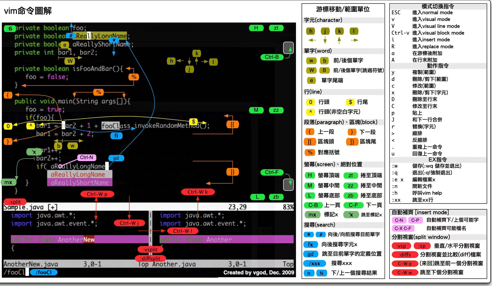

## 常用命令

```bash
#查看内核版本
uname -r
#查看处理器架构
uname -m
# 快速定位文件
locate filename
#查看so文件的以来
ldd
#将文件打包为二进制文件，譬如将图片转为c++ 头文件
xdd

# 删除文件
find . -name "*.txt" | xargs rm -rf

# 创建软连接
ln -s [源文件或目录][目标文件或目录]

# -h：与-l结合使用，以人类可读的方式显示文件大小（如K、M、G等）。
ls -lh

# 查找文件，查找范围 类型 名字
find ./ -type f -name "*.c"
#文件复制拷贝
rsync -a source destination
#排除文件
rsync -av --exclude='*.txt' source/ destination
#多个排除模式
rsync -av --exclude 'file1.txt' --exclude 'dir1/*' source/ destination
rsync -av --exclude={'file1.txt','dir1/*'} source/ destination
#远程同步
rsync -av username@remote_host:source/ destination
#断点续传
rsync -avP -e 'ssh -p 4321'  /dataA username@B:/dataB/

# 切换用户
su backend
# grep 使用
ps -ef | grep sshd | grep -v grep
cat /etc/init.d/sshd | grep -v '^#' | grep -v '^$'

# grep是一个强大的文本搜索工具。常用参数如下：
# -i：忽略大小写进行搜索。
# -v：反转匹配，即显示不匹配的行。
# -n：显示行号。
# -c：统计匹配的行数。

# 增加文件内容，多行编辑
cat << EOF >> /etc/profile.d/java.sh

```

sed的操作

https://www.runoob.com/linux/linux-comm-sed.html

### awk
```bash
# awk 是对文本一行一行进行处理，每一行的多个字段分别是$1 $2 $3 $4 ... $0表示改行的整条数据
# -F 表示分隔符，默认为空格，NF表示每行字符有多少个字段，NR表示当前处理的是第几行， ~ 表示启用正则匹配， 正则表达式用一对 / 包含起来
cat /etc/passwd | awk -F ':' '{if ($NF ~ /bash/) print $1}'

cat /etc/passwd | awk -F ':' 'BEGIN{print "user\tshell\n-------"} {print $1"\t"$NF} END{print "--------"}'

# 打印行数
awk '{print NR, $0}' file

```

### cmake 升级

打开cmake下载的官网：https://cmake.org/files/
这里我们选择最高的子版本，cmake-3.20.6-linux-x86_64.sh，点击进行下载。（最小的子版本号可以自行更改，我选的是当时最高的6，因为它大概率拥有最全的补丁）

```bash
cd Downloads
sudo bash cmake-3.20.6-inux-x86_64.sh --skip-licence --prefix=/usr

# 安装过程中遇到：
# 第一个选择时，输入y!!!
Do you accept the license? [yn]:
# 输入 y

# 第二个选择时，输入n!!!
By default the CMake will be installed in:
  "/usr/cmake-3.23.0-linux-x86_64"
Do you want to include the subdirectory cmake-3.23.0-linux-x86_64?
Saying no will install in: "/usr" [Yn]:
# 输入 n

```
## fzf安装

```bash
sudo  apt install fzf
source /usr/share/doc/fzf/examples/completion.zsh
source /usr/share/doc/fzf/examples/key-bindings.zsh
# 快捷键 ctrl + T  art + c   ctrl + r  fzf
# 配置
export FZF_DEFAULT_OPTS="--height 40% --layout=reverse --preview '(highlight -O ansi {} || cat {}) 2> /dev/null | head -500'"
export FZF_CTRL_T_OPTS="--preview '(highlight -O ansi -l {} 2> /dev/null || cat {} || tree -C {}) 2> /dev/null | head -200'"
```
如果omz的话，需要加到 插件里面启用。

## oh my zsh

```bash
##首先全部拷贝下网址中的代码，并在本地创建叫做install.sh的文件，将代码复制进该文件。
# https://gitee.com/mirrors/oh-my-zsh/blob/master/tools/install.sh

# 替换以下内容
ZSH=${ZSH:-~/.oh-my-zsh}
REPO=${REPO:-ohmyzsh/ohmyzsh}
REMOTE=${REMOTE:-https://github.com/${REPO}.git}
BRANCH=${BRANCH:-master}
#替换成
ZSH=${ZSH:-~/.oh-my-zsh}
REPO=${REPO:-mirrors/oh-my-zsh}
REMOTE=${REMOTE:-https://gitee.com/${REPO}.git}
BRANCH=${BRANCH:-master}
```

## the fuck

```bash

```
## vim




https://zhuanlan.zhihu.com/p/294938381?utm_medium=social&utm_psn=1819891349903785984&utm_source=wechat_session


### 命令模式
1、移动光标
1）上下左右移动光标

    上、下、左、右方向键 移动光标
    h（左） j（下） k（上） l（右） 移动光标

2）光标移动到文件头或文件尾

    gg 移动到文件头
    G 移动到文件尾（shift + g）

3）光标移动到行首或行尾

    ^ 移动到行首
    $ 移动到行尾

4）移动到指定行

    :n 移动到第几行（这里的 n 是数字）

2、删除或剪切

1）删除字母

    x 删除单个字母
    nx 删除 n 个字母（n 是数字，如果打算从光标位置连续删除 10 个字母，可以使用 10x 即可）

2）删除整行或剪切

    dd 删除单行
    ndd 删除多行
    :n1,n2d 删除指定范围的行

删除行或多行，是比较常用的删除方法。这里的 dd 快捷键既是删除也是剪切。删除内容放入了剪切板，如果不粘贴就是删除，粘贴就是剪切。粘贴方法：

    p 粘贴到光标下面一行
    P 粘贴到光标上面一行

3）从光标所在行删除到文件尾

    dG 从光标所在行删除到文件尾（d 是删除行，G 是文件尾，连起来就是从光标行删除到文件尾）

3复制

    yy 复制单行
    nyy 复制多行

复制之后的粘贴依然可以使用 p 键或 P 键

4 撤销

    u 撤销
    ctrl + r 反撤销

u 键能一直撤销到文件打开时的状态，ctrl + r 能一直反撤销到最后一次操作状态

5替换

    r 替换光标所在处的字符
    R 从光标所在处开始替换字符，按 esc 键结束

6其他

    gg ：跳转到文件开头
    Shift + g ：跳转到文件结尾
    :vsplit ：垂直分割
    :split ：水平分割窗口
    /pattern : 从上往下查找关键词 pattern 并高亮显示
    ?pattern : 从下往上查找关键词 pattern 并高亮显示
    : 100 : 跳转到文件的第100行
    /pattern1 [ ]+ pattern2: 查找关键词 pattern1 之后为任意个空格之后是关键词 pattern2
    /^C.*\spattern : 查找行头第一个字符为C之后任意多个字符后是空格且空格后是pattern关键词的内容
    :g/^$/d : 删除不包含任何空格的空行
    :g/^\s*$/d : 删除包含空格的空行
    :%g!/pattern/d : 删除不包含关键词pattern的所有行
    ：%s/\s+/ /g 删除行中间的空格


## tldr

```bash
sudo apt-get install tldr
sudo tldr --update
#没有目录则自己创建 /home/ubuntu/.local/share/tldr
```

## frp 部署


1、从github 下载，解压下载的压缩包。

2、将frpc 复制到内网服务所在的机器上。

3、将frps 复制到拥有公网 IP 地址的机器上，并将它们放在任意目录。

4、使用以下命令启动服务器：./frps -c ./frps.toml
5、使用以下命令启动客户端：./frpc -c ./frpc.toml

6、不挂断 **nohup ./frps -c ./frps.toml** **nohup ./frpc -c ./frpc.toml**

使用systemd来操作

```bash
## 参考链接 https://www.xbfast.com/22/
# 创建服务文件
sudo vim /etc/systemd/system/frps.service
```

```tex
[Unit]
# 服务名称，可自定义
Description = frp server
After = network.target syslog.target
Wants = network.target

[Service]
Type = simple
# 启动frps的命令，需修改为您的frps的安装路径
ExecStart = /path/to/frps -c /path/to/frps.toml

[Install]
WantedBy = multi-user.target
```

```bash
# 启动frp
sudo systemctl start frps
# 停止frp
sudo systemctl stop frps
# 重启frp
sudo systemctl restart frps
# 查看frp状态
sudo systemctl status frps
# 设置 frps 开机自启动
sudo systemctl enable frps
```

服务器端配置

`bindPort =7000`

客户端配置

```tex
serverAddr = "x.x.x.x"
serverPort = 7000

[[proxies]]
name = "ssh"
type = "tcp"
localIP = "127.0.0.1"
localPort = 22
remotePort = 6000
```

连接方式

```bash
# 需要在服务器端开启 7000  6000 的端口，在防火墙里设置
# x.x.x.x 表示服务器公网IP ， test 表示内网用户名
ssh -o Port=6000 test@x.x.x.x
```

## marktext

```bash
###
# 1、n级标题
# n个# 表示n级标题，打完 # 之后记得加个空格

# 2、字体变换
# 标粗：ctrl+B
# 标斜：ctrl+i
# 下划线：ctrl+U
# 高亮：ctrl+shift+H
# 删除线：ctrl+D

# 3、代码块
# 行内代码：ctrl+`
# 代码块：```

# 4、插入表格
# ctrl+shift+T

# 5、插入图像
# ctrl+shift+i

# 6、超链接
#ctrl+L

# 7.
# Ctrl+J来切换侧边栏

# 8
# 当您开始新行时，只需键入@以显示包含所有可用功能的弹出窗口

# 9
# 在两个::之间输入表情英文，MarkText支持快捷选择小表情
```

## SHELL

```bash
chmod u+x **.sh
# 添加到path
export PATH=$PATH:/home/ay2021/scripts
# 修改文件归属， 冒号前面是用户，冒号后面是所属组
chown  backend:backend  ./test.sh
```

## 进程 内存

```bash
ps -aux | grep **
ps -ef | grep **
kill -9 PID  # 强制杀死进程
free -h
#查看内存用量 交换区用量
free -m
```

## 压缩

```bash
# 压缩 tar
tar -cvf studio.tar directory_to_compress
#解压tar 到指定目录
tar -xvf studio.tar -C /tmp/extract/
#压缩 tar.gz
tar -zcvf studio.tar.gz directory_to_compress
#解压 tar.gz 到 目录
tar -zxvf studio.tar.gz  -C /tmp/extract/

# 压缩文件
rar a -r test.rar file
# 解压文件
unrar x test.rar

# 压缩文件
zip -r test.zip file
# 解压文件
unzip test.zip -d file
```

## 磁盘用量

```bash
fdisk -l # 查看磁盘所有分区
df -hl # 查看磁盘剩余空间
df -h  #查看每个根路径的分区大小
du -sh [目录名] #返回该目录的大小
du -sm [文件夹] #返回该文件夹总M数
```

## screen

```bash
# 创建窗口test
screen -S test
# 列出所有
screen -ls
#进入screen
screen -r <screen的pid>
# 断开当前窗口(继续运行)
ctrl + a + d
ctrl + d
# 退出当前窗口
exit
# 对于正在启动的后台进程修改名字
screen -S [原始任务名] -X sessionname [修改后的任务名]
#清除损坏的screen
screen --wipe
```

## wsl2 安装cuda

```bash
# 参考文档 https://blog.csdn.net/iwanvan/article/details/122119595
# 安装的时候注意版本问题
apt-cache showpkg cuda
apt-get install <package_name>=<version_name>

# 卸载
#To remove CUDA Toolkit:
sudo apt-get --purge remove "*cuda*" "*cublas*" "*cufft*" "*cufile*" "*curand*" \
 "*cusolver*" "*cusparse*" "*gds-tools*" "*npp*" "*nvjpeg*" "nsight*" "*nvvm*"
#To remove NVIDIA Drivers:
sudo apt-get --purge remove "*nvidia*" "libxnvctrl*"
#To clean up the uninstall:
sudo apt-get autoremove
```

## tmux

```bash
# 查看有所有tmux会话
tmux ls
# 新建tmux窗口
tmux new -s <session-name>
# 分离会话,快捷键：Ctrl+b d
tmux detach
# 重新连接会话
tmux attach -t <session-name>
tmux at -t <session-name>
#关闭会话
exit
# 划分上下两个窗格,Ctrl+b “
tmux split
# 划分左右两个窗格 Ctrl+b %
tmux split -h


# 光标切换到上方窗格,Ctrl+b 方向键上
tmux select-pane -U
”            # 将当前面板平分为上下两块
%            # 将当前面板平分为左右两块
x            # 关闭当前面板
!            # 将当前面板置于新窗口；即新建一个窗口，其中仅包含当前面板
Ctrl+方向键    # 以1个单元格为单位移动边缘以调整当前面板大小
Alt+方向键    # 以5个单元格为单位移动边缘以调整当前面板大小
Space        # 在预置的面板布局中循环切换；依次包括even-horizontal、even-vertical、main-horizontal、main-vertical、tiled
q            # 显示面板编号
o            # 在当前窗口中选择下一面板
方向键        # 移动光标以选择面板
{            # 向前置换当前面板
}            # 向后置换当前面板
Alt+o        # 逆时针旋转当前窗口的面板
Ctrl+o        # 顺时针旋转当前窗口的面板
```


## 字符及文件处理 grep/find/awk/xargs
### 1 grep
`grepgrep [选项] 'pattern' 文件...`
1.1 常用选项-I：用于排除grep中的二进制文件
-i：忽略大小写。
-r：递归搜索目录及其子目录。
-n：显示匹配行的行号。
-v：显示不匹配的行。
-l：只显示匹配的文件名，而不显示匹配的行。
-w：只匹配整个单词，而不是部分单词。
-E：使用扩展正则表达式。
-F：将模式视为固定字符串，而不是正则表达式。
-A: 显示匹配行之后的几行。
-B：显示匹配行之前的几行。
-C：显示匹配行前后各几行。
-c: 统计所有每个文件匹配的行数；–不好用，实际用处不大；
-a：将二进制文件视为文本文件进行搜索
–color=auto: 高亮显示该字符串；一般常用：alias grep ‘grep --color=auto’
–exclude: 排除特定文件。
–exclude-dir 排除特定目录。个人对我来说最常用的就是：grep -Inr “pattern”

1.2 常见用法demo
```bash
# 1 在文件中基本查找
grep "pattern" file.txt
# 2 递归搜索目录中的所有文件
grep -r "pattern" directory/
# 3 忽略大小写
grep -i "pattern" file.txt
# 4 显示匹配的行号：
grep -n "pattern" file.txt
# 5 显示不匹配的行
grep -v "pattern" file.txt
# 6 只显示匹配的文件名
grep -l "pattern" file.txt
# 7 使用扩展正则表达式
grep -E "pattern1|pattern2" file.txt
# 8 将pattern看为固定字符串
grep -F "pattern" file.txt
# 9 统计匹配行数
grep -c 'pattern' filename.txt
# 10 高亮显示该字符串
grep --color=auto 'pattern' filename.txt
# 11 匹配整个单词
grep -w 'word' filename.txt
# 12 排除特定文件
grep -r --exclude='*.log' 'pattern' 
# 13 排除特定目录
grep -r --exclude-dir={dir1,dir2} 'pattern' /path/to/directory/
# 14 搜素匹配并显示之后几行
grep -A 3 'pattern' filename.txt
grep -B 3 'pattern' filename.txt
grep -C 3 'pattern' filename.txt
```
### 2 find
`find [路径] [选项] [表达式]`

2.1 常用选项-name：按文件名搜索。
-type：按文件类型搜索（如 f 表示普通文件，d 表示目录）。
-size：按文件大小搜索（如 +10M 表示大于10MB的文件）。
-mtime：按文件修改时间搜索（如 -5 表示5天内修改过的文件）。
-exec：对搜索到的文件执行指定的命令。
2.2 常见用法demo

```bash
# 1 按文件名搜索
find ./ -name "filename.txt"
find ./ -iname "filename.txt" # 忽略大小写文件名
# 2 按文件类型搜素
find ./ -type f # 仅搜索文件
find ./ -type d # 仅搜素目录
find ./ -type l # 仅搜素符号链接
# 3 按文件大小搜素
find ./ -size +10M
find ./ -size -1k
# 4 按文件修改时间搜索
find ./ -mtime -5
find ./ -mtime +30
# 5 按文件权限模式搜索
find ./ -perm /644
# 6 按用户名搜素
find ./ -user username
find ./ -group groupname


#!/bin/bash

# 查找并打印所有 .txt 文件
echo "Finding all .txt files:"
find . -name "*.txt"

# 查找并删除所有 .tmp 文件
echo "Deleting all .tmp files:"
find . -name "*.tmp" -delete

# 查找并压缩所有 .log 文件
echo "Compressing all .log files into logs.tar.gz:"
find . -name "*.log" -exec tar -czvf logs.tar.gz {} +

# 查找并重命名所有 .bak 文件为 .bak.old
echo "Renaming all .bak files to .bak.old:"
find . -name "*.bak" -exec mv {} {}.old \;

# 查找并统计大于 1MB 的文件数量
echo "Counting files larger than 1MB:"
find . -size +1M | wc -l

# 查找并列出最近一周内修改过的文件
echo "Listing files modified in the last week:"
find . -mtime -7

```
2.3 组合用法
```bash
# -exec: 对找到的文件执行命令
find . -name "*.txt" -exec cat {} \;
# -delete: 删除找到的文件
find . -name "*.tmp" -delete

# 组合条件
find . -type f -and -name "*.txt"
find . -type f -or -type d
find . -type f -not -name "*.log"

```
### 3 xargs
用于将标准输入转换为命令行参数。
`command | xargs [选项] [命令]`
command：产生标准输出的命令。
[选项]：控制 xargs 的行为。
命令：要执行的命令及其参数。3.1 常用选项-I：指定一个替换字符串，用于在命令中替换输入的参数。
-n：指定每次传递给命令的参数数量。
-P：指定并行执行的进程数。
-r：如果输入为空，则不执行命令。
-t：在执行命令之前，先打印出命令
-p；执行命令前询问
-t: 显示即将执行的命令

3.2 常见用法demo

```bash
# 1 -p：在执行每个命令前提示用户确认
find . -name "*.txt" | xargs -p rm

# 2 -a file：从文件中读取输入，而不是标准输入
xargs -a filename.txt command

# 3 -t：显示即将执行的命令
find . -name "*.txt" | xargs -t rm

# 4 -I replace-str：将输入中的每一行替换为 replace-str 中的 {}
find . -name "*.txt" | xargs -I {} cp {} /backup/{}

# 5 -n max-args：每次传递的最大参数数量
find . -name "*.txt" | xargs -n 5 rm

# 6 使用 -r 选项避免在输入为空时执行命令
echo "" | xargs -r rm

# 7 使用 -t 选项在执行命令之前打印命令
echo "file1.txt file2.txt file3.txt" | xargs -t rm

# 8 -d delim：指定输入项之间的分隔符（默认为空白字符
echo "file1.txt|file2.txt" | xargs -d '|' rm

# 9 -0：输入项之间用 NUL 字符分隔（通常与 find -print0 结合使用
find . -name "*.txt" -print0 | xargs -0 rm

# 10 -P max-procs：同时运行的最大进程数
find . -name "*.txt" | xargs -P 4 gzip

# 11 -E eof-str：指定输入结束字符串
echo "file1.txt\nfile2.txt\nEOF" | xargs -E EOF rm

# 12 -r 或 --no-run-if-empty：如果没有输入，则不执行命令
find . -name "*.log" | xargs -r rm

示例1：基本搜索并删除文件
find . -name "*.tmp" | xargs rm
这将删除所有 .tmp 文件。

示例2：查找并复制文件到另一个目录
find . -name "*.jpg" | xargs -I {} cp {} /backup/pictures/
这将把所有 .jpg 文件复制到 /backup/pictures/ 目录中。

示例3：查找并压缩文件
find . -name "*.log" | xargs tar -czvf logs.tar.gz
这将把所有 .log 文件压缩成 logs.tar.gz。

示例4：限制每次传递的参数数量
find . -name "*.txt" | xargs -n 2 rm
这将每次传递两个 .txt 文件给 rm 命令。

示例5：使用 -I 替换占位符
find . -name "*.bak" | xargs -I {} mv {} {}.old
这将把所有 .bak 文件重命名为 .bak.old。

示例6：并发执行命令
find . -name "*.jpg" | xargs -P 4 gzip
这将并发地对所有 .jpg 文件进行压缩，最多同时运行 4 个 gzip 进程。

示例7：使用 -0 处理包含空格的文件名
find . -name "*.txt" -print0 | xargs -0 rm
这将正确处理包含空格或特殊字符的文件名。

示例8：使用 -p 提示用户确认
find . -name "*.log" | xargs -p rm
这将在删除每个 .log 文件前提示用户确认。

示例9：使用 -t 显示即将执行的命令
find . -name "*.txt" | xargs -t rm
这将显示即将执行的 rm 命令。

#综合示例

#!/bin/bash

# 查找并删除所有 .tmp 文件
echo "Deleting all .tmp files:"
find . -name "*.tmp" | xargs -p rm

# 查找并复制所有 .jpg 文件到 backup 目录
echo "Copying all .jpg files to /backup/pictures/"
find . -name "*.jpg" | xargs -I {} cp {} /backup/pictures/

# 查找并压缩所有 .log 文件
echo "Compressing all .log files into logs.tar.gz:"
find . -name "*.log" | xargs tar -czvf logs.tar.gz

# 查找并重命名所有 .bak 文件为 .bak.old
echo "Renaming all .bak files to .bak.old:"
find . -name "*.bak" | xargs -I {} mv {} {}.old

# 查找并限制每次传递 2 个参数给 rm 命令
echo "Removing .txt files in batches of 2:"
find . -name "*.txt" | xargs -n 2 rm

# 查找并处理包含空格的文件名
echo "Handling filenames with spaces:"
find . -name "* *" -print0 | xargs -0 rm

# 查找并显示即将执行的命令
echo "Displaying commands before execution:"
find . -name "*.log" | xargs -t rm

```
### 4 awk
`awk [选项] '模式 { 操作 }' 文件名`
[选项]：控制 awk 的行为。
模式：定义要处理的行。
操作：对匹配的行执行的操作。
文件…：要处理的文件列表。常用选项
-F：指定字段分隔符。
-v：定义变量。
-f：从文件中读取 awk 脚本

```bash
# 4.1 基本选项
# -F fs 或 --field-separator=fs：指定字段分隔符。
awk -F, '{print $1}' file.csv

# -v var=value：设置 awk 变量。
awk -v name="John" '{print "Hello, " name}' file.txt

# -f scriptfile：从文件中读取 awk 脚本。
awk -f script.awk file.txt

# 使用条件判断
awk '$3 > 100 { print $1 }' file.txt

# 使用变量
awk -v var="pattern" '$0 ~ var { print $0 }' file.txt

# 从文件中读取 awk 脚本
awk -f script.awk file.txt

# 4.2 内置函数
# print：打印内容。
awk '{print $1, $2}' file.txt

# length(s)：返回字符串 s 的长度。
awk '{print length($0)}' file.txt

# substr(s, m, n)：返回字符串 s 从位置 m 开始的 n 个字符。
awk '{print substr($1, 1, 3)}' file.txt

# split(s, a, fs)：将字符串 s 按分隔符 fs 分割到数组 a 中。
awk '{split($1, a, "-"); print a[1], a[2]}' file.txt

#match(s, r)：在字符串 s 中匹配正则表达式 r。
awk '{if (match($1, /pattern/)) print $0}' file.txt

# 4.3 内置变量
#     FS：字段分隔符（默认为空白字符）。
#     OFS：输出字段分隔符（默认为空白字符）。
#     RS：记录分隔符（默认为换行符）。
#     ORS：输出记录分隔符（默认为换行符）。
#     NF：当前记录中的字段数。
#     NR：已处理的记录数（行号）。
#     FILENAME：当前处理的文件名
# 按字段分隔符分割并打印特定字段
awk -F, '{print $1, $3}' data.txt

# 使用内置变量
awk '{print NR, FILENAME, NF, $0}' data.txt

#计算总和
awk '{print NR, FILENAME, NF, $0}' data.txt

# 过滤特定条件
awk -F, '$2 > 30 {print $1}' data.txt

# 使用正则表达式
awk '/Eng/' data.txt

# 使用自定义变量
awk -v prefix="Name:" '{print prefix, $1}' data.txt

# 使用内置函数
awk -F, '{print substr($1, 1, 3), length($1)}' data.txt

# 处理多文件
awk -F, '{print $1, $2}' data.txt more_data.txt

# 使用脚本文件
BEGIN {
    FS=","
    OFS="\t"
    print "Name\tAge\tOccupation"
}
{
    print $1, $2, $3
}
END {
    print "Total records processed:", NR
}

# 4.4 综合示例
#!/bin/bash

# 打印每个员工的姓名和职业
echo "Employee Names and Occupations:"
awk -F, '{print $1, $3}' data.txt

# 计算所有员工的平均年龄
echo "Average Age:"
awk -F, '{sum += $2; count++} END {print sum/count}' data.txt

# 过滤出年龄大于30岁的员工
echo "Employees older than 30:"
awk -F, '$2 > 30 {print $1}' data.txt

# 使用正则表达式查找包含 "Dev" 的职业
echo "Employees with 'Dev' in their occupation:"
awk '/Dev/' data.txt

# 使用自定义变量前缀
echo "Employees with custom prefix:"
awk -v prefix="Name:" '{print prefix, $1}' data.txt

# 使用内置函数处理字符串
echo "First three letters of names and their lengths:"
awk -F, '{print substr($1, 1, 3), length($1)}' data.txt

# 处理多个文件
echo "Data from multiple files:"
awk -F, '{print $1, $2}' data.txt more_data.txt

# 使用脚本文件进行复杂处理
echo "Processed data using script.awk:"
awk -f script.awk data.txt

```
### 5 sed 

sed，全称 Stream Editor（流编辑器），它的核心思想是不打开文件，直接在命令行中修改、删除、替换文本，并且可以把修改后的结果输出到终端或保存到文件。
`sed '指令' 文件`

```bash
# 1 替换文本（相当于 Ctrl+H）
sed 's/旧内容/新内容/' 文件名
s：表示 substitute（替换）
/旧内容/新内容/：表示 将“旧内容”替换成“新内容”

# 把 hello 替换成 hi,输出 hi world
echo "hello world" | sed 's/hello/hi/'

# 假设 file.txt 里有
hello Alice，hello Alice's sister
hello Bob, hello Bob's brother
hello Charlie
# 执行
sed 's/hello/hi/' file.txt
# 输出
hi Alice，hello Alice's sister
hi Bob, hello Bob's brother
hi Charlie
#这里只是打印出修改后的结果，但不会真正修改 file.txt 的内容。你只是看到终端里 hello 被替换成了 hi，但 file.txt本身没有发生任何变化。


# 2️全局替换
# 默认情况下，sed只替换每一行的第一个匹配项，如果想替换所有，要加 g（global）
# 记住 g，否则只会替换每行的第一个匹配项！
sed 's/hello/hi/g' file.txt
# 输出
hi Alice，hi Alice's sister
hi Bob, hi Bob's brother
hi Charlie


# 3 直接修改文件
# 默认 sed 不会改动原文件，只是把修改结果输出到终端 ,如果想真正改文件，需要加 -i
# -i直接修改文件，没有撤销功能，误操作可能会导致数据丢失！
sed -i 's/hello/hi/g' file.txt
# 为了避免误操作导致数据丢失，推荐使用 -i.bak先创建文件备份，然后再修改
sed -i.bak 's/hello/hi/g' file.txt


# 4 删除某一行
# N 代表 行号  d 代表 删除
sed 'Nd' 文件名
# 删除第 2 行
sed '2d' file.txt
# 删除最后一行 $ : 代表最后一行
sed '$d' file.txt
# 删除所有包含 Bob 的行
sed '/Bob/d' file.txt
# 删除所有空行 ^$ 代表空行，所以这条命令能删掉所有空白行！
sed '/^$/d' file.txt
# 删除前 N 行
sed '1,5d' file.txt
# 删除第 N 行到最后一行
sed '2,$d' file.txt
# 删除包含多个关键词的行  /error\|fail/ 👉 匹配 error 或 fail
sed '/error\|fail/d' file.txt
# 删除所有以字母开头的行
sed '/^[a-zA-Z]/d' file.txt


# 5 只显示某些行
# N 代表 行号 p 代表 打印
sed -n 'Np' 文件名
# 打印第 2 行
sed -n '2p' file.txt
# 显示 2-4 行
sed -n '2,4p' file.txt
# 只显示匹配的行
# -n 选项的作用是 关闭默认输出，只显示 p（print）匹配的内容。
sed -n '/Bob/p' file.txt


# 6 在指定行前/后插入文本
# i 代表 insert，在某行前插入内容；a 代表 append，在某行后追加内容。
#在第 2 行前插入 "Henry is comming"
sed '2i\ Henry is comming' file.txt
# 在第 3 行后插入 "David is comming"
sed '3a\ David is comming' file.txt


# 7 sed 其他常见操作
# 修改某一行
# 3c\ 表示修改第 3 行
sed '3c\ This is a new line' file.txt
# 提取包含数字的行
sed -n '/[0-9]/p' file.txt
#删除空格（去除所有行首和行尾空格）
# ^[ \t]*// 👉 删除行首的空格和 Tab
# [ \t]*$// 👉 删除行尾的空格和 Tab
sed 's/^[ \t]*//;s/[ \t]*$//' file.txt
# 删除 HTML 标签
# <[^>]*> 👉 匹配 HTML 标签
# s/...//g 👉 替换为空
sed 's/<[^>]*>//g' file.html
# 删除注释（# 或 // 开头的行）
sed '/^#/d' config.txt   # 删除 # 开头的注释
sed '/^\/\//d' code.cpp  # 删除 // 开头的注释


# 8 sed -e 命令的使用
# -e 选项的作用是在同一条 sed 命令中执行多个操作，可以替换、删除、插入等多种操作同时进行。
# 依次执行多个替换
sed -e 's/Alice/Jane/' -e 's/Bob/John/' file.txt
#依次执行“删除 + 替换”
sed -e '/^#/d' -e 's/error/ERROR/g' file.txt
#结合 -e 实现多行插入
sed -e '2i\ --- Start ---' -e '4a\ --- End ---' file.txt
# -e 结合 -i 直接修改文件
sed -i -e 's/foo/bar/g' -e 's/old/new/g' file.txt
# -e 结合 -n 只显示匹配的结果
sed -n -e '/error/p' -e '/fail/p' file.txt


#9 sed 结合 find、grep、awk 等常见组合命令
# 批量替换某个目录下所有 .txt 文件中的 hello为 hi
# + 👉 批量执行，提高效率（比 \; 更快）
find /path -type f -name "*.txt" -exec sed -i 's/hello/hi/g' {} +
# sed + grep：只修改包含特定内容的行
#只修改包含 "error" 的行，把 "failed" 替换为 "FAILED"
grep "error" file.txt | sed 's/failed/FAILED/g'
# sed + awk：精准修改特定列
# 批量修改 CSV 文件的第 2 列，把 low 改成 LOW
awk -F, '{ $2=gensub(/low/, "LOW", "g", $2); print }' OFS=, file.csv
# sed + xargs：批量修改多个文件
# 在多个 .log 文件里批量替换 "DEBUG" 为 "INFO"
find /var/log -type f -name "*.log" | xargs sed -i 's/DEBUG/INFO/g'
# sed + tee：边修改边输出
# 把 config.conf 里的 "8080" 端口改成 "9090"，同时保存到 new_config.conf
sed 's/8080/9090/g' config.conf | tee new_config.conf
# sed + diff：对比修改前后的差异
diff <(cat file.txt) <(sed 's/error/ERROR/g' file.txt)

```


## vscode插件

### koroFileHeader注释插件

```bash
# Ctrl + win + i
# 直接按住快捷键，即可在当前文件头部生成

# Ctrl + win + t
# 鼠标光标移到到目标函数的上一行，再按快捷键.函数注释
```
### Bookmarks插件

```bash
#快捷键	功能
Ctrl+alt+K	#创建或消除书签
Ctrl+alt+J	#跳转到前一个书签
Ctrl+alt+L	#跳转到后一个书签

```
## trt工具

```bash
# ppocr v4
paddle2onnx --model_dir ./  --model_filename inference.pdmodel --params_filename inference.pdiparams --save_file ./reshape/det.onnx  --opset_version 10 --input_shape_dict="{'x':[-1,3,-1,-1]}"  --enable_onnx_checker True
3*640*640

paddle2onnx --model_dir ./  --model_filename inference.pdmodel --params_filename inference.pdiparams --save_file ./reshape/rec.onnx --opset_version 10 --input_shape_dict="{'x':[-1,3,-1,-1]}" --enable_onnx_checker True
3*48*320

paddle2onnx --model_dir ./ --model_filename inference.pdmodel  --params_filename inference.pdiparams --save_file ./reshape/cls.onnx  --opset_version 10 --input_shape_dict="{'x':[-1,3,-1,-1]}"  --enable_onnx_checker True
3*32*320

# 升级之后改尺寸换为
python -m paddle2onnx.optimize --input_model model.onnx \
                               --output_model new_model.onnx \
                               --input_shape_dict "{'x':[1,3,224,224]}"


E:\demo\3rdparty\TensorRT-8.4.1.5\bin\trtexec.exe --minShapes=x:1x3x640x640 --optShapes=x:1x3x640x640 --maxShapes=x:1x3x640x640 --onnx=E:\demo\rep\AIFramework\models\ort_models\ch_PP-OCRv4_det_infer\reshape\det.onnx --saveEngine=E:\demo\rep\AIFramework\models\ort_models\ch_PP-OCRv4_det_infer\reshape\det.trt.engine


E:\demo\3rdparty\TensorRT-8.4.1.5\bin\trtexec.exe --minShapes=x:1x3x32x320 --optShapes=x:1x3x32x320 --maxShapes=x:1x3x32x320 --onnx=E:\demo\rep\AIFramework\models\ort_models\ch_PP-OCRv4_rec_infer\reshape\rec.onnx --saveEngine=E:\demo\rep\AIFramework\models\ort_models\ch_PP-OCRv4_rec_infer\reshape\rec.trt.engine
1*3*48*320
```

## jupyter


```bash
nohup jupyter-notebook --no-browser --ip 0.0.0.0 --port 15000 --allow-root > nohup-jupyter.log &
```

## nvidia-smi

```bash
# 显示 GPU 状态的摘要信息
nvidia-smi
# 显示详细的 GPU 状态信息 这个命令会每1秒更新一次状态信息
nvidia-smi -l 1
# 列出所有 GPU 并显示它们的 PID 和进程名称
nvidia-smi pmon
# 强制结束指定的 GPU 进程,这会强制结束 GPU ID 为 0 上的 PID 为 12345 的进程
nvidia-smi --id=0 --ex_pid=12345
# 设置 GPU 性能模式,第一个命令会为所有 GPU 设置为性能模式，第二个命令只针对 ID 为 0 的 GPU
nvidia-smi -pm 1
nvidia-smi -i 0 -pm 1
# 重启 GPU
nvidia-smi --id=0 -r


```


