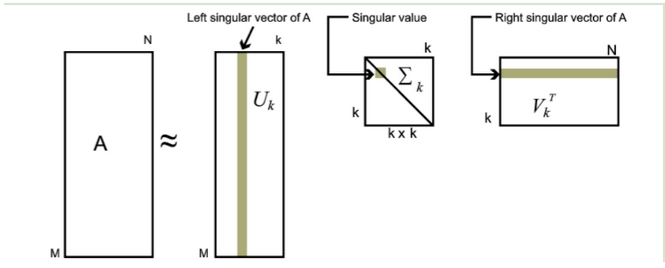

## 平面几何
```c++
//两点距离
double dist_p2p(const cv::Point2f& a, const cv::Point2f& b)
{
	return std::sqrt(std::pow(a.x - b.x, 2) + std::pow(a.y - b.y, 2));
}

//计算两直线交点
 cv::Point2d get2lineIPoint(cv::Point2d lineOnePt1, cv::Point2d lineOnePt2, cv::Point2d lineTwoPt1, cv::Point2d lineTwoPt2)
 {
	double x1 = lineOnePt1.x, y1 = lineOnePt1.y, x2 = lineOnePt2.x, y2 = lineOnePt2.y;
	double a1 = -(y2 - y1), b1 = x2 - x1, c1 = (y2 - y1) * x1 - (x2 - x1) * y1; // 一般式：a1x+b1y1+c1=0
	double x3 = lineTwoPt1.x, y3 = lineTwoPt1.y, x4 = lineTwoPt2.x, y4 = lineTwoPt2.y;
	double a2 = -(y4 - y3), b2 = x4 - x3, c2 = (y4 - y3) * x3 - (x4 - x3) * y3; // 一般式：a2x+b2y1+c2=0
	bool r = false;                                                             // 判断结果
	double x0 = 0, y0 = 0;                                                      // 交点
	double angle = 0;                                                           // 夹角

	cv::Point2d result(-1, -1);
	// 判断相交
	if (b1 == 0 && b2 != 0) // l1垂直于x轴，l2倾斜于x轴
		r = true;
	else if (b1 != 0 && b2 == 0) // l1倾斜于x轴，l2垂直于x轴
		r = true;
	else if (b1 != 0 && b2 != 0 && a1 / b1 != a2 / b2)
		r = true;

	if (r)
	{
		//计算交点
		x0 = (b1 * c2 - b2 * c1) / (a1 * b2 - a2 * b1);
		y0 = (a1 * c2 - a2 * c1) / (a2 * b1 - a1 * b2);
		// 计算夹角
		double a = sqrt(pow(x4 - x2, 2) + pow(y4 - y2, 2));
		double b = sqrt(pow(x4 - x0, 2) + pow(y4 - y0, 2));
		double c = sqrt(pow(x2 - x0, 2) + pow(y2 - y0, 2));
		angle = acos((b * b + c * c - a * a) / (2 * b * c)) * 180 / CV_PI;
	}
	result.x = x0;
	result.y = y0;
     return result;
 }

//点到直线的距离
float dist_p2l(cv::Point pointP, cv::Point pointA, cv::Point pointB) {
	//求直线方程
	int A = 0, B = 0, C = 0;
	A = pointA.y - pointB.y;
	B = pointB.x - pointA.x;
	C = pointA.x * pointB.y - pointA.y * pointB.x;
	//代入点到直线距离公式
	float distance = 0;
	distance = ((float)abs(A * pointP.x + B * pointP.y + C)) / ((float)sqrtf(A * A + B * B));
	return distance;
}

//点到直线的垂足
cv::Point2f calculate_foot_point(cv::Point2f line_pt1, cv::Point2f line_pt2, cv::Point2f src_pt) {

cv::Point2f root_pt(0, 0);
  if (line_pt1.x == line_pt2.x) {
    //线与x轴垂直
    root_pt.x = line_pt1.x;
    root_pt.y = src_pt.y;
  }
  else if (line_pt1.y == line_pt2.y) {
    //线与Y轴垂直
    root_pt.x = src_pt.x;
    root_pt.y = line_pt1.y;
  }
  else {
  //线与 x轴 y轴 都不垂直
    double a1 = -(line_pt2.y -line_pt1.y);
    double b1 = (line_pt2.x - line_pt1.x);
    double c1 = (line_pt2.y - line_pt1.y) * line_pt1.x - (line_pt2.x - line_pt1.x) * line_pt1.y;

    root_pt.x = (b1 * b1 * src_pt.x - a1 * b1 * src_pt.y - a1 * c1) / (a1 * a1 + b1 * b1);
    root_pt.y = (a1 * a1 * src_pt.y - a1 * b1 * src_pt.x - b1 * c1) / (a1 * a1 + b1 * b1);
  }
  return root_pt;
}

//获取直线的斜率 截距
cv::Point2f get_lines_fangcheng(const Tival::FindLineResult& ll) {
	float k = 0; //直线斜率
	float b = 0; //直线截距

	double x_diff = 0;
	if (abs(ll.start_point.x - ll.end_point.x) < 2) {
		x_diff = abs(ll.start_point.x - ll.end_point.x);
	}
	k = (double)(ll.start_point.y - ll.end_point.y)/*(lines[i][3] - lines[i][1])*/ / (double)(x_diff/*ll.start_point.x - ll.end_point.x*/)/*(lines[i][2] - lines[i][0])*/; //求出直线的斜率// -3.1415926/2-----+3.1415926/2
	b = /*(double)lines[i][1] - k * (double)lines[i][0]*/(double)ll.end_point.y   - k * (double)ll.end_point.x;
	cv::Point2f pt(k, b);
	return pt;
}

//已知直线两点，与任意一点的一个坐标的一个值，求另一个值
double get_line_x(cv::Point2f line_p1, cv::Point2f line_p2, double y) {

	double x1 = line_p1.x, y1 = line_p1.y, x2 = line_p2.x, y2 = line_p2.y;
	double x = (y - y1) * (x2 - x1) / (y2 - y1) + x1;
	return x;
}

double get_line_y(cv::Point2f line_p1, cv::Point2f line_p2, double x) {
	double x1 = line_p1.x, y1 = line_p1.y, x2 = line_p2.x, y2 = line_p2.y;
	double y = (x-x1)*(y2-y1)/(x2-x1)+y1;
	return y;
}

//圆与直线的交点
void get_point_1(cv::Point2f p1,cv::Point2f p2,cv::Point2f& t1,cv::Point2f& t2 ) {

    //直线斜率
    double k = (p2.y - p1.y) / (p2.x -p1.x);
    k = -1 / k;
    //截距
    double b = p1.y - k * p1.x;

    //圆心
    cv::Point2f center = p1;
    double r = 10;


    double A = 1 + k * k;
    double B = -2 * center.x + 2 * k * (b-center.y);
    double C = center.x * center.x + (b - center.y) * (b - center.y) - r * r;
    double delta = B * B - 4 * A * C;

    t1.x = (-B -std::sqrt(delta))/(2*A);
    t1.y = k * t1.x + b;

    t2.x = (-B + std::sqrt(delta)) / (2*A);
    t2.y = k * t2.x + b;

}

//线段的迭代
 cv::LineIterator it(src, cross_pt[0], cross_pt[1]);
 std::vector<cv::Point2f>dst;

 for (int i = 0; i < it.count; i++, it++) {
     cv::Point2f pt(it.pos());
     if (std::abs(cv::pointPolygonTest(circle_point,pt,true))<=3) {
         //cv::circle(src, pt, 2, CV_RGB(255, 0, 0),1);
         dst.emplace_back(pt);
     }
 }

```
### 轮廓面积

```c++

void area(cv::Point2d p1, cv::Point2d p2, cv::Point2d p3) {
	double s = std::abs((p1.x * p2.y + p2.x * p3.y + p3.x * p1.y -p1.x*p3.y   - p2.x*p1.y  -p3.x*p2.y) / 2);
	printf_s("A = %.6f\n", s);
}
std::vector<cv::Point2f> v1;
v1.emplace_back(pts[0]);
v1.emplace_back(pts[1]);
v1.emplace_back(pts[2]);
cv::contourArea(v1);

//行列式求解
std::vector<cv::Point2d> pts;
pts.emplace_back(0   ,4079);
pts.emplace_back(351 , 4079);
pts.emplace_back(0 , 3125);
pts.emplace_back(306.509827, 4028.913330);

cv::Mat m1 = (cv::Mat_<double>(3, 3) << 0.000000, 4079.000000,1, 351.000000, 4079.000000, 1,0.000000, 3125.000000,1);
cv::Mat m2 = (cv::Mat_<double>(3, 3) << 0.000000, 4079.000000, 1,351.000000, 4079.000000, 1,306.509827, 4028.913330,1);
cv::Mat m3 = (cv::Mat_<double>(3, 3) << 0.000000, 4079.000000,1, 0.000000, 3125.000000,  1, 306.509827, 4028.913330,1);
cv::Mat m4 = (cv::Mat_<double>(3, 3) << 351.000000, 4079.000000,1, 0.000000, 3125.000000,1, 306.509827, 4028.913330,1);
double s1 = 0.5 * std::abs(cv::determinant(m1));
double s2 = 0.5 * std::abs(cv::determinant(m2));
double s3 = 0.5 * std::abs(cv::determinant(m3));
double s4 = 0.5 * std::abs(cv::determinant(m4));

```

## 矩阵运算
### 特征值与特征向量
A为n阶矩阵，若数λ和n维非0列向量x满足Ax=λx，那么数λ称为A的特征值，x称为A的对应于特征值λ的特征向量。式Ax=λx也可写成( A-λE)x=0，并且|λE-A|叫做A 的特征多项式。当特征多项式等于0的时候，称为A的特征方程，特征方程是一个齐次线性方程组，求解特征值的过程其实就是求解特征方程的解。


计算A的特征值与特征向量


```c++
//https://blog.csdn.net/weixin_46537710/article/details/106337476
Mat src;
image.convertTo(src, CV_32FC1);
cv::Mat eValuesMat;//特征值
cv::Mat eVectorsMat;//特征向量
eigen(src, eValuesMat, eVectorsMat);//通过openCV中eigen函数得到特征值与特征向量
```
求出特征值和特征向量有什么好处呢？ 就是我们可以将矩阵A特征分解。如果我们求出了矩阵A的n个特征值 ，以及这n个特征值所对应的特征向量。那么矩阵A就可以用下式的特征分解表示：


其中W是这n个特征向量所张成的n×n维矩阵，而Σ为这n个特征值为主对角线的n×n维矩阵。要进行特征分解，矩阵A必须为方阵。

### 矩阵分解
#### svd分解
SVD也是对矩阵进行分解，但是和特征分解不同，SVD并不要求要分解的矩阵为方阵。假设我们的矩阵A是一个m×n的矩阵，那么我们定义矩阵A的SVD为：


其中U是一个m * m的矩阵， 中间的是一个m * n的矩阵，除了主对角线上的元素以外全为0，主对角线上的每个元素都称为奇异值， V是一个 n*n的矩阵。 U和V都是酉矩阵，即满足它的共轭转置与自身相乘等于单位矩阵。酉矩阵是满秩的，每一列都是单位向量，其每两列都是正交的。这类矩阵性质非常好。


对于奇异值,它跟我们特征分解中的特征值类似，在奇异值矩阵中也是按照从大到小排列，而且奇异值的减少特别的快，在很多情况下，前10%甚至1%的奇异值的和就占了全部的奇异值之和的99%以上的比例。也就是说，我们也可以用最大的k个的奇异值和对应的左右奇异向量来近似描述矩阵。


如下图所示，现在我们的矩阵A只需要灰色的部分的三个小矩阵就可以近似描述了。




#### QR分解


## 二维变化


## 三维空间中的旋转变换

绕Z轴旋转


绕X轴旋转


绕Y轴旋转


绕任意轴旋转的公式：给定具有单位长的


则物体绕OA轴旋转变换的矩阵表示可确定如下：


### 根据对应的三维点估计刚体变换的旋转平移矩阵
```c++
 //公式推导与python代码 https://blog.csdn.net/u012836279/article/details/80203170
 //c++ 代码  https://blog.csdn.net/kewei9/article/details/74157236

 void test_affine3d(std::vector<cv::Point3f> srcPoints, std::vector<cv::Point3f>dstPoints, int pointsNum, TRigidTrans3D& transform) {
	cv::Mat src_avg, dst_avg,src_rep,dst_rep, srcMat, dstMat;
	cv::Mat src_mat = cv::Mat(srcPoints, true).reshape(1, pointsNum);
	cv::Mat dst_mat = cv::Mat(dstPoints, true).reshape(1, pointsNum);
	cv::reduce(src_mat, src_avg, 0, cv::REDUCE_AVG);
	cv::reduce(dst_mat, dst_avg, 0, cv::REDUCE_AVG);
	cv::repeat(src_avg, pointsNum, 1, src_rep);
	cv::repeat(dst_avg, pointsNum, 1, dst_rep);
	srcMat  = (src_mat - src_rep).t();
	dstMat  = (dst_mat - dst_rep).t();

	cv::Mat matS = srcMat * dstMat.t();
	cv::Mat matU, matW, matV;
	cv::SVDecomp(matS, matW, matU, matV);

	cv::Mat matTemp = matU * matV;
	float det = cv::determinant(matTemp); //计算矩阵的行列式

	float datM[] = { 1, 0, 0, 0, 1, 0, 0, 0, det };
	cv::Mat matM(3, 3, CV_32FC1, datM);
	cv::Mat matR = matV.t() * matM * matU.t();

	transform.matR = matR.clone();
	float* datR = (float*)(matR.data);
	transform.X = dst_avg.at<float>(0, 0)- (src_avg.at<float>(0, 0) * datR[0] + src_avg.at<float>(0, 1) * datR[1] + src_avg.at<float>(0, 2) * datR[2]);
	transform.Y = dst_avg.at<float>(0, 1)- (src_avg.at<float>(0, 0) * datR[3] + src_avg.at<float>(0, 1) * datR[4] + src_avg.at<float>(0, 2) * datR[5]);
	transform.Z = dst_avg.at<float>(0, 2)- (src_avg.at<float>(0, 0) * datR[6] + src_avg.at<float>(0, 1) * datR[7] + src_avg.at<float>(0, 2) * datR[8]);
}
#include <random>
#define _USE_MATH_DEFINES
#include <math.h>

void test_data() {
	//旋转矩阵关系  https://blog.csdn.net/changbaolong/article/details/8307052
	//测试的旋转矩阵，平移矩阵
	cv::Mat matR = (cv::Mat_<float>(3, 3) << std::cos(30.0 / 180.0 * M_PI), std::sin(30.0 / 180.0 * M_PI), 0.f,-std::sin(30.0 / 180.0 * M_PI), std::cos(30.0 / 180.0 * M_PI), 0.f,0.f, 0.f, 1.f);
	cv::Mat matT = (cv::Mat_<float>(3, 1) << 246.f, 102.f, 58.f);

	std::vector<cv::Point3f> srcPoints, dstPoints;
	cv::RNG rng;
	for (int i = 0; i < 10;i++) srcPoints.emplace_back(rng.uniform((double)0, (double)1000), rng.uniform((double)0, (double)1000), rng.uniform((double)0, (double)1000));

	//根据原始数据，生成目标点，需要注意类型
	for (int i = 0; i < 10;i++) {
		cv::Mat src = (cv::Mat_<float>(3, 1) << srcPoints[i].x, srcPoints[i].y, srcPoints[i].z);
		cv::Mat dst = matR * src + matT;
		dstPoints.emplace_back(dst.at<float>(0, 0), dst.at<float>(1, 0), dst.at<float>(2, 0));
	}
	TRigidTrans3D transform;
	test_affine3d(srcPoints, dstPoints,10,transform);

	XLOG << transform.matR << std::endl;
	XLOG << transform.X << std::endl;
	XLOG << transform.Y << std::endl;
	XLOG << transform.Z << std::endl;

	//第二种方法
	std::vector<cv::Point3f> srcPoints_vec, dstPoints_vec;
	for (int j = 0; j < 10;j++) {
		srcPoints_vec.push_back(srcPoints[j]);
		dstPoints_vec.push_back(dstPoints[j]);
	}
	cv::Mat aff(3, 4, CV_64F);
	std::vector<uchar> inliers;
	cv::estimateAffine3D(srcPoints_vec, dstPoints_vec,aff,inliers);
	XLOG << aff << std::endl;
	return;
}

```

## eigen
### eigen基础
参考链接： https://zhuanlan.zhihu.com/p/111727894
### eigen示例
```c++
#include <iostream>
using namespace std;
#include <ctime>
// Eigen 核心部分
#include <Eigen/Core>
// 稠密矩阵的代数运算（逆，特征值等）
#include <Eigen/Dense>
using namespace Eigen;
#define MATRIX_SIZE 50
/****************************
* 本程序演示了 Eigen 基本类型的使用
****************************/
int main(int argc, char **argv) {
  // Eigen 中所有向量和矩阵都是Eigen::Matrix，它是一个模板类。它的前三个参数为：数据类型，行，列
  // 声明一个2*3的float矩阵
  Matrix<float, 2, 3> matrix_23;

  // 同时，Eigen 通过 typedef 提供了许多内置类型，不过底层仍是Eigen::Matrix
  // 例如 Vector3d 实质上是 Eigen::Matrix<double, 3, 1>，即三维向量
  Vector3d v_3d;
  // 这是一样的
  Matrix<float, 3, 1> vd_3d;

  // Matrix3d 实质上是 Eigen::Matrix<double, 3, 3>
  Matrix3d matrix_33 = Matrix3d::Zero(); //初始化为零
  // 如果不确定矩阵大小，可以使用动态大小的矩阵
  Matrix<double, Dynamic, Dynamic> matrix_dynamic;
  // 更简单的
  MatrixXd matrix_x;
  // 这种类型还有很多，我们不一一列举

  // 下面是对Eigen阵的操作
  // 输入数据（初始化）
  matrix_23 << 1, 2, 3, 4, 5, 6;
  // 输出
  cout << "matrix 2x3 from 1 to 6: \n" << matrix_23 << endl;

  // 用()访问矩阵中的元素
  cout << "print matrix 2x3: " << endl;
  for (int i = 0; i < 2; i++) {
    for (int j = 0; j < 3; j++) cout << matrix_23(i, j) << "\t";
    cout << endl;
  }

  // 矩阵和向量相乘（实际上仍是矩阵和矩阵）
  v_3d << 3, 2, 1;
  vd_3d << 4, 5, 6;

  // 但是在Eigen里你不能混合两种不同类型的矩阵，像这样是错的
  // Matrix<double, 2, 1> result_wrong_type = matrix_23 * v_3d;
  // 应该显式转换
  Matrix<double, 2, 1> result = matrix_23.cast<double>() * v_3d;
  cout << "[1,2,3;4,5,6]*[3,2,1]=" << result.transpose() << endl;

  Matrix<float, 2, 1> result2 = matrix_23 * vd_3d;
  cout << "[1,2,3;4,5,6]*[4,5,6]: " << result2.transpose() << endl;

  // 同样你不能搞错矩阵的维度
  // 试着取消下面的注释，看看Eigen会报什么错
  // Eigen::Matrix<double, 2, 3> result_wrong_dimension = matrix_23.cast<double>() * v_3d;

  // 一些矩阵运算
  // 四则运算就不演示了，直接用+-*/即可。
  matrix_33 = Matrix3d::Random();      // 随机数矩阵
  cout << "random matrix: \n" << matrix_33 << endl;
  cout << "transpose: \n" << matrix_33.transpose() << endl;      // 转置
  cout << "sum: " << matrix_33.sum() << endl;            // 各元素和
  cout << "trace: " << matrix_33.trace() << endl;          // 迹
  cout << "times 10: \n" << 10 * matrix_33 << endl;               // 数乘
  cout << "inverse: \n" << matrix_33.inverse() << endl;        // 逆
  cout << "det: " << matrix_33.determinant() << endl;    // 行列式

  // 特征值
  // 实对称矩阵可以保证对角化成功
  SelfAdjointEigenSolver<Matrix3d> eigen_solver(matrix_33.transpose() * matrix_33);
  cout << "Eigen values = \n" << eigen_solver.eigenvalues() << endl;
  cout << "Eigen vectors = \n" << eigen_solver.eigenvectors() << endl;

  // 解方程
  // 我们求解 matrix_NN * x = v_Nd 这个方程
  // N的大小在前边的宏里定义，它由随机数生成
  // 直接求逆自然是最直接的，但是求逆运算量大

  Matrix<double, MATRIX_SIZE, MATRIX_SIZE> matrix_NN
      = MatrixXd::Random(MATRIX_SIZE, MATRIX_SIZE);
  matrix_NN = matrix_NN * matrix_NN.transpose();  // 保证半正定
  Matrix<double, MATRIX_SIZE, 1> v_Nd = MatrixXd::Random(MATRIX_SIZE, 1);

  clock_t time_stt = clock(); // 计时
  // 直接求逆
  Matrix<double, MATRIX_SIZE, 1> x = matrix_NN.inverse() * v_Nd;
  cout << "time of normal inverse is "
       << 1000 * (clock() - time_stt) / (double) CLOCKS_PER_SEC << "ms" << endl;
  cout << "x = " << x.transpose() << endl;

  // 通常用矩阵分解来求，例如QR分解，速度会快很多
  time_stt = clock();
  x = matrix_NN.colPivHouseholderQr().solve(v_Nd);
  cout << "time of Qr decomposition is "
       << 1000 * (clock() - time_stt) / (double) CLOCKS_PER_SEC << "ms" << endl;
  cout << "x = " << x.transpose() << endl;

  // 对于正定矩阵，还可以用cholesky分解来解方程
  time_stt = clock();
  x = matrix_NN.ldlt().solve(v_Nd);
  cout << "time of ldlt decomposition is "
       << 1000 * (clock() - time_stt) / (double) CLOCKS_PER_SEC << "ms" << endl;
  cout << "x = " << x.transpose() << endl;

  return 0;
}

```

### eigen 旋转变换
```c++
#include <iostream>
#include <cmath>
using namespace std;
#include <Eigen/Core>
#include <Eigen/Geometry>
using namespace Eigen;
// 本程序演示了 Eigen 几何模块的使用方法
int main(int argc, char **argv) {

  // Eigen/Geometry 模块提供了各种旋转和平移的表示
  // 3D 旋转矩阵直接使用 Matrix3d 或 Matrix3f
  Matrix3d rotation_matrix = Matrix3d::Identity();
  // 旋转向量使用 AngleAxis, 它底层不直接是Matrix，但运算可以当作矩阵（因为重载了运算符）
  AngleAxisd rotation_vector(M_PI / 4, Vector3d(0, 0, 1));     //沿 Z 轴旋转 45 度
  cout.precision(3);
  cout << "rotation matrix =\n" << rotation_vector.matrix() << endl;   //用matrix()转换成矩阵
  // 也可以直接赋值
  rotation_matrix = rotation_vector.toRotationMatrix();
  // 用 AngleAxis 可以进行坐标变换
  Vector3d v(1, 0, 0);
  Vector3d v_rotated = rotation_vector * v;
  cout << "(1,0,0) after rotation (by angle axis) = " << v_rotated.transpose() << endl;
  // 或者用旋转矩阵
  v_rotated = rotation_matrix * v;
  cout << "(1,0,0) after rotation (by matrix) = " << v_rotated.transpose() << endl;

  // 欧拉角: 可以将旋转矩阵直接转换成欧拉角
  Vector3d euler_angles = rotation_matrix.eulerAngles(2, 1, 0); // ZYX顺序，即yaw-pitch-roll顺序
  cout << "yaw pitch roll = " << euler_angles.transpose() << endl;

  // 欧氏变换矩阵使用 Eigen::Isometry
  Isometry3d T = Isometry3d::Identity();                // 虽然称为3d，实质上是4＊4的矩阵
  T.rotate(rotation_vector);                                     // 按照rotation_vector进行旋转
  T.pretranslate(Vector3d(1, 3, 4));                     // 把平移向量设成(1,3,4)
  cout << "Transform matrix = \n" << T.matrix() << endl;

  // 用变换矩阵进行坐标变换
  Vector3d v_transformed = T * v;                              // 相当于R*v+t
  cout << "v tranformed = " << v_transformed.transpose() << endl;

  // 对于仿射和射影变换，使用 Eigen::Affine3d 和 Eigen::Projective3d 即可，略

  // 四元数
  // 可以直接把AngleAxis赋值给四元数，反之亦然
  Quaterniond q = Quaterniond(rotation_vector);
  cout << "quaternion from rotation vector = " << q.coeffs().transpose()
       << endl;   // 请注意coeffs的顺序是(x,y,z,w),w为实部，前三者为虚部
  // 也可以把旋转矩阵赋给它
  q = Quaterniond(rotation_matrix);
  cout << "quaternion from rotation matrix = " << q.coeffs().transpose() << endl;
  // 使用四元数旋转一个向量，使用重载的乘法即可
  v_rotated = q * v; // 注意数学上是qvq^{-1}
  cout << "(1,0,0) after rotation = " << v_rotated.transpose() << endl;
  // 用常规向量乘法表示，则应该如下计算
  cout << "should be equal to " << (q * Quaterniond(0, 1, 0, 0) * q.inverse()).coeffs().transpose() << endl;

  return 0;
}

```

## opencv 的旋转变换
```c++
#pragma once
#include <algorithm>
#include <vector>
#include <iostream>
#include "opencv2/opencv.hpp"
#include "opencv2/highgui.hpp"
#include "opencv2/imgproc/imgproc.hpp"
#ifndef __TRANSFORM_H__
#define __TRANSFORM_H__

namespace nao {
    namespace algorithm {
        namespace transform {
            /*---------------------------------------------透视变换-----------------------------------------------------*/
            /**
             * @brief 点排序，按照顺时针方向排序，适用于4个点，不适用于多点
             * @param src_pt，输入的原点
             * @return 排序后的点,顺时针排序的点，第一个点为左上角的点
            */
            template<typename T> std::vector<T> order_pts(const std::vector<T> src_pt) {
                std::vector<T> tmp,dst;
                if (src_pt.size() != 4) {
                    std::cerr<<"输入的原点个数错误"<<std::endl;
                    return dst;
                }
                tmp.assign(src_pt.begin(),src_pt.end());
                //按照x值大小升序排列，x值小的两个点位左侧的两个点
                std::sort(tmp.begin(), tmp.end(), [=](const T pt1, const T pt2) {return pt1.x < pt2.x;});
                if (tmp[0].y > tmp[1].y) {
                    if (tmp[2].y > tmp[3].y) {
                        dst.emplace_back(tmp[1]);
                        dst.emplace_back(tmp[3]);
                        dst.emplace_back(tmp[2]);
                        dst.emplace_back(tmp[0]);
                    }
                    else {
                        dst.emplace_back(tmp[1]);
                        dst.emplace_back(tmp[2]);
                        dst.emplace_back(tmp[3]);
                        dst.emplace_back(tmp[0]);
                    }
                }
                else {
                    if (tmp[2].y > tmp[3].y) {
                        dst.emplace_back(tmp[0]);
                        dst.emplace_back(tmp[3]);
                        dst.emplace_back(tmp[2]);
                        dst.emplace_back(tmp[1]);
                    }
                    else {
                        dst.emplace_back(tmp[0]);
                        dst.emplace_back(tmp[2]);
                        dst.emplace_back(tmp[3]);
                        dst.emplace_back(tmp[1]);
                    }
                }
                return dst;
            }
            /**
             * @brief 4点透视变换矩阵，原点与透视点需要一一对应。从实际图像变换到正视图
             * @param src_points 原点
             * @param dst_points 透视后的点，
             * @param wrap_mat   得到的透视矩阵
            */
            template<typename T>
            void  perspective(const std::vector<T> src_points, const std::vector<T> dst_points, cv::Mat& wrap_mat) {
                if (src_points.size() != 4 || dst_points.size() != 4) return;
                //排序赋值
                std::vector<T> src_tmp = order_pts(src_points);
                std::vector<T> dst_tmp = order_pts(dst_points);
                T src[4], dst[4];
                for (int i = 0; i < src_tmp.size(); i++)
                    src[i] = T(src_tmp[i].x, src_tmp[i].y);
                for (int i = 0; i < dst_tmp.size(); i++)
                    dst[i] = T(dst_tmp[i].x, dst_tmp[i].y);
                wrap_mat = cv::getPerspectiveTransform(src, dst).clone();
            }
            /**
             * @brief    4点透视变换，不需要提供目标点，原点必须是矩形的4个角点，从实际图像变换到正视图
             * @param pts 原点
             * @param wrap_mat 透视矩阵
            */
            template<typename T>
            void perspective(const std::vector<T> pts, cv::Mat& wrap_mat) {
                if (pts.size() != 4) return;
                //排序
                std::vector<T> tmp_pt = order_pts(pts);
                T src_pts[4], dst_pts[4];
                //赋值
                for (int i = 0; i < tmp_pt.size(); i++)
                    src_pts[i] = T(tmp_pt[i].x, tmp_pt[i].y);
                dst_pts[0] = T(tmp_pt[0].x,tmp_pt[0].y);
                dst_pts[1] = T(tmp_pt[2].x,tmp_pt[0].y);
                dst_pts[2] = T(tmp_pt[2].x,tmp_pt[2].y);
                dst_pts[3] = T(tmp_pt[0].x,tmp_pt[2].y);
                cv::Mat ret=cv::getPerspectiveTransform(src_pts,dst_pts);
                wrap_mat = ret.clone();
                //透视变换函数 cv::warpPerspective(,);
            }

            /**
             * @brief   最小二乘法透视矩阵，不限制点的个数，要求一一对应。
             * @tparam T
             * @param src_points
             * @param dst_points
             * @return
            */
            template<typename T>
            cv::Mat perspective(const std::vector<T> src_points, const std::vector<T> dst_points) {
                if (src_points.size() != dst_points.size()) return cv::Mat();
                cv::Mat ret = cv::findHomography(src_points, dst_points, 0);
                return ret;
                //透视变换函数 cv::warpPerspective(,);
            }

            /**
             * @brief 点变换，将实际图像上的点通过透视矩阵，求得到正视图上对应的点
             * @param src_point 原点
             * @param wrap_mat 透视矩阵
             * @param dst_point 输出点
             * @refer https://www.cnblogs.com/yanghailin/p/12510318.html
            */
            template<typename T>
            void point_transform(const T src_point, const cv::Mat wrap_mat, T& dst_point) {
                cv::Mat_<double> pt(3,1);
                pt(0, 0) = src_point.x;
                pt(0, 1) = src_point.y;
                pt(0, 2) = 1;
                cv::Mat ret = wrap_mat * pt;
                double a1 = ret.at<double>(0, 0);
                double a2 = ret.at<double>(1, 0);
                double a3 = ret.at<double>(2, 0);
                dst_point.x = static_cast<double>(a1 / a3);
                dst_point.y = static_cast<double>(a2 / a3 );
            }
            /*------------------------------------------仿射变换--------------------------------------------------------*/
            /**
             * @brief 图像翻转
             * @param src  原图
             * @param dst  目标图
             * @param flip_type 翻转类型，0，表示上下翻转。1，表示左右翻转。-1表示对角线翻转。
            */
            void flip(const cv::Mat src,cv::Mat& dst,int flip_type) {
                cv::Mat ret;
                cv::flip(src,ret,flip_type);
                dst = ret.clone();
            }
            /**
             * @brief  图像旋转
             * @param src   原图
             * @param dst   目标图像
             * @param angle 逆时针旋转角度
             * @param center 旋转中心
             * @param scale  缩放比例
            */
            template<typename T>
            void rotate(const cv::Mat src, cv::Mat& dst,double angle, T center = T(0,0),double scale = 1.0) {
                cv::Mat ret;
                cv::Mat m = cv::getRotationMatrix2D(center,angle,scale);
                cv::warpAffine(src,ret,m,src.size(),cv::INTER_LINEAR + cv::WARP_FILL_OUTLIERS);
                dst = ret.clone();
            }
            /**
             * @brief 平移变换
             * @param src     原图
             * @param dst     目标图
             * @param xoffset x轴平移量
             * @param yoffset y轴平移量
             * @refer https://blog.csdn.net/southfor/article/details/109393028
             * @other 另一种写法，平移矩阵为,2行3列矩阵
             * 1,0，xoffset
             * 0,1，yoffset
             * 所以矩阵可以写为 cv::Mat m = (cv::Mat_<double>(2,3)<< 1,0,xoffset,0,1,yoffset);
             * 三点透视变换
            */
            template<typename T>
            void move(const cv::Mat src, cv::Mat& dst, double xoffset, double yoffset) {
                T pt1[3], pt2[3];
                //平移前的位置
                pt1[0] = T(0, 0);
                pt1[1] = T(xoffset,0);
                pt1[2] = T(0,yoffset);
                //平移后的位置
                pt2[0] = T(xoffset,yoffset);
                pt2[1] = T(2 * xoffset,yoffset);
                pt2[2] = T(xoffset, 2 * yoffset);
                //平移矩阵
                cv::Mat m,ret;
                m = cv::getAffineTransform(pt1,pt2);
                cv::warpAffine(src,ret,m,cv::Size(src.cols + xoffset,src.rows + yoffset));
                dst = ret.clone();
            }

            /**
             * @brief 最原始的仿射变换函数,用此函数进行错切变换
             * @param src 原图
             * @param dst 目标图
             * @param src_point 原图的三个点，float型的数组，数组的个数是3
             * @param dst_points 目标图的三个点，float型的数组，数组的个数是3
             * @refer https://zhuanlan.zhihu.com/p/387408410
            */
            template<typename T>
            void affine(const cv::Mat src,cv::Mat& dst,const T src_points[], const T dst_points[]) {
                cv::Mat m = cv::getAffineTransform(src_points,dst_points);
                cv::Mat ret;
                cv::warpAffine(src,ret,m,src.size());
                dst = ret.clone();
            }


			cv::Mat cvMat6_to_cvMat9(const cv::Mat& mtx6)
			{
				cv::Mat mtx9(3, 3, CV_64FC1);
				double* M9 = mtx9.ptr<double>();
				const double* M6 = mtx6.ptr<double>();
				M9[0] = M6[0];
				M9[1] = M6[1];
				M9[2] = M6[2];
				M9[3] = M6[3];
				M9[4] = M6[4];
				M9[5] = M6[5];
				M9[6] = 0.0;
				M9[7] = 0.0;
				M9[8] = 1.0;
				return mtx9;
			}

			cv::Mat d6_to_cvMat(double d0, double d1, double d2, double d3, double d4, double d5)
			{
				cv::Mat mtx(3, 3, CV_64FC1);
				double* M = mtx.ptr<double>();
				M[0] = d0;
				M[1] = d1;
				M[2] = d2;
				M[3] = d3;
				M[4] = d4;
				M[5] = d5;
				M[6] = 0.0;
				M[7] = 0.0;
				M[8] = 1.0;
				return mtx;
			}

			/*
				向量的旋转平移变化
			*/
			cv::Mat vector_angle_to_M(double x1, double y1, double d1, double x2, double y2, double d2)
			{
				cv::Point2f center(x1, y1);
				double angle = d2 - d1;
				cv::Mat rot_M = cv::getRotationMatrix2D(center, angle, 1.0);
				rot_M = cvMat6_to_cvMat9(rot_M);

				cv::Mat trans_M = d6_to_cvMat(1, 0, x2 - x1, 0, 1, y2 - y1);
				cv::Mat M = trans_M * rot_M; // 先旋转在平移（矩阵乘法相反）
				return M;
			}

			cv::Point2f TransPoint(const cv::Mat& M, const cv::Point2f& point)
			{
				std::vector<double> values = { point.x, point.y };
				cv::Mat mat = cv::Mat(values).clone(); //将vector变成单列的mat，这里需要clone(),因为这里的赋值操作是浅拷贝
				cv::Mat dest = mat.reshape(1, 1);

				cv::Mat homogeneousPoint = (cv::Mat_<double>(3, 1) << point.x, point.y, 1.0);
				cv::Mat transformed = M * homogeneousPoint;
				return cv::Point2f(transformed.at<double>(0, 0), transformed.at<double>(0, 1));
			}
        }//namespace transform
    }//namespace algorithm
}//namespace nao
#endif // !__TRANSFORM_H__
/*----------------------------------------------------------------------------- (C) COPYRIGHT LEI *****END OF FILE------------------------------------------------------------------------------*/
```
opencv 中获取仿射矩阵的函数
```c++
//这个函数得到的是2行3列的矩阵，原点左乘这个矩阵，可以得到目标点
cv::Mat cv::getAffineTransform( // Return 2-by-3 matrix 返回2*3矩阵
	const cv::Point2f* src,	 // Coordinates *three* of vertices 3个顶点坐标
	const cv::Point2f* dst 	// Target coords, three vertices 目标坐标，3个顶点
);
// 另一个
cv::Mat cv::getRotationMatrix2D( // Return 2-by-3 matrix
	cv::Point2f center // Center of rotation 旋转中心
	double angle, // Angle of rotation 旋转角
	double scale // Rescale after rotation 在旋转之后重新调节
);

//获取逆仿射矩阵
//给定2*3矩阵的仿射变换，通常希望能够计算逆变换，它可以用于将所有转换点“放回”它们原来的地方
void cv::invertAffineTransform(
	cv::InputArray M, // Input 2-by-3 matrix
	cv::OutputArray iM // Output also a 2-by-3 matrix
);


```
仿射变换的函数
```c++
void cv::warpAffine(
	cv::InputArray src, 	// Input image
	cv::OutputArray dst, 	// Result image
	cv::InputArray M, 	// 2-by-3 transform mtx 2*3转换矩阵
	cv::Size dsize, 	// Destination image size 目标图像大小
	int flags = cv::INTER_LINEAR, 	// Interpolation, inverse 设置插值方法 ，附加选项cv::WARP_INVERSE_MAP允许从dst到src而不是从src到dst的反向转换
	int borderMode = cv::BORDER_CONSTANT, 	// Pixel extrapolation 像素外推的方法
	const cv::Scalar& borderValue = cv::Scalar() 		// For constant borders 边界的值
);

void cv::transform(
	cv::InputArray src, // Input N-by-1 array (Ds channels) Ds 通道的N*1矩阵
	cv::OutputArray dst, // Output N-by-1 array (Dd channels) Dd通道的N*1矩阵
	cv::InputArray mtx // Transform matrix (Ds-by-Dd) 变换矩阵是Ds * Dd矩阵
);
```