## 奇技淫巧

### zip

使用zip函数同时迭代多个可迭代对象

```python
names = ['Alice', 'Bob', 'Charlie']
ages = [25, 30, 35]
​
for name, age in zip(names, ages):
    print(f"{name} is {age} years old.")
​
# Alice is 25 years old.
# Bob is 30 years old.
# Charlie is 35 years old.
```
### lambda

使用lambda函数创建匿名函数

```python
multiply = lambda x, y: x * y
result = multiply(3, 4)
print(result)
​
# 12
```
### enumerate

使用enumerate函数同时获取索引和值

```python
fruits = ['apple', 'banana', 'cherry']
for index, fruit in enumerate(fruits):
    print(f"Index: {index}, Fruit: {fruit}")
​
# Index: 0, Fruit: apple
# Index: 1, Fruit: banana
# Index: 2, Fruit: cherry
```

### 字典推导式

字典推导式创建字典

```python
keys = ['a', 'b', 'c']
values = [1, 2, 3]
my_dict = {k: v for k, v in zip(keys, values)}
print(my_dict)
​
# {'a': 1, 'b': 2, 'c': 3}
```

### collections.Counter

使用collections.Counter统计元素出现次数

```python
from collections import Counter
my_list = [1, 2, 3, 1, 2, 1, 3, 4]
counter = Counter(my_list)
print(counter)
# Counter({1: 3, 2: 2, 3: 2, 4: 1})
```

### 多行字符串

多行字符串的快速拼接

```python
multiline_string = (
    "This is a"
    " multiline"
    " string."
)
print(multiline_string)
​
# This is a multiline string.
```

### *args和**kwargs

使用*args和**kwargs处理可变数量的参数

```python
def example_function(*args, **kwargs):
    print("Positional arguments:", args)
    print("Keyword arguments:", kwargs)
​
example_function(1, 2, 3, name='Alice', age=25)
​
# Positional arguments: (1, 2, 3)
# Keyword arguments: {'name': 'Alice', 'age': 25}
```

### try和except

使用try和except处理异常

```python
def safe_divide(x, y):
    try:
        result = x / y
        print("Result:", result)
    except ZeroDivisionError:
        print("Error: Division by zero")
​
safe_divide(10, 2)
safe_divide(5, 0)
​
# Result: 5.0
# Error: Division by zero

```

### map函数

使用map函数对可迭代对象的所有元素应用同一个函数
```python
numbers = [1, 2, 3, 4, 5]
squared_numbers = list(map(lambda x: x**2, numbers))
print(squared_numbers)
​
# [1, 4, 9, 16, 25]
```

### filter函数
使用filter函数过滤可迭代对象的元素

```python
numbers = [1, 2, 3, 4, 5]
even_numbers = list(filter(lambda x: x % 2 == 0, numbers))
print(even_numbers)
​
# [2, 4]
```
### 字符串拼接

```python
str1 = 'a'
str2 = 'b'
print('-'.join([str1, str2]))
```

```python
str1 = 'a'
str2 = 'b'
str = f'this is str1: {str1}, this is str2: {str2}.'
print(str)

name = "Eric"
age = 74
res = f"Hello, {name}. You are {age}."
print(res)


# 多行字符串
message = f"""
    Hi {name}.
    You are a {profession}.
    You were in {affiliation}.
 """
print(message)

# 引号
main_sql = f"""select role,
        day
    from xxx"""
print(main_sql)


res = f"The \"comedian\" is {name}, aged {age}."
print(res)

#大括号，为了使字符串出现大括号，必须使用双大括号：
res = f"{{74}}"
print(res)
```
### 一行 For 循环
```python
#For循环在一行我的列表 = [100, 200, 300, 400, 500]#原路
result = []
for x in mylist:
    if x > 250:
        result.append(x)
print(result) # [300, 400, 500]#One Line Way
result = [x for x in mylist if x > 250]
print(result) # [300, 400, 500]

```

要在一行中编写 IF Else 语句，我们将使用三元运算符。三元的语法是“[on true] if [expression] else [on false]”。
```python
#if Else 在一行中
#Example 1 if else
print("Yes") if 8 > 9 else print("No") # No
#Example 2 if elif else
E = 2
print("High") if E == 5 else print("数据STUDIO") if E == 2 else print("Low") # 数据STUDIO
#Example 3 only if
if 3 > 2: print("Exactly") # Exactly
```

```python
if alpha > 7:
    beta = 999
elif alpha == 7:
    beta = 99
else:
    beta = 0

#简化为
beta = 999 if alpha > 7 else 99 if alpha == 7 else 0
```
### 合并两个词典
```python
dict_1 = {'One':1, 'Two':2}
dict_2 = {'Two':2, 'Three':3}
dictionary = {**dict_1, **dict_2}
print(dictionary)
# {'One': 1, 'Two': 2, 'Three': 3}
```
### 交换两个变量
```python
a , b = 50 , 60
print(a,b)
a , b = b , a
print("After swapping",a,b)
```
### 多重赋值

让我们尝试增加前一个代码中的值的数量。可以将多个值赋给单个变量。将多个值赋给一个变量时，必须在变量名前使用星号。

```python
a , *b = 50 , 60 , 70
print(a)
print(b)
print(type(a))
print(type(b))

# 50
# [60, 70]
# <class 'int'>
# <class 'list'>
```

###  Web server
有时候需要一个临时的 Web server，可以直接`python3 -m http.server 12345`


## collections包

参考链接：  https://zhuanlan.zhihu.com/p/343747724
提供了各类型数据结构


## 回调函数

```python
def run(callback=None):
    if callback is not None:
        callback()
    print("函数内部")

run(lambda: print("插入函数"))


def run(callback=None):
    value = 1
    if callback is not None:
        callback(value)
    print("函数内部")

run(lambda x:print(f"插入函数{x}"))


import inspect
def run(callback=None):
    if callback is not None:
        if not inspect.isroutine(callback):
            raise TypeError("callback must be a function or method")
        callback()
    print("函数内部")

run("测试")


```

## 魔术方法

参考链接:  https://mp.weixin.qq.com/s/AEI3gYxQ1FRxAU1zByEPKw


__missing__ ： 消除防御性代码的字典秘密

适用场景： 配置对象、计数器、缓存字典，或任何在获取有可能缺失的键时不抛出异常的情况。

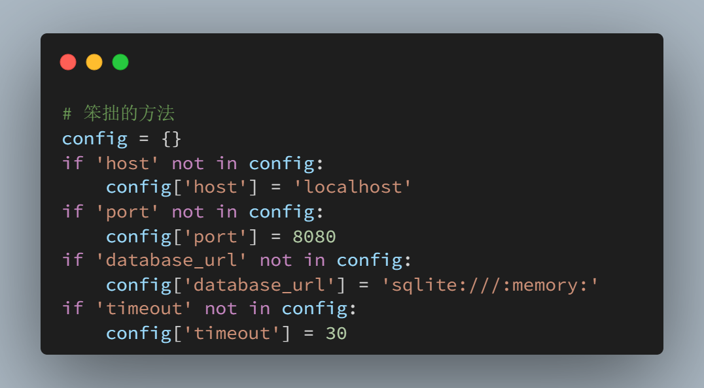
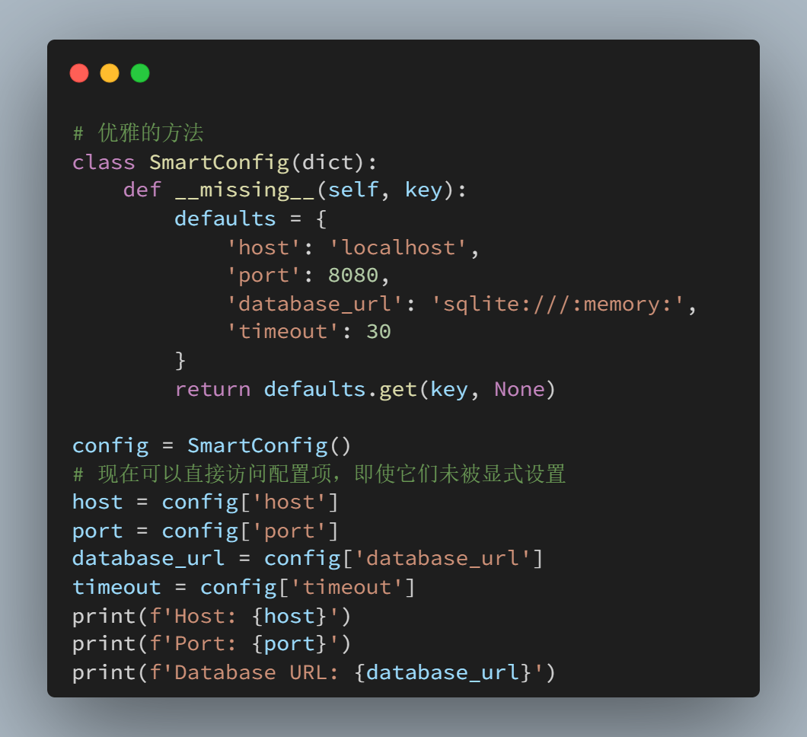


__index__：使自定义对象与切片一起协作

想让你的自定义对象与 Python 的切片语法无缝协作吗？ \__index__ 会将你的对象转换为整数，以便在序列中使用。

适用场景： 任何表示域中数值位置或索引的对象——例如时间戳、偏移量或自定义范围对象。

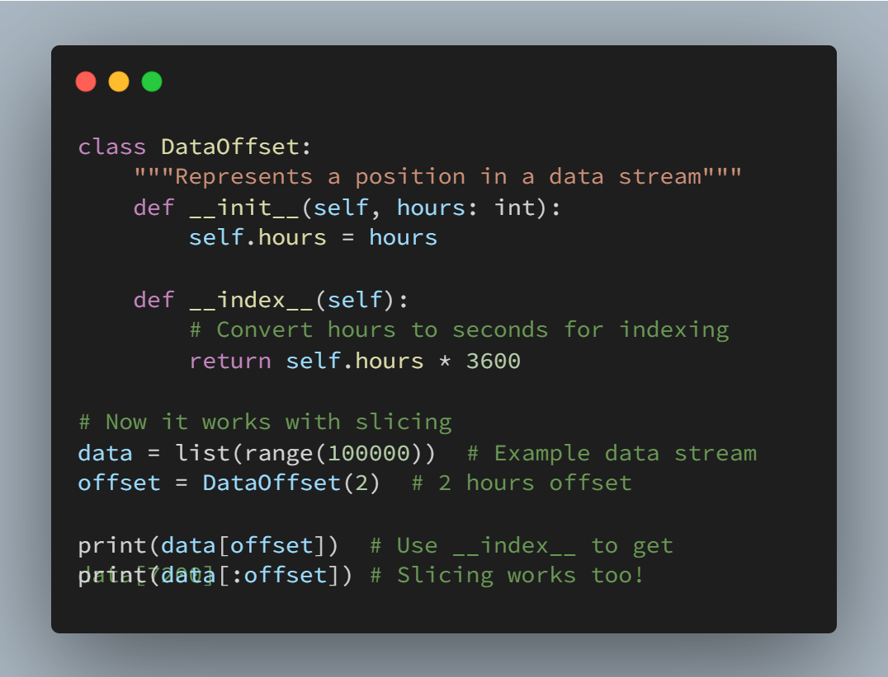

__matmul__：使用 @ 运算符的矩阵乘法

@ 运算符不仅仅用于装饰器。当你实现 \__matmul__ 接口时，你的对象可以使用 @ 来进行运算，从而显著提高代码的可读性。

适用场景： 数据转换、数学计算或任何需要频繁使用矩阵运算的领域。比如在机器学习流程中使用它来简化转换链。

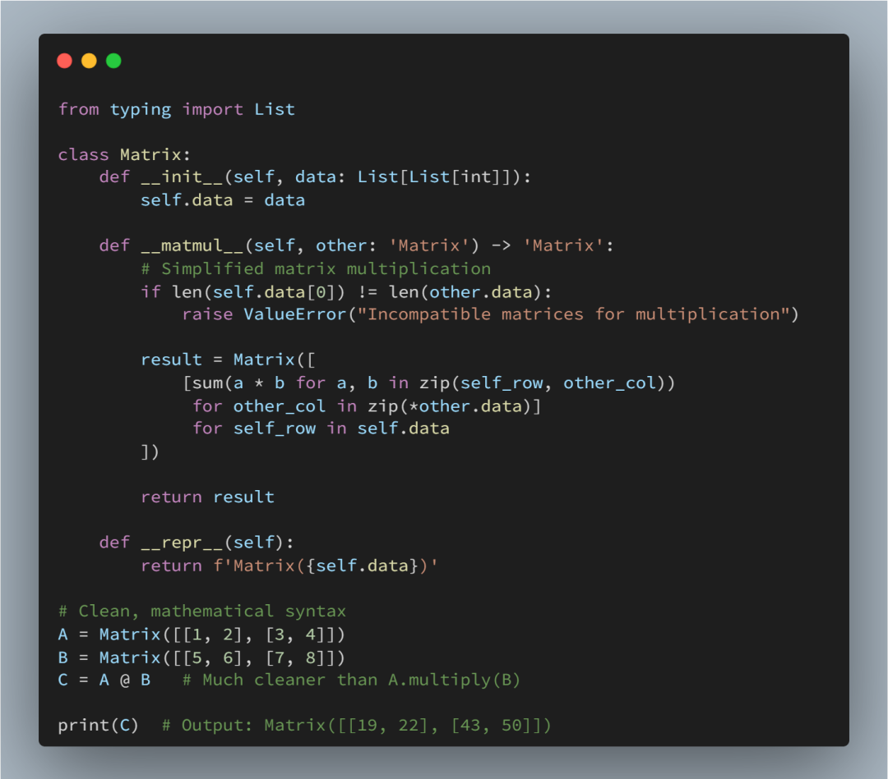


__slots__：拯救生产系统的内存秘密

当创建数百万个对象时，内存使用情况会变得至关重要。\__slots__ 会限制对象可以拥有的属性，从而消除每个实例的 \__dict__ ，并显著降低内存使用量。

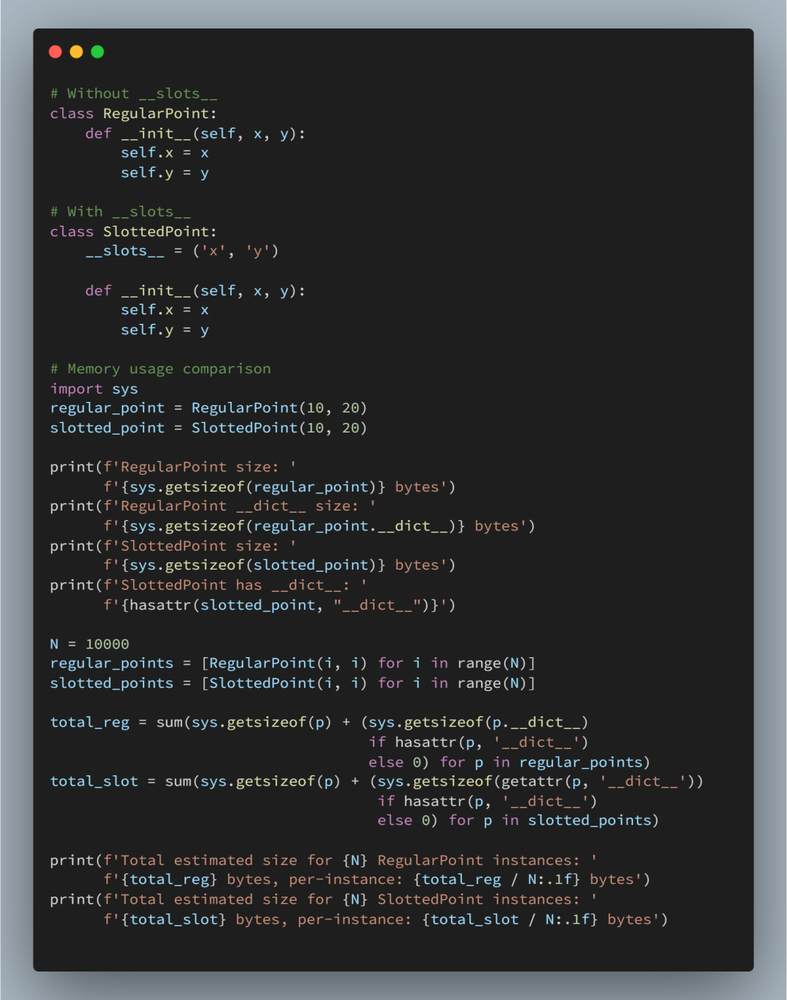

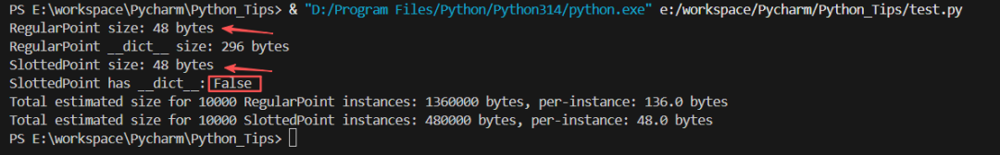

缺点： 将失去动态属性赋值和每个实例的 __dict__ 功能。适用于拥有多个具有固定属性的简单对象实例的情况


注意：最开始的单个实例的内存大小都是 48 个字节，是因为：

    sys.getsizeof(obj) 只返回该 Python 对象本身在 CPython 下的字节大小（对象头/结构），不包含它引用的其他对象（例如 __dict__、字符串、列表等）。
    对于普通实例（有 __dict__），实例对象本身和属性字典是两个独立的对象：
        sys.getsizeof(instance) 只测实例的 C 结构（通常是 48 bytes 左右）。
        sys.getsizeof(instance.__dict__) 测量属性字典的大小（例如示例中是 296 bytes）。
        对于使用 __slots__ 的类，默认没有 __dict__（除非你在 __slots__ 中包含 '__dict__'），属性存放在更紧凑的内部结构中，所以：
        单个实例的 sys.getsizeof 仍可能显示与普通实例相同的基础对象大小（因为那部分是对象头等固定开销）。
        真正的内存节省来自“没有为每个实例分配一个 dict 对象”这一点 — 这在大量实例时才显著。


__enter__ / __exit__：上下文管理器魔法

上下文管理器确保即使发生异常也能正确清理资源。与其到处依赖 try/finally 代码块，不如创建能够与 Python 的 with 语句无缝集成的对象。

专业提示： 使用 contextlib 模块可以简化上下文管理器，但当需要基于类的状态管理时，需要手动实现 \__enter__ / \__exit__ 。适用场景：资源管理、临时状态变更、监控或任何需要确保资源释放的操作。

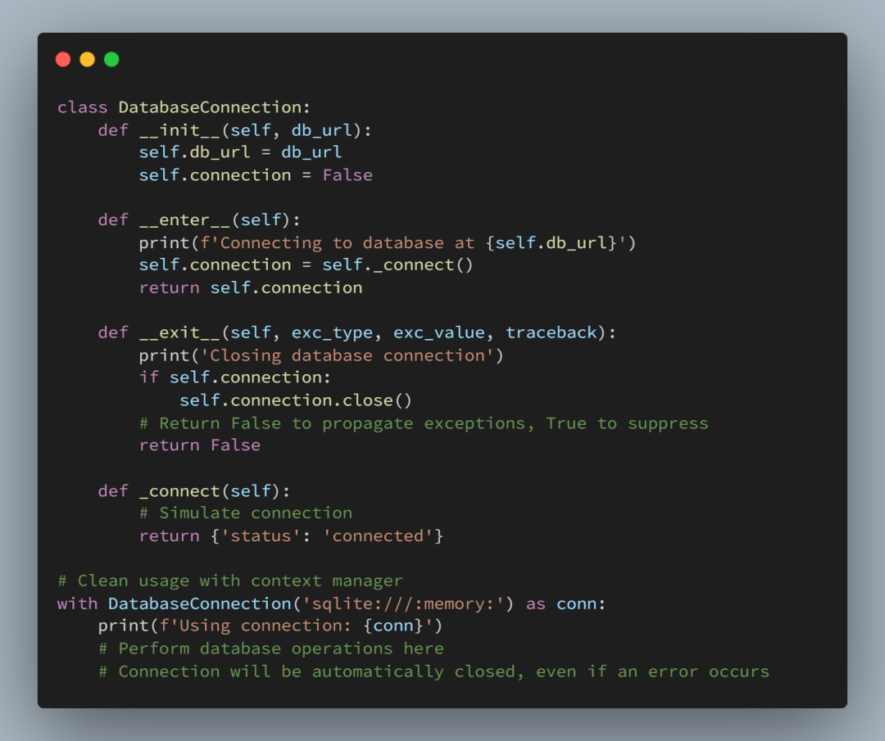


__fspath__：使自定义对象与路径兼容

通过实现路径协议，使您的自定义对象与 Python 的文件系统函数无缝协作。

适用场景： 构建需要与现有文件系统功能配合使用的文件/路径抽象。非常适合路径遵循特定模式的数据工程应用。

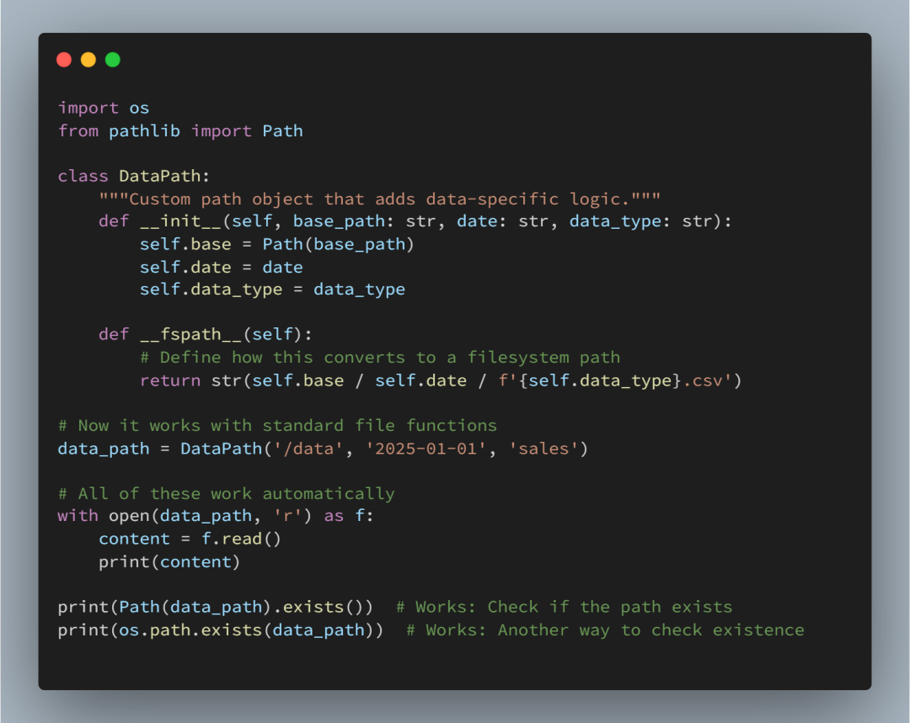


__anext__ + __aiter__：异步迭代的正确

\__aiter__ 和 \__anext__ 是 Python 中定义 异步迭代器协议（Asynchronous Iterator Protocol） 的两个“魔术方法”。对于异步数据处理，这些方法允许你创建与 async for 循环一起使用的对象，非常适合流式数据或异步生成器。这组协议与同步世界中的 \__iter__ 和 \__next__ 相对应。

    同步 for 循环:
        for item in my_list:
        Python 在背后调用 my_list.__iter__() 来获取一个迭代器。
        循环调用该迭代器的 __next__() 方法获取每一项，直到触发 StopIteration 异常。
    异步 async for 循环:
    async for item in my_async_iterable:
    Python 在背后调用 my_async_iterable.__aiter__() 来获取一个异步迭代器。
    循环调用该迭代器的 __anext__() 方法（这是一个 async 方法，所以它返回一个可等待对象），await 它的结果来获取每一项，直到触发 StopAsyncIteration 异常。

真实场景案例：异步 API 分页器

假设您需要从一个提供分页（Pagination）数据的 API 中获取大量数据。例如，一个 /api/items 接口，您必须通过 ?page=1, ?page=2... 逐页请求才能获取所有项目。

我们不希望一次性请求所有页面（可能导致内存溢出或被 API 限流），也不希望在请求一页时阻塞整个程序。我们希望创建一个对象，可以让我们像遍历一个普通列表一样，使用 async for 来遍历所有项目，而这个对象会在后台自动、异步地处理分页请求。

示例代码

我们将模拟一个网络请求，使用 asyncio.sleep 来代表真实的 I/O 等待时间。

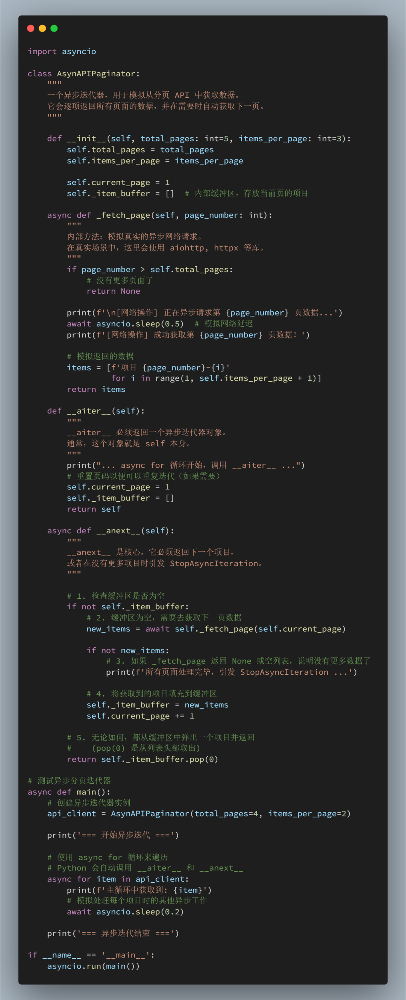

核心思想是：当“获取下一个”这个动作本身是一个需要等待的I/O操作时，你就应该使用这个协议。

这允许您的代码在等待数据时（例如等待网络响应）去执行其他任务，而不是完全卡住。


主要适用场景包括：

    流式数据处理 (Streaming Data)
    •WebSockets：async for message in websocket:。__anext__ 内部会 await websocket.recv()，等待下一条消息的到来。
    •服务器发送事件 (SSE)：与 WebSockets 类似，等待事件流中的下一个事件。
    •IoT 传感器数据：等待来自某个硬件或传感器的下一个读数。

    网络请求分页 (Network Request Pagination)
    •如上例所示：处理 GitHub、Twitter、Slack 或任何返回分页结果的 REST API。__anext__ 负责在需要时透明地获取下一页。


    数据库游标 (Database Cursors)
    •当您从数据库中查询一个非常大的结果集（例如数百万行）时，您不希望将它们全部加载到内存中。
    •像 asyncpg (PostgreSQL驱动) 这样的库允许您使用异步游标。__anext__ 会在内部 await cursor.fetchrow() 来异步获取下一行数据。

    异步文件 I/O
    •使用 aiofiles 库逐行读取一个非常大的文件。__anext__ 可以在内部 await f.readline()，在等待磁盘I/O时释放控制权。

    消息队列消费者 (Message Queue Consumers)
    •从 RabbitMQ, Kafka 或 Redis Pub/Sub 中消费消息。__anext__ 内部会 await queue.get()，异步地等待队列中的下一条消息。

总而言之，\__aiter__ / \__anext__ 协议是构建高性能、非阻塞 I/O 数据管道的基础。它让您能用一个干净的 async for 循环来处理那些“一次来一点”的异步数据源。

__await__：让对象本身可等待

适用场景： 数据库连接、文件操作或任何代表异步操作本身的对象。使 API 使用起来更加自然。

\__await__ 不是返回可等待的对象，而是使对象本身可等待。这使得异步 API 更加简洁。

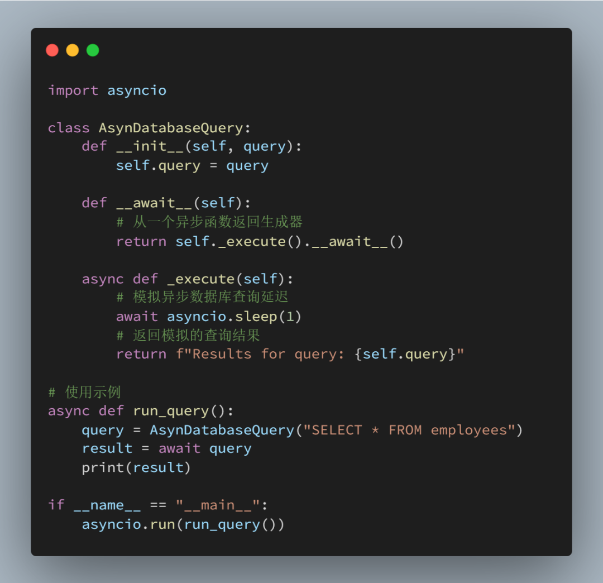

__getattr__ 与 __getattribute__：属性访问陷阱

这两种方法都控制属性访问，但它们的工作原理完全不同。混用它们可能会导致无限递归或意想不到的行为。

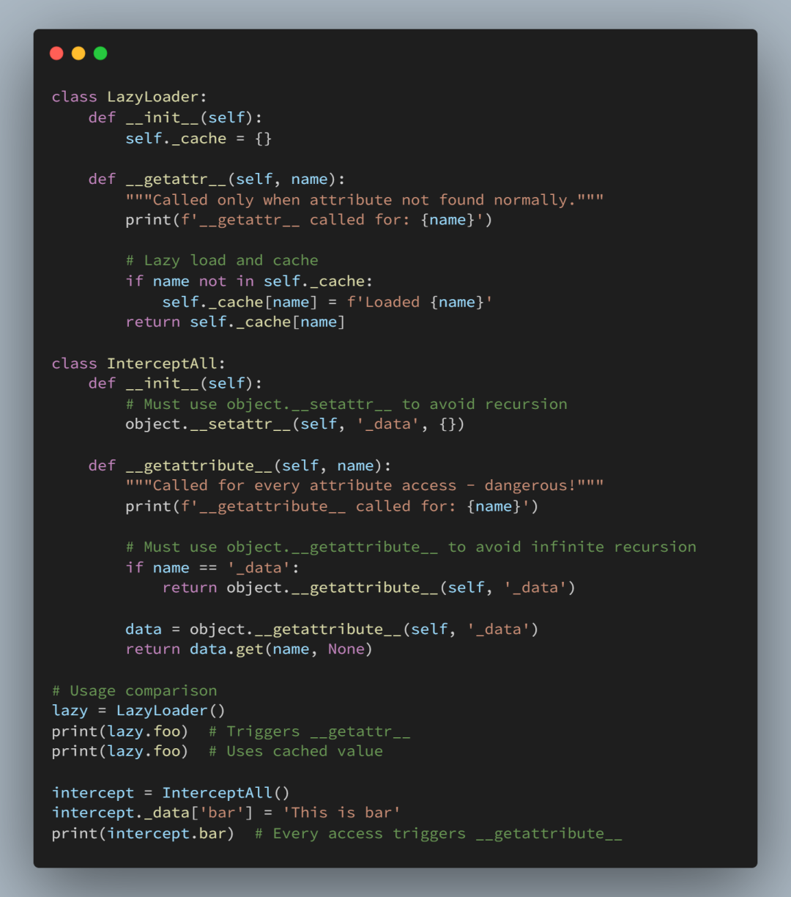

    关键规则：
    •使用 __getattr__ 作为备用方案（更安全）
    •仅当需要拦截所有访问时才使用 __getattribute__
    •始终在 __getattribute__ 中使用 object.__getattribute__() 以避免递归。

适用场景： 使用 __getattr__ 来获取代理对象和延迟加载。除非绝对必要，否则绝对别使用 __getattribute__ 。

__call__：将对象转换为函数

将对象转换为可调用实体，创建强大的模式，例如可配置转换器或有状态函数。

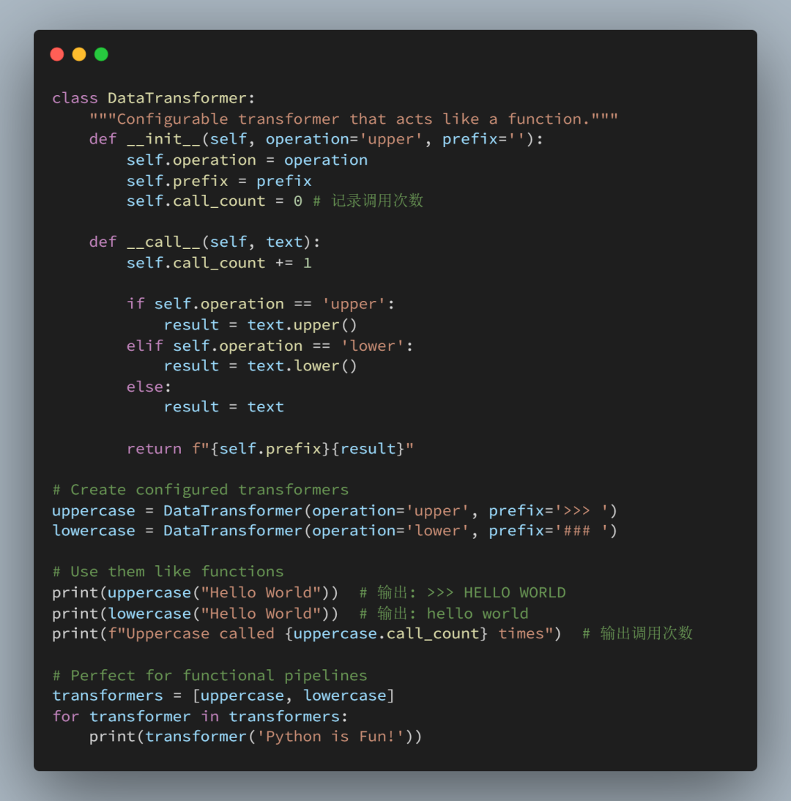

适用场景： 可配置处理器、有状态函数、回调对象，或任何需要面向对象设计并具有函数式接口的场景。

__prepare__：控制类创建（高级）

此元类方法允许你在类创建期间控制使用的类字典对象。最常用于保持类属性声明的顺序。

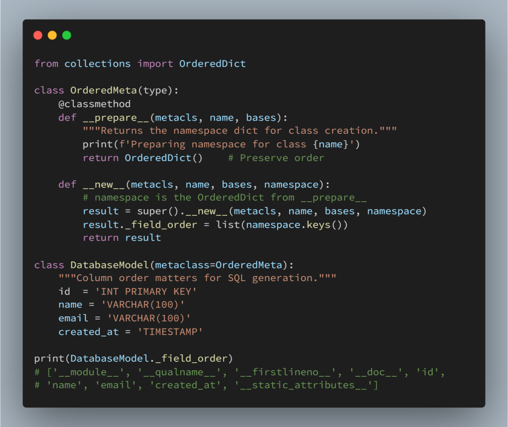

    适用场景：
    •ORM 定义中，列顺序对 SQL 生成至关重要
    •处理顺序重要的配置类
    •需要保留声明顺序的模式定义
    •任何声明顺序都有其语义含义的领域特定语言（DSL）